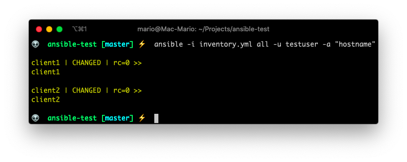
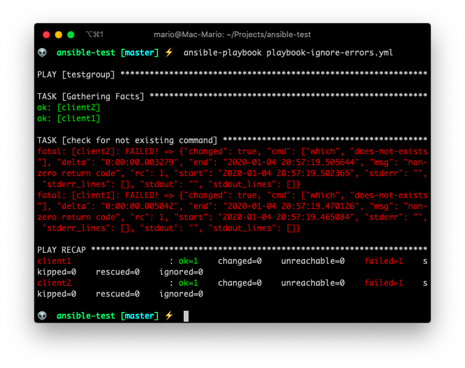

# Ansible introduction for developers

> All the code in this article can be found in [GitHub](https://github.com/marioy47/ansible-testlab) along a very simple Vagrant test lab.

So you need to setup _yet another_ LEMP (Linux, Nginx, MariaDB, PHP) server on Digital Ocean or EC2 that also includes additional services like a [Redis](https://redis.io/) cache and [Letsencrpyt](https://certbot.eff.org/) for SSL certificate creation.

... Or maybe you need to setup a new development environment using [Vagrant](https://www.vagrantup.com/) or [Docker](https://www.docker.com/) that has that same LEMP stack with those same services.

You've done it so many times that you've created an installation script using `bash` that executes all the commands you need to have a working environment or working server. But this script is growing to be 300 lines long (in bash that's a lot!) and its becoming unmanageable.

... And then you think... "There's got to be a better way".

It turns out there is!

[Ansible](https://www.ansible.com/) is a orchestration and automation tool written in python that has been growing in popularity thanks to its simplicity, efficiency and most of all the ability to work **without installing remote agents**. I mean, if your are not sold by that last part, I don't know what would.

Ansible works by connecting to remote hosts, or as Ansible calls them _clients_, using SSH. And executing _modules_ (which are python scripts) that are uploaded to the remote machine **at execution time**.

The only requisite for the remote machine is that it has a fairly recent version of python (and sometimes not even that).

Among the advantages of Ansible are:

- Does not require the installation of remote agents.
- Can execute tasks in parallel on multiple machines.
- Works on Linux and Windows
- There are hundreds of modules that execute different tasks.
- Can be used to execute just one command or complete _playbooks_ (more on that latter).
- Can be used in Vagrant and Docker for creating development environments.
- Can be programmed to execute different actions on different group of machines
- Its maintained by RedHat

> Ansible works by using SSH to execute commands on Linux/MacOS, and [WinRT](https://en.wikipedia.org/wiki/Windows_Runtime) to execute commands on Windows


## Clients setup

Before we beginning, we need to setup SSH access to the remote machines we're going to use.

For that we have to create public ssh key for my current account, and add it to the remote servers.

Since that is beyond the scope of this article, I'll leave you to figure out how to create a SSH key, but I'm going to show you the steps to create a `sudo` user:

### 1. Create the remote user
Doesn't matter how, but on the remote client (in this case `client1`) you should have access to the `root` user, at least for a little while.

then create the _ansible execution user_, meaning the user that you are going to use to execute ansible modules. In my case the user will be `testuser`.


### 2. Paste your key on the new users `.ssh/authorized_keys` file

The next step is to copy your **public key** from you Ansible Server (your management computer), which in my case is my Mac. And paste it in the remote server on the `.ssh/authorized_keys` file.

_This step is executed as the `testuser` user_


### 3. Add SUDO privileges to that user or group

Also, we need that the remote user(s) to have `sudo` privileges without requiring a password.

If you noticed in the previous step, I created the `testuser` user with the group `sudo`. That's the group that's going to have special privileges.

So, **still as root**  execute `visudo` and add the `NOPASSWD` option.


> This 3 steps have to be done for each computer you want to manage.

If you are using Digital Ocean, Linode or any VPS service, this steps can be done for you at machine creation time.

### Test ssh access

just ssh to the remote host from your control machine:


## Install Ansible

This part is easy... In your _Ansible Server_ (your control machine) install the ansible package.

In Mac you just have to use [Homebrew](https://brew.sh/)

```bash
brew install ansible
```

In Linux use `apt` or `yum`. Here is how to do it in Ubuntu.

```bash
sudo apt-add-repository ppa:ansible/ansible
sudo apt update
sudo apt-get install ansible
```

And we're done... At least with the installation.

## Inventories

The first and most important file for ansible is the **inventory** file.

Inventories are a list of hosts and variables that can be group and reused for multiple tasks execution. In other words, _the inventory file is where the list of host are stored_

So, lets create the inventory file `inventory.yml`, and add the list of remote hosts where you want to execute tasks, commands or modules.

```yml
# inventory.yml
client1
client2
```

This is an inventory file where I'm just adding 2 machines and no variables.

As you can see, by default the inventory file, and most other `ansible` files, are in the YAML format, which is a extremely simple a readable format. You can see a quick introduction of it in [the official Ansible documentation](https://docs.ansible.com/ansible/latest/reference_appendices/YAMLSyntax.html#yaml-syntax), but the main thing to keep in mind with `yaml` is that **indentation must be respected**.

> The `.yml` extension is optional. You can opt to not use any extension at all.

## Execute a remote command

... Also called [Ad-hoc commands](https://docs.ansible.com/ansible/latest/user_guide/intro_adhoc.html).

Lets start by executing a remote command on each of the hosts (in our case just two) that we have in our inventory.

The structure an `ansible`  command is

```bash
ansible -i <inventory-file.yml> <pattern or host> -m <module to use> -a <command in the module>
```

So lets execute the command `hostname` to determine the host's name on the server `client1` and server `client2`.

On the **Mac** terminal execute:

```bash
ansible -i inventory.yml all -a "hostname"
```


Here:
- We're using the `inventory.yml` file. Hence the `-i` parameter.
- `all` means "Use the pattern `all`" which is the default **group** for all the clients in the inventory. More on patters latter.
- `-a` means "arguments" and since we haven't specified any module (again, more on modules and commands latter), Ansible will assume we are using the [`command`](https://docs.ansible.com/ansible/latest/modules/command_module.html#command-module) module with the parameter `hostname`.


Wait! an error???

The reason for the error is that we're trying to connect to the **remote** server as the user `mario` which only exists in the **local** machine.

Let's provide a valid remote user by using the `-u` flag.

```bash
ansible -i inventory.yml all -u testuser -a "hostname"
```



Even though is not very obvious. We get a successful answer: `client1` and `client2` is the name of each  machine.

## Execute a module

Ansible comes with a big [list of modules](https://docs.ansible.com/ansible/latest/modules/modules_by_category.html), which are [python scripts](https://docs.ansible.com/ansible/latest/dev_guide/developing_modules_general.html#developing-modules-general), that can execute multiple complex tasks on the remote server.

The beauty of the module system, is that they don't have to reside on the remote server. They are copied (using sftp or scp) to each remote host on execution time, and then they get executed by the remote python interpreter.

So, lets execute our first module by issuing the command

```bash
ansible -i inventory.yml all -u testuser -m ping
```


- `-m` means "Use the module ..." and we are using the module [ping](https://docs.ansible.com/ansible/latest/modules/ping_module.html).
- There is no `-a` option because the `ping` module does not requires it.

Take into account that the _module_ `ping` is **not** the ping command. From the Ansible documentation:
> This is NOT ICMP ping, this is just a trivial test module that requires Python on the remote-node

## Setting defaults

If you are following along this article. You've noticed that we have to pass the `-i` and the `-u` flag always... This can become old pretty soon.

So lets solve the `-i` issue now by creating an _ansible configuration file_ or `ansible.cfg` on the directory where we are working on with the following content

```ini
# ansible.cfg
[defaults]
inventory = inventory.yml
```

This tells `ansible` to use the file `inventory.yml` as the default inventory file.

Now we can execute ansible like this:

```bash
ansible all -u testuser -m ping
```


We'll solve the `-u` "issue" latter when we get to variables.

> For a list of parameters that can be configured in the `ansible.cfg` file you can browse the `ansible.cfg` file in the [github](https://github.com/ansible/ansible/blob/devel/examples/ansible.cfg) repo.

## Become root

Now, lets assume that we need to execute a remote command as a super user. We can can achieve that by using the `--become` flag

Let's first execute a remote command as the `testuser` user.

```bash
ansible all -u testuser -a whoami
```

And now lets execute the same command but as root.

```bash
ansible all -u testuser -a whoami --become
```


Voila! We're root on the remote server

## Patterns in the inventory file.

At the beginning we talked about groups of hosts in the inventory. Ansible calls them _patterns_ because you can specify one group or several groups of hosts by using patterns.

That's is somewhat out of the scope of this article. So know that we can specify multiple servers on the inventory file.

You can create a group of hosts by using hierarchy in the inventory file like so:

```yml
# inventory.yml
testgroup:
  hosts:
    client1:
    client2:

```

Here we created the `testgroup` group (or pattern) and that group has two hosts `client1` and `client2`.

Lets see how we can use that pattern:

```bash
ansible testgroup -u testuser -a "echo hola mundo"
```


Ansible has 2 defaults groups `all` and `ungrouped`. You can read more about those in the [Ansible documentation](https://docs.ansible.com/ansible/latest/user_guide/intro_inventory.html).


## Variables in inventories

Ansible wouldn't be useful if you couldn't use some kind variable on you inventory files or anywhere else.

The thing to remember with Ansible variables are that they are flattened out so you can overwrite a value of a variable for an specific host.

With what we've seen so far, we can say that we can specify variables by _host_, by _group_ or both.

#### 1. By host

```yml
# inventory.yml
testgroup:
  hosts:
    client1:
      my_custom_string: Hola Mundo
```

#### 2. By group

```yml
# inventory.yml
testgroup:
  hosts:
    client1:
    client2:
  vars:
      my_custom_string: Hola Mundo
```

#### 3. Combined:
```yml
# inventory.yml
testgroup:
  hosts:
    client1:
      my_custom_string: Hola just for client 1
    client2:
  vars:
    my_custom_string: Hola from the pattern -testgroup-
```

And then use it in a command or a module

```bash
ansible testgroup -u testgroup -a "echo {{my_custom_string}}"
```


Awesome! We can now specify global parameters and variables depending on the host or the gruop.

## Advanced variables

Variables like passwords or secrets are not a good idea to pass on the command line or have them stored in public files. And most of all, they should't be committed to a git repo. That's why you can use an external file for storing the variables.

For Ansible to know which variables file to use on a host or a group, you have to create a new sub-dir relative to the current working dir with the name `group_vars/<group name>.yml`.

So for instance, in our example we have the group `testgroup`. We should have the following hierarchy:

```txt
$ tree
.
├── group_vars
│   └── testgroup.yml
└── inventory.yml

1 directory, 2 files

```

Lets do a test to see vars in action in the inventory and in the group vars.

Lest change the inventory to look like this:

```yml
# inventory.yml
testgroup:
  hosts:
    client1:
      my_custom_string: Hola just for client 1
    client2:

```

And `group_vars/testgroup.yml` looks like:

```yml
# group_vars/testgroup.yml
my_custom_string: Hola from group_vars/testgroup.yml
```

And execute ansible like

```bash
ansible all -u testuser -a "echo {{my_custom_string}}"
```


As you can see, the `my_custom_string` has different values in each client. On `client1` it picked the value from `inventory.yml`. On `client2` it picked it up from the `group_vars/testgroup.yml` file.


> Ansible has a very clever flattening algorithm to overwrite variable values. More on that [here](https://docs.ansible.com/ansible/latest/user_guide/intro_inventory.html#how-variables-are-merged)


## Special variables

Now that we know about variables, wouldn't it be nice if we could store the username and password to a remote host in a variable file instead of passing it in the command line?

...Well ...you can!

Ansible has set of [special variables](https://docs.ansible.com/ansible/latest/user_guide/intro_inventory.html#connecting-to-hosts-behavioral-inventory-parameters) that can be used for instances like that.

So lets change `group_vars/testgroup.yml` to have the following contents:

```yml
# group_vars/testgroup.yml
ansible_user: testuser
```

And the inventory to:

```yml
# inventory.yml
testgroup:
  hosts:
    client1:
    client2:
  vars:
    my_custom_string: Hola mundo from inventory.yml
    ansible_become: true
```

And issue the following command:

```bash
ansible all -a "echo {{my_custom_string}}"
ansible all -a "whoami"
```


I bet that you already figured out that `ansible_user` is the username we use for connecting to the remote server, and that `ansible_become` tells Ansible to become the super user on the remote machine.

Also you've might noticed that I combined the usage of variables inside the `inventory.yml` and `gruop_vars/testgroup.yml`. I could have added the `ansible_user` var inside the `inventory.yml` file also.

> You could use the `group_vars/testgroup.yml` file for sensitive data that can not be committed to a repo by adding it to `.gitignore`.

## Managing files
With Ansible you can also copy files to the remote machines.... And not only that, those files can be templates that will be parsed a and complemented with local or remote variables.

### Copying a file

You can copy files directly with the [`copy`](https://docs.ansible.com/ansible/latest/modules/copy_module.html) module...

```bash
mkdir files/
touch files/test-file.txt
ansible all -m copy -a "src=files/test-file.txt dest=/tmp/new-file.txt"
ansible all -a "ls -l /tmp/new-file.txt"
```


### Coping and parsing a template

You can also create files with variables inside them that get parsed after uploading them with the [`template`](https://docs.ansible.com/ansible/latest/modules/template_module.html) module.

```bash
# Create the template
mkdir templates/
echo "Template file: {{my_custom_string}}" > templates/new-template.j2

# Use the template
ansible all -m template -a "src=templates/new-template.j2 dest=/tmp/from-template.txt"
ansible all -a "cat /tmp/from-template.txt"
```


Ansible uses [Jinja2](https://jinja.palletsprojects.com/en/2.10.x/) templating language for creating its templates.

If you've worked with [Smarty](https://www.smarty.net/), [Twig](https://twig.symfony.com/) or [Liquid](https://shopify.github.io/liquid/) you should feel right at home with _ansible templates_.

### Change owner and mode

I think its pretty self explanatory:

```bash
ansible all -m file -a "dest=/tmp/new-file.txt owner=ubuntu mode=600"
ansible all -a "ls -l /tmp/new-file.txt"
```


> The `copy` and `template` modules allow you to upload files and change the owner at the same time.

## Installing packages

Install a package if its not present with the [apt module](https://docs.ansible.com/ansible/latest/modules/apt_module.html)

```bash
ansible all -m apt -a "name=nginx state=present"
```


## Facts

_Ansible facts_ are remote system properties that are collected by Ansible when it connects to a remote machine.

You can view `ansible_facts` by running the `setup` module on a remote system:

```bash
ansible client1 -u testuser -m setup
```


As you can see there are A LOT of lines. That's why you can filter them by using the parameter filter:

```bash
ansible client1 -u testuser -m setup -a "filter=ansible_os_family"
ansible client1 -u testuser -m setup -a "filter=*ipv4"
```

## Ansible Playbooks
Up until now, we've been using the `ansible` command to execute specific **tasks** on the remote systems listed in the inventory file.

The real power of Ansible is when you create a group of tasks or **plays** in what Ansible calls **Playbooks**.

The first and most important difference is that playbooks are executed using the `ansible-playbook` command as opposed to `ansible` for simple tasks.

Playbooks must be in the `yaml` format (its not optional) and are designed to be very easy to read and create.

So lets create a playbook that does the last 3 tasks for us:
1. Copy a file
2. Create a file from a template
3. Install a package

```yml
# playbook-sample1.yml
---
- hosts: testgroup
  vars:
    file_owner: ubuntu
    file_name: playbook-copy.txt
    my_custom_string: String from the playbook
  remote_user: testuser
  become: true
  tasks:
    - name: copy a file from the files/ directory
      copy:
        src: files/test-file.txt
        dest: /tmp/{{ file_name }}
        owner: "{{ file_owner }}"
    - name: create a file from a template
      template:
        src: templates/new-template.j2
        dest: /tmp/playbook-template.txt
    - name: install nginx if not present
      apt:
        name: nginx
        state: present
```

And lets execute it with

```bash
ansible-playbook playbook-sample1.yml
```

> Take into account that variables should be enclosed in `"` when used in a playbook as the sole parameter


... As you can see.

- A _play_ starts with the `- hosts:` label.
- Each play has a `tasks:` section where every tasks is added.
- Each task starts with a `- name: ` label followed by a plain English (or plain Spanish in my case 😁) description of what it does.
- Next, each tasks declares the module it uses, like `copy`, `template` or `apt`
- Depending on the module there is one or more parameters (like `src` or `dest` in the copy module)

Hope you see now the power of ansible. With just one very short command we created files, installed services, parsed templates and in 2 clients **at the same time**.

The **big bonus** of playbooks is that you can use everything we've seen so far inside a playbook without requiring external file (except for the `inventory` file):

- You can create vars for further usage inside the same playbook
- You can become `root`, for the complete play or just for one task.
- If there is a `group_vars/<patterns>.yml` file, those vars will flattened and used also (the variables in the playbook take precedence)
- You can use variables for naming files and services
- You can use variables for the **content** of a template
- You can (and must) execute tasks
- Tasks accept parameters that can also be variables

### Playbooks with multiple plays

In the previous section, I showed you a playbook with just one play. The fact of the matter is that we can execute multiple plays in a playbook.

This is useful in cases where you want to execute some tasks in a group of servers, and then other tasks on other groups of server:

This a playbook with 2 plays:

```yml
---
- hosts: webgroup
  - tasks:
    - name: First task for webgroup
      ...

-hosts: dbgroup
  - tasks:
    - name: First task for dbgroup
      ...

```

One of the great advantages of having plays are that they are sequential and a play wont be executed before the previous finishes no matter how many servers are on the `webgroup` and `dbgroup`.

## Debugging output

From the first playbook example, you might noticed that playbook commands do not generate any output, but most of the time you need to know what's happening, specially while developing a playbook.

The `- debug` option is specially useful for such a cases.

The usage of the `debug` option almost always requires you to store the output on a variable. So let take a look at the following example:

```yml
# playbook-debug-example.yml
---
- hosts: testgroup
  remote_user: testuser
  tasks:
    - name: A test command
      command: cat /etc/hostname
      register: _command
    - debug:
      msg: {{ _command.stdout }}
```


With `register` you can store the output of a command or module in a variable, and then use that variable latter in the playbook.

## Ignoring errors or continued executing

If a task in a play returns a value different than 0, which is success in most OSs, the play will stop.

This is particularly important with the `command` and `shell` modules where some commands return values different than 0 (on bash think `$? -ne 0`) even on success.

Take the following example:

```yml
# playbook-ignore-errors.yml
---
- hosts: testgroup
  remote_user: testuser
  tasks:
    - name: check for not existing command
      command: which does-not-exists
    - name: this command should not be executed
      command: echo hola mundo
    - debug:
      msg: "finished the execution"
```

You can see that the `debug` section never gets executed.



But if we add `ignore_errors: True` on the playbook.

```yml
# playbook-ignore-errors.yml
---
- hosts: testgroup
  remote_user: testuser
  tasks:
    - name: check for not existing command
      command: which does-not-exists
      ignore_errors: True
    - name: this command should not be executed
      command: echo hola mundo
    - debug:
      msg: "finished the execution"
```


You see that event the tasks reports errors, but the `debug` section gets executed.

## Events an notifications on execution

There are times when you want to configure your server by adding files on special places, like `/etc/apache2/conf-available` or `/etc/php/7.0/fpm/conf.d/` for Apache and PHP respectively.

Most of the time you need to create an alias and restart the service for the configuration to take effect **if the file is actually new or different**

For those times, the `notify` parameter in conjunction with a `handlers` section is exactly what you need.

```yml
# playbook-notify-example.yml
---
- hosts: testgroup
  remote_user: testuser
  become: true
  vars:
    file_owner: ubuntu
    file_name: from-ansible-tpl.conf
    location_path: ansible-test
  tasks:
    - name: install nginx if not present
      apt:
        name: nginx
        state: present
    - name: create nginx conf file from template
      template:
        src: templates/nginx-template.j2
        dest: /etc/nginx/snippets/{{ file_name }}
        owner: "{{ file_owner }}"
      notify:
        - enable conf
        # - other handler
  handlers:
    - name: enable conf
      service:
        name: nginx
        state: restarted
```


In this case, the tasks in the `handlers` section will be executed **only** if the `template` task actually created a new file, or created a new file with different content.

Lest test that the new file got created:


Now. If I run the command again you can confirm that the **RUNNING HANDLER** section is not there.


Nifty, right?

## Playbook prompts

There are times when you need to execute a playbook several times, but each time with different data. Or maybe you have sensitive information that you don't want to store in any file ever.

In those cases, prompting the user for input is very useful.

You can prompt the user for a variable value by using the `vars_prompt` command:

```yml
# playbook-with-prompts.yml
---
- hosts: testgroup
  remote_user: testuser
  vars_prompt:
    - name: username
      prompt: What is the new username
      private: no
    - name: user_group
      prompt: To which group should it be added ?
      default: admin
  tasks:
    - name: create the new user
      shell: useradd -m -s /bin/bash -g {{ user_group }} {{ username }}
```


## Conditionals in playbooks

Conditionals is kind of a big subject in Ansible since there are a lot of use cases when you would need a conditional:

- The result of a play depends on the value of a variable, status or _fact_ of a remote system
- A play is executed depending on a previous result
- The value of a variable is composed by the value of another
- Execute a task only on certain architectures or certain Linux Distributions.
- Etc.

So we're just going to scratch the surface in this post.

The `when` statement is the main form of using conditionals on a playbook:

```yml
# playbook-when-and-facts.yml
---
- hosts: testgroup
  remote_user: testuser
  become: True
  tasks:
    - name: Shutdown only debian systems
      command: shutdown -h now
      when: ansible_os_family == "Debian"
```
