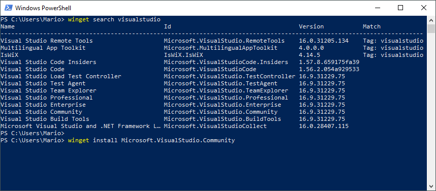
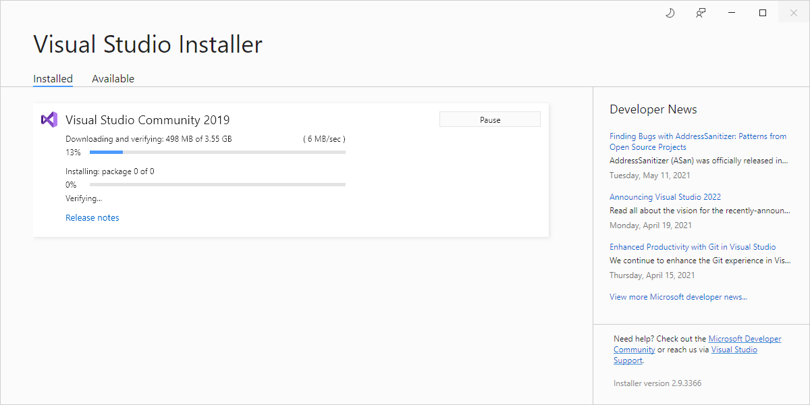
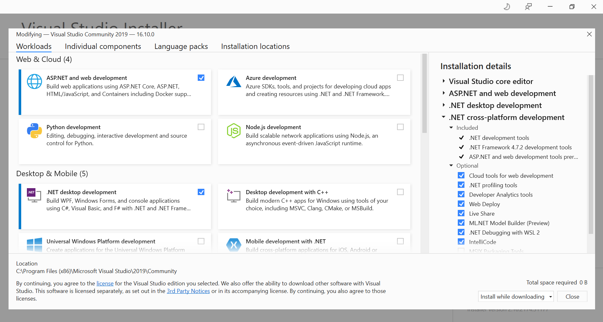
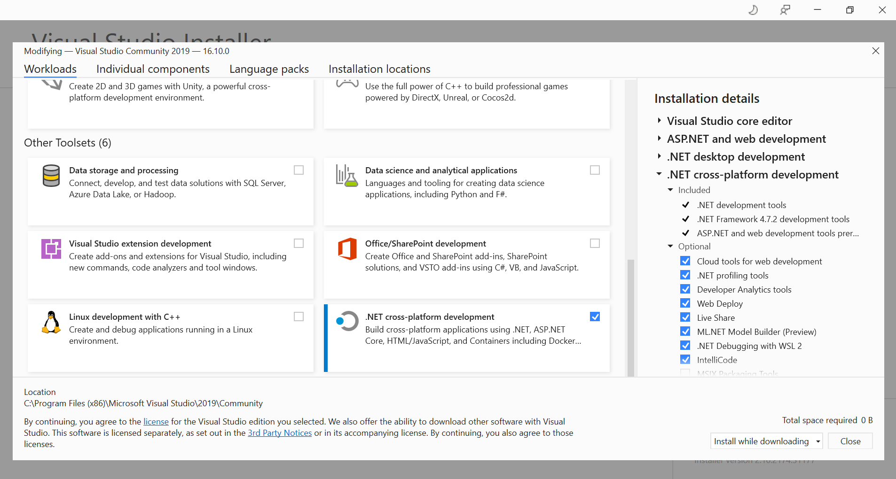
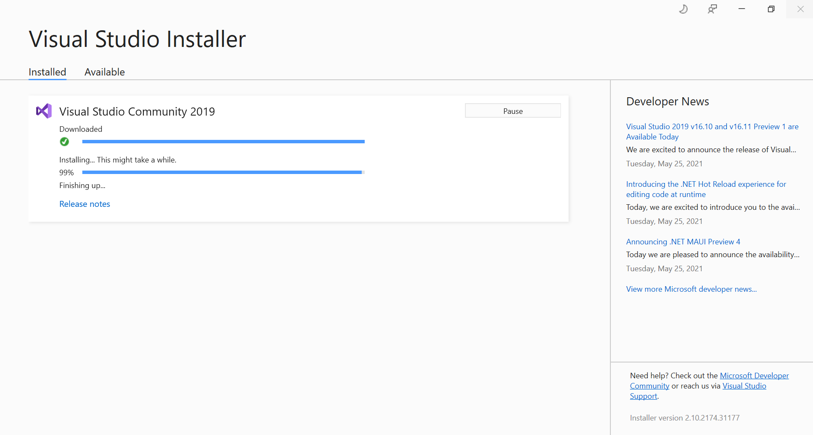
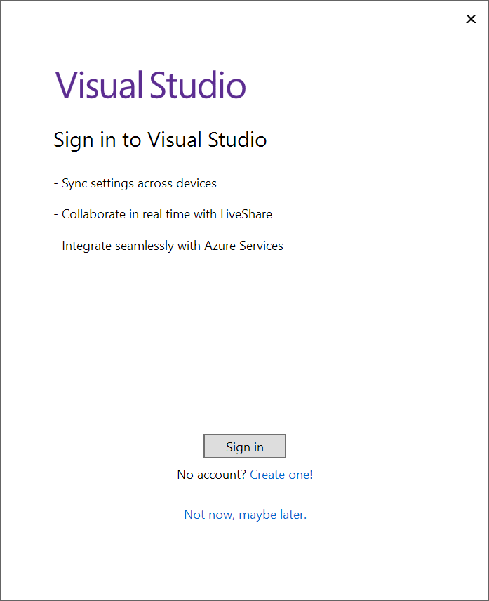
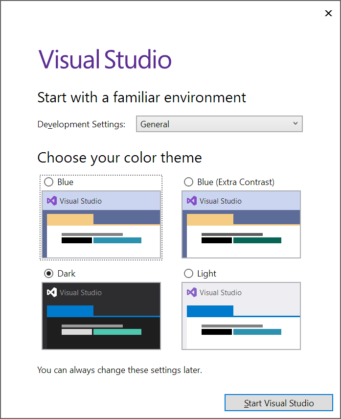
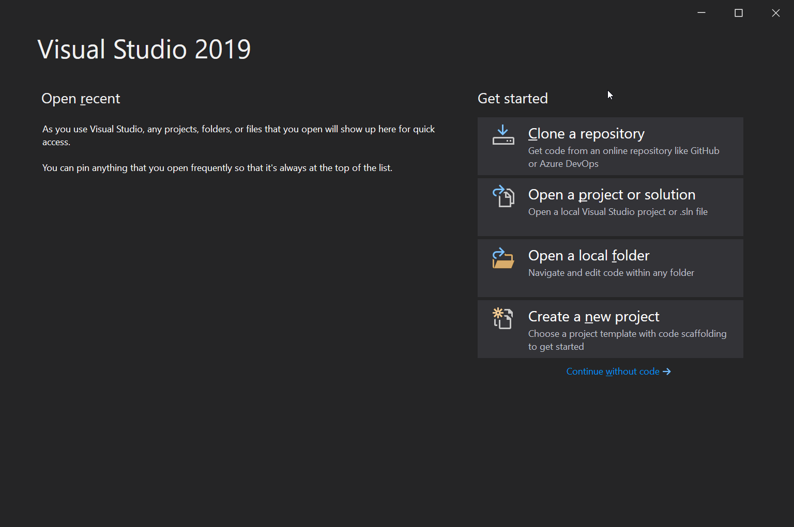

# C# setupa and first steps for .NET Core development

## Installation

```bash
winget search visualstudio
winget install Microsoft.VisualStudio.2019.Community
```











## First launch





## What is ASP.NET

- Open source web framework
- Cross Platform
- Lets you make you webpates with a language called **razor**
- `razor` is just HTML and c#. You just type _HTML_ then type an `@{...}` and inside the brackets you add c# code.

## Create a new project

- Start _Visual Studio 2019_
- Then _Create a new Project_
- Then select _ASP.NET Core Web Application_
- Create a project. P.e. _ContosoCraftsWebSite_
- Select _Web Application_

To run it just click on the _play_ button which starts a _debugging session_. And it's the same as `F5`.

You can also run it with `Ctrl+F5` which starts the program without debuggin.

On the first run it asks you to install a self signed certificate

On the task bar, near to the clock, there is a new icon called _ISS Express_ which is the development web server. If you click on the icon, you can select _Show All Applications_ and it will show that there are 2 ports open, one for SSL and another one for non secured pages.

### Solution explorer

- `wwwroot` folder with static stuff
- `Page` where the dynamic code lives
- `Program.cs` is the main program which uses the `Startup.cs`
- `appsettings.json` 

### Changing the _Welcome_ text

- Open `Pages/index.cshtml` and edit it
- Save and Reload
- There is no need to restart the application

## Creating a persistance layer

In this case I'm going to use a `.json` file as a read only database.

- Create a `.json` file and place it in `wwwroot/data/products.json`
- Create a `Models/` folder and inside it create the **class** `Model/Product.cs`
- Use the _code snippet_ `prop` to create the `Id`, `Maker`, `Image`, `Url`, `Title`, `Description`, `Ratings` array.


## Video Series

https://www.youtube.com/playlist?list=PLdo4fOcmZ0oW8nviYduHq7bmKode-p8Wy
