# Certbot Introduction and Basic Usage with Nginx and Apache

Since 2018 Google started penalizing sites that are not secured by [SSL](https://wikipedia.org/wiki/SSL) lowering its page rank. And even tough its been 2 years since that change, there are still many sites that use Plain HTTP instead of HTTPS.

So here I'm going to show you how to use _Let's Encrypt_ with the `certbot` command to secure your web-server in a very easy (and very free) way.

## TOC

```toc

```

## So what is LetsEncrypt?

Let's Encrypt is a nonprofit **Certificate Authority** that provides [TLS](https://wikipedia.org/wiki/Transport_Layer_Security) certificates for websites.

> SSL is now deprecated in favor of TLS. But its still supported and valid.

A **Certificate Authority** is a special company or organization that can issue certificates that **any browser** (think Firefox, Chrome, Edge, Safari) can understand.

> Only a small group of organizations can be Certificate Authorities or CA's.

In other words, you can request a free, 100% valid, certificate from Let's Encrypt.

So, you can either go to a commercial Certificate Authority like GoDaddy or Verisign and pay up a yearly feee of up to US\$200 to create a certificate. Or you can use `certbot` to request a certificates from Let's Encrypt without paying a dime.

One note though...

Let's encrypt does not support special certificates that not only validates your server but your company as legally stablished enterprise.

In those "rare" cases where you need that extra validation, you need to **buy** a cert by a company like Verysign or GoDaddy and you might need to provide additional legal documentation before your cert gets created.

## So what is `certbot`?

`certbot` is the CLI command (a command that runs in a Terminal) that you can use to **request and install** certificates from Let's Encrypt CA in a **fully automized** way.

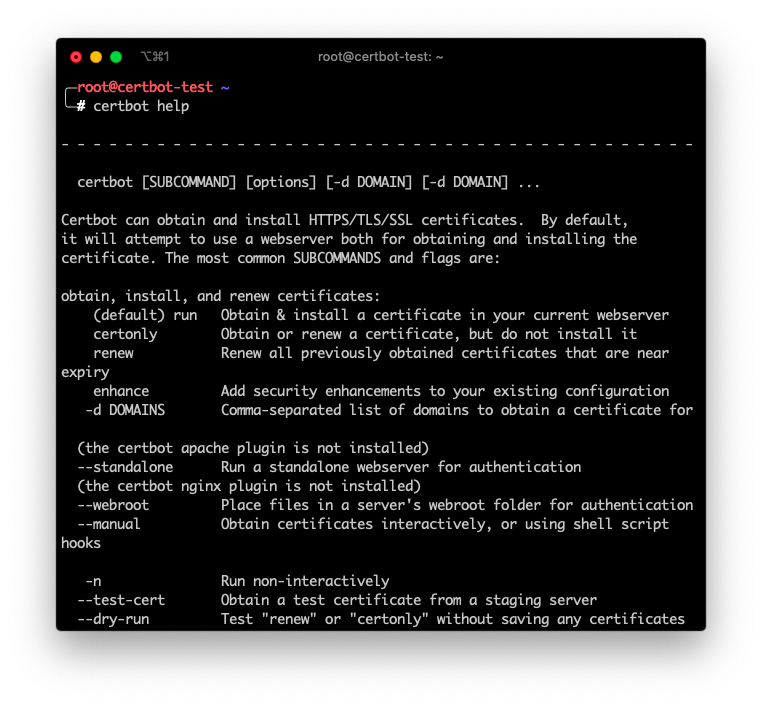

Services like https, ftp, ldap, etc. Can be secured with SSL as the transport layer by using `certbot` generated certificates.

... And did I say that they are free?

Take into account that the certificates are not created by `certbot`. They are created by the **Let's Encrypt** servers. `certbot` just automates the process of creating a key, validate your server, and download the resulting certificate.

## How does `certbot` works?

To create and install a certificate, `cerbot` first **validates that your machine has a valid DNS** record by creating a temporary file in your server and then asking the _Let's Encrypt_ servers to retrieve it using the DNS name and not the IP.

> There are other ways to validate the DNS record of your machine, but that's the more popular one.

If the validation passes, it **creates a cryptographic key** and connects to the _Let's Encrypt_ servers issuing a _certificate requests_ with that key.

The third step is to **download the certificate** from _Let's Encrypt_ and save it in your machine next to the key of the previous step.

The last **optional** step is that `certbot` will try to configure your _daemon_ (Apache, Nginx or other) with this new certificate.

All this process takes about 30 seconds to a minute if you have your server configured in DNS beforehand.

## And how does a certificate secures my server?

First of all... You use a **certificate and a key** to encrypt the information that transits between your server and a users browser. So a certificate does not secures a service, it just secures the communication.

Second: The basic idea of encrypting information is:

- You use a certificate to cypher the data that leaves your server
- You use the key to decipher the data that reaches your server

The key is created by you in your server and nobody, **and I mean nobody**, should know that key.

The certificate has to be created by a valid **Certificate Authority** (like Let's Encrypt) since that certificate need to be trusted by browser across the world.

The process is actually a little more complicated than that. But that's the gist of it.

## `cerbot` commands and plugins

So up until now I've said that `certbot` is for requesting and storing certificates. What I haven't said is that depending on how you want to validate your machine and what _daemon_ (Apache, Nginx, etc.) you want to secure, you have to use a plugin.

There are 2 Types of plugins:

1. Authenticators
2. Installers

Personally I don't like to use _Installers_ since they try to configure your _daemon_ in a very particularly non flexible way. But if you use standard configurations in your Apache or Nginx you'll be fine.

For instance, this is the command to create a certificate, and configure it in your local **Apache** server:

```bash
sudo certbot run -a webroot -i apache -w /var/www/html -d example.com
```

- `-a` specifies that the authenticator is the `webroot` authenticator.
- `-i` specifies that the installer is `apache`.
- `-d` specifies that the domain to authenticate is `example.com`
- `-w` is an additional parameter that the `webroot` authenticator requires that indicates where is web server's _Web Root_

The final **certificate and key** will get stored in `/etc/letsencrypt/live/example.com/` sub directory. And the Apache service will be automatically configured.

### Authenticators

Authentication is making sure that your DNS is correct and it points to the machine you are trying to secure.

And _making sure that the DNS points to your machine_ can be done in one of this ways:

- Let's Encrypt servers can retrieve an special file in your machine using plain http
- `certbot` can configure your Apache in an special way
- `certbot` can configure your Nginx in a special way
- `certbot` can fire up a temporary mini web server so the Let's Encrypt's servers can access a temporary file
- Etc.

So **authenticators** are the _method_ that `certbot` will use to validate your machine.

### Installers

If your machine passes the validation process, Let's Encrypt generates a certificate that has to be stored somewhere and your service need to be configured to use that stored certificate.

The **installer** is that part of `certbot` that takes care of this configuration.

In our example we provided the `-a apache` as installer. So `certbot` will try to find Apache's configuration file and append instructions to take into account the newly created certificate.

Most of the time you opt out to not have `certbot` configure your service with the newly created certificate. But just in case let me tell you that there are installers for:

- Apache
- Nginx
- DNS (when you create wildcard certificates)
- Etc

## Using the `certonly` command

Most of the time you'll want to only create the certificate and configure the daemon yourself. At least that's my case since I try to keep my configuration files small and neat.

In those times you can use the `certonly` command to instruct `certbot` to make the authentication and store the certificate in `/etc/letsecrypt/` **but not** make any changes to any _daemon_ configuration file.

For instance:

```bash
sudo certbot certonly -a webroot -w /var/www/html -d example.com
```

Will create a certificate (with no installation) for the domain `example.com`. Also, instructing `certbot` that the _Web Root_ path is `/var/www/html`.

This will authorize my machine by placing a temp file in `/var/www/html`, then will ask _let's Encrypt_ to retrieve that file, and if can, it will create the `/etc/letsencrypt/live/example.com/cert.pem` certificate.

## Installing `certbot`

To install the `certbot`command its just a matter of executing a couple of `apt` commands (or yum if you are on CentOS or Fedora machine).

```bash
sudo add-apt-repository ppa:certbot/certbot -y
sudo apt-get install certbot -y -qq
which certbot
```

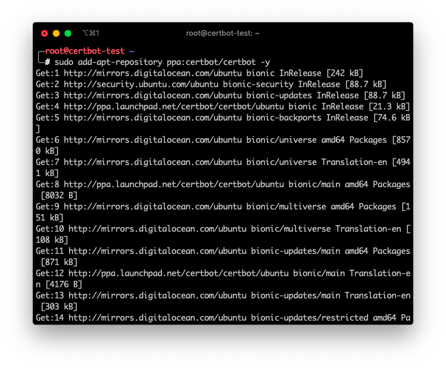

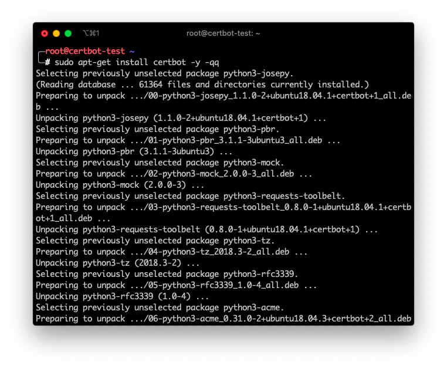

In english what I did was:

1. Add the `certbot` repository to my machine
2. Install `certbot`
3. Verify that the command is available

## Configure a Machine using Let's Encrypt

Now, lets configure an Nginx and an Apache server using _Let's Encrypt_ and `certbot`with the `certonly` command and changing ourselves the configuration files.

### 1. Configure your DNS

First we need to register our machine in DNS.

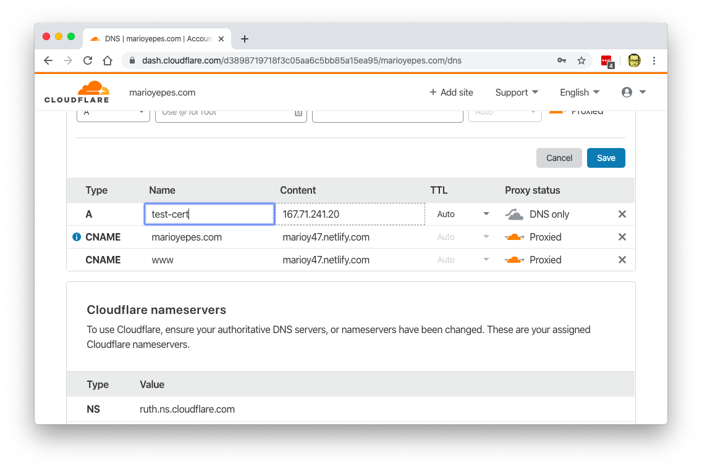

We do this first since DNS requires a couple of minutes (or even a couple of hours) to pick up this change.

If we issue a `dig` command and we get a valid response, then we're good to go:

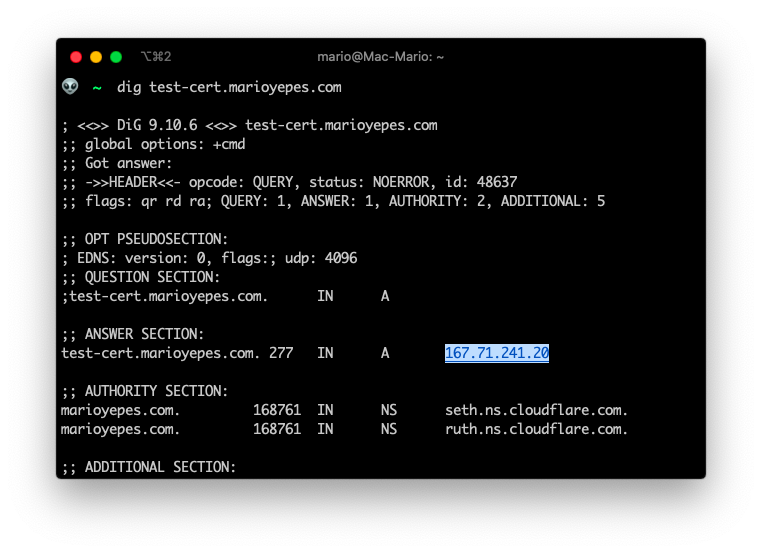

You can see that I added `test-cert.marioyepes.com` to DNS with the IP `167.71.241.20`.

### 2. Creating the cert

Having configured the DNS record, its now time to execute the command that creates the certificate.

The command is kind of long, but easy to figure out:

```bash
sudo certbot certonly -a webroot --webroot-path=/var/www/html -d test-cert.marioyepes.com --agree-tos -m test-cert@marioyepes.com  --no-eff-email --cert-name test-cert
```

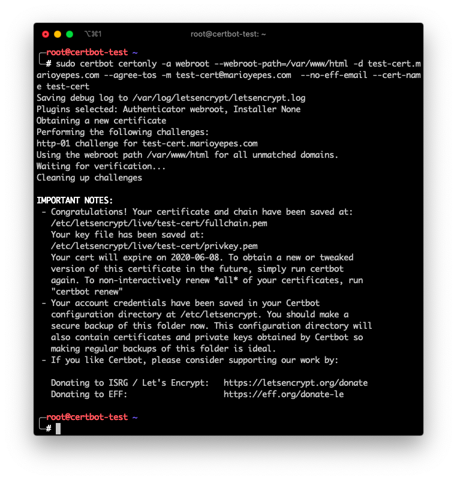

Let me explain...

- Used `certonly` so no _daemon_ installation or configuration is made
- Used `-a webroot` to specify the _WebRoot_ authenticator. And added `--webroot-path=/var/www/html` so `cerbot` knows where is the web root.
- Also, added `-d test-cert.marioyepes.com` parameter so `certbot` knows which domain to validate.
- `--agree-tos -m test-cert@marioyepes.com --no-eff-email` instructs `certboot` not to prompt me for _Terms of Service_ nor to _which email send reminders_ nor if I want _EFF (Electronic Frontier Foundation) emails_.
- And finally `--certname test-cert` instructs `certbot` to save the new certificate and key in `/etc/letsencrypt/live/test-cert/` directory instead of using the domain name.

If we list the newly created `/etc/letsencrypt/live/test-cert/` directory, we can see that we have at least 3 files

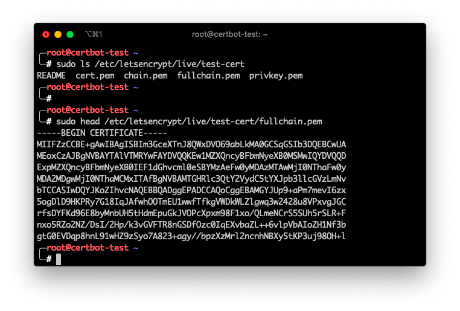

- `privkey.pem` which is the private key used to decrypt incoming information
- `cert.pem` which is the actual certificate
- `fullchain.pem` which is a combination of the previous 2

### 3. Configure Nginx

To configure Nginx, you need to create a new virtual server. And a virtual server is created by adding a new `server` section.

I like keeping virtual servers in its own files. So lets create the new file `/etc/nginx/sites-available/test-ssl` with the following contents:

```nginx {9,10}
# /etc/nginx/sites-available/test-ssl

server {
	listen 443 ssl default_server;
	listen [::]:443 ssl default_server;
	server_name test-cert.marioyepes.com;
	root /var/www/html;
	index index.html index.nginx-debian.html;
	ssl_certificate /etc/letsencrypt/live/test-cert/fullchain.pem;
	ssl_certificate_key /etc/letsencrypt/live/test-cert/privkey.pem;
	location / {
		try_files $uri $uri/ =404;
	}
}
```

Notice that the newly created certificate and key are configured with the `ssl_certificate` and `ssl_certificate_key` directives. **We need both files**.

Having created the new virtual server in `sites-available` you have to activate it by creating a _Symbolic Link_ in `sites-available`.

Here is the complete process:

```bash
sudo vim /etc/nginx/sites-available/test-ssl # Create the file
sudo ln -s /etc/nginx/sites-available/test-ssl /etc/nginx/sites-enabled/test-ssl # Enable new virtual server
sudo nginx -t # Text configuration
sudo service nginx reload # Load the configuration
```

Now, lets test that the server is secured:

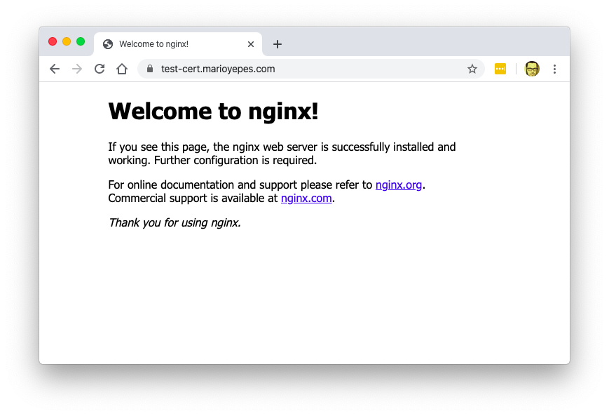

Do you see the look at the address bar? That means that the site is secured with SSL.

Just to be sure, lets use a SSL/TLS validator:

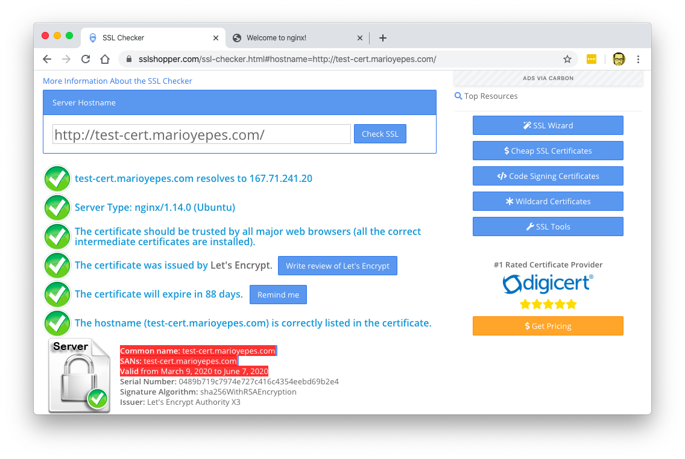

### 4. Configure Apache

With Apache the process is similar, its just that the directives are different.

So lests start by creating a new _Virtual Host_ with a new configuration file in `/etc/apache2/sites-available/certbot-test.conf` and add the following content:

```apacheconf {10-12}
# /etc/apache2/sites-available/certbot-test.conf

<IfModule mod_ssl.c>
  <VirtualHost *:443>
    ServerName test-cert.marioyepes.com
    DocumentRoot /var/www/html
    ErrorLog ${APACHE_LOG_DIR}/error.log
    CustomLog ${APACHE_LOG_DIR}/access.log combined_plus_hostname
    SSLEngine on
    SSLCertificateFile /etc/letsencrypt/live/test-cert/cert.pem
    SSLCertificateKeyFile /etc/letsencrypt/live/test-cert/privkey.pem
    SSLCertificateChainFile /etc/letsencrypt/live/test-cert/fullchain.pem
  </VirtualHost>
</IfModule>
```

With Apache, you enable a new site by executing the command `a2ensite` and then restarting apache:

```bash
sudo a2ensite certbot-test
systemctl restart apache2
```

And that's it. You have a secure site with Apache.

## Renew a certificate

Let's Encrypt certificates are valid for only 90 days, as opposed to the 365 days of a regular one.

This means that you have to renew them pretty often.

The good new is that to renew **all of your certificates** stored in you machine, you only have to issue the command

```bash
sudo certbot renew
```

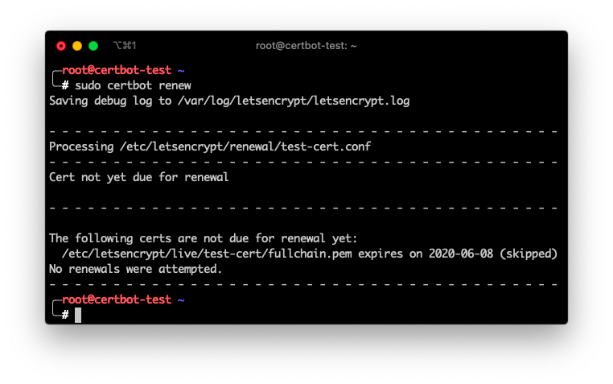

And that will go over all of the certificates stored in `/etc/letsencrypt/live` and renew them automatically.

You can even add a `cron` job in your machine that does that automatically for you once a week.

```
# /etc/crontab
3 0 * * 1 certbot renew
```

## List and delete certs

If you have a lot of websites in your server, like when you are creating virtual hosts with Nginx or Apache, its possible that you'll end up with a lot of certificates stored in your machine.

If you need to list which certificates are in you machine use the command

```bash
sudo cerboot certificates
```

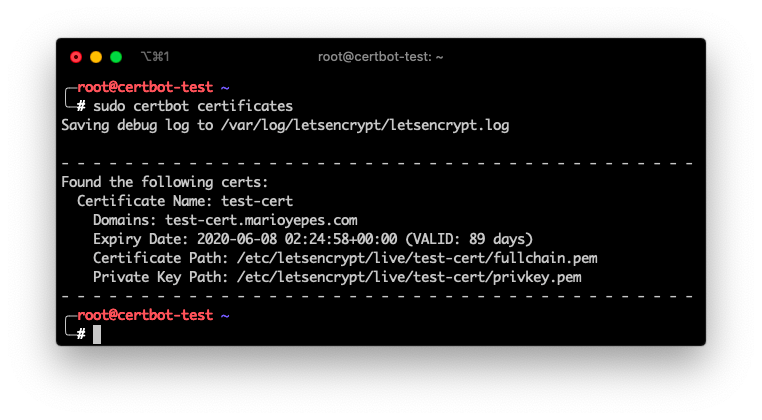

And if by any case you need to delete a certificate you can issue the command

```bash
sudo certbot delete --cert-name test-cert
```

Where `test-cert` is the name of the certificate you want to delete

## More info

The complete `certbot` manual can be found [here](https://certbot.eff.org/docs/using.html).

Take into account that the manual in the previous link cover how to use the `certbot` command and not how to develop with _Let's Encrypt_ API.
