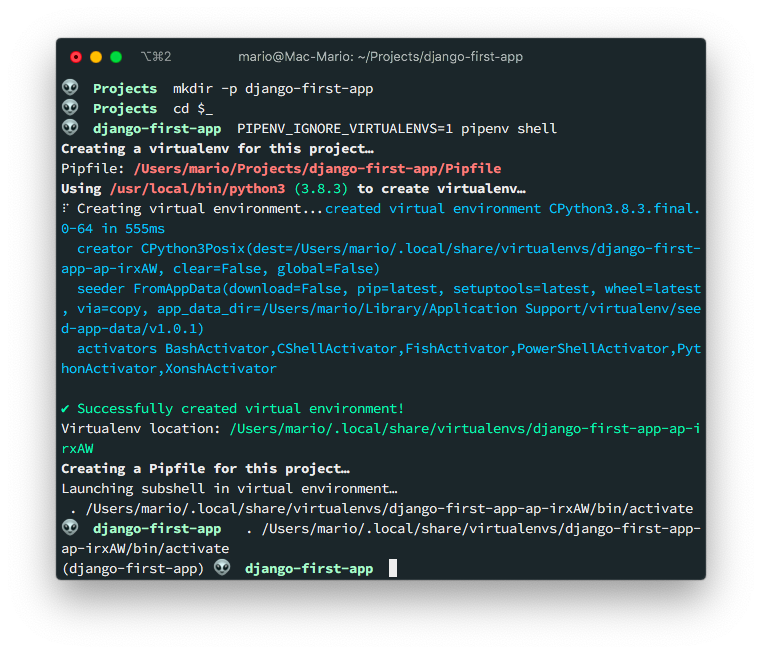

# Django tooling with Pipenv, Pre-Commit, GitHub actions and PostgreSQL

Lately I've become more and more interested in [Python](https://python.org) for it's usage in Data Science applications, Machine Learning and the creation websites that has some kind of prediction options.

So I started looking at the different python web frameworks and it seems that [Django](https://www.djangoproject.com/) is a safe bet if you are just starting to dip your toes in this world.

So I created this guide to show you how you can create a kick ass Django development environment with:

- [Pipenv](https://docs.pipenv.org/) for package installation and management
- [pre-commit](https://pre-commit.com/) to lint files before commiting to GitHub
- Automatic testing with [GitHub Actions](https://github.com/features/actions)
- [PostgreSQL](https://www.postgresql.org/) instead of Sqlite for data storage

Is important to note that this is not a Django guide, nor a development tutorial. It's more a python tooling guide.

## TOC

```toc

```

## Install Python and Pip

Obviously we need to start with Python. This is what is going to power up all of the tools and modules that we're going to use here.

By default Mac comes with an outdated Python, at least it was like that at the time of this article writing


Upgrading python to the current version ([3.9](https://en.wikibooks.org/wiki/Python_Programming/Version_history) at the time of this writing) is pretty easy if you are using (and you should) [brew](https://brew.sh) package manager.

Also, we are going to need the latest version of [pip](https://pypi.org/project/pip/) since we're going to need to install external python packages.

```bash
brew install python3 pip3
```

This will install the new commands `python3` and `pip3`. This also means that you'll end up with 2 versions of python in your computer.

> Its highly recommended that you do first a `brew update` before installing the new python to resolve some conflicts. In my case I had packages that required Python 3.7 and other Python 3.8.

## Install Pipenv

This is somewhat different at what you find on most of the django tutorials: The usage of [Pipenv](https://pipenv.pypa.io) instead of `virtualenv` or `venv`.

If you have a python background, the best way to explay `pipenv` is that is a combination of `pip` and `venv`.

For a node developer (like me), you can think of `pipenv` like the `npm` of Python.

And if you are a PHP developer, well, is the `composer` of Python.

OK, installing `pipenv` is pretty easy too:

```bash
brew install pipenv
```

And this will get you the command `pipenv` like so:


If you are more of a fan of installing packages with `pip` you could do:

```bash
pip3 install pipenv
```

If you are in Linux or Windows with WSL, then:

```bash
sudo apt-get update
sudo apt-get install pip
pip install --user pipenv
export PATH=$PATH:~/.local/bin # Add this to your .bashrc or .zshrc files
pipenv --version # To make sure it got installed
```

Notice that the method installs `pipenv` in your home directory in `~/.local/bin` sub-directory, and that's why you have to _export_ your `PATH` variable.

Additional information on how to install Pipenv can be found int the [documentation site](https://pipenv.pypa.io/en/latest/install/#installing-pipenv).

## Install PostgreSQL

If you are developing a serious project, you have to use a really performing database. And, unless you are willing to pay serious dough, there is nothing better that PostgreSQL.

> In MacOS, make sure you Xcode is up to date. This is necesary fo rthe `psycopg2` installation:

Install PostgreSQL with homebrew is pretty easy, you just need 3 commands:

```bash
brew install postgresql
brew services start postgresql
```

I already created an in-depth [tutorial](https://marioyepes.com/install-postgresql-on-mac-with-brew/) on how to install PostgreSQL in mac if you are interested on knowing more.

## Verify that you have all pre-requisites

Let just make sure that we have everything we need:

```bash
$ python3 --version
Python 3.9.1

$ pip3 --version
pip 20.3.3 from /usr/local/lib/python3.9/site-packages/pip (python 3.9)

$ pipenv --version
pipenv, version 2020.6.2

$ psql --version
psql (PostgreSQL) 13.1
```

The important part is that `pip3` and `python3` refer to the same version.

## Create virtual environment

Now that we have Python, Pip and Pipenv installed, we need to create a folder for a project, and then a _virtual environment_ in that folder.

So execute the following:

```bash{3}
mkdir django-first-app
cd $_
PIPENV_IGNORE_VIRTUALENVS=1 pipenv --python 3.9 shell
```

This will:

- Create a folder for our project
- Change directory into that folder
- Create the virtual environment

The command `pipenv shell` should be enough to create the virtual environment, but I used differently in the example:

- I passed the `--python 3.9` parameter.
- I passed the `PIPENV_IGNORE_VIRTUALENVS` variable

In my case I had issues because I had python 3.8 **and** 3.9 installed. So I had to pass the `--version 3.9` flag to the `pipenv shell` command.

Additionally, it seems that `pipenv` has a [bug](https://github.com/pypa/pipenv/issues/4316) when installed in Mac where it detects a virtual environment even if there is none yet. That's why I passed `PIPENV_IGNORE_VIRTUALENVS=1`.



Also, notice how the terminal's prompt changed prefixing it with `(django-first-app)` and how we have a file called `Pipfile` with the following contents:

```toml
[[source]]
url = "https://pypi.org/simple"
verify_ssl = true
name = "pypi"

[packages]

[dev-packages]

[requires]
python_version = "3.9"
```

Now, this is very important: **If you exit your terminal, or open a new terminal to work on your project, you need to execute `pipenv shell` before you execute any other python (or django) command**

### Where is the real virtual environment?

If you already know Python, you might be wandering where is the _virtual environment_ placed? ... There is no `venv/` folder or anything like it!

Well, its is your home dir:


That's one of the advantages of `pipenv`. It doesn't clutter your workdir with files.

## Create the Django project

We're ready to start up:

- We have a recent version of python ✓
- We have `pipenv` in our computer ✓
- We have a virtual environment for our project ✓

... We are ready to install Django!

The first thing is to install the Django Framework in our **virtual environment** and **then** create the actual project

```bash
pipenv install django
django-admin startproject config .
python manage.py runserver 8000
```

This will:

- Install Django in **our virtual environment**
- Create the new project
- Run the test server in port `8000` (which is the default port)

Notice the `.` at the end. This prevent the creation of a new sub-directory.

> I like to name my projects `config` since there is where most of the configuration files will be. A lot of people use the sufix `_project`, like `crm_project` or `test_project`, instead.

If you visit `http://localhost:8000` you'll get the start Django start screen.


## Fix the `settings.py` file

Before we go any further, lets do some cleanup in the `config/settings.py` file by removing some sensitive data and making Django read the environment for things like keys:

> Remember `config`, is the name I chose for my project

- Remove the `SECRET_KEY` value from the settings file, and make it be read from the environment. This prevents tools like GitGardian to complaint about security issues and makes our project more portable
- Change the `DEBUG` variable to be taken from the environment also
- Add `localhost` and `127.0.0.1` to the list of allowed hosts `ALLOWED_HOSTS`
- Configure the default timezone

All of this is achieved by making the following changes in the `config/settings.py` file:

```python
# config/settings.py
import os # Add this. You'll need this to read data from the environment
# ...
SECRET_KEY = os.environ.get('SECRET_KEY', '') # Import SECRET_KEY from the environment
# ...
DEBUG = os.environ.get('DEBUG', 'True').lower() == 'true' # Enable Debug
# ...
ALLOWED_HOSTS = ['127.0.0.1', 'localhost'] # Add the this 2 entries
# ...
LANGUAGE_CODE = 'es-co' # If you want to change the default languege
# ...
TIME_ZONE = 'America/Bogota' # Change this to your local zone
```

Now, our first trick!

It turns out that `pipenv` reads a file called `.env`, if exists, when you execute `pipenv shell`. And the values that are on `.env` are published as _environment variables_!

No you know why we changed those values in settings. Right?

So, lets make this `.env` file with the following content:

```yaml
# .env
SECRET_KEY = '**************************************************'
DEBUG=True # Not required but good to have it here
```

> Obviously change the '\***_._**' for the actual key

Now, stop the development server, **exit the virtual environment and re-enter it** so the `.env` file gets read.

```bash
^D # Ctrl-C to stop the django server
exit
pipenv shell
python manage.py runserver 8080
```

> I changed the port just for fun ;)

Visit `http://localhost:8080` and verify that you still get a placeholder page.

## Using pre commit hooks

I love making my development environments take care of all the details a project requires. Tasks like linting and formatting should be done for me before I commit to GitHub. That's why I use [pre-commit](https://pre-commit.com/) in Python projects.

> For JavaScript I use [husky](https://www.npmjs.com/package/husky)

But to have `pre-commit` work. I first need to initialize a repository.

```bash
git init
git branch -m main
echo .env >> .gitignore
echo db.sqlite3 >> .gitignore
git add .
git commit -m "First commit"
```

> Notice that I'm using `main` instead of `master` just like GitHub likes it.

Now, lets install pre-commit package:

```bash
pipenv install --dev pre-commit
pre-commit --version
```

And configure it by creating the `.pre-commit-config.yaml` configuration file with the contents displayed in [the official website](https://pre-commit.com/#2-add-a-pre-commit-configuration).

```yaml
repos:
  - repo: https://github.com/pre-commit/pre-commit-hooks
    rev: v2.3.0
    hooks:
      - id: check-yaml
      - id: end-of-file-fixer
      - id: trailing-whitespace
      - id: check-executables-have-shebangs
      - id: debug-statements
      - id: check-merge-conflict
  - repo: https://github.com/psf/black
    rev: 19.3b0
    hooks:
      - id: black
```

Finally install the hooks in your git repository.

```bash
pre-commit install
pre-commit autoupdate
```

> The `pre-commit install` will generate the file `.git/hooks/pre-commit`

On the next time you execute `git commit -m '...'` some files will get downloaded. But this only happens the first time.

Now... A little test! ... Add 3 or four extra spaces in `config/settings.py` and try to commit those changes.


Isn't that awesome?

Our first commit failed, but at the same time if fixed the offending files. That's why re-adding and re-committing worked.

> There is a very complete Django `pre-commit` [tutorial](https://codeburst.io/tool-your-django-project-pre-commit-hooks-e1799d84551f) in codeburst.io

## Enable GitHub actions

I also love this part. Creating workflows so our code gets tested directly on GitHub.

But before we add the actions we have to create some tests to execute and some functionality to be tested.

### Create a test URL

First let's create a `test-path/` route that returns a simple _Hello world_ message when visited.

```python {4,8}
# config/urls.py
from django.contrib import admin
from django.urls import path
from django.http import HttpResponse

urlpatterns = [
    path('admin/', admin.site.urls),
    path('test-path/', lambda req: HttpResponse('Hello world'), name='test-path')
]
```

As you can see, I created the `test-path/` route, that when visited returns a `Hello world` message. To test this out visit `http://localhost:8000/test-path/` and verify that you get the correct message.

The idea behind this small functionality is to have something to test against when we setup GitHub actions.

### Setup testing

Now, lets setup testing in Django...

This is very easy since testing in Django comes out of the box. That's a reason to call Django a _bateries included_ framework.

So, create a file called `config/test.py` with the following 2 tests:

```python
# config/test.py
from django.test import TestCase
from django.urls import reverse

class FirstTest(TestCase):
    def test_that_invalid_fails(self):
        """ This test fails on purpose """
        self.assertTrue(False)

    def test_that_testing_works(self):
        """ This test validates that the route /test-path/ is a valid path """
        res = self.client.get(reverse('test-path'))
        self.assertEqual(200, res.status_code)
```

As you can see, the second test tests the route we created previously.

To verify that the tests are executed, in the terminal issue (make sure that the virtual environment is still activated):

```bash
python manage.py test
```

And this will output

```bash
Loading .env environment variables...
Creating test database for alias 'default'...
System check identified no issues (0 silenced).
F.
======================================================================
FAIL: test_that_invalid_fails (config.test.FirstTest)
This test fails on purpose
----------------------------------------------------------------------
Traceback (most recent call last):
  File "/Users/mario/Projects/django-first-app/config/test.py", line 8, in test_that_invalid_fails
    self.assertTrue(False)
AssertionError: False is not true

----------------------------------------------------------------------
Ran 2 tests in 0.046s

FAILED (failures=1)
Destroying test database for alias 'default'...
```

Great! We have one valid test and **one invalid test**. This will come in handy when we configure GitHub actions.

### Setup a GitHub workflow

To setup GitHub actions you need only to create a `.yaml` workflow file in the `.github/workflows/` directory with the instructions on how to create a python environment that executes the testing functions.

> In [https://docs.github.com/en/actions](https://docs.github.com/en/actions), under the section [building and testing python](https://docs.github.com/en/actions/guides/building-and-testing-python) you can get to the [example python workflow file](https://docs.github.com/en/actions/guides/building-and-testing-python#starting-with-the-python-workflow-template) which is a good starting point for a vanilla python project. The problem with that file is that assumes that you are using `pip` and not `pipenv`.

```yaml {1,11}
# .github/workflows/django-tests.yaml
name: Execute django tests

on: [push]

jobs:
  build:
    runs-on: ubuntu-latest
    strategy:
      matrix:
        python-version: [3.9]

    steps:
      - name: Checkout the projects code
        uses: actions/checkout@v2

      - name: Set up Python ${{ matrix.python-version }}
        uses: actions/setup-python@v2
        with:
          python-version: ${{ matrix.python-version }}

      - name: Install pipenv
        run: |
          python -m pip install --upgrade pipenv wheel

      - id: cache-pipenv
        uses: actions/cache@v1
        with:
          path: ~/.local/share/virtualenvs/
          key: ${{ runner.os }}-pipenv-${{ hashFiles('**/Pipfile.lock') }}

      - name: Install dependencies
        if: steps.cache-pipenv.outputs.cache-hit != 'true'
        run: |
          pipenv install --deploy --dev

      - name: Execute the tests
        run: |
          pipenv run python manage.py test
        env:
          SECRET_KEY: "xxxxxxxxxxxxxxxxxxxxxxxxxxxxxxxxxxxxxxxxxxxxxxxxxx"
```

> In this example use `xxxxxx...` for the `SECRET_KEY` actually. We need a non empty secret but just for testing.

A couple of things to point out about that workflow:

- Since we're using `pipenv` we verify if there is a cache before we install dependencies
- The execute tests command is `pipenv run python manage.py test` that's because we need to load activate a virtual environment and load variables into it
- We're using an insecure `SECRET_KEY` value since we are just testing
- If we need a database for our tests, we have to configure it before the `Execute the tests` step

> A more complete workflow file can be found in this [gist](https://gist.github.com/alukach/6f3a371e9af600e417aca1b36806ad72) from Anthony Lukach.

### Commit and verify

Up until now we have:

- A temp route to test in `/test-path/`
- 2 test functions in `config/test.py`
- A workflow `.yaml` with the necesary steps to execute the tests in GitHub

The only thing left to do is to create a repository (which you should know how to do) in GitHub and add it as a remote to our current project:

```bash
git add .
git commit -m "Adding GitHub actions workflow for automatic testing"
git remote add origin git@github.com:marioy47/django-development-environment.git
git push -u origin main
```

An go to GitHub, under the **Actions** tab to verify that the tests are running:


Notice that the firsts tests failed and the last is a success. That's because I when into `config/test.py` and changed the failing test:

```python {9}
# config/test.py
from django.test import TestCase
from django.urls import reverse


class FirstTest(TestCase):
    def test_that_invalid_fails(self):
        """ This test fails on purpose """
        self.assertTrue(True)

    def test_that_testing_works(self):
        """ This test validates that the route /test-path/ is a valid path """
        res = self.client.get(reverse("test-path"))
        self.assertEqual(200, res.status_code)
```

If you take a closer look, you can see that now we assert that true is true: `self.assertTrue(True)`

## Create and configure a PostgreSQL database

At the beginning we installed PostgreSQL and made it run at start up. Now lest install a Postgress Python driver so Django can actually connect to it.

In the terminal execute:

```bash
pipenv install psycopg2
createdb django_project
psql -l
```

Let me explain what each of those commands do:

- Install the Python PostgreSQL connector [psycopg](https://www.psycopg.org/)
- Create a new database in PostgreSQL
- List the databases to verify that the new one got created

Then we need to modify `config/settings.py`, where the `DATABASES` variable is configured, to specify the connection values:

```python
# config/settings.py
# ...
DATABASES = {
    'default': {
        'ENGINE': 'django.db.backends.postgresql_psycopg2',
        'NAME': os.environ.get('DB_NAME', ''),
        'USER': os.environ.get('DB_USER', ''),
        'PASSWORD': os.environ.get('DB_PASS', ''),
        'HOST': os.environ.get('DB_HOST', 'localhost'),
        'PORT': os.environ.get('DB_PORT', '5432'),
    }
}
# ...
```

And finally we need to modify our `.env` file adding the values of the configuration we just changed:

```yaml {4-9}
# .env
SECRET_KEY = '**************************************************'

# Database values
DB_NAME = 'django_project'
DB_USER = 'mario'
DB_PASS = 'mypass'
DB_HOST = 'localhost'
DB_PORT = '5432'
```

We all of this setted up you have to:

- Leave the virtual environment
- Re enter it
- Make the migrations

This is done with:

```bash
exit
pipenv shell
python manage.py makemigrations
python manage.py migrate
```

To check that the migrations worked, list the table `django_migrations` in the `django_project` database and verify that the migrations got actually executed:

```bash
psql -U mario -d django_project -c "select * from django_migrations"
```

## Final toughts

As you can see, we just configured an development environment for Django, without the need of creating one application.

The idea is the final result will help you to continue on the creation of a real application. But that a topic for another article.
