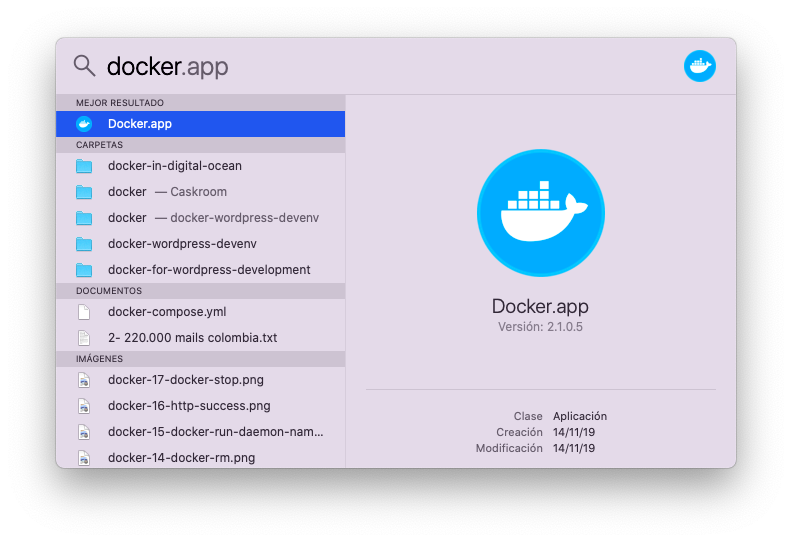
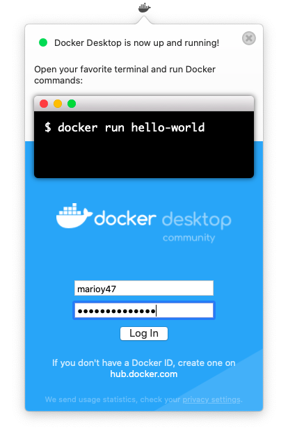
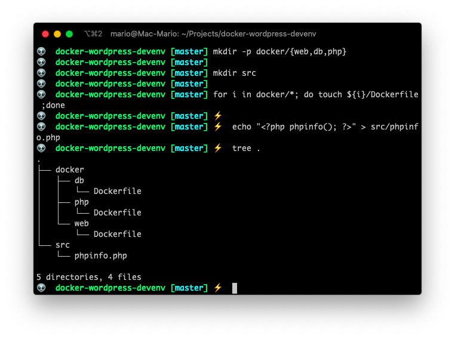

# Using Docker for Wordpress Development

I've been using [Vagrant](https://www.vagrantup.com/) for WordPress development for the las 4 years with great success, and the process has always been the same:

1. Install [VirtualBox](https://www.virtualbox.org/) and [Vagrant](https://www.vagrantup.com/) on my computer
2. Execute `vagrant init` to create a new `Vagrantfile` on an empty directory
3. Start vagrant with `vagrant up`

After I execute those commands I end up with a complete virtual machine with a full fledged linux running inside it. Which is fine, if it wasn't for the fact that:

- The configuration of the `Vagrantfile` is extremely long because you not only have to specify which OS you need inside your virtual machine, but the hardware you want to support and the local resources (sub-dirs) you want to share
- You have to install a bunch of binaries (trough an script or manually) INSIDE that virtual machine. Apps like a web server, a database engine, a php interpreter, node, etc.
- You have a **machine** with its **own OS** inside your machine (that also has an OS). And that consumes a great deal of resources.
- Make both OSs talk to each other is not a easy task. So when you need to access logs for instance, you have to issue commands that you probably shouldn't need to issue.

And to top it all... If I want to deploy Wordpress from my development machine to a production server, I have to follow an strict list of commands and checks to ensure that all versions and all paths on the production machine match the versions and paths of the development one.

So I wanted something faster, less error prone, more resource efficient and more portable for that process. That's why I wanted to give [Docker](https://www.docker.com/) a try.

Here I'm going to show you the steps I followed to have a full Wordpress production and development environment using Docker with the following items:

- I'll use Docker Images for the Web Server (nginx), Database (MariaDB) and Cache (Redis).
- I'll not use OS **only** images. (So no Ubuntu Docker image).
- I'll NOT use any WordPress images since I want to optimize it myself.
- I'll install plugins and themes using `wp-cli`.

## TOC

```toc

```

## Docker vs Vagrant (And any virtual machine solution)

If you've used Vagrant or plain Virtual Box before, you know that to run an emulated piece of software, like WordPress, first you have to create a virtual machine. And in this virtual machine install a complete OS (Linux most of the time)... And of top of all, install the binaries you need like `nginx`, `php` and `mariadb` inside that virtual manchine. All of that because, Vagrant is a **hardware** emulator.

And here is the BIG DIFFERENCE!.

Docker is going to use MY PC's OS kernel and my hardware to execute the supporting binaries that I need to have a WordPress environment even though they are compiled for another OS. Docker will take care of converting Linux system calls to Mac OS system calls. So Docker is a **software** emulator.

... Let me say that in another way. I'll be instructing Docker which Linux binaries to install to run WordPress directly in my Mac, instead of using a Virtualized PC with its own OS.

That's a big gain... But also a big change...

The gain is that you don't need a Virtual Machine and in that virtual machine a complete OS.

The change is that you have to create a configuration file for each binary you need to install. So, instead of having one big configuration file for the hole development environment, you need to create a configuration file for `php`, one for `nginx` and one `mariadb`.

Ok now... That last part is not completely true. There are ways to have just 1 configuration file for all 3 services, or even run them in one big group, but we're trying to be very basic here.

> If you are a Docker veteran you might be shouting at the screen right now for some of the things you just read. I apologise, but this is the simplest way I find to explain. 

## Install and run Docker

Now that _I tried to explain_ the differences between Docker and Virtual Machines, Lets start by installing Docker.

Ff you have Mac OS, installing Docker couldn't be easier. Just use _brew_ and that's it.

```bash
brew cask install docker
```

Now that Docker is installed, you just need to start it.



If all went well, you should have a Docker icon on the **menu bar**. That means that the Docker daemon is alive and well.



## Configure the WorkDir for your development environment

To start then, we need to create a WorkDir. And inside that WorkDir we'll use sub-dirs to configure Nginx, MariaDB, PHP-FPM, etc.

```bash
mkdir -p docker/{web,db,php}
mkdir src
echo '<?php phpinfo(); ?>' > public/index.php
tree docker public
```



- `docker/web/` will contain all the configuration needed for PHP
- `docker/db/` will contain the MariaDB files
- `docker/php/` will contain the php-fpm configuration
- `src/` will contain our WordPress

## Dockerfile for the database

```docker
FROM mariadb:latest

CMD ["mysqld"]

EXPOSE 3306

```

Test: `docker build --tag mariadb_phpdev .`

## Dockerfile for nginx

```docker
FROM nginx:alpine

CMD ["nginx"]

EXPOSE 80 443
```

## Dockerfile for php-fpm

```docker
FROM php:fpm-alpine

CMD ["php-fpm"]

EXPOSE 9000
```

## Suggested documentation

https://x-team.com/blog/docker-compose-php-environment-from-scratch/
