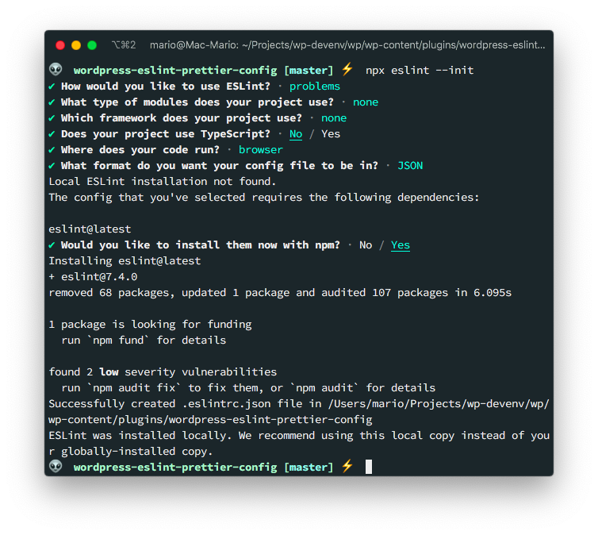
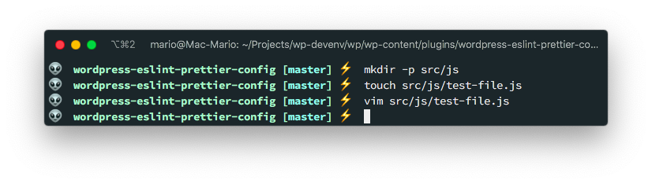
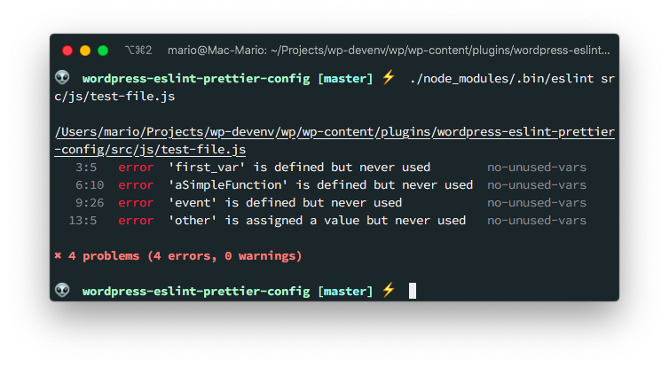
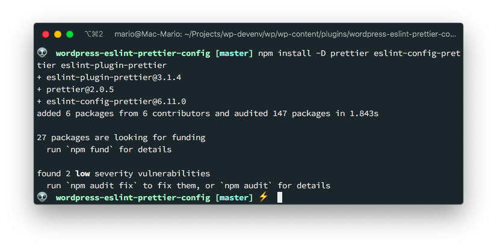
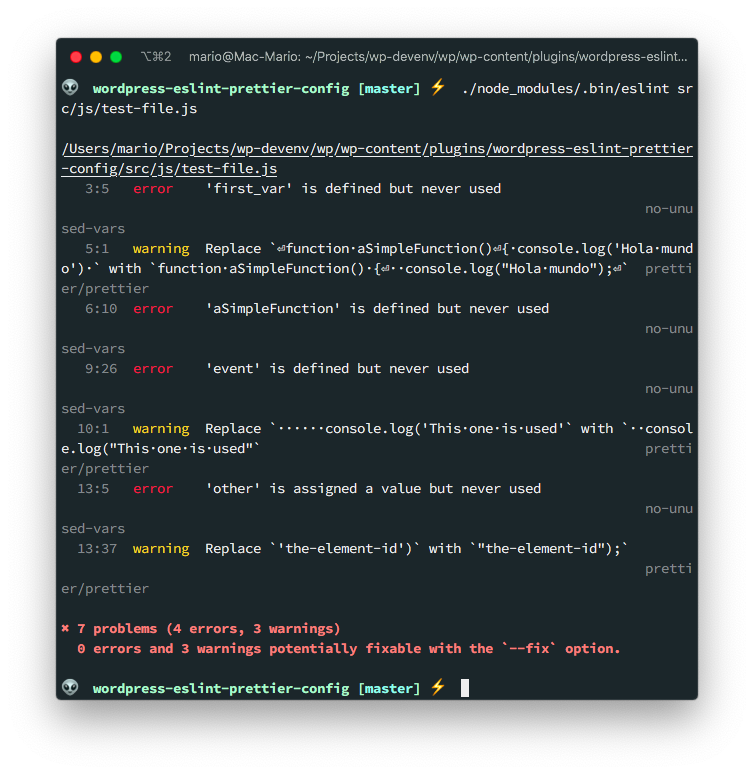
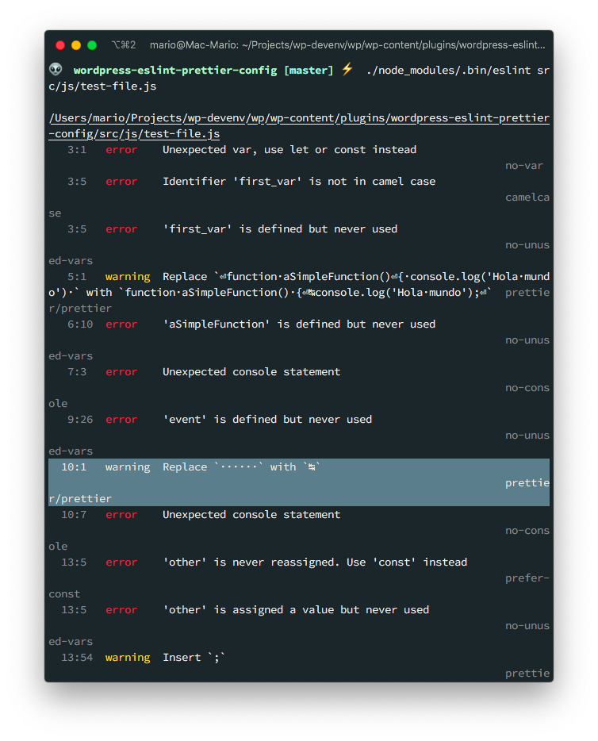
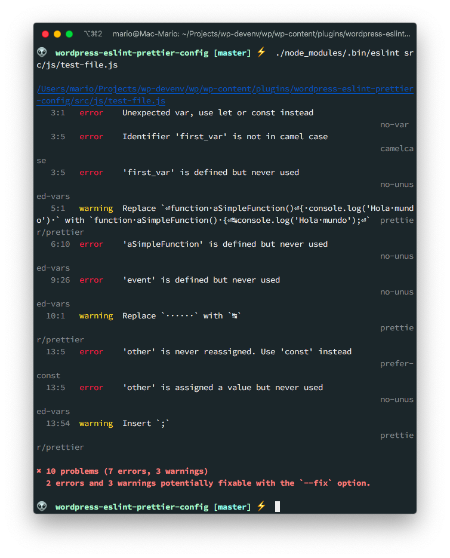

# Configure Eslint and Prettier for WordPress Theme development

Quoting the ESLint [Getting Started Guide](https://eslint.org/docs/user-guide/getting-started)

> ESLint is a tool for identifying and reporting on patterns found in ECMAScript/JavaScript code, with the goal of making code more consistent and avoiding bugs.

So, it basically analyzes JavaScript code, looking for errors or code-smells, without executing it. Which is great! This avoids many issues that other kind of linters have.

And how about a Prettier?...

Well, [Prettier](https://prettier.io/) is an **Opinionated code formatter** that ensures that the code of your project looks the same.

So if you are developing a JavaScript application you should certainly use both of this tools.

But you are using _Visual Studio Code_ you say?

Than you might be asking yourself ¿Why would you want to use a _command line_ tools for analyzing and formatting code if _VS Code_ already does it?

Well, the reason is that by using ESLint and Prettier, you can add the linting and formatting configuration to your project and share it across your team. Also, you can include it in your _Continuous Integration_ platform and ensure that your code is correct.

## The Caveat

Even tough both tools are excellent, its not all roses.

It turns out that ESLint has its own code formatter. Which is good, but it doesn't do as good a job as Prettier. So its not a bad idea to use both tools at the same time. And that can bring some weird issues.

- ESLint formatter will make some changes that Prettier could revert
- If you use a _watch_ function you could get and endless loop where one formatter fixes and then the other undoes the action
- You need to set up formatting rules on 2 places

So there are some simple steps that you can take to have both tools working together without stepping on each other toes.

## Preparing a project

For this tutorial, we're going to create a WordPress plug-in, and we're going to have the `.js`, `.scss`and `.css` files be linted by ESLint and formatted by Prettier.

So, just create a directory in your plug-ins dir and start git in it.

```bash
cd /path/to/wordpress/wp-content/plugins
mkdir wordpress-eslint-prettier-config
cd $_
git init
```

Also create an empty `package.json` file since we're going to add `npm` packages to it:

```bash
npm init -y
```

It's a good idea to edit your `package.json` so the information about author, keywords and such is correct.

```json
{
  "name": "wordpress-eslint-prettier-config",
  "version": "1.0.0",
  "description": "This is a basic repo that serves as a guide on how to configure eslint and prettier for a WordPress project.",
  "scripts": {},
  "repository": {
    "type": "git",
    "url": "git+https://github.com/marioy47/wordpress-eslint-prettier-config.git"
  },
  "keywords": [
    "eslint",
    "prettier",
    "wordpress",
    "editorconfig"
  ],
  "author": "Mario Yepes <marioy47@gmail.com>",
  "license": "MIT",
  "bugs": {
    "url": "https://github.com/marioy47/wordpress-eslint-prettier-config/issues"
  },
  "homepage": "https://github.com/marioy47/wordpress-eslint-prettier-config#readme",
  "devDependencies": {}
}
```

## ESLint Setup

ESLint and Prettier are tools that can be run in the command line. That's why some developers install them globally on their system:

```bash
# This is useful but not recommended
npm install -g eslint prettier
```

This is totally fine. But [as the documentation suggests](https://eslint.org/docs/user-guide/getting-started#installation-and-usage) you should install eslint **per project**. And the reason is because you'll want to include _code linting_ and _code beatifying_ on your **Continuous Integration** step.

Personally, I never install them globally and I recommend you don't also. That way there wont be any confusion on why the "_CI_ step is not working".

To start the initial setup use `npx` to call `eslint` with the `--init` flag:

```bash
npx eslint --init
```

This will start a wizard asking you for you project preferences:



As you can see, the wizard asks you for pretty basic questions:

- Which standard to use
- If you use React, Vue or Angular
- If the current project uses Typescript
- Etc.

Depending on your answers, you'll get prompted with the question if you want to install some additional packages or in my case, it went ahead and installed all required dependencies.

The result of this command, is that you'll get a `.eslint.json` file

```json
{
    "env": {
        "browser": true,
        "es2020": true
    },
    "extends": "eslint:recommended",
    "parserOptions": {
        "ecmaVersion": 11
    },
    "rules": {
    }
}
```

The configuration file is very important since ESLint wont work without it since it declares which **rules** you are going to apply to you project.


## Using ESLint with the new configuration

Now, lets create a test `.js` file and run it trough ESLint to verify if it has errors:



```javascript
// src/js/test-file.js

var first_var;


function aSimpleFunction()
{ console.log('Hola mundo') }

function anotherFunction(event) {
      console.log('This one is used');
}

let other = document.getElementById('the-element-id')

anotherFunction(null);
```

And execute ESLint to figure out if it has any errors:



Great! We have a way to **detect** code errors but still no styling.

One thing to note. The ESLint configuration wizard added the `eslint` module to our `packages.json` file.

## Prettier configuration

With ESLint installed, we can now move to configuring Prettier so we can format our code.

The issue is that ESLint can do some formatting that can conflict with Prettier. So we have to make the 2 tools talk to each other so there is no formatting problems.

Fortunately, Prettier has [official support for ESLint](https://prettier.io/docs/en/integrating-with-linters.html) so the process is not that complicated.

So lest install the `prettier` module and a couple of supporting modules so ESLint understands that it has to use prettier for the formatting:

```bash
npm install -D prettier eslint-config-prettier eslint-plugin-prettier
```



- `prettier` is the Prettier command but on our project.
- `eslint-config-prettier ` [Turns off all rules that are unnecessary or might conflict with Prettier.](https://github.com/prettier/eslint-config-prettier#eslint-config-prettier).
- `eslint-plugin-prettier` [Runs Prettier as an ESLint rule and reports differences as individual ESLint issues](https://github.com/prettier/eslint-plugin-prettier#eslint-plugin-prettier-).

Then we have to edit `.eslint.json` to add the **prettier plugin** and the **prettier config**.

```json{8,15}
{
    "env": {
        "browser": true,
        "es2020": true
    },
    "extends": [
        "eslint:recommended",
        "plugin:prettier/recommended"
    ],
    "parserOptions": {
        "ecmaVersion": 11
    },
    "rules": {
        "prettier/prettier": "warn"
    }
}
```

As advised by the documentation, leave the `prettier` be the last _extend_ configuration.

Now, when you issue eslint again, you'll get some additional warnings about the code style:



## WordPress configuration

If you take a look at the `.eslint.json` file in the [Guetenberg Project](https://github.com/WordPress/gutenberg/blob/master/.eslintrc.js), you can see that WordPress uses A LOT of rules.

Since we're lazy, I'm going to use an already created [ESLint WordPress Package](https://www.npmjs.com/package/@wordpress/eslint-plugin)

This package will _configurations and custom rules for WordPress development_. Which is exactly what we need.

So lets install it with 

```bash
npm install @wordpress/eslint-plugin --save-dev
```

And again, edit the `.eslint.json` file adding this new package:

```json
{
    "env": {
        "browser": true,
        "es2020": true
    },
    "extends": [
        "eslint:recommended",
        "plugin:@wordpress/eslint-plugin/recommended"
    ],
    "parserOptions": {
        "ecmaVersion": 11
    },
    "rules": {
        "prettier/prettier": "warn"
    }
}
```

Take into account that I've deleted the `plugin:prettier/recommended` since according [to the documentation](https://www.npmjs.com/package/@wordpress/eslint-plugin#usage) _The recommended preset will include rules governing an ES2015+ environment, and includes rules from the eslint-plugin-jsx-a11y, eslint-plugin-react, and eslint-plugin-prettier projects._

And now take a look at the output when I run `eslint` again:



In the hightlited line you can see that its recommeding to use **Tabs** instead of spaces which is what WordPress recoomends.

## Disabling rules

I don't know about you, but when I'm developing I really need to use the `console.log()` function in my JavaScript code... But eslint complains about that all the time.

So if you want to temporary disable that check, add the following to your `.eslint.json` file:

```json{15}
{
    "env": {
        "browser": true,
        "es2020": true
    },
    "extends": [
        "eslint:recommended",
        "plugin:@wordpress/eslint-plugin/recommended"
    ],
    "parserOptions": {
        "ecmaVersion": 11
    },
    "rules": {
        "prettier/prettier": "warn",
        "no-console": "off"
    }
}
```

This way you wont get any errors about the `no-console` issue:



## Prettier local configuration

## Add npm script to run it

https://medium.com/capua-dev/integrando-prettier-con-eslint-961d1d8b716c

## Add Editorconfig for faster review

## Visual Studio configuration 

## Vim Configuration
