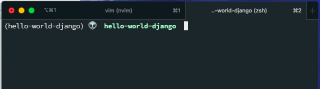
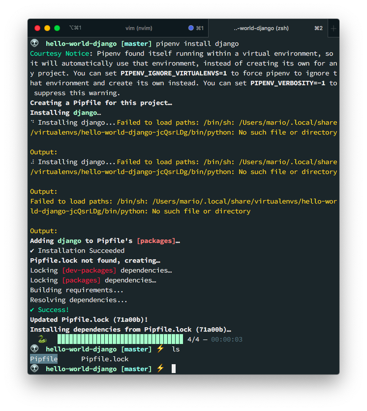
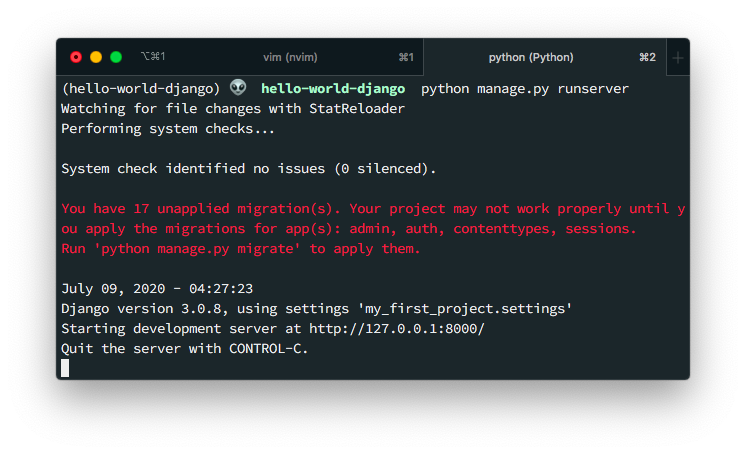
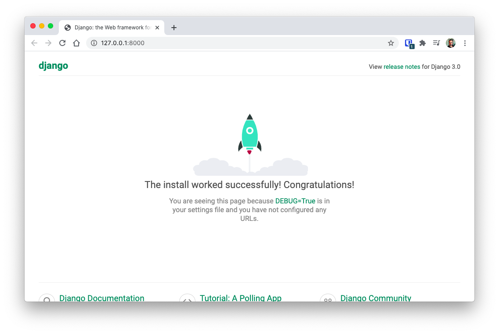

## Install python and Pipenv
```bash
brew install paython3
pip3 install pipenv
```

Be sure to exit and re-open the terminal to avoid python version confussion

```bash
mkdir hello-world-django 
cd $_
pipenv shell
```



```toml
[[source]]
name = "pypi"
url = "https://pypi.org/simple"
verify_ssl = true

[dev-packages]

[packages]

[requires]
python_version = "3.7"
```

## Install django and setart dev server



```bash
django-admin startproject my_first_project
python manage.py runserver
```

```
first_project
├── __init__.py
├── asgi.py
├── settings.py
├── urls.py
└── wsgi.py

```

```toml
[[source]]
name = "pypi"
url = "https://pypi.org/simple"
verify_ssl = true

[dev-packages]

[packages]
django = "*"

[requires]
python_version = "3.7"
```




## Create first app

```bash
pipenv shell
python manage.py startapp hello
```

```
hello
├── __init__.py
├── admin.py
├── apps.py
├── migrations
│   └── __init__.py
├── models.py
├── tests.py
└── views.py

1 directory, 7 files
```

