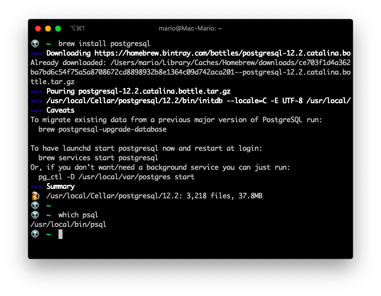
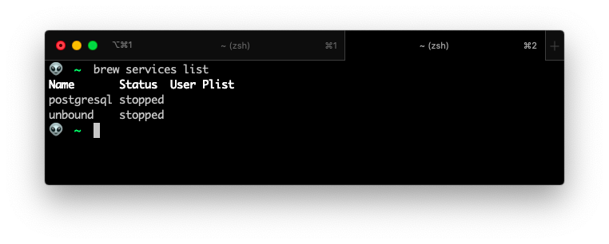
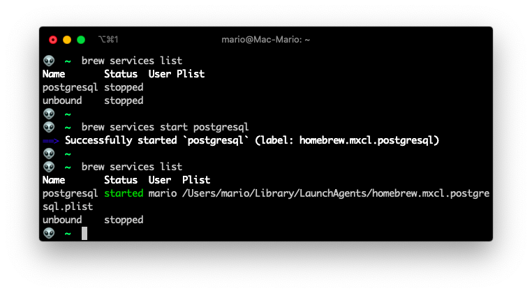
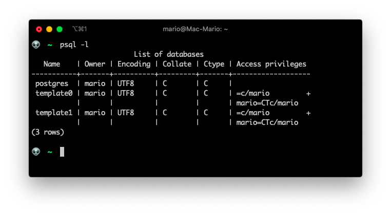
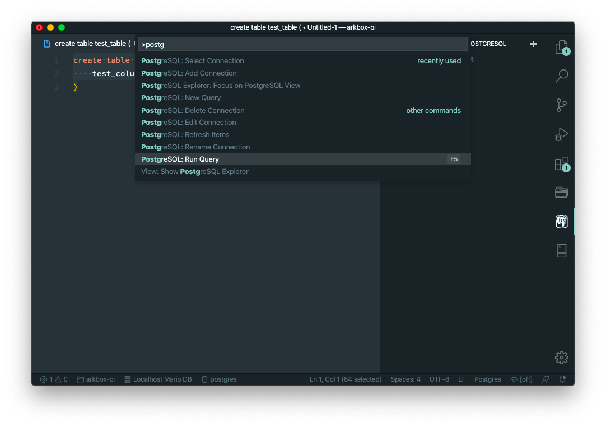
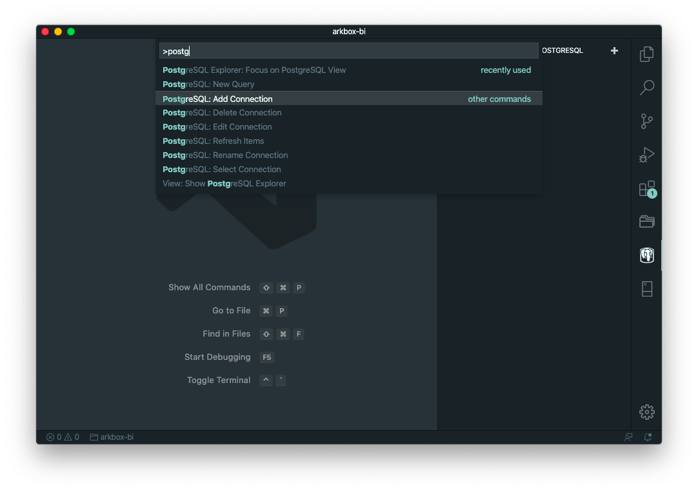
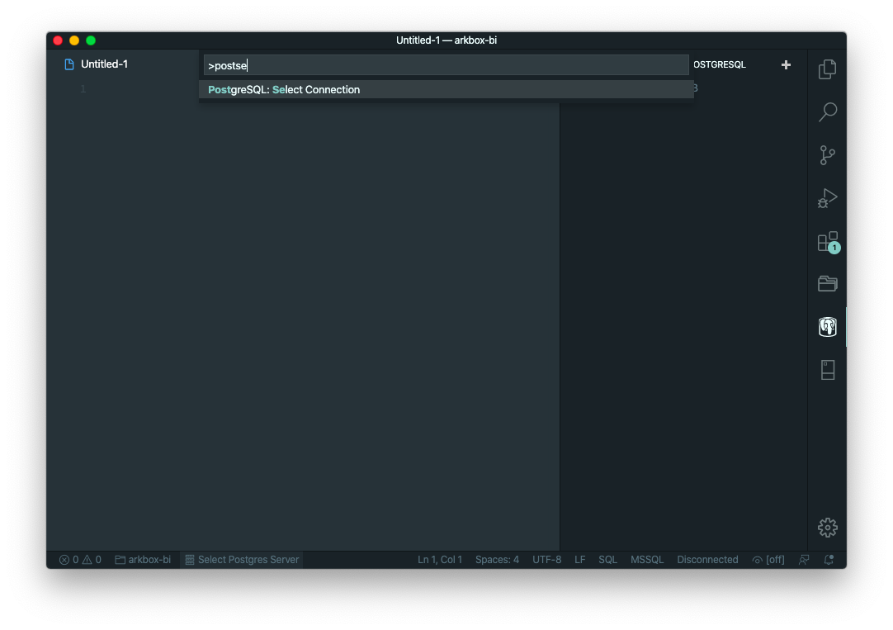
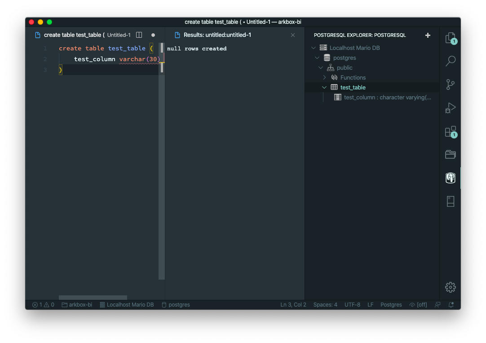

# Install PostgresSQL in a Mac with Homebrew

This is a short post about how to install [PostgreSQL](https://postgresql.org) on a Mac machine using [Homebrew](https://brew.sh).

And as I bonus, I'll show you how to access it directly in visual studio since most of the visualization tools are commercial or pretty cumbersome to use.

## Install the package

This is very straight  forward, specially if you have used Hombrew before:

```bash
brew doctor
brew update
brew install postgresql
export PGDATA='/usr/local/var/postgres' #check your package dir
```



One word about that last step, the `export` step.

That's a warning that the PostgreSQL installer issues: To export the `PGDATA` variable in case the command `psql` doesn't work.

In my case I didn't have to use it, but its a good idea to keep that in mind.

To verify that all whent well. Lest list the installed services and look for `postgresql`



## Disable service auto start

If you don't want/need a background service started at boot time, you can just run:

```bash
pg_ctl -D /usr/local/var/postgres start
```

In that way you have to manage the start/stop of the service by your self.

On a Mac, a PostgreSQL server without connections do not consume a lot of resources so its pretty safe to have the service start automatically at boot time.

## Service management.

The advantage of using Homebrew is that we can use the `brew` command to manage the service as opposed of the more traditional `lanchctl` command that Mac OS uses.

So to start the service, just type:

```bash
brew services start postgresql
```



And to stop it...

```bash
brew services stop postgresql
```


## Common errors

This are a couple of solutions to common errors

### You do not have any databases

After install you should be able to list the databases from the command line:

```bash
psql -l
```



But it possible that you get an error saying that you do not own any database. The solution would be to create your own database:

```bash
createdb `whoami`
```

### Postgres role not present

Also, if you are getting an error about the `postgres` role not being present, then create the _Postgres User_

```bash
createuser -s postgres
```

## Visual Studio Code

There are several extensions that you can use to connnect to PostgreSQL using visual studio code. There is even one created by Microsoft...

But the best one is [PostgreSQL](https://marketplace.visualstudio.com/items?itemName=ckolkman.vscode-postgres) by Chris Kolkman

You can install it using the extension manager inside _Visual Studio Code_. Or you can install it from the terminal with the following command.

```bash
code --install-extension ckolkman.vscode-postgres
```

Before we get into creating a connection, let me give you the most practical tip about this extension: **User `F5` to execute a query** 😅



### Setup and connect

Just create a connection



Or if you already have a connection, just select one:



### Explorer

If you have objects on your database, you can use the explorer to view them:




## Remove completely PostgresSQL

If your done with your development or if you are receiving error with your PostgreSQL service, then you might need to delete and re-install your PostgreSQL.

The problem lies with the fact that most of the time re-installing doesn't solve the problem.

In that case you have to **completely delete** the package and the database files.

```bash
brew uninstall postgresql
rm -rf /usr/local/var/postgres
rm ~/.psql*
rm ~/.pgpass
```
