# Install, Setup and Execute your first Django Application

Lately I've become interested in Data Science applications and creation websites that has some kind of prediction options.

If you search the Internet, you'll find that if you want to do some kind of Data Science and Web projects you should use the Python-Django-TensorFlow stack.

Now, I'm not saying that that's what you should use, I'm only pointing out that those are the most popular technologies according to the search engines.

Here I'm going to show how I setted up my Mac to create this kind of applications without any external dependencies outside Python.

... Well, almost.

> If you want to set up your computer with the minimum amount of hassle, then I recommend that you skip this article and head over to the [Anaconda site](https://www.anaconda.com/) for instructions on how to install Python with their distribution.

## Install Python

Obviously we need to start with Python. This is what is going to power up all of the tools and modules that we're going to use here.

By default Mac comes with an outdated Python, at least it was like that at the time of this article writing

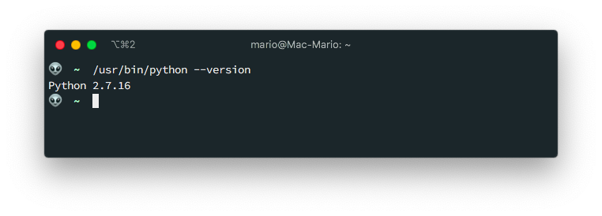

Upgrading python to the current verion ([3.8](https://en.wikibooks.org/wiki/Python_Programming/Version_history) at the time of this writing) is pretty easy if you are using (and you should) [brew](https://brew.sh) package manager.

```bash
brew install python
```

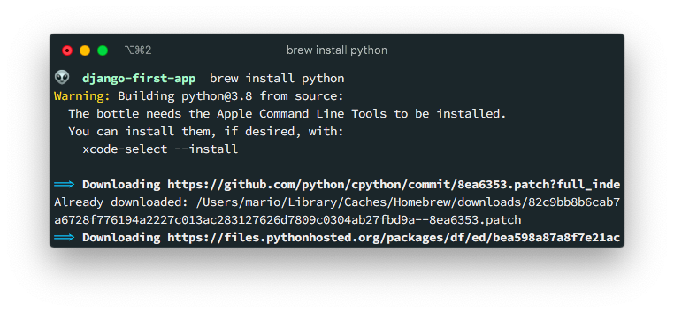

This will install a new command `python3`. This means that you'll end up with 2 versions of python in your computer.

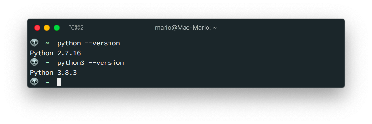

> Its higly recommended that you do first a `brew update` before installing the new python to resolve some conflicts. In my case I had packages that required Python 3.7 and other Python 3.8.

## Install Pipenv

This is somewhat different at what you find on most of the django tutorials: The usage of [Pipenv](https://pipenv.pypa.io) instead of `virtualenv`, `venv` and `pip`.

If you have a python background, the best way to explay `pipenv` is that is a combination of `pip` and `venv`.

For a node developer (like me), you can think of `pipenv` like the `npm` of Python.

And if you are a PHP developer, well, is the `composer` of Python.

OK, installing `pipenv` is pretty easy too:

```bash
brew install pipenv
```

And this will get you the command `pipenv` like so:

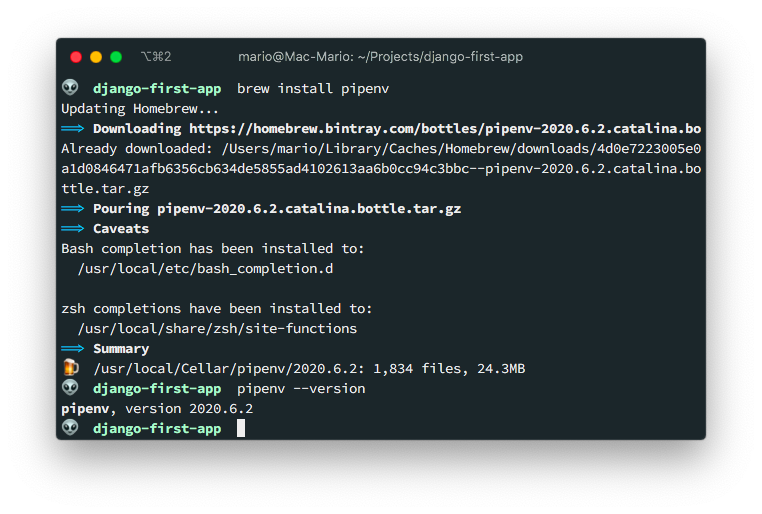

If you are more of a fan of installing packages with `pip` you could do:

```bash
pip3 install pipenv
```

And if you are on Windos or Linux, you can go to the [documentation](https://pipenv.pypa.io/en/latest/install/#installing-pipenv) for additional installing options.

## Create a Virtual Environment

Now that we have our pre requisites installed, we need to create a folder for a project, and then a _virtual environment_ in that folder.

The reason for the need to create a virtual environment has its roots in the previous item where we had to install a new Python interpreter in our machine. With virtual environments we can select with version of Python we are going to use for our current project.

Additionally, if we use virtual environments, we can install Python packages that just work on this virtual environment without clashing with the packages of other projects.

So execute the following:

```bash{3}
mkdir django-first-app
cd $_
PIPENV_IGNORE_VIRTUALENVS=1 pipenv shell
```

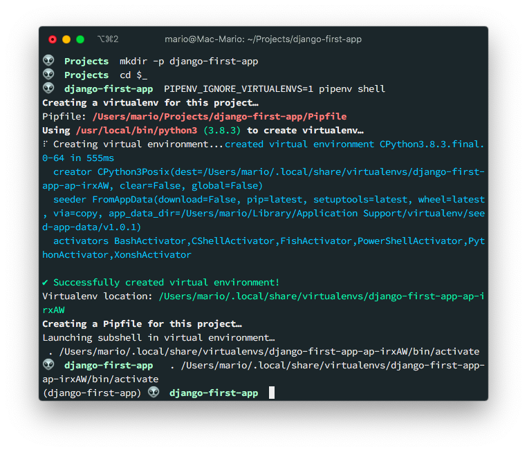

This will create a directory for our project, `cd` into it and initialize a virtual environment.

Notice how the prompt changes, adding `(django-first-app)` at the begening of it.

This tell us that we're using a virtual environment and that the name of the virtual environment is `django-first-app`.

Also, if you list the contents of the current dir, you'll find a new file called `Pipenv` with basic information of our new virtual environment

This are the contents of the `Pipfile`

```toml
[[source]]
name = "pypi"
url = "https://pypi.org/simple"
verify_ssl = true

[dev-packages]

[packages]

[requires]
python_version = "3.8"
```

The important part, for now, is that we are specifying that we're using version `3.8` of python.

If you know python, you know that a virtual environment copies a version of python and a basic list of modules. So you might be wandering where are they.

Well, they are in your home directory:

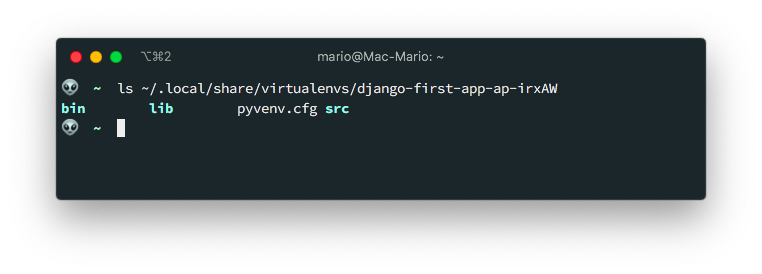

That's one of the advantages of `pipenv`. It doesn't clutter your workdir with files.

Now, this is very important: **If you exit your terminal, or open a new terminal to work on your project, you need to execute `pipenv shell` before you execute any other python (or django) command**

### Bug at the time of this writing

Now, you might be wandering ¿why did I used `PIPENV_IGNORE_VIRTUALENVS=1` on the creation of the virtual environment?.

We'll, it seems that `pipenv` has a [bug](https://github.com/pypa/pipenv/issues/4316) when installed in Mac where it detects a virtual environment even if there is none yet, and it issues the following message in the console.

```text
Courtesy Notice: Pipenv found itself running within a virtual environment, so it will automatically use that environment, instead of creating its own for any project. You can set PIPENV_IGNORE_VIRTUALENVS=1 to force pipenv to ignore that environment and create its own instead. You can set PIPENV_VERBOSITY=-1 to suppress this warning.
```

So, setting that variable before executing `pipenv shell` makes sure that you are creating a fresh virtual env.

**This parammeter is only needed the first time you execute `pipenv shell`**

## Create a Django project

We're almost setted up:

- We have a recent version of python
- We have `pipenv` in our computer
- We have a virtual environment for our project

... We are ready to install Django!

The first thing is to install the Django Framework in our **virtual environment** and **then** create the actual project

```bash
pipenv install django
django-admin startproject first_app .
```

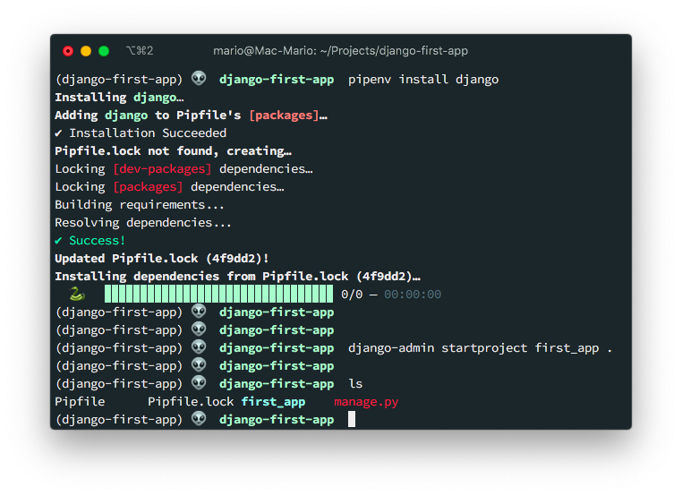

The first command installs django globally, and the second initializes a project in the current directory.

After both commands execute, you are left with the following directory structure:

```bash
$ tree .
.
├── Pipfile
├── Pipfile.lock
├── db.sqlite3
├── first_app
│   ├── __init__.py
│   ├── asgi.py
│   ├── settings.py
│   ├── urls.py
│   └── wsgi.py
└── manage.py

1 directory, 9 files
```

As you can see, we have a bunch of new files.

Right now the most important are

- `Pipfile.lock` file which has a list of packages **and versions** used in our project
- A `first_app` directory that hold our Django project
- And finally a `manage.py` script for us to create elements and "manage" our application (more on that latter).

Additionally, if we look at our `Pipfile` you'll see that we now have a new dependency:

```toml{9}
[[source]]
name = "pypi"
url = "https://pypi.org/simple"
verify_ssl = true

[dev-packages]

[packages]
django = "*"

[requires]
python_version = "3.8"
```

We're ready to start developing. But we wont just yet.

## Test your environment

Before we begin creating applications, views, models, etc. Lets test that Django works. Lets start the development web server with

```bash
python manage.py runserver
```

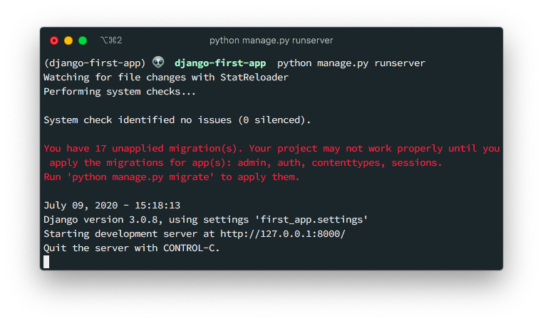

> Notice that we're still in our virtualenv, so the `python` comamnd refers to Python 3.8

And if we open a browser on https://localhost:8000 you'll get a _success_ page:


This tell us that we are good.

## Install linting and formatting tools

Before you start editing code, and to prevent any warnings from the code editor, lets install `pytlint` for linting our code, and `autopep8` to format it correctly.

```bash
pipenv install --dev pylint autopep8
```

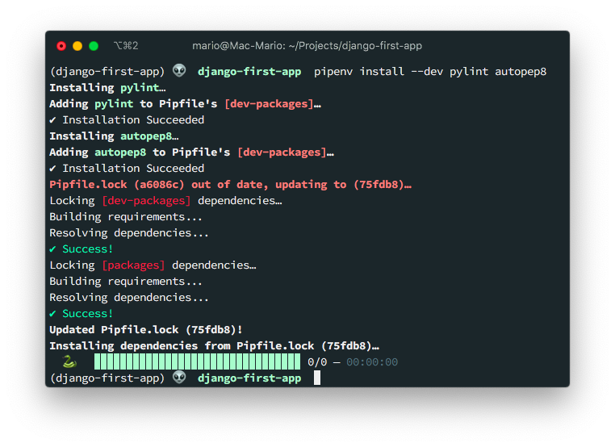

Notice that I used the `--dev` flag so this 2 packages are not installed in production.

If you look into the `Pipfile` you'll notice 2 new entries:

```toml{7,8}
[[source]]
name = "pypi"
url = "https://pypi.org/simple"
verify_ssl = true

[dev-packages]
pylint = "*"
autopep8 = "*"

[packages]
django = "*"

[requires]
python_version = "3.8"
```

Also notice that this 2 new entries are in the `dev-packages` section. This means that when we deploy to production, this 2 packages won't be installed.

## SECRET_KEY fix

As you can see from the last screeshot, you have a full blown web application that does nothing. So you might be wandering if you should commit to **git** now.

But before we do, lets fix a security issue that arises with Django, and is the fact that it stores a `SECRET_KEY` value inside the `first_app/settings.py` file.

```python
# settings.py

# SECURITY WARNING: keep the secret key used in production secret!
SECRET_KEY = 'vxxxxxxxxxxxxxxxxxxxxn59#$3(k=irh8iv$d8eqytlbh+7(c'
```

You should't commit that to the server ever, ever, ever. And I mean ever!

To fix that, `pipenv` comes to the rescue.

When you execute `pipenv shell`, or any other `pipenv` command, it will try to load a `.env` file and publish its contents as environment variables:

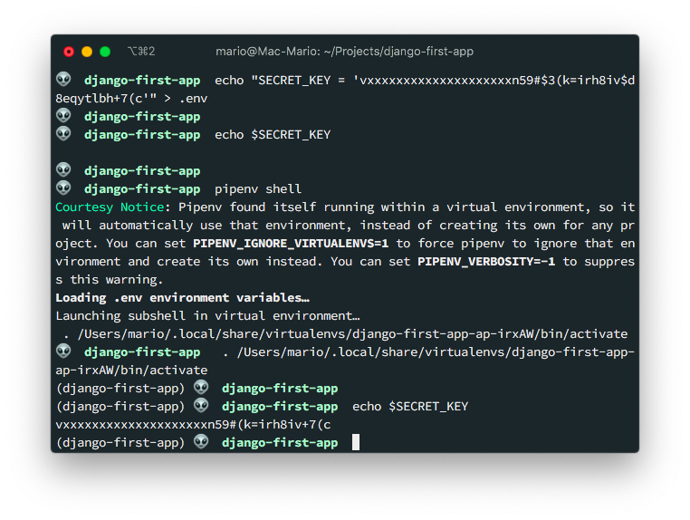

If you look at that last line, you can see how the `SECRET_KEY` is available as an **environment variable**. Now we have to change `first_app/settings.py` so it loads that variable from the environment instead of having it _burned_ into the code:

```python
# settings.py

# SECURITY WARNING: keep the secret key used in production secret!
SECRET_KEY = os.environ['SECRET_KEY']
```

And lets start the Django server again to verify that everything is working:

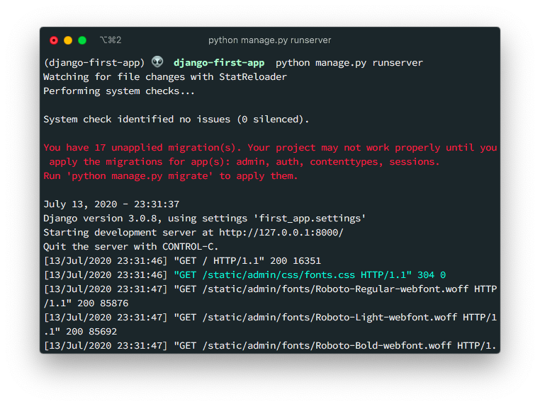

Ignore the red warning, that just saying that we havent initialized the database tables. The important thing is that the server is running and accepting connections.

If getting out and back in of the virtual environment its too much hassle. Then you can use the `pipenv run` command to execute the `manage.py` script:

```bash
pipenv run python manage.py runserver
```

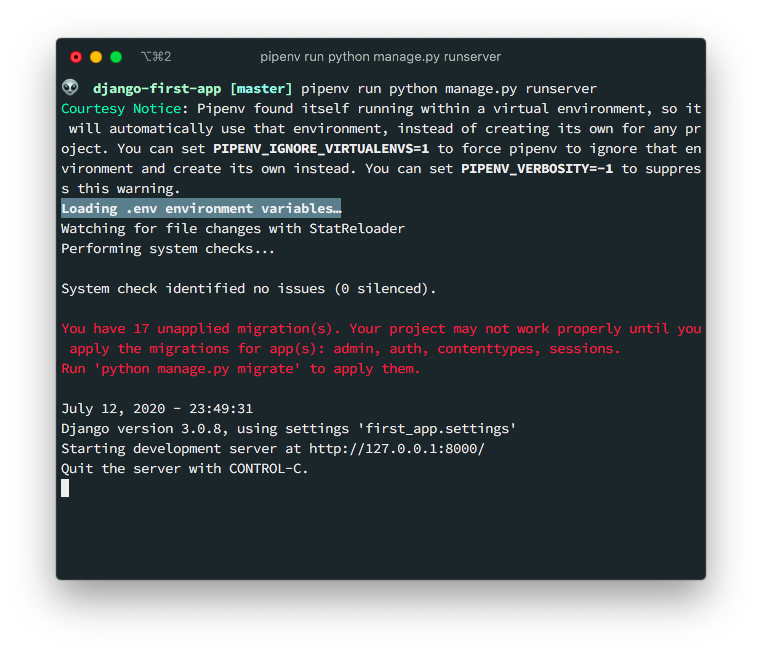

Finally don't forget to add this `.env` file to `.gitignore`:

```bash
echo .env >> .gitignore
```

And we're done.

## Create first app

I recommend you stop here and pick up an actual [Django tutorial](https://www.youtube.com/playlist?list=PL-osiE80TeTtoQCKZ03TU5fNfx2UY6U4p), or the official [documentation](https://docs.djangoproject.com/en/3.0/intro/). But if you want a quick getting started, here it is.

### 1. Create the actual app using the `manage.py` script like so:

```bash
python manage.py startapp hello
```

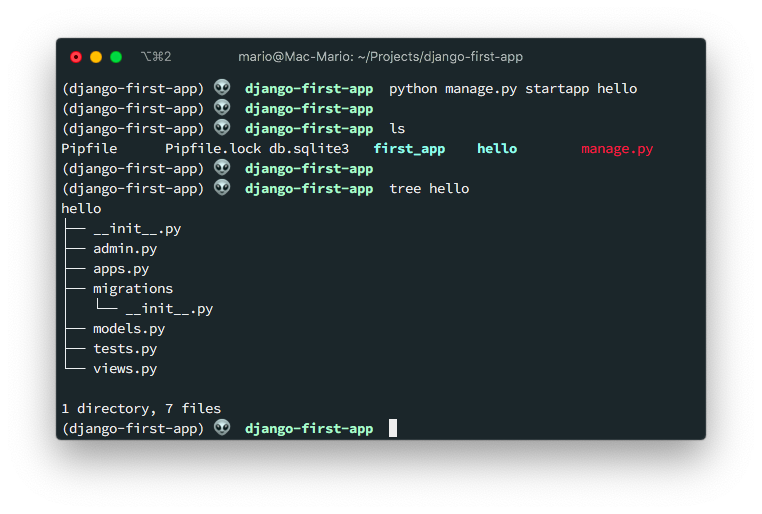

### 2. Register the `hello` app by adding it to the `INSTALLED_APPS` array in `first_app/settings.py`

```python{9}
# first_app/settings.py
INSTALLED_APPS = [
    'django.contrib.admin',
    'django.contrib.auth',
    'django.contrib.contenttypes',
    'django.contrib.sessions',
    'django.contrib.messages',
    'django.contrib.staticfiles',
    'hello'
]
```

### 3. Create a view in `hello/views.py`

```python
from django.shortcuts import render
from django.http import HttpResponse

def hello_world(request):
    return HttpResponse('Hola mundo!')
```

If you visit now the server, the success page will change to an error warning us that there is no rout the the root.

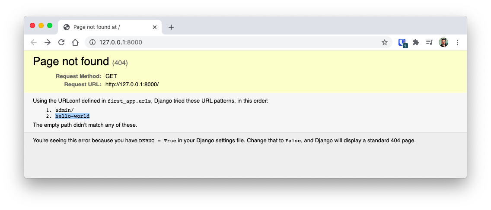

### 4. Create a route in `first_app/urls.py`

```python{3.8}
from django.contrib import admin
from django.urls import path
from hello.views import hello_world

urlpatterns = [
    path('admin/', admin.site.urls),
    path('hello-world', hello_world)
]
```

### 5. Run server and visit the new route

```bash
python manage.py runserver
```

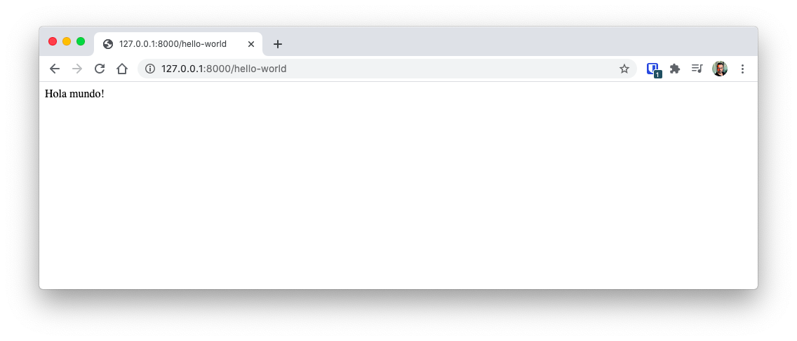

## Pipenv Cheat Sheet

I've included here a list of useful `pipenv` commands in case yoy are curious.

| Command                | Action                                                |
| ---------------------- | ----------------------------------------------------- |
| `pipenv --python 3.7`  | Create a project with another Python version          |
| `pipenv install --dev` | Install packages including _dev_ dependencies         |
| `pipenv lock`          | _Burns_ the package versions on `Pipfile.lock` file   |
| `pipenv clean`         | Removes all packages not in `Pipfile.lock`            |
| `pipenv run <command>` | Runs a command using the current virtualenv           |
| `pipenv sync`          | Installs the packages from `Pipfile.lock`             |
| `pipenv uninstall`     | Removes a pacakge from the env and from the `Pipfile` |
| `pipenv --where`       | Locates the project                                   |
| `pipenv --rm`          | Remove the current virtual environment                |
| `pipenv --venv`        | Locates the virtual environment                       |
| `pipenv ---py`         | Locates the Python interpreter                        |

## Final words

If you want to take a look at the final product, then you can visit the [GitHub Repo](https://github.com/marioy47/django-first-app) and take a look at the generated files.
