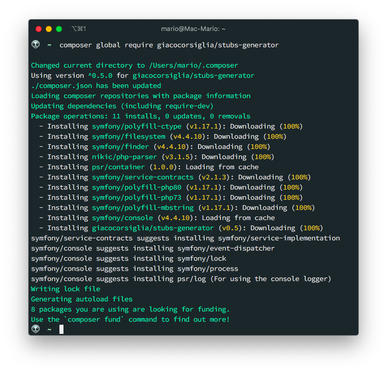
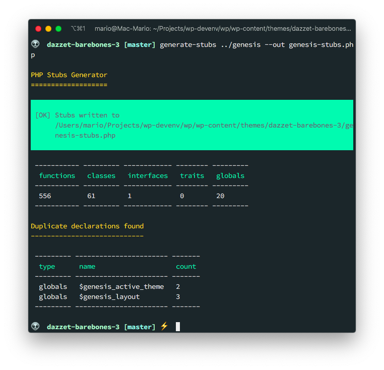
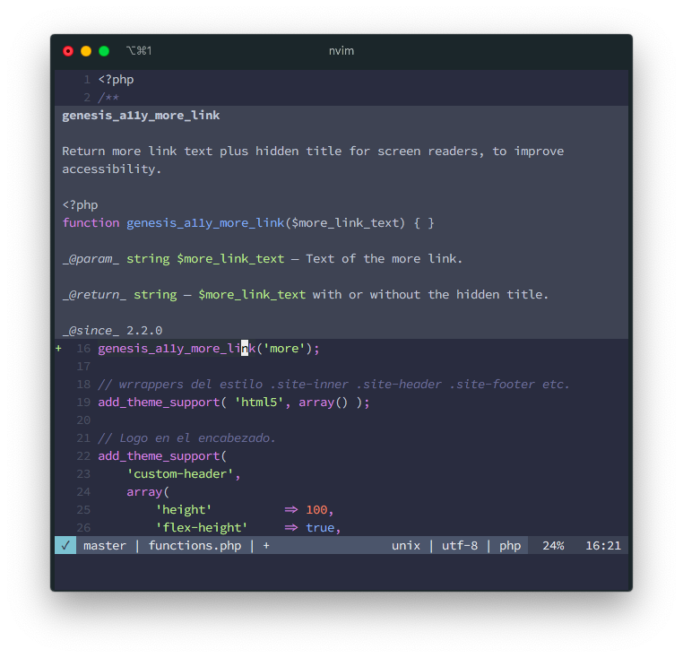
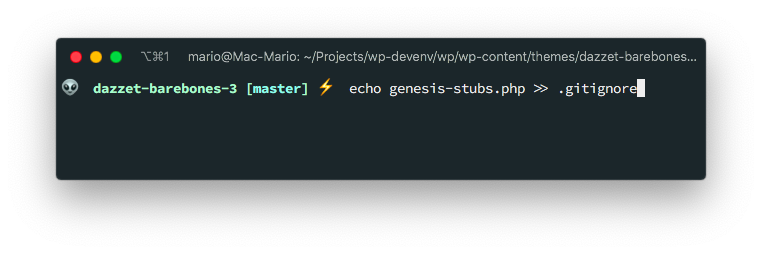

# Configure Intelephense to recognize Genesis Framework Functions

Its very probable that you don't know what Intelephense is, or at least what it really is.

Intelephense is the a [Language Server Protocol](https://langserver.org/) implementation for PHP.

Its not the only one, but in my opinion is the best one.

If you are still confused about what what you just read, let me give you a small history lesson.

## History

When Microsoft launched its [Visual Studio (Code)](https://code.visualstudio.com) editor. It decided to have the language parsing, linting and formating of code be done by an external server. And  that server changes depending the language that the user is editing.

