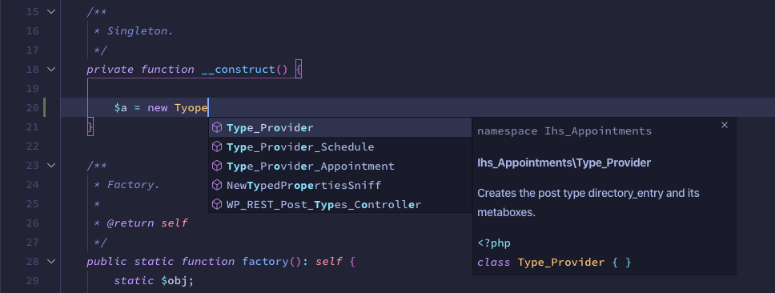
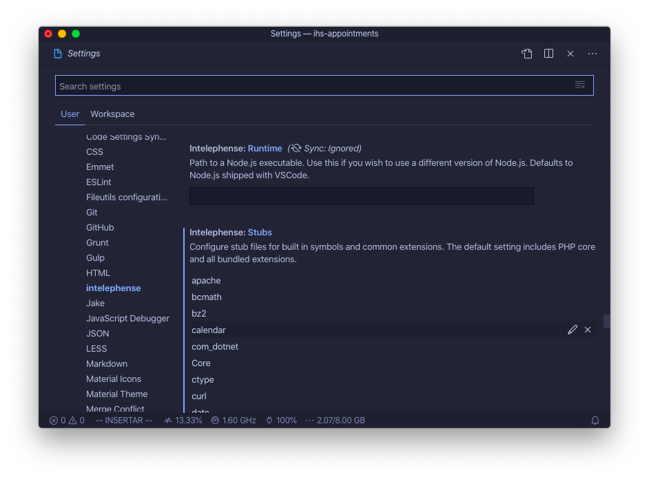
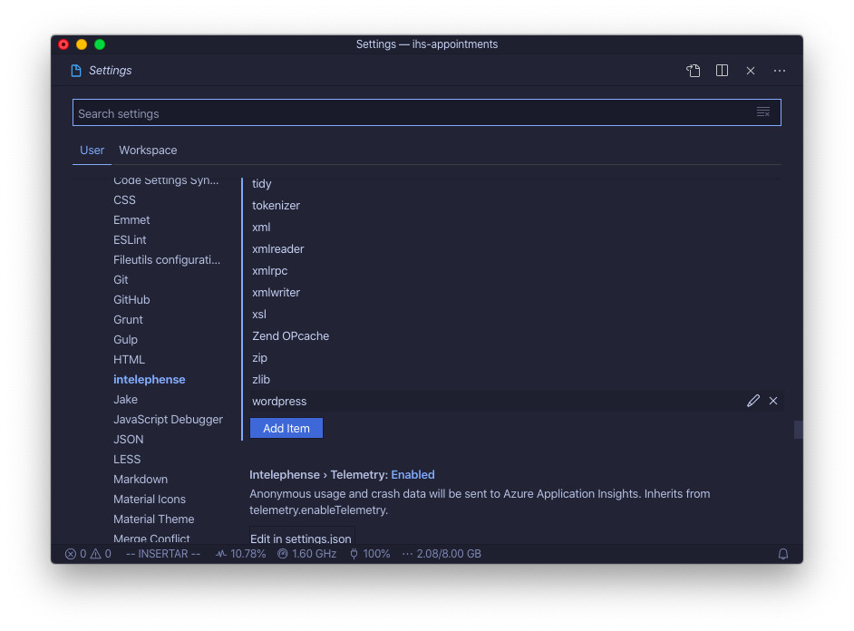
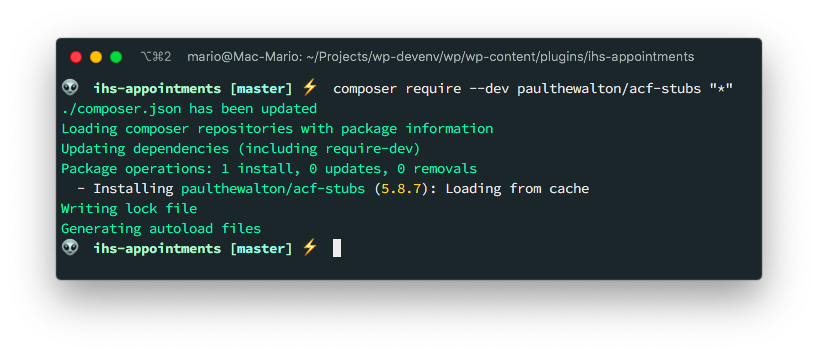
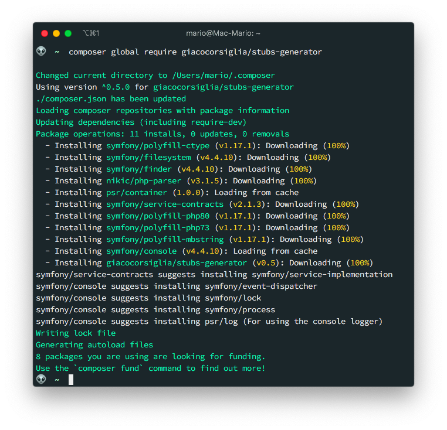
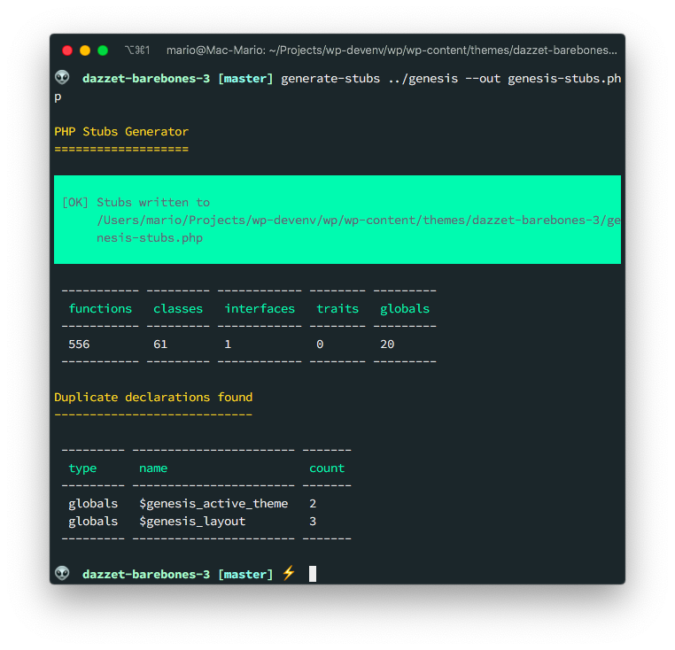
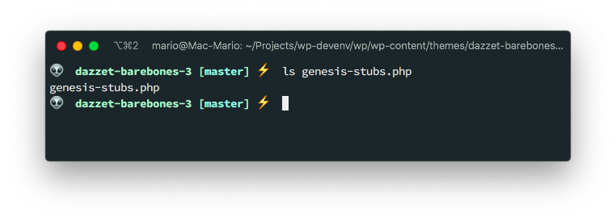
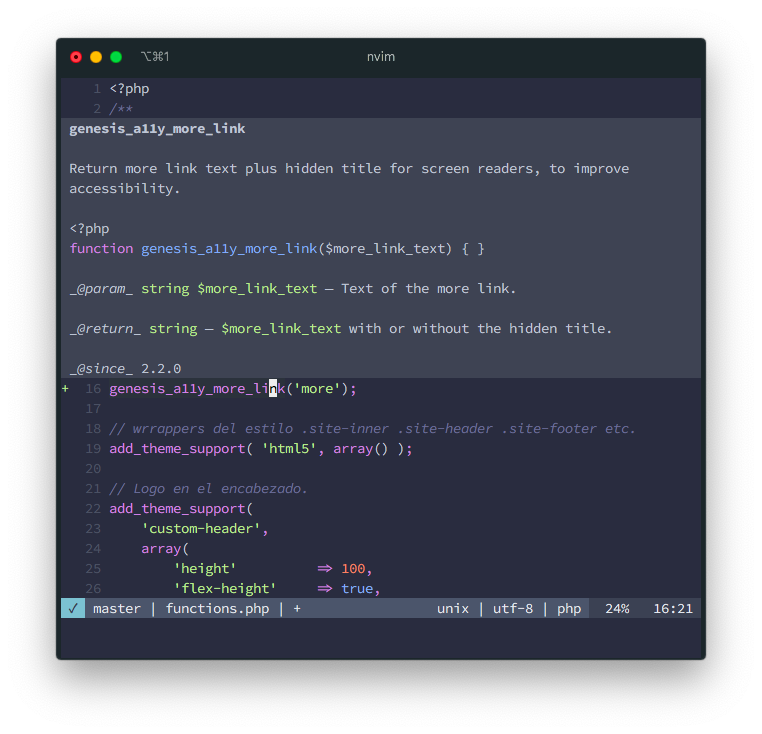
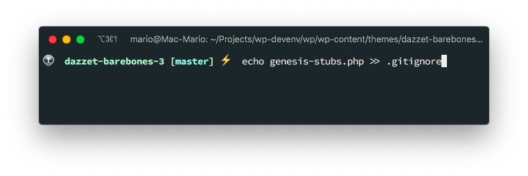

# Configure Intelephense to recognize WordPress, Genesis Framework and ACF Functions

Its very probable that you don't know what Intelephense is, or at least what it really is.

Intelephense is a [Language Server Protocol](https://langserver.org/), or **LSP**, implementation for PHP. Its not the only one, but in my opinion is the best one.

If you are still confused about what what you just read, let me give you a small history lesson.

## TOC

```toc

```

## History

When Microsoft launched its [Visual Studio (Code)](https://code.visualstudio.com) editor. It decided to have the language parsing, linting and formating of code be done by an external server. And that server has to follow an special implementation described in https://langserver.org/.

The great thing about that is that LSP, is that is an standard and not an implementation. Allowing developers to write their own server and connect them to any editor like [Visual Studio Code](https://code.visualstudio.com) or even [Neovim](https://neovim.io/).

The LSP server can be written in any language but most of them are written in TypeSctipt.

For PHP there are several implementations:

- [Phpactor](http://phpactor.github.io/phpactor/) which is written in PHP
- [PHP Languge Server](https://github.com/felixfbecker/php-language-server) that is completelly forgotten.
- [Intelephense](https://intelephense.com/) which also offers a [Visual Studio Code](https://code.visualstudio.com) extension that you  can download from [here](https://marketplace.visualstudio.com/items?itemName=bmewburn.vscode-intelephense-client)

But as I said in the intro, _Intelephense_ is the best as of July 2020.

## How it works

Intelephense, as any good LSP implementation, reads all the `.php` files in your project and extract all the function names from the function declarations. Also extracts any class names it finds and any _defines_ it encounters.

> Intelephense, and all the LSP implementations for PHP, includes the files that are in your `vendor/` directory.

Then, using the _DocComments_ of the function, class, definition, etc. Creates the pop-up documentation that you see in you editor when you start to type.



The problem, is that Intelephense recognizes all of the native PHP keywords, definitions and functions and the functions **in your project**, but external names, or names that come from external libraries are completely unknown to it.


The problem to solve is **how do we make Intelephense recognize** WordPress functions, Genesis Framework functions and [ACF](https://www.advancedcustomfields.com/) functions so it auto completes them.

The answer is we create and activate **stubs**!!!.

> Intelephense uses the [phpstormb-stubs](https://github.com/JetBrains/phpstorm-stubs) to have an idea of which functions to auto complete.

## WordPress auto completion

Lets start with the easier one: WordPress.

Is the easier one because Intelephense already includes support for WordPress auto complete but **is not activated by default**.

To activate it you have to go to your editor configuration and add `wordpress` to the parameter `intelephense.stubs`

### Visual Studio Code

Just open the configuration in the _Intelephense_ section:



And **add** `wordpress` to the list.



And you have WordPress support. Its that simple.

### Neovim

Neovim as of the time of this writing needs an external plugin called [Conquer of Completion](https://github.com/neoclide/coc.nvim) (or CoC in short) to use LSP servers including Intelepense. But there are [plans](https://neovim.io/doc/user/lsp.html) support LSP natively.

So first install and [configure](https://marioyepes.com/vim-setup-for-modern-web-development/) _CoC_ in your machine, and then execute `:CocConfig`.

This will open the `con-settings.json` file. There add `wordpress` to the list of stubs:

```json{11}
{
  "intelephense.stubs": [
    "...",
    "xmlreader",
    "xmlrpc",
    "xmlwriter",
    "Zend OPcache",
    "zip",
    "zlib",
    "ssh2",
    "wordpress"
  ]
}
```

## ACF

This one is also pretty easy... Actually easier than WordPress, but it has to be done **per project**.

You just need to require the [paulthewalton/acf-stubs](https://github.com/paulthewalton/acf-stubs) as a `--dev` dependency using composer.



As I said before, _Intelephense_, both in VSCode and Neovim will read the files in your `vendor/` directory so you don't need to do anything else.


## Genesis Framework

This one also has to be done per project and not per editor, but requires an additional step: You have to create the stubs yourself:

The first thing you have to do is to install **globally** the `stubs-generator` tool using composer.

> This has to be done only once, not per project.



With the `stub-generator` command installed, place yourself into the **project directory** where you want to generate the stubs and execute 

```bash
generate-stubs /path/to/wordpress/wp-content/themes/genesis --out genesis-stubs.php
```



In this example I didn't use an absolute path but a relative path since its easier.

> You can use any name, I selected `genesis-stubs.php` in this example.



Then, open _Neovim_ or _VSCode_ and test that the Genesis Framework Functions get auto copleted.



If all works. Add this new file to the `.gitignore` file so it doesn't get committed to git



And thats it... You have autompletion for Native PHP, WordPress, Genesis and ACF.
