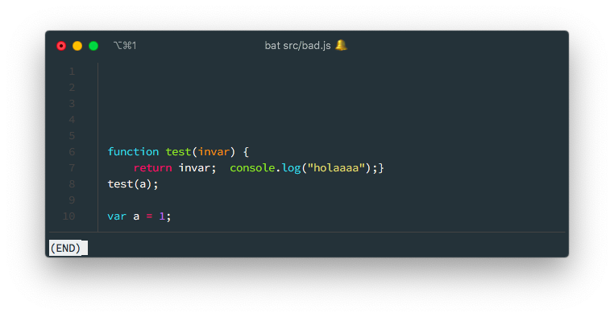
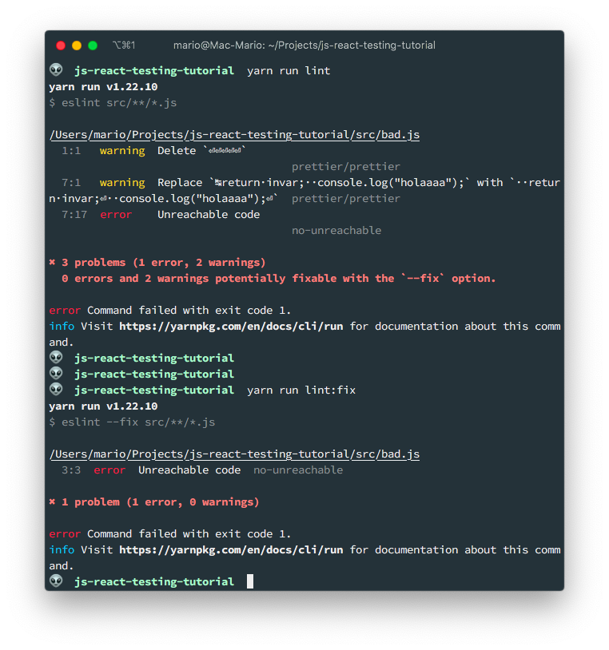
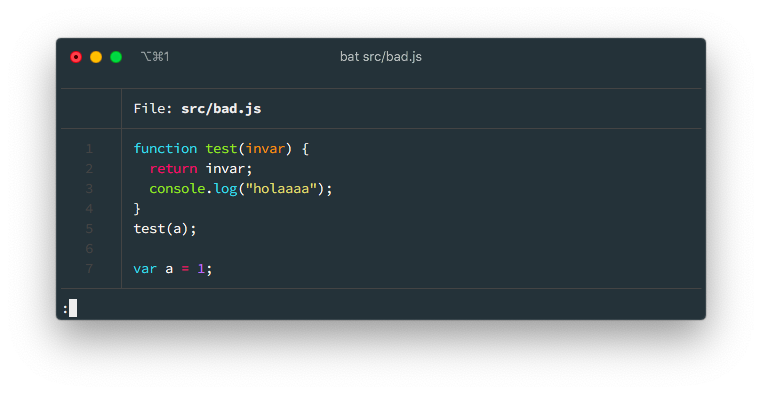
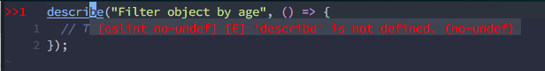
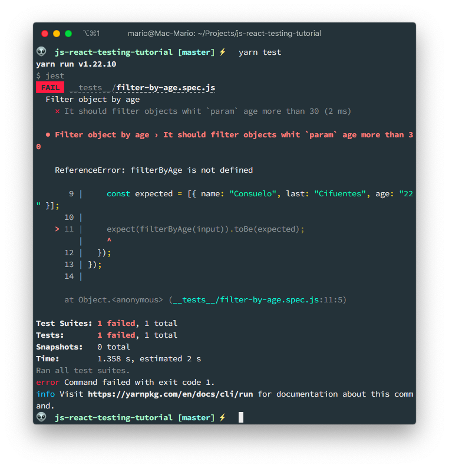
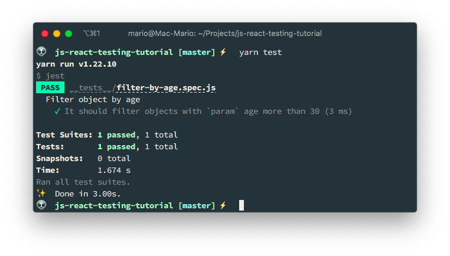
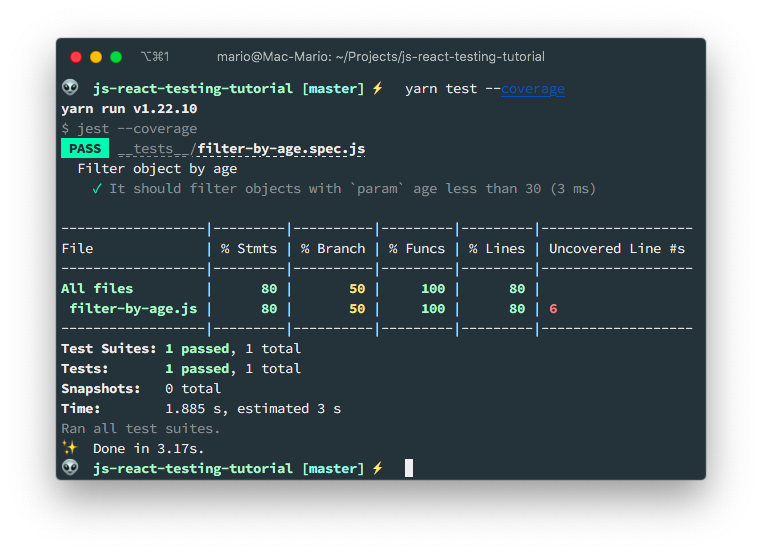
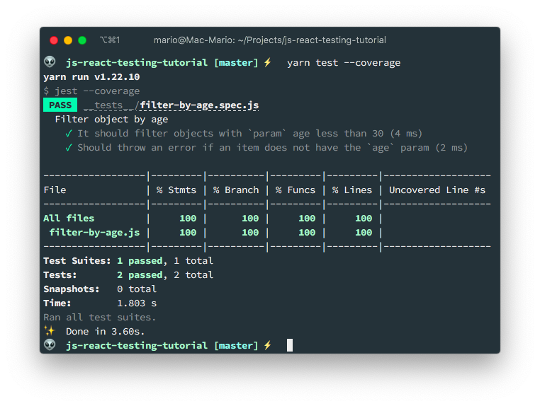
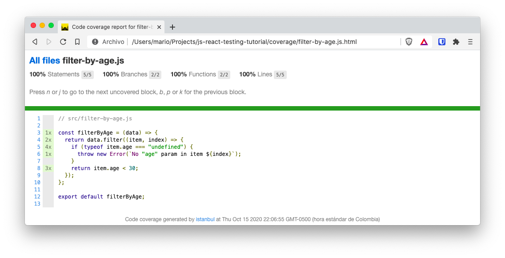

# Intro to React testing with Jest and React Testing Library

I don't have to tell you that testing is important... Right? RIGHT????

Then just let me tell you that with this article I'll attempt to set up a testing evironment that goes from vanilla JavaScript to React component testing.

In this case I'll be using [Jest](https://jestjs.io/), [JDOM]() and, [Testing Library](https://testing-library.com/) for all my testing needs

## TOC

```toc

```

## What is Jest

[Jest](https://jestjs.io/) is a _JavaScript Test Runner_. In other words, it's a JavaScript library for creating, running and structuring tests.

## What is React Testing Library

Since [version 3.3.0](https://github.com/facebook/create-react-app/releases/tag/v3.3.0) `create-react-app` uses [React Testing Library](https://testing-library.com/)

## Setup

One thing you have to know about me as a developer, is that I use [Neovim](() with [CoC](), and I require [Eslint]() and [Prettier]() installed on my project so I have automatic code formatting and linting.

So I'll start by creating a new empty project (hence the `yarn init -y`) and then I'll install a linter and a formatter.

```bash
mkdir js-react-testing-tutorial
cd $_
yarn init -y
yarn add eslint prettier eslint-config-prettier eslint-plugin-prettier --dev
```

That will leave me with the following directory structure.

```bash
$ tree -a -I node_modules # Show hidden files and ignore node_modules/
.
├── package.json
└── yarn.lock

0 directories, 2 files
```

And this is the contents of the `package.json` file. 

```json
{
  "name": "js-react-testing-tutorial",
  "version": "1.0.0",
  "main": "index.js",
  "license": "MIT",
  "devDependencies": {
    "eslint": "^7.11.0",
    "eslint-config-prettier": "^6.12.0",
    "eslint-plugin-prettier": "^3.1.4",
    "prettier": "^2.1.2"
  }
}
```

Notice that there are no `scripts` section and there are only packages in the `devDependencies` section.

## Configure Eslint + Prettier

Installing the linting and formatting packages is not enough. We have to instruct them how should they format the code and what is considered errors.

For that we have to execute the command `eslint` using `yarn`, but passing the `--init` flag so we get a configuration wizard.

> I'm not going to cover this part with a lot of detail, if you want an explanation on what I'm doing here, you can go to [my Esltin blog post](/eslint-prettier-wordpress-config/) for a detailed explanation.

```bash
yarn run eslint --init
```

And to make `eslint` work with `prettier` you have to edit the `.eslintrc.json` file and add a new set of rules in the `extends` section.

```json {7,13}
{
  "env": {
    "browser": true,
    "es2021": true,
    "node": true
  },
  "extends": ["eslint:recommended", "plugin:prettier/recommended"],
  "parserOptions": {
    "ecmaVersion": 12,
    "sourceType": "module"
  },
  "rules": {
    "prettier/prettier": "warn"
  }
}
```

Additionally, I like to have the formatting errors (the ones repoted by `prettier`) be shown as a warning and not as an error on my editor. That's why in the `rules` section I add the `"prettier/prettier": "warn"` element.


Finally, to make my life easier, I add 2 commands in the `scripts` section of the `pacage.json` file so I can execute `eslint` from `yarn`.

```json {13,14}
{
  "name": "js-react-testing-tutorial",
  "version": "1.0.0",
  "main": "index.js",
  "license": "MIT",
  "devDependencies": {
    "eslint": "^7.11.0",
    "eslint-config-prettier": "^6.12.0",
    "eslint-plugin-prettier": "^3.1.4",
    "prettier": "^2.1.2"
  },
  "scripts": {
    "lint": "eslint src/**/*.js",
    "lint:fix": "eslint --fix src/**/*.js"
  }
}
```

As you can see, I added the `lint` and `lint:fix` commands to find and fix errors on my files respectively.







## Install Jest

```bash
yarn add jest babel-jest @babel/preset-env --dev
```

We need the babel modules to support _ES6_ `import`

Now lets create a file for a new function and its spec

```bash
mkdir src/
mkdir __tests__/
touch src/filter-by-age.js
touch __tests__/filter-by-age.spec.js
```

Createa a new _script_ to execute `jest` from `yarn`

```json {7,8,12,16,18}
{
  "name": "js-react-testing-tutorial",
  "version": "1.0.0",
  "main": "index.js",
  "license": "MIT",
  "devDependencies": {
    "@babel/preset-env": "^7.12.0",
    "babel-jest": "^26.5.2",
    "eslint": "^7.11.0",
    "eslint-config-prettier": "^6.12.0",
    "eslint-plugin-prettier": "^3.1.4",
    "jest": "^26.5.3",
    "prettier": "^2.1.2"
  },
  "scripts": {
    "lint": "eslint src/**/*.js",
    "lint:fix": "eslint --fix src/**/*.js",
    "test": "jest"
  }
}
```

### Fixing IDE complaints



```json {6}
{
  "env": {
    "browser": true,
    "es2021": true,
    "node": true,
    "jest": true
  },
  "extends": ["eslint:recommended", "plugin:prettier/recommended"],
  "parserOptions": {
    "ecmaVersion": 12,
    "sourceType": "module"
  },
  "rules": {
    "prettier/prettier": "warn"
  }
}
```

## Creating our first test

Add the following content to `__tests__/filter-by-age.js`

```javascript
// __tests__/filter-by-age.spec.js
import filterByAge from "../src/filter-by-age"

describe("Filter object by age", () => {
  test("It should filter objects with `param` age less than 30", () => {
    const input = [
      { name: "Mario", last: "Yepes", age: "77" },
      { name: "Juan", last: "Ramirez", age: "32" },
      { name: "Consuelo", last: "Cifuentes", age: "22" },
    ]

    const expected = [{ name: "Consuelo", last: "Cifuentes", age: "22" }]

    expect(filterByAge(input)).toEqual(expected)
  })
})
```

And execute `yarn test` to see if the test passes



It fails.

Create the function `filterByAge` in `src/filter-by-age.js` so the test passes.

```javascript
// src/filter-by-age.js

const filterByAge = data => {
  return data.filter(item => {
    return item.age < 30
  })
}

export default filterByAge
```



## Test coverage

In `src/filter-by-age.js` lets add an exception

```javascript {5-7}
// src/filter-by-age.js

const filterByAge = data => {
  return data.filter((item, index) => {
    if (typeof item.age === "undefined") {
      throw new Error(`No "age" param in item ${index}`)
    }
    return item.age < 30
  })
}

export default filterByAge
```

```bash
yarn test --coverage
```



Create a new test to cover the exception

```javascript {17-20}
// __tests__/filter-by-age.spec.js
import filterByAge from "../src/filter-by-age"

describe("Filter object by age", () => {
  test("It should filter objects with `param` age less than 30", () => {
    const input = [
      { name: "Mario", last: "Yepes", age: "77" },
      { name: "Juan", last: "Ramirez", age: "32" },
      { name: "Consuelo", last: "Cifuentes", age: "22" },
    ]

    const expected = [{ name: "Consuelo", last: "Cifuentes", age: "22" }]

    expect(filterByAge(input)).toEqual(expected)
  })

  test("Should throw an error if an item does not have the `age` param", () => {
    const input = [{}]
    expect(() => filterByAge(input)).toThrow(`No "age" param in item 0`)
  })
})
```



## Configure test coverage

```json {20-23}
{
  "name": "js-react-testing-tutorial",
  "version": "1.0.0",
  "main": "index.js",
  "license": "MIT",
  "devDependencies": {
    "@babel/preset-env": "^7.12.0",
    "babel-jest": "^26.5.2",
    "eslint": "^7.11.0",
    "eslint-config-prettier": "^6.12.0",
    "eslint-plugin-prettier": "^3.1.4",
    "jest": "^26.5.3",
    "prettier": "^2.1.2"
  },
  "scripts": {
    "lint": "eslint src/**/*.js",
    "lint:fix": "eslint --fix src/**/*.js",
    "test": "jest"
  },
  "jest": {
    "collectCoverage": true,
    "coverageReporters": ["html", "text"]
  }
}
```

```bash
coverage
├── base.css
├── block-navigation.js
├── favicon.png
├── filter-by-age.js.html
├── index.html
├── prettify.css
├── prettify.js
├── sort-arrow-sprite.png
└── sorter.js

0 directories, 9 files
```



## References

- Intro to React Testing [video](https://www.youtube.com/watch?v=ZmVBCpefQe8&t=1187s)
