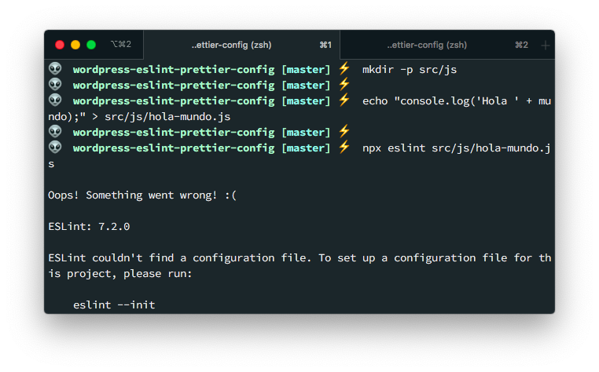
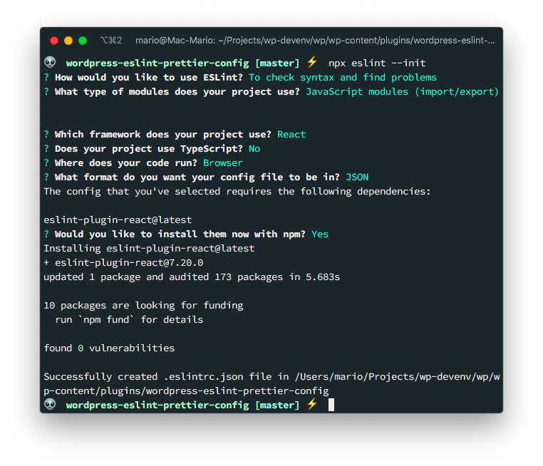
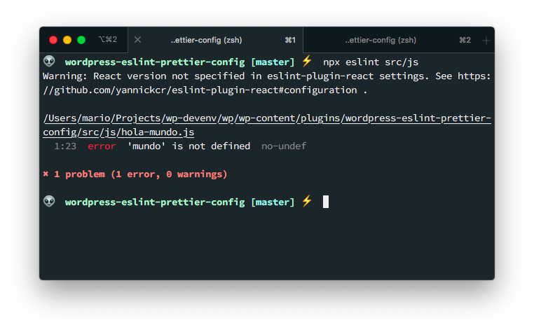

# Configure Eslint and Prettier for WordPress Theme development

Quoting the ESLint [Getting Started Guide](https://eslint.org/docs/user-guide/getting-started)

> ESLint is a tool for identifying and reporting on patterns found in ECMAScript/JavaScript code, with the goal of making code more consistent and avoiding bugs.

So, it basically analyzes JavaScript code, looking for errors or code-smells, without executing it. Which is great! This avoids many issues that other kind of linters have.

And how about a Prettier?...

Well, [Prettier](https://prettier.io/) is an **Opinionated code formatter** that ensures that the code of your project looks the same.

If you are a _Visual Studio Code_ user, you might be thinking ¿Why would you want to use a _command line_ tools for analyzing and formatting code if _VS Code_ already does it?

Well, the reason is that by using ESLint and Prettier, you can add the linting and formatting configuration to your project and share it across your team. Also, you can include it in your _Continuous Integration_ platform and ensure that your code is correct.

## Preparing a project

For this tutorial, we're going to create a WordPress plug-in, and we're going to have the `.js`, `.scss`and `.css` files be linted and formatted by ESLint and Prettier.

So, just create a directory in your plug-ins dir and start git in it.

```bash
cd /path/to/wordpress/wp-content/plugins
mkdir wordpress-eslint-prettier-config
cd $_
git init
```

Also create an empty `package.json` file since we're going to add `npm` packages to it:

```bash
npm init -y
```

## ESLint rules

For ESLint to work you need 2 things:

- The `eslint` cli program in your **project**
- A configuration file with rules

You can install `eslint` _CLI_ globally but [as the documentatino suggests](https://eslint.org/docs/user-guide/getting-started#installation-and-usage) you should install eslint **per project**

The configuration file is very important since ESLint wont work without it since it declares which **rules** you are going to apply to you project.



This is an example of a configuration file:

```json
{
    "rules": {
        "semi": ["error", "always"],
        "quotes": ["warn", "double"]
    }
}
```
_Taken from the ESLint Getting Started Guide_

Here we're telling eslint to force the usage of _semicolon_ at the end of each line, and the quoting style we're going to use is _double qoutes_.

Each rule has the option to show an **error** a **warning** or to be **off**.

There are hundreds of rules that you can add to your configuration. Just head to the [rules section](https://eslint.org/docs/rules/) of the documentation for a complete list.

Additionally, you can create your own rules and bundle them in an plug-in, like the [WordPress ESLint Plugin](https://www.npmjs.com/package/@wordpress/eslint-plugin)

## Create the .eslint.js file

Now that we have our repo and a `package.json` file created, lest create our first `.eslintrc.json` configuration file.

For this we need to execute the following

```bash
npx eslint --init
```

And ESLint will ask us a series of questions about how we want to examine our project:



This command will do 2 things:

- Create the `.eslintrc.json` with some basic rules for our project
- Install the `eslint` and `eslint-plugin-react` npm packages as a _Dev Dependency_ in `package.json`

```json
// .eslintrc.json
{
    "env": {
        "browser": true,
        "es2020": true
    },
    "extends": [
        "eslint:recommended",
        "plugin:react/recommended"
    ],
    "parserOptions": {
        "ecmaFeatures": {
            "jsx": true
        },
        "ecmaVersion": 11,
        "sourceType": "module"
    },
    "plugins": [
        "react"
    ],
    "rules": {
    }
}
```

```json
// package.json
{
  // . . .
  "devDependencies": {
    "eslint": "^7.2.0",
    "eslint-plugin-react": "^7.20.0"
  }
}
```

Now, if I run `npx eslint src/js` again, I get a report with some errors on my `.js` file:



## NPM scripts

Now, executing `npx eslint src/js` it's going to get old very fast. Lets automatize that command by addint a new script in `package.json`


```json
// package.json
{
  // ...
  "scripts": {
    "lint": "eslint src/js/**/*.js",
    "lint:fix": "eslint src/js/**/*.js --fix"
  },
  //...
}
```

That way, we can execute `npm run lint:fix` for fix any errors we have in our file.

## Prettier config

With ESLint installed, we can now move to configuring Prettier so we can format our code.

The issue is that ESLint does some formatting that can conflict with Prettier. So we have to make the 2 tools talk to each other so there is no formatting prolems.

Fortunatelly, Prettier has [official support for ESLint](https://prettier.io/docs/en/integrating-with-linters.html) so the process is not that complicated.

For starters, we have to install the `prettier` npm module, and

```bash
npm install -D prettier eslint-config-prettier eslint-plugin-prettier @wordpress/eslint-plugin prettier
```

Then in `.eslintrc.json` change the `extends` section with:

```json

```

## Vim

You need to install prettier

```bash
npm install --save-dev prettier
```

Install CoC and `coc-eslint`
command! -nargs=0 Prettier :CocCommand prettier.formatFile
"coc.preferences.formatOnSaveFiletypes": ["css", "markdown"],

Create `.eslintrc` file

```json
{
  "env": {
    "browser": true,
    "es2020": true
  },
  "extends": "plugin:@wordpress/eslint-plugin/recommended",
  "parserOptions": {
    "ecmaVersion": 11,
    "sourceType": "module"
  },
  "rules": {}
}
```

Create `.prettierrc` file

```yaml
useTabs: true
tabWidth: 2
printWidth: 100
singleQuote: true
trailingComma: es5
bracketSpacing: true
parenSpacing: true
jsxBracketSameLine: false
semi: true
arrowParens: avoid
endOfLine: auto
```
#npm install eslint @wordpress/eslint-plugin --save-dev

https://www.robinwieruch.de/prettier-eslint
