# Static and Dynamic blocks with WordPress Gutenberg

[Gutenberg](https://wordpress.org/gutenberg/) is the present of WordPress development. Is the new way of creating pages and posts, and pretty soon [full site editing](https://www.youtube.com/watch?v=C6WpIgOGdq0).

So if you are a WordPress developer, the time to learn Gutenberg was yesterday!

Unfortunately, the [official documentation](https://developer.wordpress.org/block-editor/) is pretty dense and [it's tutorial](https://developer.wordpress.org/block-editor/getting-started/create-block/) is easy to follow, but not to understand.

So, in this article I'll try to show as succinct, but as complete as possible, how to start to create Gutenberg blocks in a progressive manner. And also how to have them being displayed in the front end of a site built with WordPress.

## TOC

```toc

```

## Development environment setup

The first thing you need to have installed is [Node](https://nodejs.org). Gutenberg is written in [React](https://reactjs.org) so that's a must.

The second thing you need is a WordPress installation, that means that you need Apache (or Nginx), MySQL (or MariaDB) and PHP.

I'm a big fan of using Docker to create my development environment. So even tough you can use any WordPress deployment like [XAMPP](https://www.apachefriends.org/) or [Local](https://localwp.com/) to follow this article, I'm leaving here the `docker-compose.yaml` file I used to create my environment and maybe this will make your life easier (or harder).

```yaml
version: "3"

services:
  db:
    image: mariadb
    container_name: gutenberg-test-db
    volumes:
      - db-lib:/var/lib/mysql
    environment:
      MYSQL_ROOT_PASSWORD: root
      MYSQL_DATABASE: ${MYSQL_DATABASE:-wordpress}
      MYSQL_USER: ${MYSQL_USER:-wordpress}
      MYSQL_PASSWORD: ${MYSQL_PASSWORD:-wordpress}

  wp:
    image: wordpress:php7.4
    container_name: gutenberg-test-wp
    environment:
      WORDPRESS_DB_HOST: gutenberg-test-db
      WORDPRESS_DB_NAME: ${MYSQL_DATABASE:-wordpress}
      WORDPRESS_DB_USER: ${MYSQL_USER:-wordpress}
      WORDPRESS_DB_PASSWORD: ${MYSQL_PASSWORD:-wordpress}
      WORDPRESS_DEBUG: ${WORDPRESS_DEBUG:-0}
    volumes:
      - wp-html:/var/www/html
      - ./:/var/www/html/wp-content/plugins/wordpress-gutenberg-multiple-blocks
    ports:
      - ${WORDPRESS_PORT:-8082}:80
    depends_on:
      - db

  cli:
    image: wordpress:cli-php7.4
    container_name: gutenberg-test-cli
    environment:
      WORDPRESS_DB_HOST: gutenberg-test-db
      WORDPRESS_DB_NAME: ${MYSQL_DATABASE:-wordpress}
      WORDPRESS_DB_USER: ${MYSQL_USER:-wordpress}
      WORDPRESS_DB_PASSWORD: ${MYSQL_PASSWORD:-wordpress}
      WORDPRESS_HOST: ${WORDPRESS_HOST:-localhost}
      WORDPRESS_PORT: ${WORDPRESS_PORT:-8082}
      WP_CLI_PACKAGES_DIR: /tmp/wp-cli
    volumes_from:
      - wp
    depends_on:
      - wp
      - db
    user: xfs # Make Linux alpine and debian user the same user-id
    command:
      - sh
      - -c
      - |
        sleep 10
        wp core install  --url=$${WORDPRESS_HOST}:$${WORDPRESS_PORT} --title=BlockTest --admin_user=admin --admin_password=admin --admin_email=admin@example.com --skip-email
        wp plugin delete hello
        wp plugin delete akismet
        wp plugin activate --all
        echo "Access wordpress on http://$${WORDPRESS_HOST}:$${WORDPRESS_PORT} with user 'admin' and password 'admin'"

networks:
  default:
    name: gutenberg-test-net

volumes:
  db-lib:
  wp-html:
```

Some notes about this Docker environment:

- You'll get an already configured WordPress installation running in `http://localhost:8082`
- You can change the **port** and **host** by creating a `.env` file with the variables `WORDPRESS_HOST` and `WORDPRESS_PORT` respectively.
- By default, the _database_, the _username_ and the _password_ are `wordpress` and it can be changed using the `.env` file with the variables specified in [WordPress Docker image documentation](https://hub.docker.com/_/wordpress).
- The plugin we're going to develop will be in `/var/www/html/wp-content/plugins/wordpress-gutenberg-multiple-blocks/` **on the container** but will be the _current_ directory in the local machine.

To start this development environment you just need to have installed [Docker Desktop](https://docker.com) and execute in the Terminal on the _root_ of the project.

```bash
mkdir gutenberg-multiple-blocks
cd $_
## create docker-compose.yaml file
docker-compose up -d
```

## Start the plugin

WordPress has it's own [`create-block`](https://github.com/WordPress/gutenberg/tree/trunk/packages/create-block) script to create a _skeleton_ plugin with blocks. But it tends to clutter the workspace since it creates more folders than we actually need and that is not a very good learning experience. So we're going to create file by file, being the first the plugin file `gutenberg-multiple-blocks.php`:

```php {11}
<?php
/**
 * Gutenberg Multiple Blocks Example
 *
 * @package           GutenMultiBlocks
 * @author            Mario Yepes
 * @copyright         2022 Mario Yepes
 * @license           GPL-2.0-or-later
 *
 * @wordpress-plugin
 * Plugin Name:       Gutenberg Multiple Blocks Example
 * Plugin URI:        https://marioyepes.com
 * Description:       Tutorial on how to add multiple blocks to one Gutenbert plugin
 * Version:           1.0.0
 * Requires at least: 5.8
 * Requires PHP:      7.4
 * Author:            Mario Yepes
 * Author URI:        https://marioyepes.com
 * Text Domain:       gutenberg-multiple-blocks
 * License:           GPL v2 or later
 * License URI:       http://www.gnu.org/licenses/gpl-2.0.txt
 * Update URI:        https://example.com/my-plugin/
 */
```

That's it! With just some comments in a file we created a plugin. Just notice that the name of the plugin will be **Gutenberg Multiple Blocks Example**.

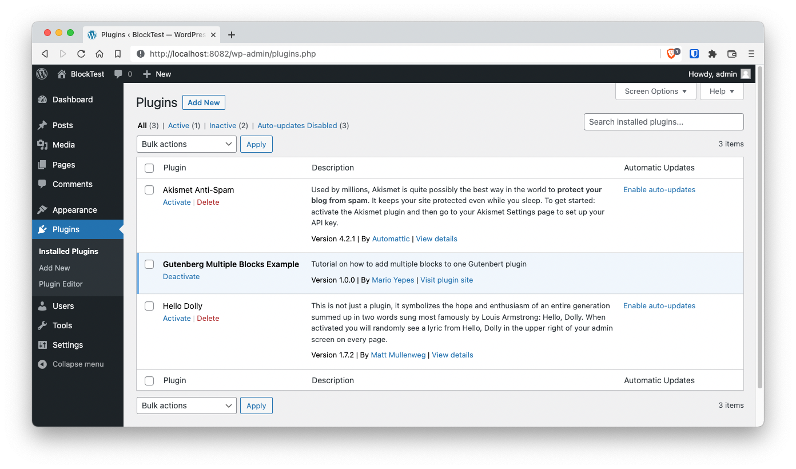

## Start the Node environment

Now that we have the plugin in place, we need to create a `node` project with `npm` and add some packages:

```bash {4}
npm init -y
npm install --save-dev @wordpress/scripts @wordpress/i18n
```

As you might know, `npm init -y` creates and empty _node_ project. So the really interesting part is the `install` line that install 2 packages:

- The [`@wordpress/scripts`](https://www.npmjs.com/package/@wordpress/scripts) will provide us with scripts to compile, lint and build our JavaScript files. Also will take care of installing the required React libraries.
- The [`@wordpress/i18n`](https://www.npmjs.com/package/@wordpress/i18n) package, which is optional, but I like to facilitate the translation of strings with the `__` function (yep, 2 underscores).

Finally, change the `scripts` section on the `packages.json` file like the [documentation suggest](https://github.com/WordPress/gutenberg/blob/trunk/packages/scripts/README.md#setup) to have the _WordPress Scripts_ take care of the compiling and linting:

```json {4,14}
{
  "...",
  "scripts": {
    "build": "wp-scripts build",
    "check-engines": "wp-scripts check-engines",
    "check-licenses": "wp-scripts check-licenses",
    "format": "wp-scripts format",
    "lint:css": "wp-scripts lint-style",
    "lint:js": "wp-scripts lint-js",
    "lint:md:docs": "wp-scripts lint-md-docs",
    "lint:md:js": "wp-scripts lint-md-js",
    "lint:pkg-json": "wp-scripts lint-pkg-json",
    "packages-update": "wp-scripts packages-update",
    "start": "wp-scripts start",
    "test:e2e": "wp-scripts test-e2e",
    "test:unit": "wp-scripts test-unit-js"

  },
  "..."
}
```

And we're done with the initial setup. You can create your first commit here.

## Create the "today" block skeleton

Just to be consistent, we are going to follow some standards regarding how we are naming our files and where are we putting them:

- In the `blocks/` folder we'll be adding the JavaScript code for the block creation
- Each block will have it's own subfolder inside `blocks/`
- The source files for each block will be called `index.js` and will be placed inside the `src/` sub-dir. Pe `blocks/<block-name>/src/index.js` file.
- The compiled scripts will be placed inside the `build/` subdirectory. Pe `blocks/<block-name>/build/index.js`
- For each block we need to create a _start_ and a _build_ command using the `wp-scripts` package

Now that we have that out of the way, lets create the _skelleton_ of our first block. The `today` block:

```bash
mkdir -p blocks/today/{src,build}
touch blocks/today/src/index.js
```

That will leave us with the following folder structure:

```bash
$ tree -I node_modules
.
├── README.md
├── blocks
│   └── today
│       ├── build
│       └── src
│           └── index.js
├── docker-compose.yaml
├── gutenberg-multiple-blocks.php
├── package-lock.json
└── package.json
```

Then, on the `package.json` add 2 new _scripts_ to **compile** and **build** the block:

```javascript {6,7}
{
  "...",
  "scripts": {
    "build": "wp-scripts build",
    "...",
    "build:today": "wp-scripts build ./blocks/today/src/index.js --output-path=./blocks/today/build",
    "start:today": "wp-scripts start ./blocks/today/src/index.js --output-path=./blocks/today/build"
  },
  "..."
}
```

And finally start the _watch_ by execting the start:

```bash
npm run start:today
```

In the terminal you'll get an error, but that's because we haven't added a React module in the `blocks/today/src/index.js`  file.

```bash
$ npm start

> wordpress-gutenberg-multiple-blocks@1.0.0 start:user-form
> wp-scripts start ./blocks/today/src/index.js --output-path=./blocks/today/src/build

<i> [LiveReloadPlugin] Live Reload listening on port 35729
asset index.js 104 bytes [emitted] (name: index)
asset index.asset.php 95 bytes [emitted] (name: index)
Entrypoint index 199 bytes = index.js 104 bytes index.asset.php 95 bytes

ERROR in index
Module not found: Error: Can't resolve './blocks/today/src/index.js' in '/Users/mario/Projects/wordpress-gutenberg-multiple-blocks'
```

You can now open an IDE and start coding.

## Creating our first _static_ block

The process of creating a block involves 2 steps, and each step is composed of multiple sub-steps:

- Crate the block front-end code
  - Create the block _registration_ function
  - Create the _edit_ callback
  - Create the _save_ callback
- Register the block in WordPress
  - Enqueue the script file
  - Register the block

### Create the block front-end

Creating the block on the front end starts with the invocation of the [`registerBlockType()`](https://developer.wordpress.org/block-editor/reference-guides/block-api/block-registration/) function, from the `@wordpress/blocks` package, with 2 parameters:

- A name. That by convention is in the form `namespace/block-name`
- A JavaScript object with the block configuration.

We're going to call this function in the `index.js` file, and place it in `blocks/today/src/` since that's the path we configured in `package.json`:

```javascript
// blocks/today/src/index.js

import { __ } from "@wordpress/i18n"
import { registerBlockType } from "@wordpress/blocks"

registerBlockType("gutenberg-multi/today", {
  title: __("Show blocks creation date", "gutenberg-multi"),
  category: "widgets",
  icon: "calendar",
  edit: () => <h2>Show todays day (Backend)</h2>,
  save: () => <h2>Show todays day (Frontend)</h2>,
})
```

From the configuration object you can see that the most **important parameters** are `edit` and `save` which are the callbacks that create the block in the dashboard and on the front-end respectively.

Notice in the terminal how the scripts get compiled and saved in `blocks/today/build/`.

```bash {2}
blocks/today/build
├── index.asset.php
├── index.js
├── index.js.map

0 directories, 3 files
```

Is specially important the file `blocks/today/build/index.assets.php` but more on that last file latter.

### Register the block in WordPress

On the previous step we created the block, but we haven't registered in WordPress yet. For that we need to go into our plugin file, the `.php` file, and add the block using the [`register_block_type`](https://developer.wordpress.org/reference/functions/register_block_type/) function.

```php
<?php
/**
 * Gutenberg Multiple Blocks Example
 *
 * @package           GutenMultiBlocks
 * @author            Mario Yepes
 * @copyright         2022 Mario Yepes
 * @license           GPL-2.0-or-later
 *
 * @wordpress-plugin
 * Plugin Name:       Gutenberg Multiple Blocks Example
 * Plugin URI:        https://marioyepes.com
 * Description:       Tutorial on how to add multiple blocks to one Gutenbert plugin
 * Version:           1.0.0
 * Requires at least: 5.8
 * Requires PHP:      7.4
 * Author:            Mario Yepes
 * Author URI:        https://marioyepes.com
 * Text Domain:       gutenberg-multiple-blocks
 * License:           GPL v2 or later
 * License URI:       http://www.gnu.org/licenses/gpl-2.0.txt
 * Update URI:        https://example.com/my-plugin/
 */

function register_user_form_block() {
	$assets = include_once __DIR__ . '/blocks/today/build/index.asset.php';

	wp_register_script(
		'gutenberg-multi-today',
		plugins_url('./blocks/today/build/index.js', __FILE__),
		$assets['dependencies'],
		$assets['version']
	);

	register_block_type(
		'gutenberg-multi/today',
		array(
			'editor_script' => 'gutenberg-multi-today',
		)
	);
}

add_action('init', 'register_user_form_block');
```

A short explanation of what is going on is: We use the already familiar `wp_register_script` function to **register the build script**. And then we use the `register_block_type` to have that script be called in the Gutenberg editor.

As you might recall from the previous step, there is an `index.asset.php` file in the `build/` sub-folder. This file is **automatically created** by the `wp-script` (configured in `package.json`) script and contains information of our block like the version and any required dependency. So it's perfect to use it in the `wp_register_script` function.

As an exercise, you should look that file contents.

### Test the new block.

Just go to the back end and add the block

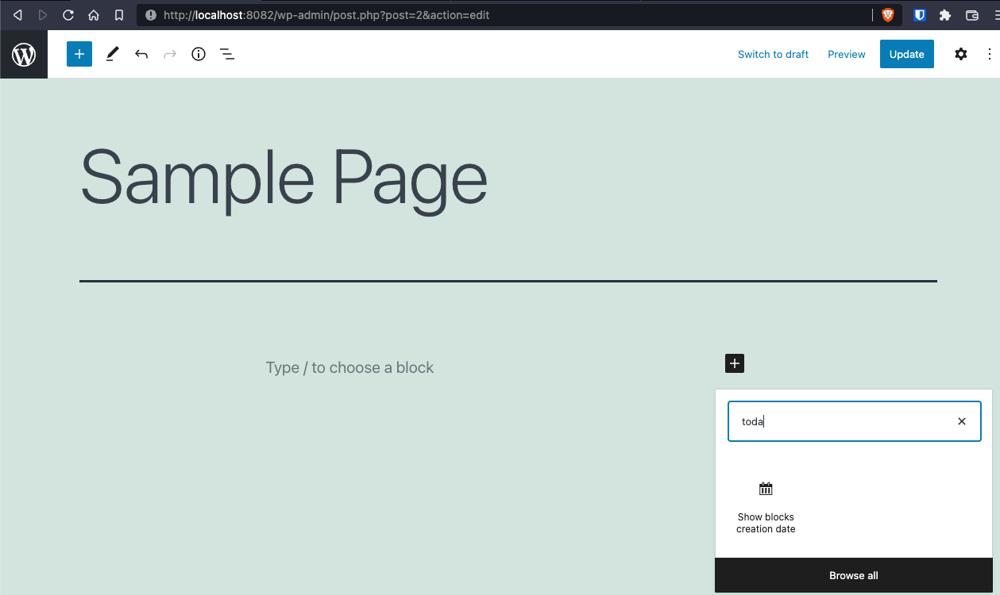

And when you prevew the page:

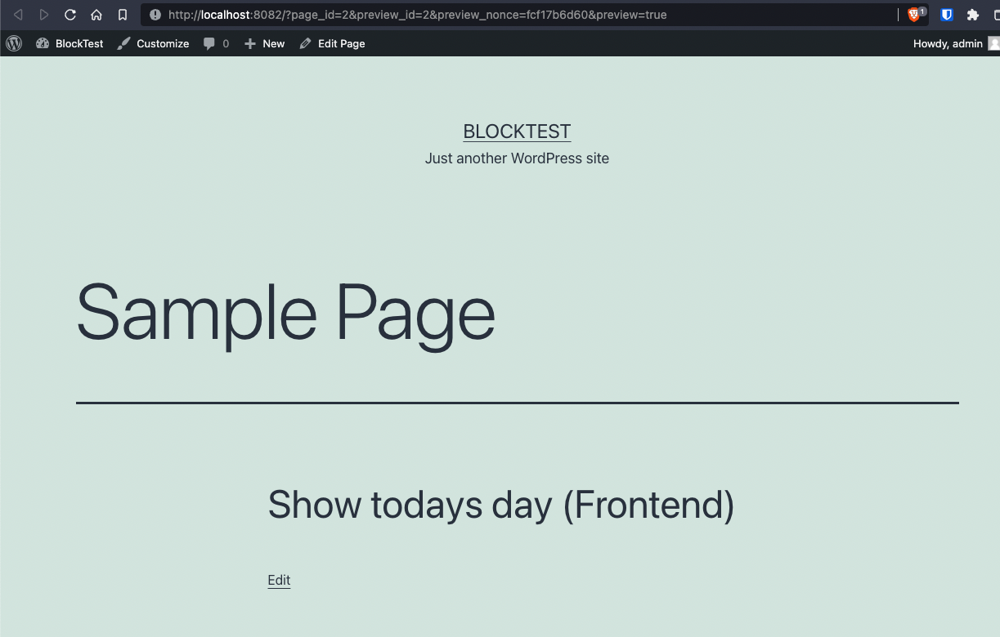

Notice how the contents of the block are what the `edit` and `save` callbacks returned!

## Passing attributes to the block

Right now our block is very simple. When the block is added to the editor it will output _Show todays day (Backend)_. And on the front-end it will show the string _Show todays day (Frontend)_. Not very useful, right? The idea is that our block actually does something like show post information or display a cool graphic that can be changed. But for that we need to pass **properties** to our block.

Both the `edit` and `save` callbacks receive parameters that can be used to change how the block behaves because remember **we're using React to create the block**

This means that you can call the `edit` or `save` callbacks in the `registerBlockType` like:

```javascript
registerBlockType("namespace/block-name", {
  edit: ({ attributes, setAttributes, className, isSelected }) => {
    /* ...*/
  },
  save: ({ attributes, setAttributes, className }) => {
    /* ...*/
  },
})
```

Now, this is very important: **the `attributes` _object_ from the parameters, is the vehicle to pass information from PHP to JavaScript**. And the `setAttributes` is the React hook to work with them inside the block.

To illustrate that lets make 4 changes:

- Let's add the `attributes` parameter to the `registerBlockType()` function with **one** parameter
- Let's move the `edit` callback to it's own components
- Do the same with the `save` callback
- Les's display the passed parameters to the `Edit` and `Save` callbacks

1: Adding the `attributes` parameter and including the not yet created components `edit` and `save`:

```javascript {6-7,13-20}
// blocks/today/src/index.js

import { __ } from "@wordpress/i18n"
import { registerBlockType } from "@wordpress/blocks"

import edit from "./edit"
import save from "./save"

registerBlockType("gutenberg-multi/today", {
  title: __("Show blocks creation date", "gutenberg-multi"),
  category: "widgets",
  icon: "calendar",
  edit,
  save,
  attributes: {
    exampleAttribute: {
      source: "html",
      selector: "h3",
      default: __("This is a passed attribute", "guten-multi"),
    },
  },
})
```

2: Displaying the `parameters` in the edit component:

```javascript
// blocks/today/src/edit.js

import { __ } from "@wordpress/i18n"

const Edit = (params) => {
  return (
    <>
      <h3>{__("Block parameters", "gutenberg-multi")}</h3>
      <pre>{JSON.stringify(params, null, 4)}</pre>
      <h3>{__("Passed functions:", "gutenberg-multi")}</h3>
      <p>Type of setAttributes: {typeof params.setAttributes}</p>
    </>
  )
}

export default Edit
```

3: Displaying the parameters in the save component:

```javascript
// blocks/today/src/save.js

import { __ } from "@wordpress/i18n"

const Save = (params) => {
  return (
    <>
      <h3>{__("Block parameters", "gutenberg-multi")}</h3>
      <pre>{JSON.stringify(params, null, 4)}</pre>
    </>
  )
}

export default Save
```

After those 3 changes (and thanks to the watch command that we're executing) we can now see the following when we **re-add\*** the block on the editor:

**Note: You have reload the editor to see the new block changes**

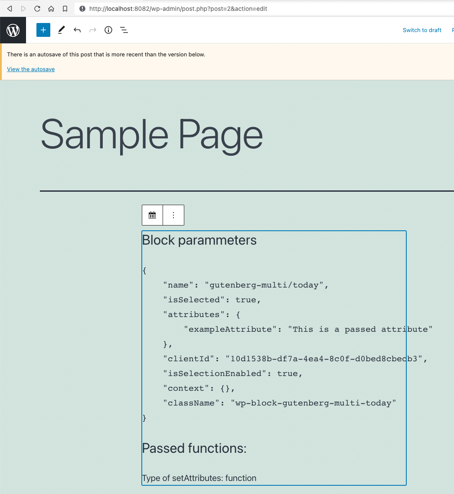

And this on the front-end:

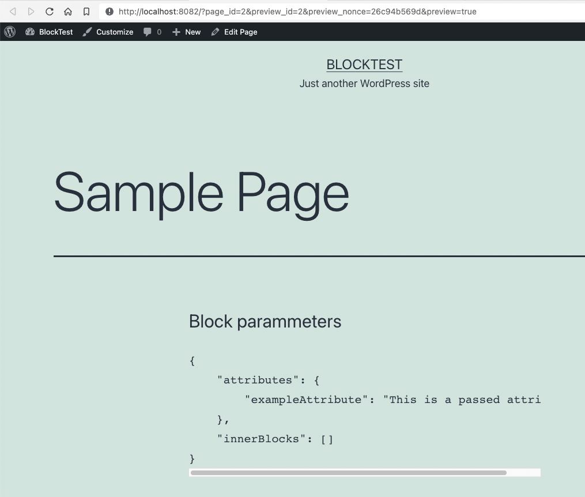

Take into account that we're still talking about _static_ blocks. Which are blocks that once added to a page or post do not change.

## Styling the block in the back-end

Did you noticed on the previews step how the `edit` callback receives a `className` parameter?

```json
{
  "...",
  "className": "wp-block-gutenberg-multi-today"
}
```

We'll, this is how we style the block on the back end.

Let's actually use that class to apply some styling, lets create the `edit.scss` file where we'll style the `wp-block-gutenberg-multi-today` class:

```scss
// blocks/style/src/style.scss

$bg-color: #000;

.wp-block-gutenberg-multi-today {
  background-color: rgba($bg-color, 0.1);
  border: 1px solid $bg-color;
  padding: 0.5em;

  &.selected {
    background-color: rgba($bg-color, 0.85);
    color: white;
  }
}
```

Then, lets change the `edit.js` component to actually use the `className` that gets passed in the block parameters... And don't forget to include the _styling_ file:

```javascript {4,7,10}
// blocks/today/src/edit.js

import { __ } from "@wordpress/i18n"
import "./edit.scss"

const Edit = (params) => {
  const { className, isSelected } = params
  return (
    <>
      <div className={isSelected ? `${className} selected` : className}>
        <h3>{__("Block parameters", "gutenberg-multi")}</h3>
        <pre>{JSON.stringify(params, null, 4)}</pre>
        <h3>{__("Passed functions:", "gutenberg-multi")}</h3>
        <p>Type of setAttributes: {typeof params.setAttributes}</p>
      </div>
    </>
  )
}

export default Edit
```

Now, by using the `isSelected` and `className`  parameters together, we can make the block turn black when it gets selected.

But there is still a missing step....

If you list the contents of the `blocks/today/build/` directory, you'll see that there is a new `index.css` file; that file contains the compiled styles from the `edit.scss`. We have to notify WordPress of that new file so it can apply those styles to the block, and we do that by registering that style both in the back-end as in the block in the `.php` file:

```php {14-19,25}
<?
// gutenberg-multiple-blocks.php

function register_user_form_block() {
	$assets = include_once __DIR__ . '/blocks/today/build/index.asset.php';

	wp_register_script(
    'gutenberg-multi-today',
		plugins_url('./blocks/today/build/index.js', __FILE__),
		$assets['dependencies'],
		$assets['version']
	);

	wp_register_style(
		'gutenberg-multi-today',
		plugins_url('./blocks/today/build/index.css', __FILE__),
		array(),
		$assets['version']
	);

	register_block_type(
		'gutenberg-multi/today',
		array(
			'editor_script' => 'gutenberg-multi-today',
			'style' => 'gutenberg-multi-today',
		)
	);
}

add_action('init', 'register_user_form_block');
```

By adding the `wp_register_style()` function, we make WordPress aware of this new CSS file. And by adding the `style` key the array parameter in `register_block_type` function, we tell WordPress to load that style when adding a _today_ block. Now we can see how the block changes in the **back-end**:

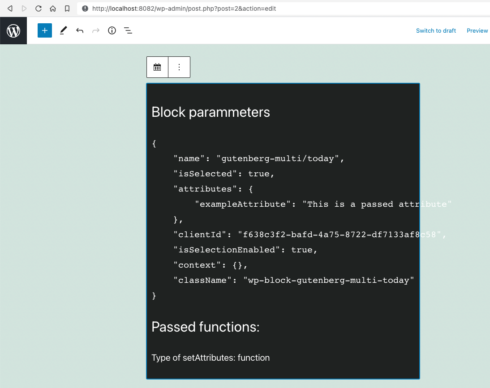

## Styling a block in the front-end

Style in the front end should be done in the theme and not in the block. Still, we can do some pretty cool things to **leverage** the site's theme. We can pass additional classes to the block front the back-end. For instance, lets make our block support `light` and `dark` modes.

This requires 2 steps:

- Add a new parameter on the `registerBlockType` function in `index.js` for each class we want to add
- Change the `Save` callback on `save.js` to support multiple classes
- Add a new `save.scss` where the new styles for the new classes get added

### Adding the `styles` attribute

This has to be done on the `registerBlockType` function, specifying the `name` and the `label` for each additional class:

```javascript {22-32}
// blocks/today/src/index.js

import { __ } from "@wordpress/i18n"
import { registerBlockType } from "@wordpress/blocks"

import edit from "./edit"
import save from "./save"

registerBlockType("gutenberg-multi/today", {
  title: __("Show blocks creation date", "gutenberg-multi"),
  category: "widgets",
  icon: "calendar",
  edit,
  save,
  attributes: {
    exampleAttribute: {
      source: "html",
      selector: "h3",
      default: __("This is a passed attribute", "guten-multi"),
    },
  },
  styles: [
    {
      name: "light",
      label: __("Light mode", "gutenberg-multi"),
      isDefault: true,
    },
    {
      name: "dark",
      label: __("Dark mode", "gutenberg-multi"),
    },
  ],
})
```

Just by making this change, you get 2 things in the **Gutenberg Inspector**

- A preview of the block with each style
- An advanced section with the name of the added classes

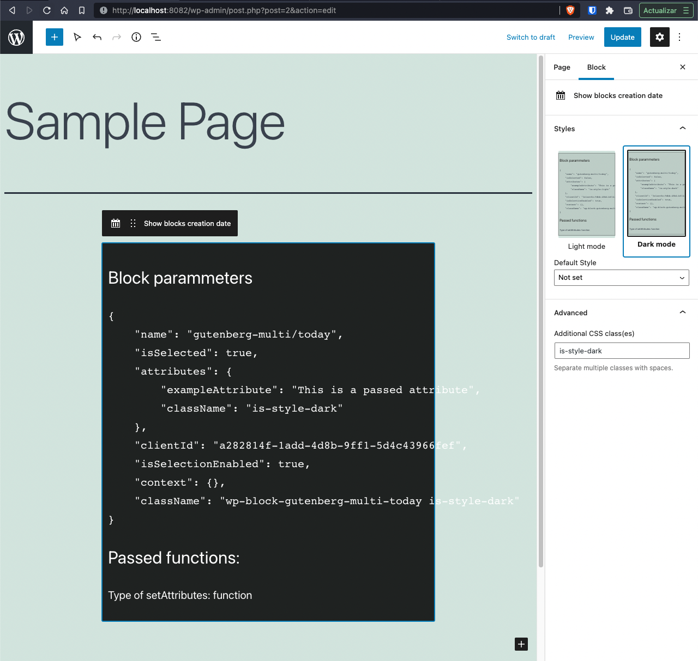

Notice that the new classes will be called `is-style-dark` and `is-style-light`

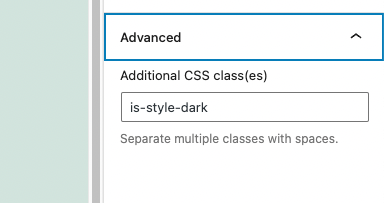

## Adding support for the new classes on the backend

Before we actually make the block support multiple classes on the front-end. Let's fix the fact that on the back-end the _Dark Mode_ has a no preview.

Just add styling on the `save.scss` for the `is-style-dark` class:

```scss
// blocks/style/sdrc/edit.scss

$bg-color: #000;

.wp-block-gutenberg-multi-today {
  background-color: rgba($bg-color, 0.1);
  border: 1px solid $bg-color;
  padding: 0.5em;

  // &.selected {
  //   background-color: rgba($bg-color, .85);
  //   color: white;
  // }

  &.is-style-dark {
    background-color: rgba($bg-color, 0.85);
    color: white;
  }
}
```

And now, we have a _Dark Mode_ preview and it shows on the block:

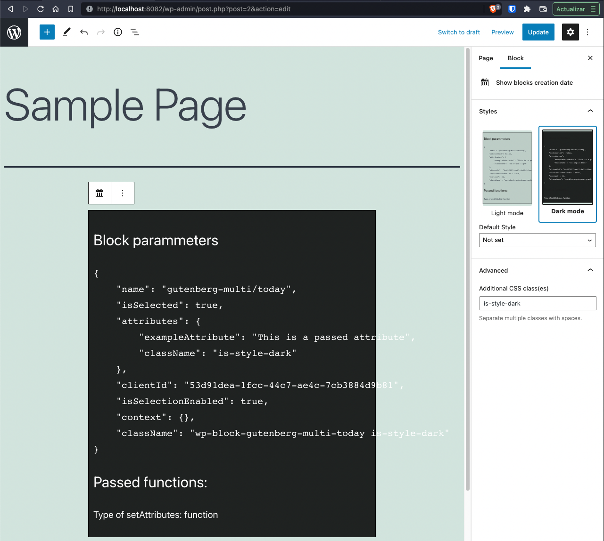

### Add support for additional classes on the front-end

For this we need to change the `Save` callback in `save.js`:

```javascript {4,7-9,12}
// blocks/today/src/save.js

import { __ } from "@wordpress/i18n"
import "./save.scss"

const Save = (params) => {
  const {
    attributes: { className = "" },
  } = params
  return (
    <>
      <div class={`today ${className}`}>
        <h3>{__("Block parameters", "gutenberg-multi")}</h3>
        <pre>{JSON.stringify(className, null, 4)}</pre>
      </div>
    </>
  )
}

export default Save
```

Notice that we wrapped the content on a `div` tag with the default class of `today`. That's important for the styling we're going to add. And we need to create the `save.scss`  file for the new clases:

```scss
// blocks/today/save.scss

.today.is-style-dark {
  background-color: rgba(#000, 0.8);
  color: white;
}
```

And now we have support for light and dark modes on our block:

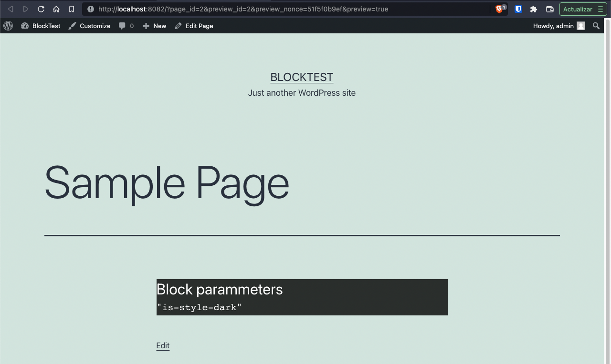

## Using options on the blocks

Now lets actually make our block useful. Let make our block receive **user** parameters, and change it's display according to them. In our case we're going have our block receive a title and some content.

The first thing we have to do is to change the _registration_ function so it **receives and stores** 2 new parameters: A `blockTitle` and an `afterContent` variables.

```javascript
// blocks/today/src/index.js

registerBlockType("gutenberg-multi/today", {
  title: __("Show blocks creation date", "gutenberg-multi"),
  category: "widgets",
  icon: "calendar",
  edit,
  save,
  attributes: {
    blockTitle: {
      source: "html",
      selector: "h3",
      default: __("Enter the block title", "gutenberg-multi"),
    },
    afterContent: {
      source: "string",
      selector: "em",
      default: __("Content after the options", "gutenberg-multi"),
    },
  },
  // ...
})
```

Remember: **the `attributes` is how the back-end communicates with the front-end**.

Then, in our `Edit` component we're going to:

- Add a `RichText` component to receive user input
- Deconstruct the `attributes` input parameters to use the attributes registered in the previous step.
- On the `RichText` component, use the `setAttributes` function to manage _state_ changes on the block

```javascript {4,11,17-23,25-31}
// blocks/today/src/edit.js

import { __ } from "@wordpress/i18n"
import { RichText } from "@wordpress/block-editor"
import "./edit.scss"

const Edit = (params) => {
  const {
    className,
    isSelected,
    attributes: { blockTitle, afterContent },
    setAttributes,
  } = params
  return (
    <>
      <div className={isSelected ? `${className} selected` : className}>
        <RichText
          tagName="h2"
          placeholder={__("Block title", "gutenberg-multi")}
          className="gutenberg-multi-title"
          value={blockTitle}
          onChange={(txt) => setAttributes({ blockTitle: txt })}
        />
        <pre>{JSON.stringify(params, null, 2)}</pre>
        <RichText
          tagName="em"
          placeholder={__("Content after the information", "gutenberg-multi")}
          className="gutenberg-multi-after"
          value={afterContent}
          onChange={(txt) => setAttributes({ afterContent: txt })}
        />
      </div>
    </>
  )
}

export default Edit
```

A few notes about the [`RichText`](https://developer.wordpress.org/block-editor/reference-guides/richtext/) component:

- Is the preferred component to add a text field in our block since it shows how the text will look
- You can use it to add practically any HTML tag you want with the `tagName` parameter
- Is from [`@wordpress/block-editor`](https://developer.wordpress.org/block-editor/reference-guides/packages/packages-block-editor/) which is where all the element of the back-end reside.
- If we're working on the editor, that library is a must

And a few notes about the `setAttributes` function:

- Is how we manage the state of the block
- Is passed as a parameter only on the `edit` callback
- When you call `setAttributes`, the block re-renders itself much like the `useState` hook works

If we reload the editor, we can see that we can _modify_ content in the block:

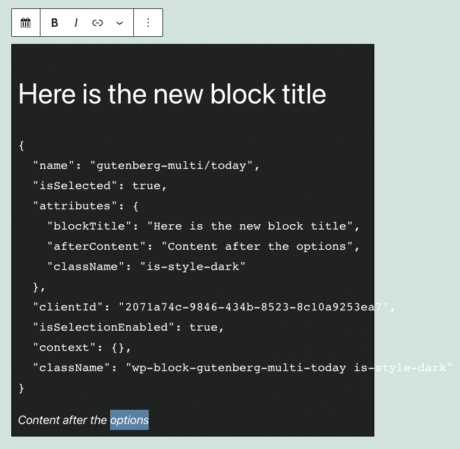

To display the new _attributes_ on the front-end. We have to use **again** the `RichText` element but with the `Content` child:

```javascript {4,9,14-18,20-24}
// blocks/today/src/save.js

import { __ } from "@wordpress/i18n"
import { RichText } from "@wordpress/block-editor"
import "./save.scss"

const Save = (params) => {
  const {
    attributes: { className = "", blockTitle, afterContent },
  } = params
  return (
    <>
      <div class={`today ${className}`}>
        <RichText.Content
          tagName="h2"
          className="gutenberg-multi-block-title"
          value={blockTitle}
        />
        <pre>{JSON.stringify(className, null, 4)}</pre>
        <RichText.Content
          tagName="em"
          className="gutenberg-multi-after-content"
          value={afterContent}
        />
      </div>
    </>
  )
}

export default Save
```

Notice how the `Edit` and `Save`  components are almost identical.

## Adding sidebar options to the block

There are times when you need to have your block support options that are not visible or are hand to do directly on the block. Like editing _labels_ on a form or changing the color or type of a font.

In those cases is useful to have controls on the sidebar or _Inspector_.

To add sections and controls on the inspector you modify the `Edit` component:

- Add the `InspectorControls` library from the `@wordpress/block-editor`
- Add the `Panel`, `PanelBody` and `TextControl` from the `@wordpress/components`

But before we do that, lets start by adding 2 new attributes to our block:

```javascript {16-24}
// blocks/today/src/index.js

registerBlockType("gutenberg-multi/today", {
  // ...
  attributes: {
    blockTitle: {
      source: "html",
      selector: "h3",
      default: __("Enter the block title", "gutenberg-multi"),
    },
    afterContent: {
      source: "string",
      selector: "em",
      default: __("Content after the options", "gutenberg-multi"),
    },
    blockContent: {
      source: "html",
      selector: "p",
    },
    blockContentType: {
      source: "string",
      type: "select",
      default: "dump",
    },
  },
  // ...
})
```

Now, let's change our component to have an `InspectorControls` section:

```javascript {4-10,17,29-46,55}
// blocks/today/src/edit.js

import { __ } from "@wordpress/i18n"
import { RichText, InspectorControls } from "@wordpress/block-editor"
import {
  Panel,
  PanelBody,
  SelectControl,
  TextareaControl,
} from "@wordpress/components"
import "./edit.scss"

const Edit = (params) => {
  const {
    className,
    isSelected,
    attributes: { blockTitle, afterContent, blockContent, blockContentType },
    setAttributes,
  } = params
  const innerTypes = [
    { value: "dump", label: "Attributes as JSON" },
    { value: "custom", label: "Custom text" },
  ]

  const innerContent =
    blockContentType == "dump" ? JSON.stringify(params, null, 2) : blockContent
  return (
    <>
      <InspectorControls>
        <Panel>
          <PanelBody>
            <SelectControl
              label={__("Inner content type", "guetmberg-multi")}
              options={innerTypes}
              value={blockContentType}
              onChange={(val) => setAttributes({ blockContentType: val })}
            />
            <TextareaControl
              label={__("Custom text", "gutenberg-multi")}
              value={blockContent}
              onChange={(txt) => setAttributes({ blockContent: txt })}
              readOnly={blockContentType == "dump" ? true : false}
            />
          </PanelBody>
        </Panel>
      </InspectorControls>
      <div className={isSelected ? `${className} selected` : className}>
        <RichText
          tagName="h2"
          placeholder={__("Block title", "gutenberg-multi")}
          className="gutenberg-multi-title"
          value={blockTitle}
          onChange={(txt) => setAttributes({ blockTitle: txt })}
        />
        <pre>{innerContent}</pre>
        <RichText
          tagName="em"
          placeholder={__("Content after the information", "gutenberg-multi")}
          className="gutenberg-multi-after"
          value={afterContent}
          onChange={(txt) => setAttributes({ afterContent: txt })}
        />
      </div>
    </>
  )
}

export default Edit
```

Notice that we just changed our component to have a drop-down that let's you select _which_ content to display in the block: The block parameters or custom content

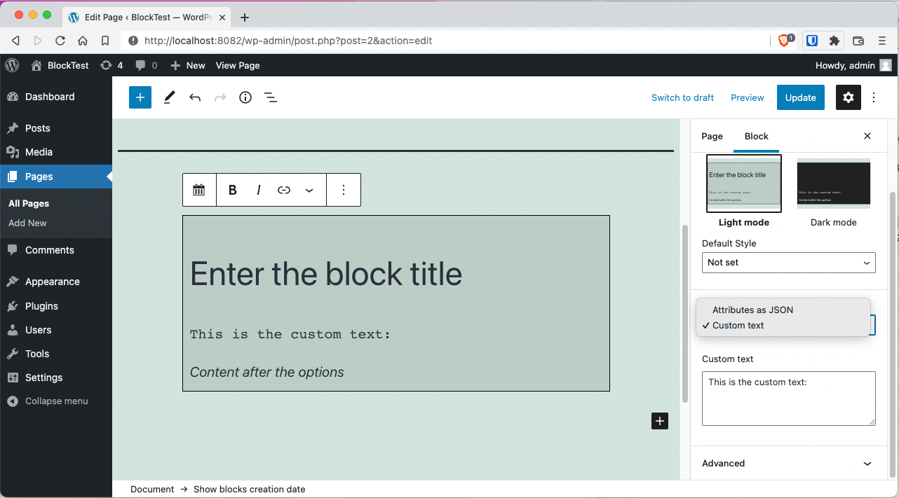

And since all the changes we do in the back-end, we have to do on the front-end. Let's change the `Save` component to display what the user selected:

```javascript {9-15,26-28}
// blocks/today/src/save.js

import { __ } from "@wordpress/i18n"
import { RichText } from "@wordpress/block-editor"
import "./save.scss"

const Save = (params) => {
  const {
    attributes: {
      className = "",
      blockTitle,
      afterContent,
      blockContent,
      blockContentType,
    },
  } = params
  return (
    <>
      <div class={`today ${className}`}>
        <RichText.Content
          tagName="h2"
          className="gutenberg-multi-block-title"
          value={blockTitle}
        />
        <pre>
          {blockContentType == "dump"
            ? JSON.stringify(className, null, 4)
            : blockContent}
        </pre>
        <RichText.Content
          tagName="em"
          className="gutenberg-multi-after-content"
          value={afterContent}
        />
      </div>
    </>
  )
}

export default Save
```

Great, we're done on how to create bloks using Version 1 of the Gutenberg API. Now lets see how to use the version 2

## Dynamic blocks

Creating blocks as we've done until now is great if you are doing mainly styling and html generation. But if you need to do things like:

- Show latests posts
- Do remote API calls
- Show results of cront jobs
- Etc

Then is better to render the block using PHP and not JavaScript. That's what sets dynamic from static block apart.

From the code's point of view, a dynamic block has it's `save` call back, always return `null`. And needs to call an additional **PHP** function to render the block.

Additionally, is best to use the [Block API v2](https://developer.wordpress.org/block-editor/reference-guides/block-api/block-metadata/) when dynamic blocks is concerned.

## Create the skeleton for the `mylatests` dynamic block

To start, create a new block (new folder and new files) for the new block:

```bash
mkdir -p block/mylatests/{src,build}
touch block/mylatests/block.json
touch block/mylatests/src/{index,edit}.js
```

Next add a `start` and `build` commands on `package.json` for the new block

```json {5,6}
{
  "...",
  "scripts": {
    "...",
    "build:mylatests": "wp-scripts build ./blocks/mylatests/src/index.js --output-path=./blocks/mylatests/build",
    "start:mylatests": "wp-scripts start ./blocks/mylatests/src/index.js --output-path=./blocks/mylatests/build"
  },
  "..."
}
```

## Create a block with Version 2 of the Gutenberg API

With that out of the way, lest do our first change regarding API v2:

- Let's create the `blocks/mylatests/block.json` file:
- Register that new file in the WordPress plugin file.

_Remember that the `start:mylatest` npm command will generate our files in the `build/` directory_

First the `blocks/mylatests/blocks.json` file:

```json
{
  "$schema": "https://schemas.wp.org/trunk/block.json",
  "apiVersion": 2,
  "name": "gutenberg-multi/mylatests",
  "title": "My latests news",
  "category": "widgets",
  "icon": "smiley",
  "description": "Custom latest posts",
  "keywords": ["latests", "news", "custom"],
  "textdomain": "gutenberg-multi",
  "editorScript": "file:./build/index.js"
}
```

Then register this file in the PHP plugin file.

```php
<?php
// gutenberg-multiple-blocks.php

//...

add_action('init', 'register_mylatests_block');

function register_mylatests_block() {
	register_block_type(
		__DIR__ . '/blocks/mylatests',
		array(
			'render_callback' => 'render_mylatests_block',
		)
	);
}

function render_mylatests_block($attributes, $content) {
	return '<p>My latest news block placeholder</p>';
}
```

Let's stop for a minute and explain what we just did. First with the `block.json` (just the important bits):

- The `$schema` key helps visual studio to know which keys are supported. So that key is not necesary
- In the `editorScript` describes where should Gutenberg look for files

Now the registration of the block in the `.php` file:

- We use again the `register_block_type`
- We omit the `editor_script` key. This tells WordPress that there is a `block.json` file
- We use instead a `render_callback` key to tell which function will render the _Dynamic HTML_
- We create a new function, a callback function, that receives 2 parameters: An `$attributes` and `$content`
- This callback function **returns** the required html to display on the front-end

Next, we create the the `blocks/mylatest/src/index.js` file with the same `registerBlockType` function. But this time, the first parameter is not the name of the block, but the object we placed in `block.json`:

```javascript
// blocks/mylatest/src/index.js

import { registerBlockType } from "@wordpress/blocks"
import blockMeta from "../block.json"

registerBlockType(blockMeta, {
  edit: () => <p>Placeholder for the backend</p>,
  save: () => null,
})
```

And this is what we get:

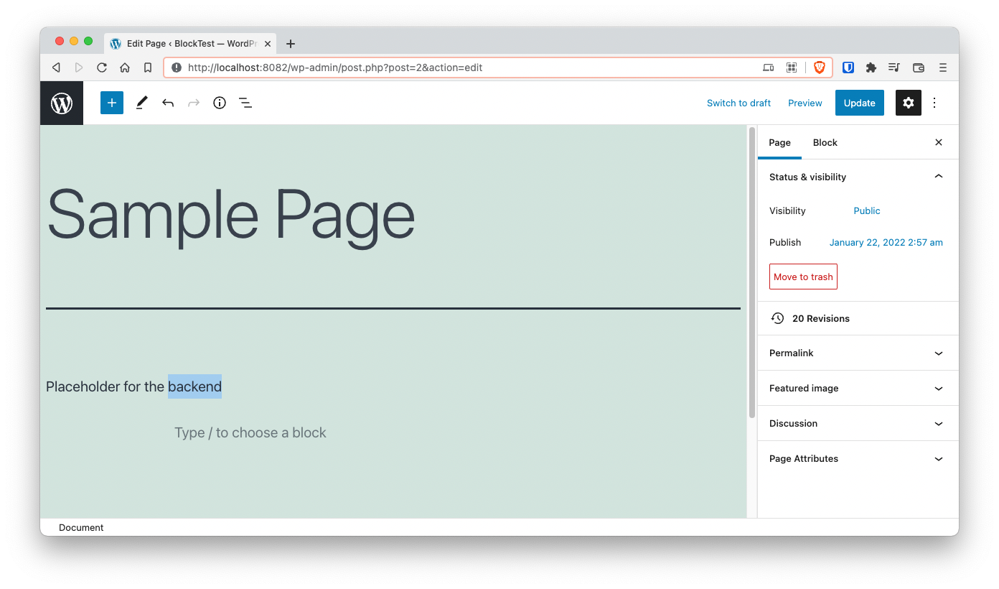

### Fix the display in the back-end

Is hard to notice from the screenshot, but when adding blocks with v2 of the API. They don't get recognized by the Gutenberg editor right away. In fact, when you click on them nothing happens, the _Inspector_ doesn't reflect that is a block.

The fix is pretty simple. Add import `{useBlockProps}` from `block-edior` to wrap the block on `edit.js` so it has the block inspector and toolbar:

```javascript {4,9}
// blocks/mylatests/src/index.js

import { registerBlockType } from "@wordpress/blocks"
import { useBlockProps } from "@wordpress/block-editor"
import blockMeta from "../block.json"

registerBlockType(blockMeta, {
  edit: () => <p {...useBlockProps()}>Placeholder for the backend</p>,
  save: () => null,
})
```

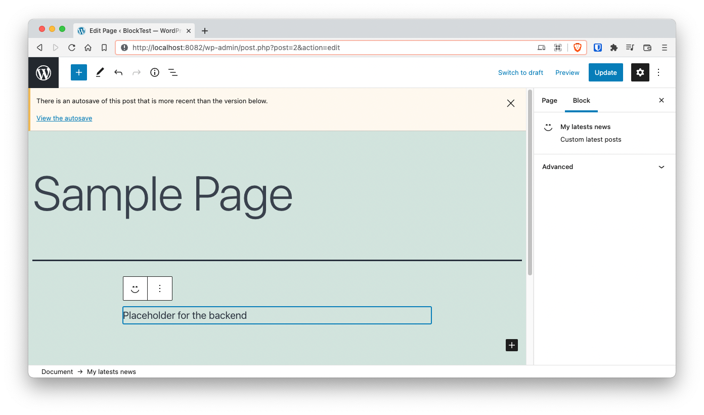

In a following section we'll be moving that `edit` callback into it's own file.

## Rendering the latests posts in the font end

Now that we fixed the issue with the `blockProps` we can start creating the PHP function that renders the latests posts. For that we need to modify the `gutenberg-multiple-blocks.php` file. Specifically the callback function we created for rendering the posts:

```php {17-39}
<?php
// gutenberg-multiple-blocks.php

// ...

add_action('init', 'register_mylatests_block');

function register_mylatests_block() {
	register_block_type(
		__DIR__ . '/blocks/mylatests',
		array(
			'render_callback' => 'render_mylatests_block',
		)
	);
}

function render_mylatests_block($attributes, $content) {
	$posts = get_posts();

	if ( empty($posts) ) {
		return '<p>No posts found</p>';
	}

	ob_start();
?>
	<h3><?php esc_html_e('My latests posts') ?></h3>

	<ul class="mylatests-posts">
		<?php foreach ( $posts as $post ): ?>
			<li class="mylatests-posts-post">
				<a href="<?php echo esc_url( get_permalink($post->ID)) ?>">
					<?php echo esc_html($post->post_title) ?>
				</a>
			</li>
		<?php endforeach; ?>
	</ul>
<?php
	return ob_get_clean();
}
```

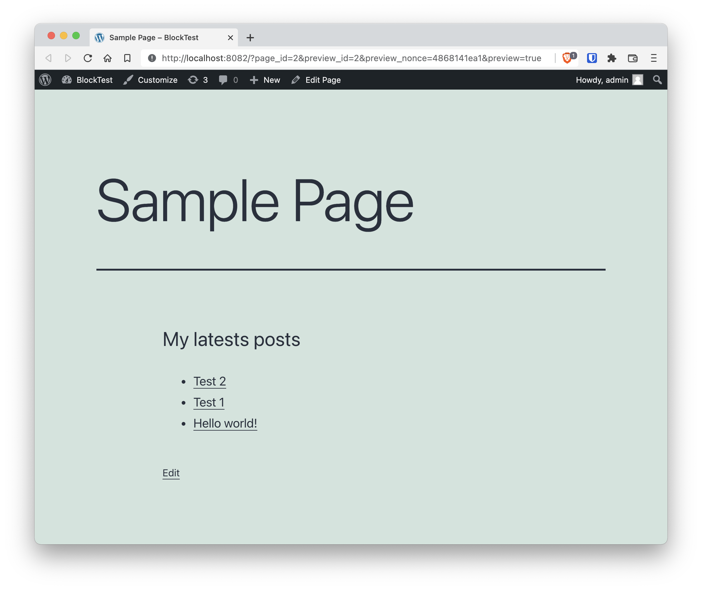

## Displaying the latests posts on the back end

Displaying posts on the back-end is not so straight forward since we have to instruct Gutenberg to fetch the posts using the [WordPress Rest API](https://developer.wordpress.org/rest-api/).

Fortunately, since this is something that we'll be doing a lot, fetching data from theback-end to display in the Gutenberg editor, the WordPress developers created the [`apiFetch`](https://www.npmjs.com/package/@wordpress/api-fetch) function that creates this requests with the necessary parameters.

The `apiFetch` function works as a wrapper of the [fetch](https://developer.mozilla.org/en-US/docs/Web/API/fetch) function. So is functionality and usage is pretty similar.

One last thing before getting into the code. Notice how the `useState` and `useEffect` function are part of the `@wordpress/components` package. This package is the complete [React](https://reactjs.org) library but inside a WordPress package.

```javascript
// blocks/mylatests/src/edit.js

import { __ } from "@wordpress/i18n"
import { useBlockProps, InspectorControls } from "@wordpress/block-editor"
import apiFetch from "@wordpress/api-fetch"
import { useState, useEffect } from "@wordpress/element"
import { Panel, PanelBody, SelectControl } from "@wordpress/components"

const postsPath = "/wp/v2/posts"
const catsPath = "/wp/v2/categories?hide_empty=true"

const Edit = () => {
  const [cats, setCats] = useState([])
  const [posts, setPosts] = useState([])

  useEffect(async () => {
    const fetchedCats = await apiFetch({ path: catsPath })
    setCats(fetchedCats.map((c) => ({ label: c.name, value: c.id })))
  }, [])

  useEffect(async () => {
    const fetchedPosts = await apiFetch({ path: postsPath })
    setPosts(fetchedPosts)
  }, [])

  if (posts.length === 0) {
    return <div {...useBlockProps()}>Loading posts</div>
  }

  return (
    <>
      <InspectorControls>
        <Panel>
          <PanelBody>
            <SelectControl
              label={__("Select the category", "gutenberg-multi")}
              options={cats}
            />
          </PanelBody>
        </Panel>
      </InspectorControls>
      <div {...useBlockProps()}>
        <h3>My latests posts</h3>
        <ul className="mylatests-list">
          {posts.map((post) => (
            <li key={post.id}>
              <a href={post.link}>{post.title.rendered}</a>
            </li>
          ))}
        </ul>
      </div>
    </>
  )
}

export default Edit
```

Notice that we're doing more than is needed. We're adding a _Category_ selector to the inspector. That's because we'll be filtering posts by category in the next step.

## Filter the posts

Again... The `attributes` parameter is how we communicate between the front and the back. And we have to start by declaring a new `attribute` in the `blocks/mylatests/block.js` file:

```json {13-17}
{
  "$schema": "https://schemas.wp.org/trunk/block.json",
  "apiVersion": 2,
  "name": "gutenberg-multi/mylatests",
  "title": "My latests news",
  "category": "widgets",
  "icon": "smiley",
  "description": "Custom latest posts",
  "keywords": ["latests", "news", "custom"],
  "textdomain": "gutenberg-multi",
  "version": "1.0.0",
  "editorScript": "file:./build/index.js",
  "attributes": {
    "category": {
      "type": "integer"
    }
  }
}
```

Next. Change the `Edit` component to filter out the posts depending on the selected category:

```javascript {12,16,23-31,45-46}
// blocks/mylatests/src/edit.js

import { __ } from "@wordpress/i18n"
import { useBlockProps, InspectorControls } from "@wordpress/block-editor"
import apiFetch from "@wordpress/api-fetch"
import { useState, useEffect } from "@wordpress/element"
import { Panel, PanelBody, SelectControl } from "@wordpress/components"

const postsPath = "/wp/v2/posts"
const catsPath = "/wp/v2/categories?hide_empty=true"

const Edit = ({ attributes, setAttributes }) => {
  const [cats, setCats] = useState([])
  const [posts, setPosts] = useState([])

  const { category } = attributes

  useEffect(async () => {
    const fetchedCats = await apiFetch({ path: catsPath })
    setCats(fetchedCats.map((c) => ({ label: c.name, value: c.id })))
  }, [])

  const fetchPosts = async () => {
    const path = category ? `${postsPath}?categories=${category}` : postsPath
    const fetchedPosts = await apiFetch({ path })
    setPosts(fetchedPosts)
  }

  useEffect(() => {
    fetchPosts()
  }, [category])

  if (posts.length === 0) {
    return <div {...useBlockProps()}>Loading posts</div>
  }

  return (
    <>
      <InspectorControls>
        <Panel>
          <PanelBody>
            <SelectControl
              label={__("Select the category", "gutenberg-multi")}
              options={cats}
              value={category || 1}
              onChange={(val) => setAttributes({ category: val })}
            />
          </PanelBody>
        </Panel>
      </InspectorControls>
      <div {...useBlockProps()}>
        <h3>My latests posts</h3>
        <ul className="mylatests-list">
          {posts.map((post) => (
            <li key={post.id}>
              <a href={post.link}>{post.title.rendered}</a>
            </li>
          ))}
        </ul>
      </div>
    </>
  )
}

export default Edit
```

The list of changes are:

- We deconstruct the function parameters to access the `attributes` and `setAttributes`
- We extract the `category` from the `attributes` so we can watch it in the `useEffect` hook and use it to send information back to the server
- We change the `useEffect` hook that extracted the posts to query the server, but only the posts of a specific category
- We change the `SelectControl` element so it changes the `category` when the users selects a new one in the _Inspector_

The last think is to change the `render_mylatests_block` callback function in PHP to do the same filtering:

```php
<?php
// ...

function render_mylatests_block($attributes, $content) {

	$args = wp_parse_args($attributes, array(
		'category' => 1
	));
	$posts = get_posts($args);

	if ( empty($posts) ) {
		return '<p>No posts found</p>';
	}

	ob_start();
?>
	<h3><?php esc_html_e('My latests posts') ?></h3>

	<ul class="mylatests-posts">
		<?php foreach ( $posts as $post ): ?>
			<li class="mylatests-posts-post">
				<a href="<?php echo esc_url( get_permalink($post->ID)) ?>">
					<?php echo esc_html($post->post_title) ?>
				</a>
			</li>
		<?php endforeach; ?>
	</ul>
<?php
	return ob_get_clean();
}
```

Notice how the `$attributes` variable just became useful!.

And with that we're done. We created a static and a dynamic Gutenberg block.

## Final toughts and Github repo

Theres is still a lot of things that you can do with Gutenberg blocks. Here I presented just a glimpse of what can be done.

The complete source code generated in this article can be accessed in <https://github.com/marioy47/wordpress-gutenberg-multiple-blocks>
