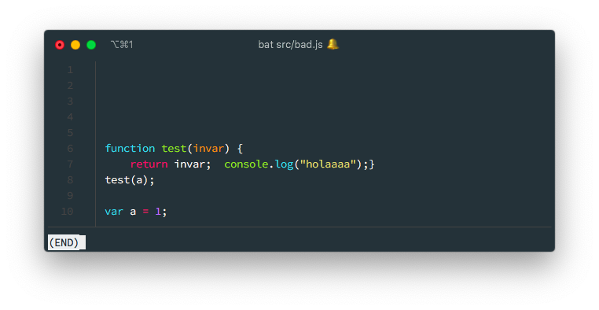
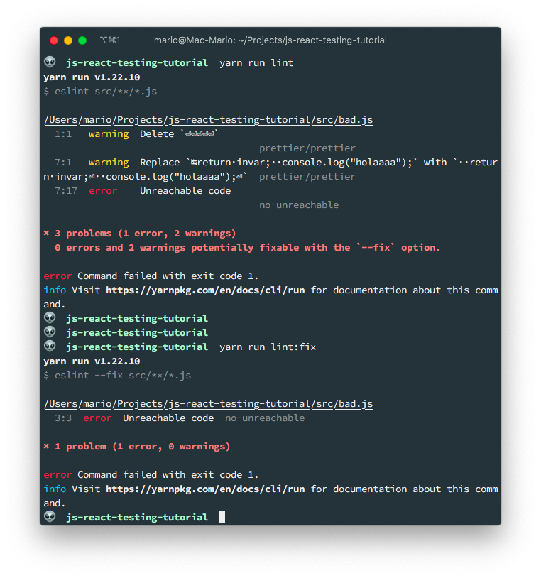
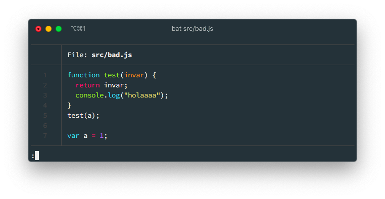
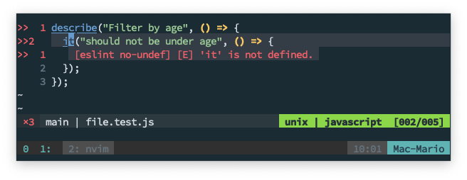
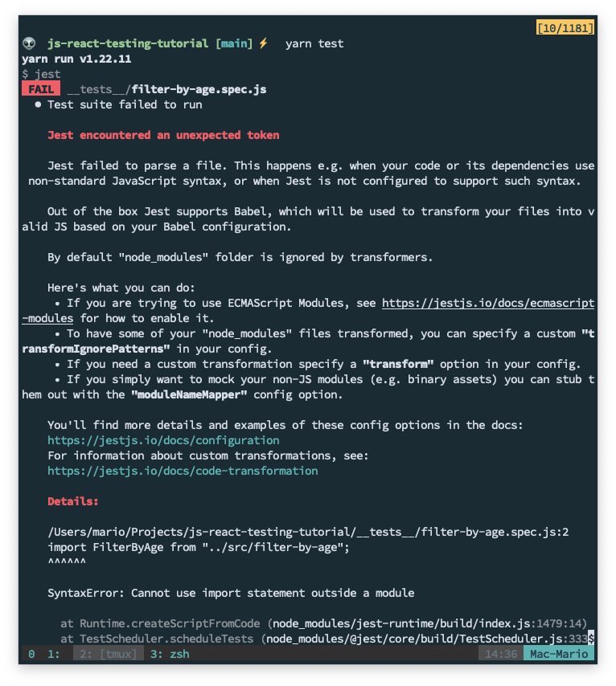
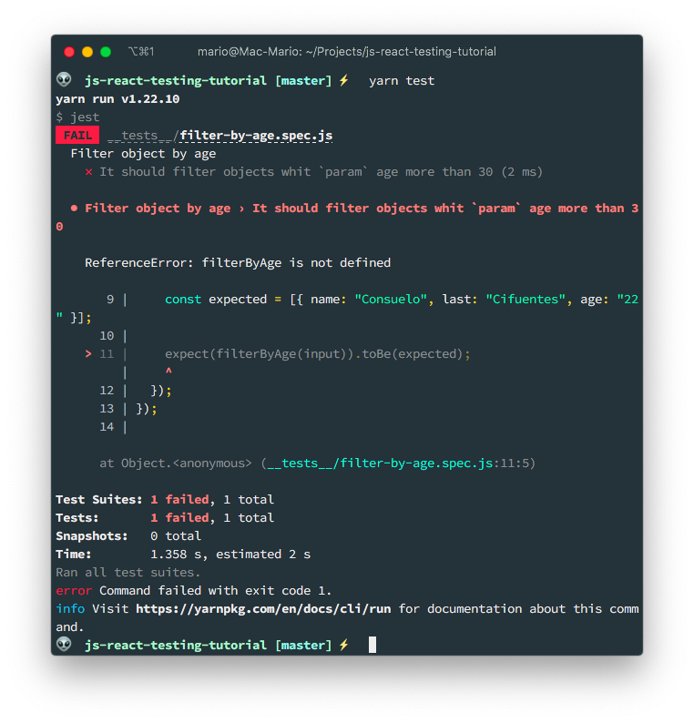
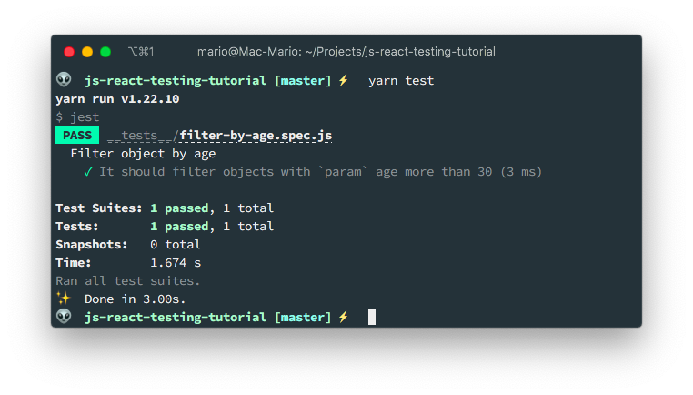
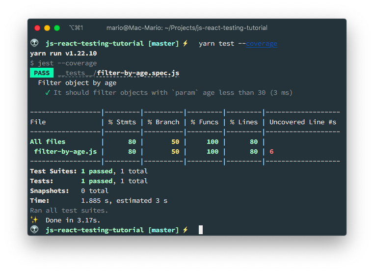
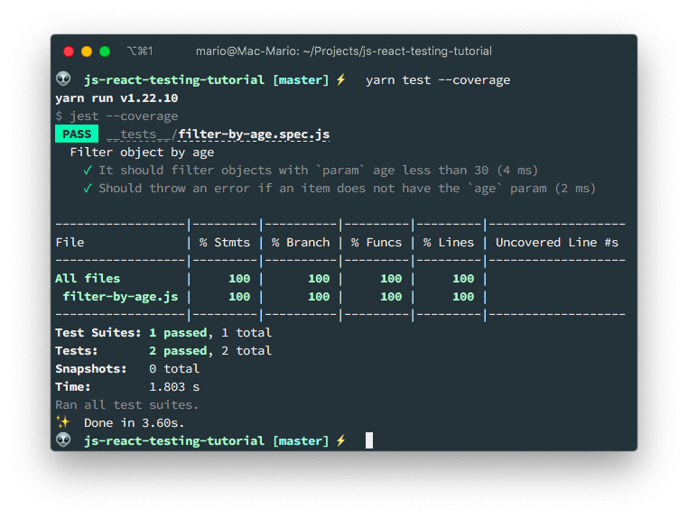
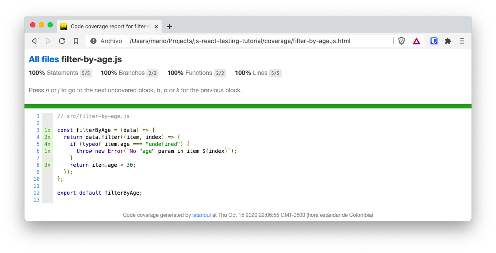

# Setting up Jest for a browser based JavaScript project

I don't have to tell you that testing is important, right?... Right?... RIGHT????

Since [React](https://reactjs.org) decided to use [Jest](https://jestjs.io) with [Testing Library](https://testing-library.com) as the default option to make tests, Jest became the de facto standard for testing project.

But the problem is this. If you create a project using [Create React App](https://create-react-app.dev) your testing framework is configured from the get go. But what If you want to use Jest on a Vanilla JavaScript project? Or what if you are using Webpack as a bundler for multiple files?... You have a big problem.

Well, that's what this article is about. How to setup Jest into a browser based vanilla project.

I'm going to assume that you already know what Jest is and that you are familiar with testing terms like test suites, test runners, mocks, spies and all of that testing good stuff.

## TOC

```toc

```

## Linting and formatting first

Since my setup consists in [Neovim](/vim-setup-for-modern-web-development/) with [CoC](https://github.com/neoclide/coc.nvim). I need to install [Eslint](https://eslint.org) and [Prettier](https://prettier.io) manually on the project so I have automatic code formatting and linting.

So I'll start by creating a new empty project (hence the `yarn init -y`) and then I'll install a _linter_, a formatter.

```bash
mkdir js-react-testing-tutorial
cd $_
yarn init -y
yarn add eslint prettier eslint-config-prettier eslint-plugin-prettier eslint-plugin-react@latest --dev
```

Installing the linting and formatting packages is not enough. We have to instruct them how should they format the code and what is considered errors.

For that we have to execute the command `eslint` using `yarn`, but passing the `--init` flag so we get a configuration wizard.

> I'm not going to cover this part with a lot of detail, if you want an explanation on what I'm doing here, you can go to my [Eslint blog post](/eslint-prettier-wordpress-config/) for an in depth explanation.

```bash
yarn run eslint --init
```

This will ask a series of questions and at the end it will create a `.eslintrc.json` configuration file. Just to be in sync, this where my answerers to the questions:

- How would you like to use ESLint? · problems
- What type of modules does your project use? · esm
- Which framework does your project use? · react
- Does your project use TypeScript? · No
- Where does your code run? · browser
- What format do you want your config file to be in? · JSON
- Would you like to install them now with npm? · No / Yes

And to make `eslint` work with `prettier` you have to edit the `.eslintrc.json` file and add a new set of rules in the `extends` section.

```json {9,22}
{
  "env": {
    "browser": true,
    "es2021": true
  },
  "extends": [
    "eslint:recommended",
    "plugin:react/recommended",
    "plugin:prettier/recommended"
  ],
  "parserOptions": {
    "ecmaFeatures": {
      "jsx": true
    },
    "ecmaVersion": 12,
    "sourceType": "module"
  },
  "plugins": ["react"],
  "rules": {
    "prettier/prettier": "warn"
  }
}
```

Finally, to make my life easier, I added 2 commands in the `scripts` section of the `package.json` file so I can execute `eslint` faster.

```json {13-16}
{
  "name": "js-react-testing-tutorial",
  "version": "1.0.0",
  "main": "index.js",
  "license": "MIT",
  "devDependencies": {
    "eslint": "^7.32.0",
    "eslint-config-prettier": "^8.3.0",
    "eslint-plugin-prettier": "^3.4.0",
    "eslint-plugin-react": "^7.24.0",
    "prettier": "^2.3.2"
  },
  "scripts": {
    "lint": "eslint src/**/*.js",
    "lint:fix": "eslint --fix src/**/*.js"
  }
}
```

As you can see, I added the `lint` and `lint:fix` commands to find and fix errors on my files respectively.

Lest test our setup... Create the `src/bad.js` file with the following contents and format:



And run the `lint` and `lint:fix` commands to fix them:



This will be the result:



Now, don't worry with that last error _Unreachable Code_. It's saying that there is an additional _design_ error that `eslint` can't fix by its own. If this was a real project, we should fix that issue manually. For now we will leave it since the `bad.js` will get removed.

## Install Jest

Installing `jest` in a ES6 project has one _gotcha_ and is that it requires the `babel-jest` package, which in turn requires de `preset-env` package. The reason we need the babel modules is to have support for the _ES6_ `import`.

```bash
yarn add jest babel-jest @babel/preset-env --dev
```

And as with the `eslint` step, lets create a _script_ in `package.json` that instructs `jest` to find and execute test in this project. The final `package.json` file will look like:

```json {7,8,13,19}
{
  "name": "js-react-testing-tutorial",
  "version": "1.0.0",
  "main": "index.js",
  "license": "MIT",
  "devDependencies": {
    "@babel/preset-env": "^7.15.0",
    "babel-jest": "^27.0.6",
    "eslint": "^7.32.0",
    "eslint-config-prettier": "^8.3.0",
    "eslint-plugin-prettier": "^3.4.0",
    "eslint-plugin-react": "^7.24.0",
    "jest": "^27.0.6",
    "prettier": "^2.3.2"
  },
  "scripts": {
    "lint": "eslint src/**/*.js",
    "lint:fix": "eslint --fix src/**/*.js",
    "test": "jest"
  }
}
```

## Fixing IDE complaints

When you install `jest` in your project, you get a series of global functions that are provided and used by the test runner, but are not defined in the project. So `eslint` will start to complaint about that. Take the following code for instance:

```javascript
// sum.test.js
describe("Making sure it works", () => {
  it("should sum 1 plus 1", () => {
    expect(1 + 1).toEqual(2)
  })
})
```

> For now, don't worry about what `describe`, `it` and `expect` do. We'll cover that latter.

When you open it in an IDE, you get this messages:



To prevent this, we need to change the environment in `.eslint.json` by adding to the `env` variable, the option of `jest`.

```json {5}
{
  "env": {
    "browser": true,
    "es2021": true,
    "jest": true
  },
  "extends": [
    "eslint:recommended",
    "plugin:react/recommended",
    "plugin:prettier/recommended"
  ],
  "parserOptions": {
    "ecmaFeatures": {
      "jsx": true
    },
    "ecmaVersion": 12,
    "sourceType": "module"
  },
  "plugins": ["react"],
  "rules": {
    "prettier/prettier": "warn"
  }
}
```

With that, the IDE will recognize this new functions and will stop complaining.

## Configure babel

What does Babel has to do with testing??? Well, let me show you the issue. Create a `import.spec.js` file in the root of the directory:

```javascript
// import.spec.js
import testFunction from "./test-function"
```

That's it! Just one line...

It doesn't matter that the `test-function.js` file does not exists. When you execute `jest test` you get the following error:



The issue is that `import` is not supported by node or Jest in a the way we all are accustomed to. That's why we need to configure babel by creating the following `babel.config.js` file:

```javascript
module.exports = {
  presets: [
    [
      "@babel/preset-env",
      {
        targets: {
          node: "current",
        },
      },
    ],
  ],
}
```

This will enable support for import, and other browser features, in node.

If you execute again `yarn test` **you'll get an error again**. Only this time is that the file we're supposed to be testing is not there. But that is something we'll solve in the following part.

**And that's it. We have Jest fully configured**.

## Creating your first Jest test

To add testing to your project, **you should add a test file for every regular file in your project**. This is not mandatory but a good practice. And with that comes the first decision you have to make:

- Place your text file next to your regular file
- Create a separate directory for all the tests

Both approaches are valid and it really depends on how your project is lay out.

For this example, we're going to create a `__test__` folder and place there all of our tests. And in this `__test__` folder, I'll create a file of the same name as the files in the `src` folder:

```bash
mkdir src
mkdir __tests__
```

Now, let's create our test file in `__tests__/filter-by-age.js`:

```javascript
// __tests__/filter-by-age.spec.js
import filterByAge from "../src/filter-by-age"

describe("Filter object by age", () => {
  test("It should filter objects with `param` age less than 30", () => {
    const input = [
      { name: "Mario", last: "Yepes", age: "77" },
      { name: "Juan", last: "Ramirez", age: "32" },
      { name: "Consuelo", last: "Cifuentes", age: "22" },
    ]

    const expected = [{ name: "Consuelo", last: "Cifuentes", age: "22" }]

    expect(filterByAge(input)).toEqual(expected)
  })
})
```

Two things to notice:

- We're creating the test file **first**
- We are giving the `.spec.js` suffix to our test file

Finally, lets create an **empty** `src/filter-by-age.js` file so it the test doesn't fail by not finding the file.

```bash
touch src/filter-by-age.js
```

To execute this test, just issue `yarn test` in the root of our folder and inspect the output:



It fails! The reason is obvious: We haven't created the `filterByAge` function yet. That's why our next step is to create the function `filterByAge` in `src/filter-by-age.js` so the test passes.

```javascript
// src/filter-by-age.js

const filterByAge = (data) => {
  return data.filter((item) => {
    return item.age < 30;
  });
};

export default filterByAge;
```



The test is passing just fine and we are sure that `jest test` works!

## Test coverage

Now, the icing on the cake. Test coverage.

With test coverage you know which functions and even how much of each function is tested.

Les do an example, lets add an exception to the `filterByAge` function. Which is not a use case that is tested by the current test:

```javascript {5-7}
// src/filter-by-age.js

const filterByAge = (data) => {
  return data.filter((item, index) => {
    if (typeof item.age === "undefined") {
      throw new Error(`No "age" param in item ${index}`);
    }
    return item.age < 30;
  });
};

export default filterByAge;
```

Now, lets generate a report of how much of our code is tested. We achieve that by using the `--coverage` flag:

```bash
yarn test --coverage
```

This will output the following report:



As you can see, the report says that we're testing all (100%) of the functions but only 80% of the lines are tested. 

So, lest add a new test to cover the exception lines in the `filterByAge` function:

```javascript {18,21}
// __tests__/filter-by-age.spec.js
import FilterByAge from "../src/filter-by-age";

describe("Fiter objects", () => {
  test("It should filter objects with `param` age less than 30", () => {
    const input = [
      { name: "Mario", last: "Yepes", age: 77 },
      { name: "Juan", last: "Ramirez", age: 32 },
      { name: "Consuelo", last: "Cifuentes", age: 22 },
    ];

    const actual = FilterByAge(input);
    const expected = [{ name: "Consuelo", last: "Cifuentes", age: 22 }];

    expect(actual).toEqual(expected);
  });

  test("Should throw an error if an item does not have the `age` param", () => {
    const input = [{}];
    expect(() => FilterByAge(input)).toThrow(`No "age" param in item 0`);
  });
});
```

And if we generate the _coverage_ report again, we get the following:



100% coverage... We're done here. Or are we?

```bash
coverage
├── clover.xml
├── coverage-final.json
├── lcov-report
│   ├── base.css
│   ├── block-navigation.js
│   ├── favicon.png
│   ├── filter-by-age.js.html
│   ├── index.html
│   ├── prettify.css
│   ├── prettify.js
│   ├── sort-arrow-sprite.png
│   └── sorter.js
└── lcov.info

1 directory, 12 files
```

We should add that to `.gitignore`

## Configure test coverage

Test coverage is only generated if we pass the `--coverage` flag to jest. But we can change that behaviour. We can can add some lines to the `package.json` to order `jest` to always show the coverage.

```json {21-27}
{
  "name": "js-react-testing-tutorial",
  "version": "1.0.0",
  "main": "index.js",
  "license": "MIT",
  "devDependencies": {
    "@babel/preset-env": "^7.15.0",
    "babel-jest": "^27.0.6",
    "eslint": "^7.32.0",
    "eslint-config-prettier": "^8.3.0",
    "eslint-plugin-prettier": "^3.4.0",
    "eslint-plugin-react": "^7.24.0",
    "jest": "^27.0.6",
    "prettier": "^2.3.2"
  },
  "scripts": {
    "lint": "eslint src/**/*.js",
    "lint:fix": "eslint --fix src/**/*.js",
    "test": "jest"
  },
  "jest": {
    "collectCoverage": true,
    "coverageReporters": [
      "html",
      "text"
    ]
  }
}
```

Here we're telling jest to always show the test coverage and to do it in text (what we've seen so far) and html format.

The HTML format can be viewed in the `coverage/` filder by openinig the `index.html` file with a browser:



## References

In this article I show you how to configure `jest`.

If you want to know more about testing, specially React testing. I encourage you to view [this vide](https://www.youtube.com/watch?v=ZmVBCpefQe8&t=1187s) in YouTube.
