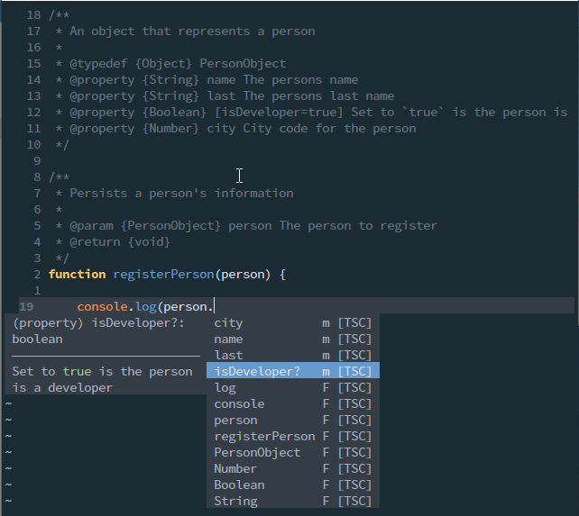

# JSDoc Introduction and cheat sheet

Lately, I've working on a JavaScript project where the original code was written by other developers a couple of months ago, and the project is actually kind of large.

The original code is very well put together and does what it's supposed to do very well I might add.

The problem is that because I came into the project late, every time I try to add a new functionality or change some behaviour I have to ask to another developer almost always the same question: **What does this function do?** or **What kind parameters does this function needs?**, specially when the parameters are objects.

The problem is that the code is not documented so I find myself hunting down the function declarations and reading the code of the function to find out what type of parameters the function needs.

So I took upon my self to document the project with [JSDoc](https://jsdoc.app/) which is the standard of JavaScript documentation.

Here is an small introduction to _JSDoc_ and a small _Cheat Sheet_ with the most common directives.

## TOC

```toc

```

## JSDoc

So, as I said before, _JSDoc_ is the standard for JavaScript code documentation. With it you can an achieve 2 very practical things:

- You get an static website, I mean actual HTML files, with all the code documentation for a project. You could publish this files so other developers have an API documentation site.
- In-line documentation with you IDE. In other words, the IDE will tell you what the function does and what it needs when you hover over it.

What sold me on _JSDoc_ from the very beginning was the second item. Have in-line documentation of every variable, function or class. For instance, take a look at the following undocumented code:


_Hovering over a JavaScript function with no JSDoc documentation_

Notice how when I hover the mouse over the function `testFunction`, the IDE (in this case NeoVim) only tells you the obvious. That there are 3 parameters and that the last one is optional.

Compare that with the following:


_Hovering over a JavaScript function that has JSDoc documentation_

As you can see, I get the information on the function, the number **and type** of parameters and the return value of the function by just hovering it.

This way, every time I need to find which parameters a function needs or what does a function do, I just have to hover over the function in [Visual Studio Code](https://code.visualstudio.com) or press `Shift+k` on NeoVim to get the function documentation and an explanation of the parameters.

## How to document an element

As with Java, to document a function, variable or class. You just have to create a comment before the element you want to document. The only thing you have to keep in mind is that the comment needs to start with `/**` and end with `*/`, like so:

```javascript
/**
 * This is a JSDoc comment
 * ...
 */
function myFunc() {
  // ...
}
```

That will tell the IDE (and the `jsdoc` command line) that this is an special comment.

## Documenting parameters

We already saw that to document an _element_ (function, variable, class, etc.) you just have to add a **special** comment before the element.

Now let's see how to document function parameters with the `@param` directive. Take the following _documented_ function for instance:

```javascript
/**
 * This is the test function.
 *
 * @param {String} name - This it the `name` parameter
 * @param {Number} [age=21] - This is the `age` parameter
 */
function myFunction(name, age = 21) {
  console.log(`Parameter 1 is ${name} and Parameter 2 is ${age}`)
  return true
}
```

Notice that:

- Each parameter requires a `@param` directive in the _speicial_ JSDoc comment
- After `@param` comes the **type** of the variable between brackets, then an **optional dash** and then the **explanation** or additional comments
- Non obligatory parameters have their names enclosed between `[` and `]`
- The default values are added using `=value` next to the variable name

Let's keep working with functions since that's where you'll be spending most of your time documenting.

## Documenting arrays of type

There are cases where you need to create arrays and specify that the arrays should only be composed of a certain type. You can use something like the following for those cases:

```javascript
/**
 * This is a global variable
 * @type {Array<string>}
 */
const arrayOfStrings = [];
```

What about if the array should support strings and numbers:

```javascript
/**
 * This is an array that can contain numbers or strings.
 *
 * @param {Array<number|string>}
 */
const arrayOfNumbersOrStrings = [];
```

Whith the `|` symbol you can specify more than one possible type.

## Object parameters

Let's say that we have the following function:

```javascript
function requieresAndObject(obj1) {
  obj1.city = "undefined" === typeof obj1.city ? "Medellín" : obj1.city
  console.log(
    `The name is ${obj1.name}. The age is ${obj1.age}. And the city ${obj1.city}`
  )
}
```

Notice that the function receives an object. That the object requires a `name` and an `age` values. And if the `city` value is not passed, the value `Medellín` is assigned to it.

How do you document that `obj1` **object** parameter? Unfortunately not very obviously:

```javascript
/**
 * Function with an object parameter
 *
 * @param {Object} obj1 This explains that the parameter is an object
 * @param {String} obj1.name This explains there should be a `name` value on the object
 * @param {Number} obj1.age This explains that there should be an `age` value
 * @param {Number} [obj1.city=Medellín] And the **optional** 3rd parameter can be also documented.
 */
function requieresAndObject(obj1) {
  obj1.city = "undefined" === typeof obj1.city ? "Medellín" : obj1.city
  console.log(
    `The name is ${obj1.name}. The age is ${obj1.age}. And the city ${obj1.city}`
  )
}
```

Not so obvious, but extremely useful.

## Documenting return values

Return values are pretty simple too:

```javascript
/**
 * Just a function that returns a string
 *
 * @return {String} Always return `Hello World!`
 */
const returnAString = () => {
  return "Hola Mundo!"
}
```

You could stop here if you want. You have the knowledge to document 90% of the JavaScript you write on a daily basis.

Still, I recommend you keep reading, because the real functionality for those edge cases comes next.

## Documenting Exceptions

If you've read the book [Clean Code](https://play.google.com/store/books/details/Robert_C_Martin_Clean_Code?id=_i6bDeoCQzsC) by [Robert C. Martin](https://play.google.com/store/info/name/Robert_C_Martin?id=06_4l9), you know that you should be throwing exceptions instead of returning `false` or `null` on error.

If you are, then you really need to specify which exceptions you throw in your code:

```javascript
/**
 * A function that throws an error
 *
 * @param {Boolean} input If `true` trows a simple error
 *
 * @throws {Error} If `input` is `true`
 * @throws {TypeError} If the `input` is `false`
 *
 * @returns {void}
 */
const throwErrorOnInput = (input) => {
  if (input) {
    throw new Error(`This is an Error`);
  }
  throw new TypeError(`This is a TypeError`);
};
```

It's pretty simple actually, the only gotcha is that you have to specify all the _Exceptions_ your function throws.

## Documenting types with `@typedef`

In the section [Object parameters](#object-parameters) we saw how to document an `Object` parameter on a function. 

But what about the case when we have multiple functions that receive an object that's supposed to have the same fields.

The following functions:

```javascript
function registerPerson(person) { /* ... */ }
function updatePerson(person) { /* ... */ }
function deletePerson(person) { /* ... */ }
```

And lets say that this functions require a `PersonObject` object with **at least** a `name`, `last`, `city` and `profile` fields. How do you specify that?

Well, you create a `@typedef` and then specify that this type is the input element. 

This sounds kind of complicated, so lets just do an example:

```javascript
/**
 * Tell JSDoc and the IDE that there is an `object` called `PersonObject`
 *
 * @typedef {Object} PersonObject
 * @property {String} name The persons name
 * @property {String} last The persons last name
 * @property {Boolean} [isDeveloper=true] Set to `true` is the person is a developer
 * @property {Number} city City code for the person
 */

/**
 * Function that uses the `PersonObject` defined with `@typedef`
 *
 * @param {PersonObject} person The person to register
 * @return {void}
 */
function registerPerson(person) {
	console.log(person.isDeveloper);
}
```

First, notice how document an object that doesn't exists by using `@typedef`. Also, notice how we set the name of the object `PersonObject` right after declaring the _typedef_ type.

Second. Notice how each element is documented by using the `@property` directive.

Third. Notice how we can use the new _type definition_ in the `@param` section of the function.

And fourth, take a look at this:



Notice how, because the `@typedef` definition, the IDE understands that the `person` object has a `city`, `name`, `last`, and `isDeveloper` fields.

Is that cool or what!

## Using inline options like `{@see https...}`

## Creating tutorials and examples

## Support Video

https://www.youtube.com/watch?v=U329pKWKqWw

Documentation: https://jsdoc.app/about-configuring-jsdoc.html
