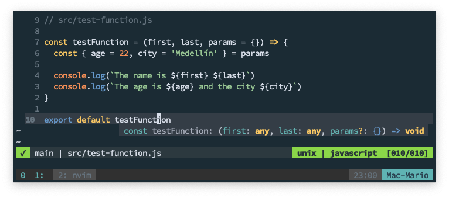
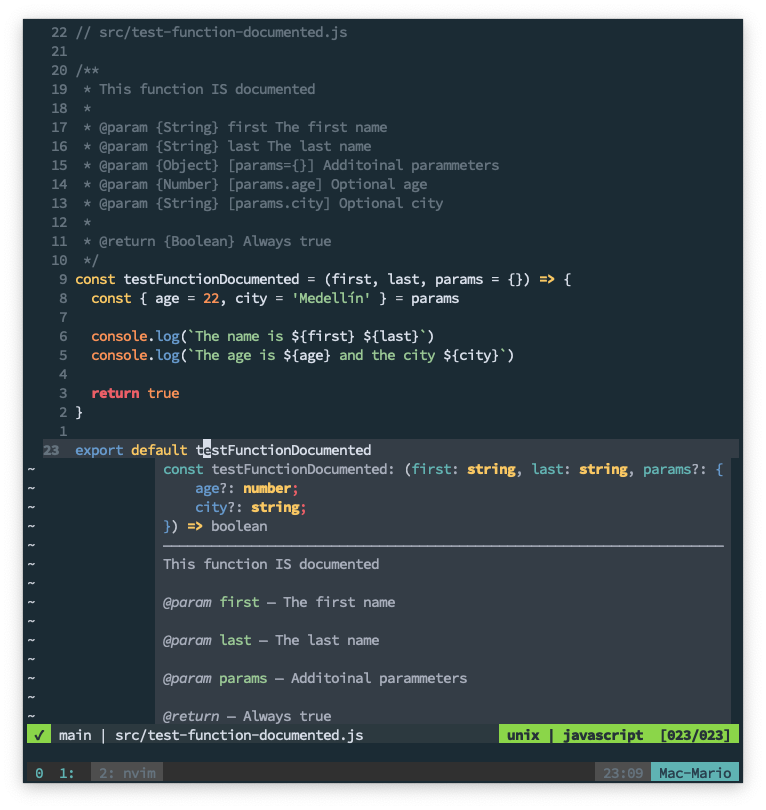

# JSDoc Introduction and cheat sheet

Lately, I've working on a JavaScript project where the original code was written by other developers a couple of months ago, and the project is actually kind of large.

The original code is very well put together and does what it's supposed to do very well I might add.

The problem is that because I came into the project late, every time I try to add a new functionality or change some behaviour I have ask almost always the same question: **What does this function do?** or **What parameters does this function needs?** when the parameters are objects.

The problem is that the code is not documented so I find myself hunting down the function declarations and reading the code of the function when the parameters are objects.

So I took upon my self to document the project with [JSDoc](https://jsdoc.app/) which is the standard of JavaScript documentation.

Here is an small introduction to _JSDoc_ and a small _Cheat Sheet_ with the most common directives.

## TOC

```toc

```

## JSDoc

So, as I said before, _JSDoc_ is the standard for JavaScript code documentation. With it you an achieve 2 very practical things:

- A static website with all the code documentation for a project
- Being able to get in-line documentation with you IDE.

What sold me on _JSDoc_ from the very beginning was the second bullet. Have in-line documentation of every variable, function or class.




 _Without JSDoc Documentation_

Notice how when I hover the mouse over the function `testFunction`, the IDE (in this case VI) only tells you the obvious. That there are 3 parameters and that the last one is optional.

Compare that with the following:



_With JSDoc Documentation_

As you can see, I get the information on the function, the number **and type** of parameters and the return value of the function by just hovering it.

This way, every time I need to find which parameters a function needs or what does a function do, I just have to hover over the function in [Visual Studio Code](https://code.visualstudio.com) or press `Ctrl+K` on Vi to get the function documentation and an explanation of the parameters.

## Basic usage

As with Java, to document a function, you just have to create a comment before the function, variable or class you want to document. The only thing you have to keep in mind is that the comment needs to start with `/**` and end with `*/`, like so:


```javascript
/**
 * This is a JSDoc comment
 * ...
 */
function myFunc() {
  //...
}
```

That will tell the IDE (and the `jsdoc` command line) that this is an special comment.

## Documenting functions

This we already seen 


```javascript
// src/index.js
const { registerUserOpts } = require("./register-user");

registerUserOpts("Mario", "22", { profile: "teacher" });
```

```javascript
// src/register-user.js

/**
 * Should we return true or an Exception?
 *
 * @type {Boolean}
 */
const successValue = true

/**
 * Possible profiles a user can have
 *
 * @type {Array<string>}
 */
const profiles = []

// Adding profiles to the empty array.
profiles.push('student')
profiles.push('teacher')
profiles.push('advisor')

/**
 * Additional options for registering a user
 *
 * @typedef {Object} UserOpts
 * @property {String} major The major of the user
 * @property {String} profile On of `student`, `teacher`, `consultant`.
 * @property {Boolean} withMajor `true` if the user has a major.
 */

/**
 * Mock of a user registration
 *
 * @param {String} name The name of the user
 * @param {Number} age Age of the user in years
 * @param {UserOpts} opts Additional parammeters
 * @return {Boolean} `true` if the user was registered
 * @throws {Error} If there was an unknown error
 * @throws {WrongProfileError} If the profile in opts is not avalable
 */
function registerUserOpts (name, age, opts = {}) {
  const { major = 'Electric', profile = 'student', withMajor = true } = opts

  if (!profiles.includes(profile)) {
    throw new WrongProfileError(`The profile ${profile} is not permited`)
  }

  if (!successValue) {
    throw new Error('Default wrong error')
  }

  console.log(`The user ${name} of age ${age} was registered`)

  if (withMajor) {
    console.log(`Updating user's major whith ${major}`)
  }

  return successValue
}

/**
 * Exception raised on the registerUserOpts function when the a wrong
 * profile is passed in the `opts` parammeter
 */
class WrongProfileError extends Error {
  /**
   * @param {String} The message assigned by the developer
   */
  constructor (message) {
    super(message)
    this.name = 'WrongProfileError'
  }
}

module.exports = {
  registerUserOpts,
  WrongProfileError
}
```
## Support Video

https://www.youtube.com/watch?v=U329pKWKqWw

Documentation: https://jsdoc.app/about-configuring-jsdoc.html
