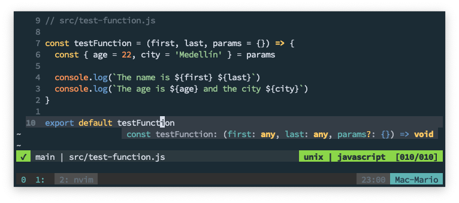
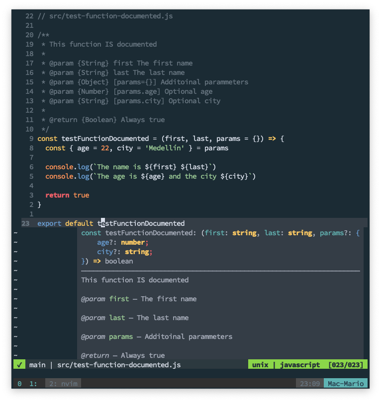
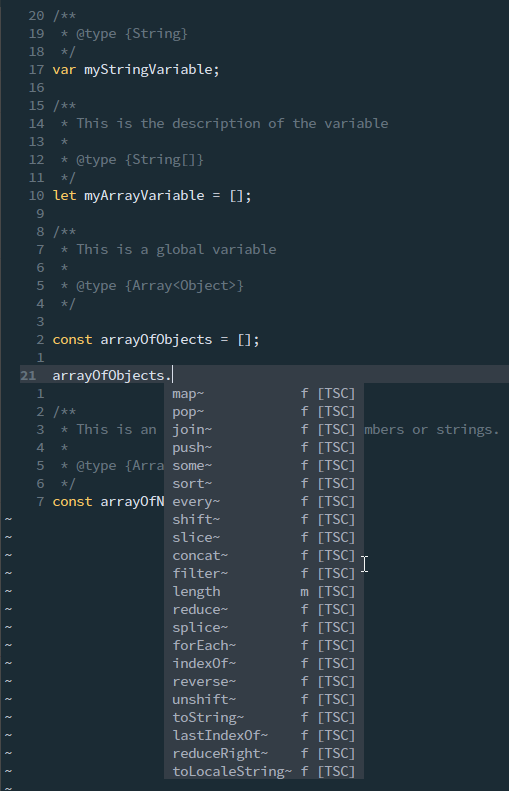
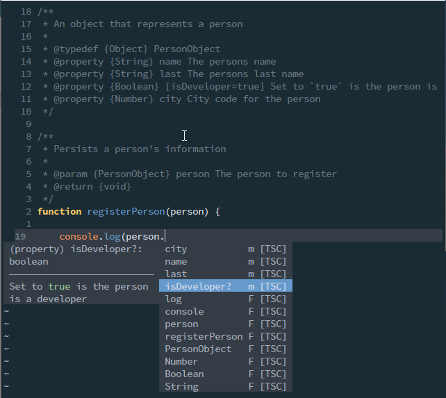
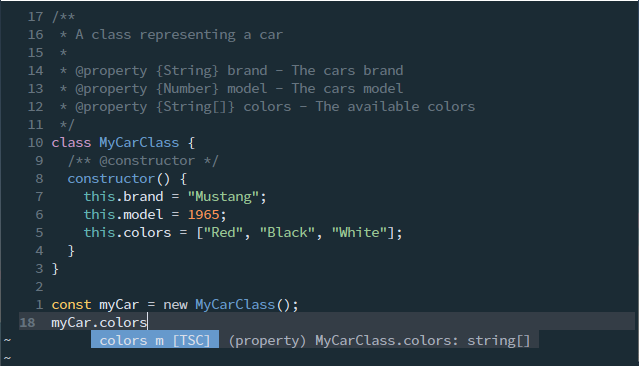
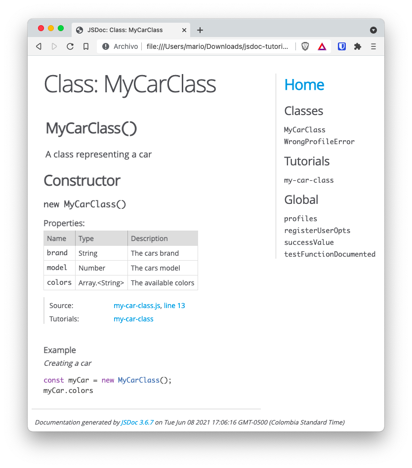

# How to comment your JavaScript code with JSDoc

So I just been tasked with documenting a fairly large JavaScript project where almost none of it's functions or clases have any comments and there is no information on what the function's parammeters do.

I took this opportunity to learn more about [JSDoc](https://jsdoc.app/) and its ability to document elements so the _IDE_ recognizes them in a better way. Also, wanted to create API documents and tutorials right from the source code, without the need of creating a separate project for it.

## TOC

```toc

```

## What is _JSDoc_?

In case you don't know, _JSDoc_ is the standard for JavaScript code documentation. With it you can an achieve 2 very practical things:

- You can "train" your IDE to understand what each function, variable or class is or needs
- You can create API docs in the form of an static HTML site for other developers

To understand what _training your IDE_ means, take for instance the following code:



_Hovering over a JavaScript function with no JSDoc documentation_

Notice how when I hover the mouse over the function `testFunction`, the IDE (in this case NeoVim) only tells you the obvious. That there are 3 parameters and that the last one is optional.

Compare that with the following:



_Hovering over a JavaScript function that has JSDoc documentation_

As you can see, when the function is documented I get the information on the function, the number **and type** of parameters and the return value of the function by just hovering it. It even tells you the components of the third parameter which is an object.

This way, every time I need to find out which parameters a function needs or what does a function do, I just have to hover over the function in [Visual Studio Code](https://code.visualstudio.com) or press `Shift+k` on NeoVim to get the function documentation and an explanation of the parameters.

## How to document an element

Let's start with the basics, how to document **any** element.

As with Java, to document a function, variable or class. You just have to create a comment before the element you want to document. The only thing you have to keep in mind is that the comment needs to start with `/**` and end with `*/`, like so:

```javascript
/**
 * This is a JSDoc comment
 * ...
 */
function myFunc() {
  // ...
}
```

That will tell the IDE (and the `jsdoc` command line) that this is an special comment.

## Documenting a variable

Documenting a variable whether is a global variable or a local variable, just needs the `@type` directive.

```javascript
/**
 * @type {String}
 */
var myStringVariable

/**
 * This is the description of the variable
 *
 * @type {String[]}
 */
let myArrayVariable = []
```

There are cases where you need to create arrays and specify that the arrays should only be composed of a certain type. You can use something like the following for those cases:

```javascript
/**
 * This is a global variable
 *
 * @type {Array<object>}
 */
const arrayOfObjects = []
```

Now, take a look how the IDE will now understand this variables:



What about if the array should support strings and numbers:

```javascript
/**
 * This is an array that can contain numbers or strings.
 *
 * @type {Array<number|string>}
 */
const arrayOfNumbersOrStrings = []
```

Whith the `|` symbol you can specify more than one possible type. **This also applies** for documenting _function parameters_ that we'll describe next.

## Documenting parameters

Now let's see how to document function parameters with the [`@param`](https://jsdoc.app/tags-param.html) directive. Take the following _documented_ function for instance:

```javascript
/**
 * This is the test function.
 *
 * @param {String} name - This it the `name` parameter
 * @param {Number} [age=21] - This is the `age` parameter
 */
function myFunction(name, age = 21) {
  console.log(`Parameter 1 is ${name} and Parameter 2 is ${age}`)
  return true
}
```

Notice that:

- Each parameter requires a `@param` directive in the _spacial_ JSDoc comment
- After `@param` comes the **type** of the variable between brackets, then an **optional dash** and then the **explanation** or additional comments
- Non obligatory parameters have their names enclosed between `[` and `]`
- The default values are added using `=value` next to the variable name

Let's keep working with functions since that's where you'll be spending most of your time documenting.

## Object parameters

Take the following function:

```javascript
function requieresAndObject(obj1) {
  obj1.city = "undefined" === typeof obj1.city ? "Medellín" : obj1.city
  console.log(
    `The name is ${obj1.name}. The age is ${obj1.age}. And the city ${obj1.city}`
  )
}
```

Notice that the function receives an object. That the object requires a `name` and an `age` values. And if the `city` value is not passed, the value `Medellín` is assigned to it.

How do you document that `obj1` **object** parameter? Unfortunately not very obviously:

```javascript
/**
 * Function with an object parameter
 *
 * @param {Object} obj1 This explains that the parameter is an object
 * @param {String} obj1.name This explains there should be a `name` value on the object
 * @param {Number} obj1.age This explains that there should be an `age` value
 * @param {Number} [obj1.city=Medellín] And the **optional** 3rd parameter can be also documented.
 */
function requieresAndObject(obj1) {
  obj1.city = "undefined" === typeof obj1.city ? "Medellín" : obj1.city
  console.log(
    `The name is ${obj1.name}. The age is ${obj1.age}. And the city ${obj1.city}`
  )
}
```

You need to specify that there is **an** `Object` parammeter, and **then** specify the required/optional fields of this object.

As I said, not so obvious, but extremely useful.

## Documenting return values

Return values are pretty simple too:

```javascript
/**
 * Just a function that returns a string
 *
 * @return {String} Always return `Hello World!`
 */
const returnAString = () => {
  return "Hola Mundo!"
}
```

But when you are returning a dictionary things are not so simple:

```javascript
/**
 * This returns a dictionary with a `table` _key_ and a `database` _key_.
 *
 * @param {Array} params - An array of 2 elements
 * @return {{table: string, database: string}} - The database and table to query
 */
function parseTableAndDb = (params) =>  {
  return { table: params[0], database: params[1] };
}
```

It's a good practice to explain what the return function means in term of it's inputs values.

## Documenting Exceptions

If you've read the book [Clean Code](https://play.google.com/store/books/details/Robert_C_Martin_Clean_Code?id=_i6bDeoCQzsC) by [Robert C. Martin](https://play.google.com/store/info/name/Robert_C_Martin?id=06_4l9), you know that you should be throwing exceptions instead of returning `false` or `null` on error.

If you are, then you really need to specify which exceptions you throw in your code with [`@throws`](https://jsdoc.app/tags-throws.html):

```javascript
/**
 * A function that throws an error
 *
 * @param {Boolean} input If `true` trows a simple error
 *
 * @throws {Error} If `input` is `true`
 * @throws {TypeError} If the `input` is `false`
 *
 * @returns {void}
 */
const throwErrorOnInput = input => {
  if (input) {
    throw new Error(`This is an Error`)
  }
  throw new TypeError(`This is a TypeError`)
}
```

It's pretty simple actually, the only gotcha is that you have to specify all the _Exceptions_ your function throws.

## Documenting types with `@typedef`

In the section [Object parameters](#object-parameters) we saw how to document an `Object` parameter on a function.

But what about the case when we have multiple functions that receive an object that's supposed to have the same fields.

Let's say that we have 3 functions that receive the same type of parameter:

```javascript
function registerPerson(person) {
  /* ... */
}
function updatePerson(person) {
  /* ... */
}
function deletePerson(person) {
  /* ... */
}
```

And lets say that this functions require a `PersonObject` with the following structure:

```javascript
// The `person` object for the previous functions:
{
  name: "Fist Name", // string
  laset: "Last Name", // string
  isDeveloper: true, // boolean
  city: "Users City" // string
}
```

How do specify that object and how do the document the functions that use that object?

Well, you create a [`@typedef`](https://jsdoc.app/tags-typedef.html) and then specify that this type is the input element.

This sounds kind of complicated, so lets just do an example:

```javascript
/**
 * Tell JSDoc and the IDE that there is an `object` called `PersonObject`
 *
 * @typedef {Object} PersonObject
 * @property {String} name The persons name
 * @property {String} last The persons last name
 * @property {Boolean} [isDeveloper=true] Set to `true` is the person is a developer
 * @property {Number} city City code for the person
 */

// No need to create a PersonObject

/**
 * Function that uses the `PersonObject` defined with `@typedef`
 *
 * @param {PersonObject} person The person to register
 * @return {void}
 */
function registerPerson(person) {
  console.log(person.isDeveloper)
}
```

First, notice how to document an object it doesn't has to exists. You just need to create a comment section with a `@typedef` at the top. Also, notice how we set the name of the object `PersonObject` right after declaring of the `@typedef`.

Second, notice how each **element** is documented by using the `@property` directive.

Third, notice how we can use the new _type definition_ in the `@param` section of the function by specifying that `person` is of type `PersonObject`.

And fourth, take a look at this:



Because of the `@typedef` definition, the IDE understands that the `person` object has a `city`, `name`, `last`, and `isDeveloper` fields.

Is that cool or what!

## Documenting class properties

I bet you've come across classes with instance variables that you just have no idea that they exists or don't have any idea what they do.

Well, for that you can use the [`@property`](https://jsdoc.app/tags-property.html) directive, very much like when we used in the `@typedef` section

```javascript
/**
 * A class representing a car
 *
 * @property {String} brand - The cars brand
 * @property {Number} model - The cars model
 * @property {String[]} colors - The available colors
 */
class MyCarClass {
  /** @constructor */
  constructor() {
    this.brand = "Mustang"
    this.model = 1965
    this.colors = ["Red", "Black", "White"]
  }
}
```

The cool thing is that the IDE will show which elements are part of the class:



## VisualStudio Code and `jsconfig.json`

There is a very useful option in [Visual Studio Code](https://code.visualstudio.com) where you can force it to type check your code if it's commented.

The function is called _Implicit Project Config: Check JS_ and its inside the _JavaScript_ group.

If you want to enable this option for your project without the need to check that option manually. You can create a [`jsconfig.json`](https://code.visualstudio.com/docs/languages/jsconfig) in the root of your project with something like this:

```json
{
  "compilerOptions": {
    "checkJs": true,
    "jsx": "preserve"
  },
  "exclude": ["node_modules", "docs"]
}
```

This not only makes _VS Code_ type check your code from your JSDoc comments, but it allows you to configure where and how to make those checks.

## Generating API documentation

OK, we've seen how to document functions, variables, classes and objects so our IDE understands our code better. But we haven't created API documentation to publish in a website. Well, that's what the [`jsdoc`](https://jsdoc.app/about-commandline.html) command is for.

```bash
jsdoc -u path/to/tutorials -c jsdoc-config.json -d path/to/destination path/to/sourcode
```

You can install it globally with `npm i -g jsdoc` but since I don't like cluttering my environment with commands. What I do is that I install it as a _Dev_ dependency:

```bash
npm init -y # If you haven't done so already
npm install -D jsdoc
```

And then, in the `package.json` file, create the following script:

```json
{
  "...",
  "scripts": {
    "jsdoc": "jsdoc -d docs-output/ -u tutorials/ src/"
  }
}
```

Here I'm creating the `npm` command `jsdoc` with the following parameters:

- Output the documentation files (the html) in `docs-output/`
- Look for tutorials in `tutorials/`
- Document the files that are in `src/`

And to generate the documentation just have to execute this in the root of my project:

```bash
npm run jsdoc
```

That will output a bunch of files that can be viewed using a browser:



Now, don't worry about the "tutorial" part. I'll explain that very soon.

## JSDoc configuration file

In the previous section, we saw how to use the `jsdoc` command with just 3 parammeters:

- Where the source code is
- Where to output the documentation
- Where the tutorial files where storeed

The fact is that there are a ton of configuration options to specify the supported file extensions, which files to exclude, information logging, etc. You can see the complete set of parammeters [here](https://jsdoc.app/about-commandline.html)

If you require very explicit or complex set of parameters to generate you documentation, you can create a [config file](https://jsdoc.app/about-configuring-jsdoc.html) in your projects folder and execute `jsdoc` like:

```bash
jsdoc -c path/to/jsdoc-config.json
```

> You can change the name of the `json` file of course

Where `jsdoc-config.json` is something like

```json
{
  "plugins": ["markdown"],
  "recurseDepth": 10,
  "source": {
    "includePattern": ".+\\.js(doc|x)?$",
    "excludePattern": "(^|\\/|\\\\)_"
  },
  "sourceType": "module",
  "tags": {
    "allowUnknownTags": true,
    "dictionaries": ["jsdoc", "closure"]
  },
  "templates": {
    "cleverLinks": false,
    "monospaceLinks": false
  }
}
```

For a list of configuration options, you can visit [this url](https://jsdoc.app/about-configuring-jsdoc.html)

## Creating tutorials and examples

I left this part for last since it has to do with the generation of API docs. And that requires de execution of the `jsdoc` command.

But the fact is that you can create from small in-line examples of how your functions can be used. To full blown tutorials in markdown files.

Let's use the `MyCarClass` to show how an example and a tutorial can be embedded:

```javascript {7-9,11}
/**
 * A class representing a car
 *
 * @property {String} brand - The cars brand
 * @property {Number} model - The cars model
 * @property {String[]} colors - The available colors
 * @example <caption>Creating a car</caption>
 * const myCar = new MyCarClass();
 * myCar.colors
 *
 * @tutorial my-car-class
 *
 */
class MyCarClass {
  /** @constructor */
  constructor() {
    this.brand = "Mustang"
    this.model = 1965
    this.colors = ["Red", "Black", "White"]
  }
}
```

Now, this is very important, **the file `my-car-class.md` or `my-car-class.html` should be present** in the folder you specified for storing the tutorials (we used `tutorials/` from the previous example).

> Remember, the folder for the tutorial is specified by the `-u` parameter

## Additional documentation

_JSDoc_ has much, much more options, you can review them [here](https://jsdoc.app/)

Also, I created a very, very small GitHub repo with some functions and classes documented [here](https://github.com/marioy47/jsdoc-tutorial). You can use it ti get inspiration on how to configure your development environment if you want.
