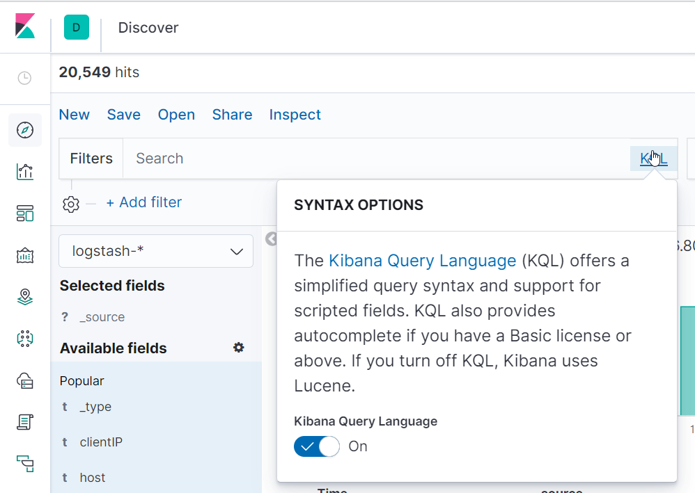

# Kibana Query Language - KQL

- It only filters data, does not sort or aggregates data
- Different set of features that the [Lucene query syntax](https://www.elastic.co/guide/en/kibana/current/lucene-query.html)
- Can query nexted fields and scripted fields
- No regular expressions with _fuzzy terms_
- You can still use the legacy _Lucene Syntax_ by clicking KQL next to the search field



## Terms Query

- Uses **exact search terms**
- Spaces separates terms
- Use quotation marks to indicate a **phrase match**

```kql
path:error.log
```

Using quotation for phrases

```kql
message:"permission denied"
``` 

## Boolean queries

```kql
path:error.log and type:apache_error
```

```kql
response:(400 or 500)
```

```kql
response:(400 or 500) and path:access.log or path:error.log
```

## Range

```kql
error >= 400 
```


## Complete guide

https://www.elastic.co/guide/en/kibana/current/kuery-query.html


