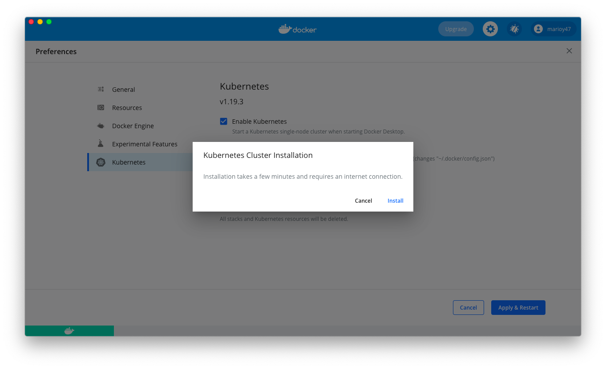
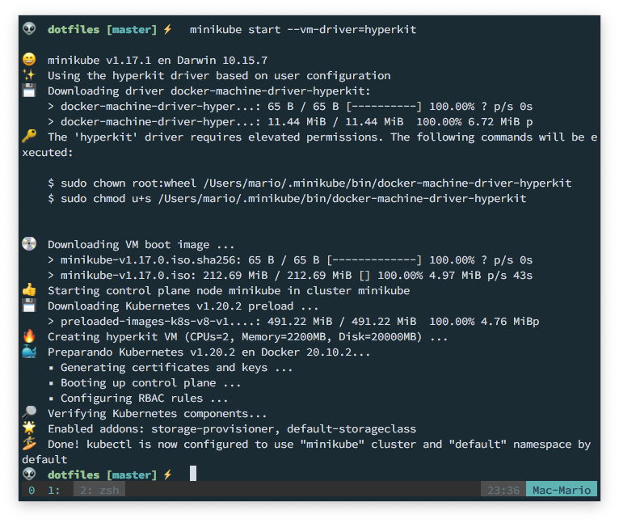

# Create your first deployment using Kubernetes

Microservices... Right? Well, that's the buzzword right now.

Have your service spread across multiple machines and in multiple parts, each one responsible just just one thing, without a single point of failure and in a replicable way. What's not to like.

But how do you achieve that?

Well, you can start with Docker. With it you can create instances of your services, and have them run in a controlled fashion with just one command:

```bash
docker run --memory 300M --cpus=0.5 --restart=on-failure \
  -v $PWD:/var/www/html/ \
  -p 8080:80 \
  nginx:1-alpine
```

Here you have an _Nginx_ service running with a max amount of CPU, max amount of memory. And if it fails it will get restarted.

This works great to a certain point. ¿But who wants to execute this command a 100 times in 10 to 20 machines?...  And there is the problem of load balancing your application so the load gets spread across the containers. And having a polling service to determine which instances are up or down so the load balancer actually spreads the load correctly... This setup is starting to become a nightmare.

Enter Kubernetes!

Kubernetes allows you to orchestrate (another trendy word) your containers in hundreds or thousands of machines while guaranteeing:

- Availability
- Scalability
- And disaster recovery

Now, this is the dream.

So let's take a look on how to create a simple Kubernetes node in your machine and how to make it control a simple node based service.

But before we start, a simple warning: _This article assumes that you already know what Docker does and how to work with it_.

## TOC

```toc

```

## Definitions

There is one thing you can say about Kubernetes with confidence, and is that it has a lot, and I mean A LOT, of components. And with those components a lot of definitions.

So lets get our vocabulary straight:

#### Pod

Pod is the minimal unit in Kubernetes. Inside it you can run **one or more** _containers_.

There are 3 things to remember about pods:

- Pods are ephemeral. Meaning that they can be created and destroyed at any time by the kubernetes service.
- You don't know for certain the IP of a pod since its created semi randomly at container initiation
- All the containers inside the pod share the same address but with different port

Personally, I think of pods as the equivalent of _Docker Compose_.

#### Node

Think of it as the machine where one or more _pod_ resides. It could be a bare metal machine or a _VPS_.

#### Service

This is the permanent IP address attached to a pod.

When a pod is recreated, the _service_ makes sure that is **reacheable** using the same address and also works a load balancer

#### Ingres

The _Ingres_ routes traffic from the **outside** into the cluster and forwards communication to internal services.

#### Configuration Map

Takes care of applying configuration to your application. Things like environment variables, routes or paths.

You create a _Configuration Map_, and then you connect a pod to it.

This is important: **It's not for storing and spreading passwords**

#### Secret

Here is where you store usernames and passwords. And, like the _Configuration Map_, you connect a pod to a secret.

#### Volumes

Allows you to connect storage to pods. But, unlike to what you have on Docker, a volume can be much more than a path on the machine. It can be a service like s3 or _Digital Ocean Spaces_.

The great thing about them, is that no matter if you use a real drive or a service, you access them like locally connected devices to the pod.

#### Deployment

Is like a blueprint for a pod that you can use to create multiple instances of them. It also specifies the number of replicas of a pod are possible and the resources assigned to them.

A deployment is stored in a `yaml` file and is this is where you'll spend most of the time creating.

**You don't specify databases in deployments since there are _states_ to take care of**

#### _Statefull_ Set

They works similar to volumes, but they are used when you need state and replication. The best example for it is when using databases where different pods require that the information is synced, persistent and can be replicated.

Just like Deployments, they take care of scaling up or down.

The truth is that they are not very used since is easier to host data in an external service like _AWS Dynamo_ or _Google Big Table_.

## Masters and Workers Nodes

We already talked about _Nodes_. We just didn't say that there are multiple types of nodes. The Worker Nodes are where the PODs live. Master nodes make sure that they deployment follows what you created in your blueprint.

A deployment needs at least a master and a worker. But there are a few recommendations:

- There should be at least 2 Master Nodes.
- A master node should not be in the same machine as a Worker Node.
- Worker nodes should be as spread as possible.

A service like AKS or _Digital Ocean Kubernetes_ takes care of creating the master nodes and you create the workers. In other words, the master nodes are handled by the provider and you pay for the workers

## How does it work

Before we start creating our own master/worker node, we need to get something very clear:

**You don't tell Kubernetes what to do. You tell it how the system should look like in any point in time**. 

This is called a _Desired State Configuration_. And the service that takes care of making this desired state a reality is the _Control Plane_.

You, as a developer, pass the _Desired State Configuration_ (the `yaml` file) through a REST API to the _Control Plane_ using the `kubectl` command.

And that's it. That's what you are basically doing when you are configuring a Kubernetes Cluster.

## Installing Kubernetes

For a development setup you install a _master_ and a _worker_ in the same machine, which as we previously said, is a big no no when in production.  Still, for learning and development it's the best way to do things.

There are 2 options for creating a Kubernetes cluster in your computer:

- Using Docker Desktop
- Using MiniKube

If you already have your images in a registry like docker.io then Minikube might be more comfortable and manageable since the installation is lighter and more straight forwared. If you are creating images from scratch with Docker Desktop, then it's easier if you just _enable_ Kubernetes there.

Bot achieve the same results, just take into account that with Minikube you can not create images since the `docker` command is not included.

> A while ago Minikube included Docker. But that is no longer the case.

### Using Docker Desktop

The steps are very, very, very easy:

- Install _Docker Desktop_ like any regular Desktop application
- Go to `Preferences > Kubernetes`
- Select `Enable Kubernetes`

Take into account that this will download some BIG Docker images required for the cluster to run. So don't worry if the third step takes some time.



After the download and installation is done, you'll have the `kubectl` command available, which will help us talk to the REST API (Control Plane) in the local Master node.

### Using Minikube

If you want to go old school or do not have access to a Desktop Environment (maybe you are doing this in a VPS for instance) then your best best is to use Minikube.

Installing minikube in Mac is just a matter of executing:

```bash
brew install minikube
```

And to install a small master/worker node, you just need execute the following:

```bash
minikube start --vm-driver=hyperkit
minikube status
kubectl get nodes
```

The first command deservers some explanation. It's instructing Minikube to use an hyperkit virtual machine (included in the Minikube installation) as a virtual server.

> It is possible to use _Virtual Box_ instead of _Hyperkit_ as a virtual machine. But this requires you to install additional software.



### Testing the installation

Whether you used _Docker Desktop_ or _Minikube_ you should be able to execute the following commands:

```bash
which kubectl
which hyperkit
kubectl version
```

If this commands execute without errors then you have a complete development setup.


## Deploying the first pod

Let's do a little recap of what you have so far:

- You have a One Node Cluster
- Master and Worker process function in this one node
- Docker container comes pre-installed
- Your node uses an hypervisor

And if you list your nodes you should get an empty response:

```bash
$ kubectl get nodes
NAME       STATUS   ROLES                  AGE    VERSION
minikube   Ready    control-plane,master   7m8s   v1.20.2

$ kubectl get pod
No resources found in default namespace.

$ kubectl get service
NAME         TYPE        CLUSTER-IP   EXTERNAL-IP   PORT(S)   AGE
kubernetes   ClusterIP   10.96.0.1    <none>        443/TCP   7m41s
```

As you can see, one node, one **empty** pod and one service for that one node.

Let's add our first container for the current pod:

```bash
kubectl create deployment nginx-test-deployment --image=nginx:1-alpine
```

If you've worked with Docker that last command should be pretty familiar. Specially the `--image=nginx:1-alpine` where we're telling kubernetes to download the `nginx:1-alpine` images into our node.

Now, if we list the resources in the pod again, this is what we get:

```bash
$ kubectl get pod
NAME                                     READY   STATUS    RESTARTS   AGE
nginx-test-deployment-5bb96c5fbb-f9wps   1/1     Running   0          112s

$ kubectl get deployment
NAME                    READY   UP-TO-DATE   AVAILABLE   AGE
nginx-test-deployment   1/1     1            1           3m8s
```

That one last line is kind of a curve ball. But is telling us that even tough we didn't created an actual deployment, kubernetes created one for us with default values which are "restart `nginx` if the service crashes". No ports, no resource allocation, and no available port to access it from the outside.

## Docker for Desktop

```bash
kubectl <get|delete|create> <resource type>
```

```bash
kubectl <create|apply> -f ./custom-config-file.yml
```

Most people just use `apply` since ita like a _Create or Update_

```bash
kubectl port-forward my-pod 8080:80
```

> you can visit then http://localhost:8080 and access the remote server

Works on local nodes or remote services depending where `my-pod` resides


## Kubectl Cheat Sheet

| Command                                               | Description                                                           |
| ----------------------------------------------------- | --------------------------------------------------------------------- |
| `kubectl get nodes`                                   | List all the nodes of a cluster. Just one for minikube                |
| `kubectl get pod`                                     | Show a list of pods in the cluster and it's status                    |
| `kubectl get services`                                |                                                                       |
| `kubectl create deployment <name> --image=<contaner>` | Downloads an image, creates a container and deploys it to the cluster |
| `kubectl get deployent`                               | Show the status of a deployment (a pod)                               |
| `kubectl logs <name>`                                 | Use the semi-random name that kubectl gave it                         |

There is no `kubectl create pod` because you interact with the abstraction called **Deployment**

## Final toughts

I really recommend the talk [A Developer's introduction to Kubernetes](https://www.youtube.com/watch?v=lAyL9HKx8cQ) from Kris Klug. It's funny, informative and it covers just enough to get you started.

And if you have the time, there is also the full course [Kubernetes tutorial for Beginers](https://www.youtube.com/watch?v=X48VuDVv0do) from Nana Janashia. It's kind of long with almost 4 hours of content, but very through, practical, and easy to understand.
