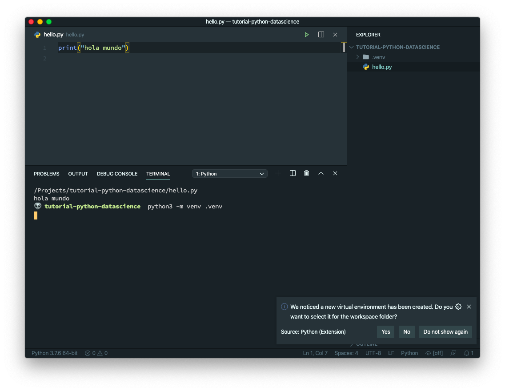
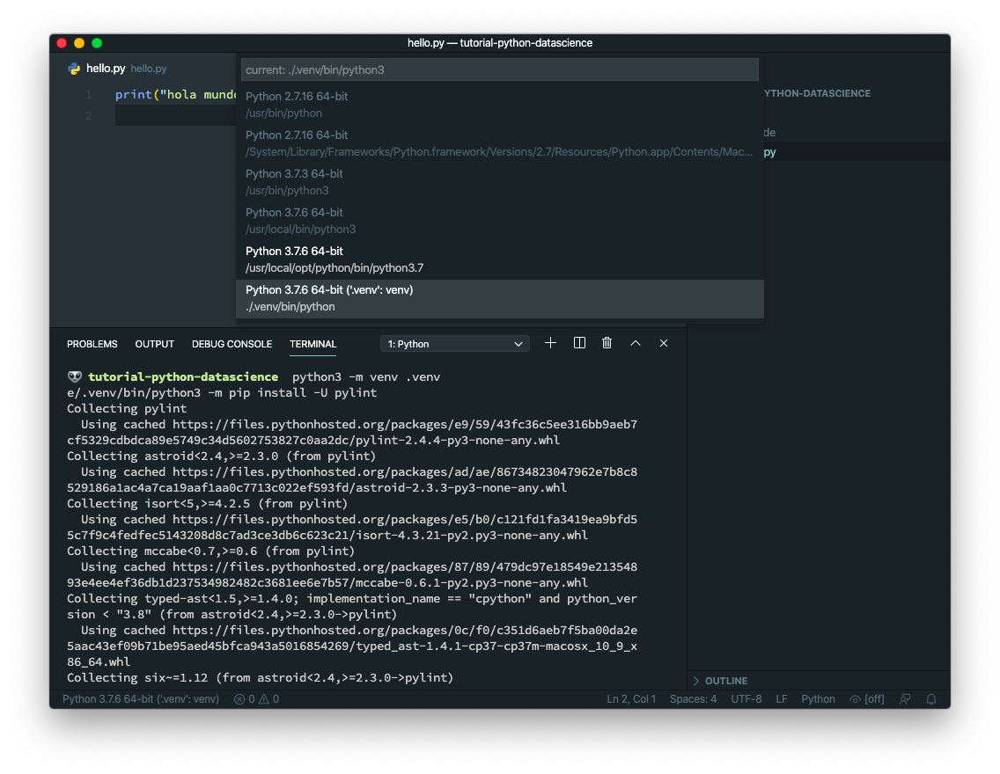
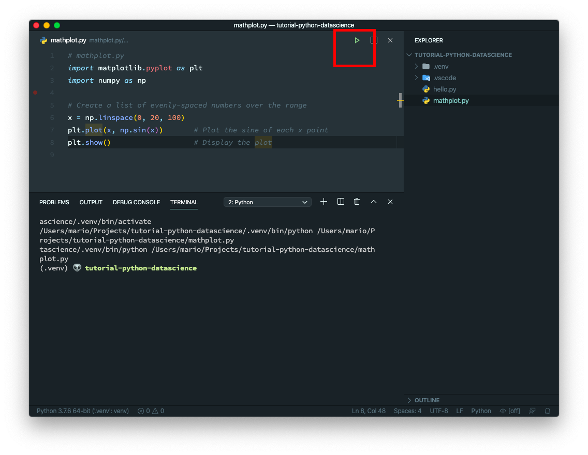
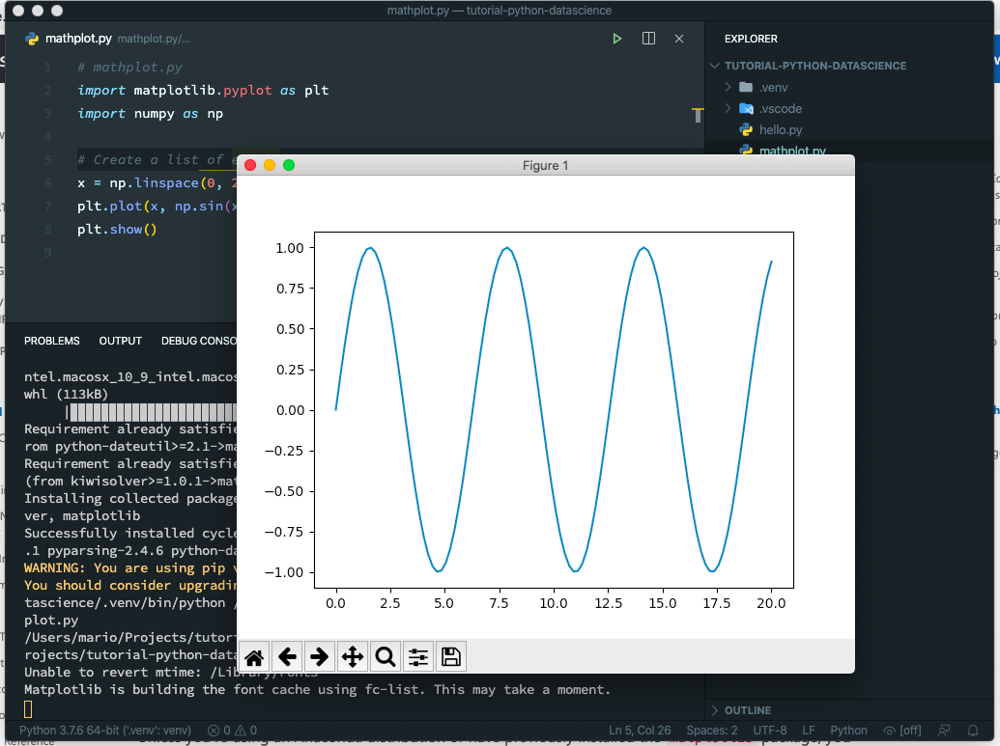

# Setup a Mac OS computer to develop DataScience solutions with Python and VSCode

Even tough is not complicated, there are a series of steps that are suggested to take, in order to be able to be productive while developing Data Science solutions using a Mac machine with the Python language.

In this article I'll show you a series of steps you can take to achieve just this without too many fuzz.

## TOC

```toc

```

## Install Python

You could say _Duh!_ here...

But the fact of the matter is that Mac OS comes with an outdated version of Python, and that version could give you issues with newer solutions.

So its required that you start by installing a new version of Python alongside of the stock one.

If you have [brew](https://brew.sh) its just a matter of executing in your terminal.

```bash
brew install python
```

This will make the `python3` command available globally in your machine.

## Install required Visual Studio Code extensions

For starters we need only one extension, and that would be the [official Python extension](https://marketplace.visualstudio.com/items?itemName=ms-python.python). That can be installed in the terminal by issuing:

```bash
code --install-extension ms-python.python
```

There are other extensions for _Data Science_ but that one will suffice.

## Creating a project

The previous 2 steps are required on a global scope. Now its time to setup your project.

The first step is to create a virtual env in your work dir:

```bash
mkdir tutorial-python-datascience
cd tutorial-python-datascience
python3 -m venv .venv
source .venv/bin/activate
```



If you notice from the image, _Visual Studio Code_ prompts you to use that Virtual Environment, which you should.

Also change the _Python Interpreter_ just in case:



## Python Project Modules

In the last step _Visual Studio_ asked you to install 2 Python modules:

- [PyLint](https://www.pylint.org/)
- [AutoPEP8](https://pypi.org/project/autopep8/)

If it didn't, here are the commands to install them in the terminal:

```bash
python3 -m pip install pylint
python3 -m pip install autopep8
```

> Notice that we're installing Python Modules and not Visual Studio Extensions

The first module (pylint) will make sure that your code is free of bugs and of good quiality **to an extent**.

The second module (autopep8) will format your code so it follows the PEP 8 style guide.

... And we're done

Remember that the last 2 steps have to be done for _every python project_

## MatPlotLib

This is not part of the process but its cool to show the power you get by following the previous steps. Lets install Python's [MatPlotLib](https://matplotlib.org/) and execute a small plotting test.

Firs install the module in our _Virtual Environment_

```bash
python3 -m pip install matplotlib
```

Then create an small plotting program

> This code is taken from the Python Tutorial in Visual Studio Code site on https://code.visualstudio.com/docs/python/python-tutorial

```python
# mathplot.py
import matplotlib.pyplot as plt
import numpy as np

# Create a list of evenly-spaced numbers over the range
x = np.linspace(0, 20, 100)
plt.plot(x, np.sin(x))       # Plot the sine of each x point
plt.show()                   # Display the plot
```

And finally fire it using the run button:





## Jupyter Notebooks

Another great **python** plugin that you should install for _Data Science_ projects is [Jupyter Notebooks](https://jupyter.org/)

You can install and start a _Jupyter Notebook_ by issugin just 2 commands (assuming that you have initialized your virtual environment)

```bash
python -m pip install jupypterlab
jupyter notebook
```

This will start a small web server in your computer that you can access just by opening your browser on the port 8080

If you want to open a _Jupyter Notebook_ directoy in _Visual Studio_ you can use the [VS Code Jupyter Notebook Previewer](https://marketplace.visualstudio.com/items?itemName=jithurjacob.nbpreviewer). But the reallity is that you don't gain much by using it.

## Final thoughts

As you can see, Visual Studio Code is a very capable Python IDE with the advantage of being very light and very versatile.

Hope you find this tutorial useful.
