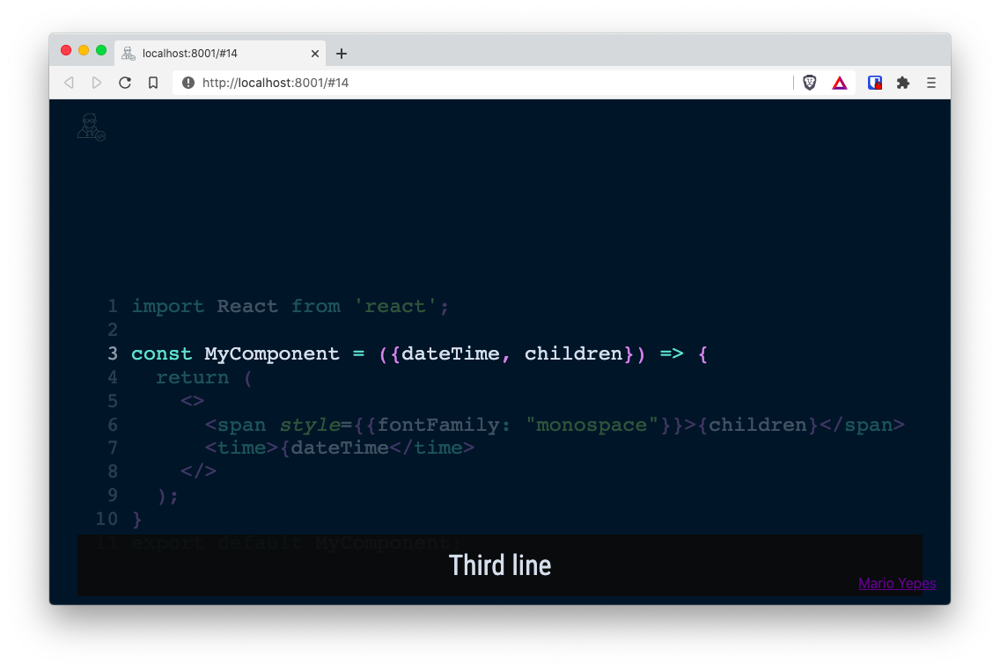

# Create developer presentations with MDX Deck - Part 2

In the [first part](/mdx-deck-developer-presentations-part-1/) of this series, we introduced [MDX Deck](https://mdxjs.com/) and [created a deck](https://github.com/marioy47/mdx-deck-tutorial) with the following properties:

- A slide with external images
- A slide with local images
- A couple of slides whith highlighted code
- A couple of slides with different layouts
- Theme usage

With what we saw in the first part, its possible to create pretty impressive slides.

But we can still do so more with _MDX Deck_!!!

In this part we'll be seeing how to use [third party components](https://github.com/jxnblk/mdx-deck/#third-party-components), specially the [Code Surfer](https://github.com/pomber/code-surfer) component. And how to publish a deck using GitHub pages with a custom sub-domain.

## TOC

```toc
to-heading: 3
```

## Speaker notes

If your are using full screen slides, is possible that you require the complete area of the slide to display your ideas, leaving no space for explanatory text.

Or just sometimes you just need a hint on why you are showing what's in the slide.

On those cases you need the `<Notes>` component provided by _MDX Deck_.

Just add add a `<Notes>...</Notes>` block anywhere in your slide, and the content wont be displayed. Pe:

```markdown
---

# Speaker notes

- Only the Speaker can see the notes
- `Option + P` Toggles the presenter mode
- The speaker sees the notes and the next slide

<Notes>

- If you open the presentation in another window it will stay in sync
- Only if you are using `yarn start`
- In windows is `Alt + P`

</Notes>
```

To **access** the speaker notes you have to type `Option + P` (`Alt + P` in Windows). This key combination also works to **get out** the speaker notes.


Note that you see the notes for the current slide, and the next slide. And if you are using multiple instances of your browser, the slides **will stay in sync**.

## Headers and Footers

_MDX Deck_ offers 2 components for adding a header and a footer. And they are called exactly like that: `<Header>` and `<Footer>`. And whatever you place in this 2 sections will appear on **all the slides**.

So, in our presentation I'm going to add an `.svg` file on the `images/` folder. And that image I'll use for the header. Also, I'm going to add a link to my blog in the footer.

Lets make those changes **at the beginning** of the deck:

```jsx {4,10-24}
<!-- slides.mdx -->

import { yellow, prism } from "@mdx-deck/themes"
import IconDev from './images/icon-developer.svg';
export const theme = {
  ...yellow,
  ...prism,
}

<Header>

<Image src={IconDev} style={{width: `32px`, height: `32px`, margin: `1em` }} />

</Header>

<Footer>

<div style={{textAlign: `right`}}>

[Mario Yepes](https://marioyepes.com)

</div>

</Footer>

# My very first presentation

[@marioy47](https://twitter.com/marioy47)
```

And now all my slides have a header and a footer:


I could have added the _Header_ and _Footer_ components at the end of the deck. But I just find it easier to manipulate them if they are at the beginning.

## Code Surfer

[CodeSurfer](https://codesurfer.pomb.us/) is a pretty awesome complement to _MDX Deck_. It allows you to animate the code that you are presenting in your slides.

It uses animations like

- Zooming
- Scrolling
- Focusing
- Morphing

Among others.

_CodeSurfer_ really makes the code in your slides come to life, and helps you to get your point across very clearly.

<iframe width="560" height="315" src="https://www.youtube.com/embed/Gqf4tYynhsY" frameborder="0" allow="accelerometer; autoplay; clipboard-write; encrypted-media; gyroscope; picture-in-picture" allowfullscreen></iframe>

Its like your presentation has super powers!!!

### Installing and using CodeSurfer

Code surfer does not come included with _MDX Deck_, but you can install it with.

```bash
yarn add --dev code-surfer
```

And then you can create a `<CodeSurfer>` section in a new slide:

````markdown
---

import { CodeSurfer } from 'code-surfer';
import { github, vsDark } from '@code-surfer/themes';

<CodeSurfer theme={github}>

```jsx showNumbers 3:6,8[15:38] title="CodeSurfer" subtitle="With numbers and selected lines"
import React from "react"

const MyComponent = ({ children }) => {
  return <span style={{ fontFamily: "monospace" }}>{children}</span>
}
export default MyComponent
```

</CodeSurfer>
````


From this slide there are some things to note:

- As with other components, you can include the library right there on the slide
- _CodeSurfer_ has its own themes (in this case we're using the GitHub theme) and they are specified in the **component**.
- You have to create a **regular code block** and then enclose it inside a `<CodeSurfer>` component.
- You can add parameters on the **code block**

### CodeSurfer: themes

You can use multiple themes **in a single slide** with _CodeSurfer_. You just have to import the theme from the `@code-surfer/themes` package and then pass it to the `<CodeSurfer>` component as a `param`.

````markdown
<CodeSurfer theme={github}>

```jsx
...
```

</CodeSurfer>
````

You can find a showcase of themes [here](https://codesurfer.pomb.us/themes/) and [here](https://github.com/pomber/code-surfer/blob/code-surfer-v2/packs/themes/src/index.ts) is the list of available themes.


-- _Taken from the [CodeSurfer](https://codesurfer.pomb.us/#themes) page_

### CodeSurfer "code" parameters

Besides allowing you to pass `params` to the **component**. You can specify multiple parameter for each code block. And differently to the `theme`, the "code" parameters are specified in the code block right next to the _Language declaration_.

````markdown
---

<CodeSurfer theme={vsDark}>

```js showNumbers title="This apperas at the top" subtitle="And this at the bottom" showNumbers
console.log("Line 1")
console.log("Line 2")
console.log("Line 3")
```

</CodeSurfer>
````


Some of the available parameters are:

- `title` Adds a title on the top of the code block
- `subtitle` Adds text at the bottom of the slide
- `showNumbers` Precedes each line of code with the line number
- `file` Allows you to import the **contents** of an external file

> It seems that the `file` parameter has some bugs in version 4.\*

### CodeSurfer: Line focus

One of the first that pop out is the fact that you can emphasize lines by adding **numbers** at the beginning of the code:

````markdown
```js 1,2[1,7]
console.log("Hola mundo")
console.log("Hello World")
```
````

The format is pretty simple:

- A number specifies a line
- Multiple lines are separated by `,`
- Ranges of lines are specified by `:`. P.e. `3:6`
- A number inside `[` and `]` denotes columns. But it need to be preceded by the line number. Pe. `5[4]`
- As lines, ranges of columns are separated by `:`. P.e. `5[8:12]`

### Code Focus or... **Code on Steroids!**

This is the most impressive part of CodeSurfer. You can animate the progression or differences in your code. You just have to add **multiple** blocks of code **in the same slide** and inside one `<CodeSurfer />` component.

Take the following 3 `jsx` blocks of code for instance:

````markdown
---

<CodeSurfer theme={vsDark}>

```jsx subtitle="Original code"
import React from 'react';

const MyComponent = ({dateTime, children}) => {
  return (
    <>
      <span style={{fontFamily: "monospace"}}>{children}</span>
      <time>{dateTime</time>
    </>
  );
}
export default MyComponent;
```

```jsx 3[22:30] subtitle="Now we highlight a word"
import React from 'react';

const MyComponent = ({dateTime, children}) => {
  return (
    <>
      <span style={{fontFamily: "monospace"}}>{children}</span>
      <time>{dateTime</time>
    </>
  );
}
export default MyComponent;
```

```jsx subtitle="And now we add more code"
import React from 'react';
import PropTypes from 'prop-types';

const MyComponent = ({dateTime, children}) => {
  return (
    <>
      <span style={{fontFamily: "monospace"}}>{children}</span>
      <time>{dateTime</time>
    </>
  );
}

MyComponent.defaultProps = {
  dateTime: "2020-10-08"
}

export default MyComponent;
```

</CodeSurfer>
````

When you present that single slide, you get something like the following:

<iframe width="560" height="315" src="https://www.youtube.com/embed/Gqf4tYynhsY?start=2" frameborder="0" allow="accelerometer; autoplay; clipboard-write; encrypted-media; gyroscope; picture-in-picture" allowfullscreen></iframe>

Don't know about you... But that's pretty kick ass.

### CodeSurfer: Using diff

This is pretty cool too.

Lets say that you have the **same** block of code that you want to emphasize in different parts using animations. Lets say that you want to focus on different lines:

````markdown
---
<CodeSurfer theme={nightOwl}>

```jsx title="Using Diff" showNumbers
import React from 'react';

const MyComponent = ({dateTime, children}) => {
  return (
    <>
      <span style={{fontFamily: "monospace"}}>{children}</span>
      <time>{dateTime</time>
    </>
  );
}
export default MyComponent;
```

```diff 1 subtitle="First line"
```

```diff 3 subtitle="Third line"
```

```diff 11 subtitle="Eleventh line"
```

</CodeSurfer>
````

You just have to use the `diff` parameter, not event specifying the language, and _CodeSurfer_ will animate it for you.



## Other documentation

This are a couple of projects and articles worth reading for further explanation

- [Build a slide deck with mdx-deck using Markdown + React](https://egghead.io/lessons/react-build-a-slide-deck-with-mdx-deck-using-markdown-react)
- [Creating a Basic Slide Deck](https://github.com/bitprj/mdx-deck)
