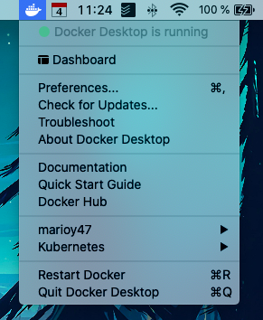
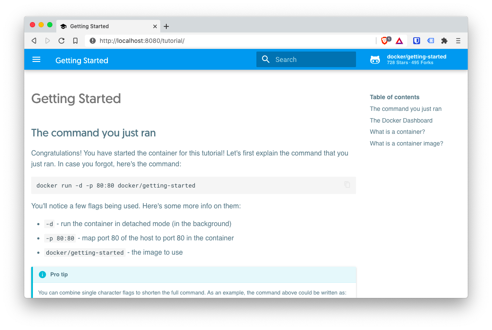
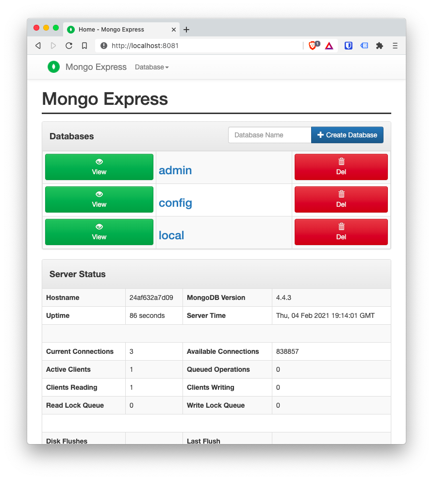

# Mongo and Mongo Express trough Docker

This is just a simple exercise on how to use Docker to locally run [MongoDB](https://www.mongodb.com/) and [Mongo Express](https://github.com/mongo-express/mongo-express).

The main problem that we're going to solve, is how to run both images and have them **communicate to each other** since by default Docker doesn't allow that.

Additionally we're going to do this procedure using the `docker` command, and then using `docker-compose`.

## TOC

```toc

```

## Prerequisites

The only prerequisite to follow allong is to have [Docker installed](https://docs.docker.com/engine/install/).

If you are running a Mac with [Homebrew](https://brew.sh) you can install it with:

```bash
brew install docker --cask
```

You should now have a docker menu in the Mac task bar:



To be sure that the installation as successful , run the _getting-started_ image:

```bash
docker run -p 80:8080 --name getting-started docker/getting-started
 # Stop with ^C
```

And visit the url [http://localhost:8080](http://localhost:8080) to get to the getting started application.



## Docker Cheat Sheet

I'm not going to explain how Docker works. For that there are a lot of in depth [tutorials](https://www.youtube.com/watch?v=3c-iBn73dDE). But I'm going to leave here a list of useful commands, some of them that we're going to use. So you don't have to go hunting into the documentation.

| Command                               | Description                                                                                                                          |
| ------------------------------------- | ------------------------------------------------------------------------------------------------------------------------------------ |
| `docker pull <image>`                 | Downloads an image without starting it                                                                                               |
| `docker images`                       | List of downloaded images                                                                                                            |
| `docker image rm <id>`                | Remove the image with id `<id>`. It's better to use the id instead of the name in case you have multiple version of the same service |
| `docker run <image>`                  | Starts the image. This is creating a container                                                                                       |
| `docker run -d <image>`               | Starts the image in _detached_ mode                                                                                                  |
| `docker run -p 1234:9876 <image>`     | Runs an image binding the _local_ port `1234` to the _container_ port `9876`                                                         |
| `docker run --name <image>`           | Run the image with a custom image                                                                                                    |
| `docker ps`                           | List of running images                                                                                                               |
| `docker ps -a`                        | List of running and stopped images                                                                                                   |
| `docker stop <id>`                    | Stops the container with the id `<id>`                                                                                               |
| `docker start <id>`                   | Re-starts an already created container (crated with `docker run`)                                                                    |
| `docker log <id>`                     | Output of the image with id `<id>`                                                                                                   |
| `docker exec -it <id> <command>`      | Run the command `<command>` (pe. /bin/bash) in the running container _interactively_                                                 |
| `docker network ls`                   | List the available networks                                                                                                          |
| `docker network create <name>`        | Create a new network                                                                                                                 |
| `docker run --network <name> <image>` | Runs the image `<image>` on the network `<network>`                                                                                  |

## Download images

We do this to save up time since some images are very big:

### Mongo DB

Use the [official image](https://hub.docker.com/_/mongo)

```bash
docker pull mongo
docker images
```

### Mongo Express

Also use the [official image](https://hub.docker.com/_/mongo-express)

```bash
docker pull mongo-express
docker images
```

## Intro to docker networks

While the images download lest explain a little how Docker networks work.

The most important thing to keep in mind, is that each container has its own network, and that you can't access one network from another. That's why, by default, 2 containers can't communicate.

But we can create our own network!

As long as we deploy multiple containers **in the same network** they not only can communicate, but they can refer to each other just by the container name and not by IP.

Still, if you want to access a container from outside the network, say from your physical laptop, you have to communicate by their exposed ports.

So, what we have to do is:

- Create a network
- When **creating** a container from an image, specify the newly created container

## Create the network

Docker provides by default some networks

```bash
docker network ls
```

We can use some of those networks to make our containers communicate with each other, but to make our environment more portable, is better to create a new one:

```bash
docker network create mongo-express-network
```

Being `mongo-express-network` the name we need to use. This means that when we startup our containers, we have to provide the `mongo-express-network` in the command line

## Persisting the data

To persist data we need to create a [Docker Volume](https://docs.docker.com/storage/volumes/) by passing the `-v` flag followed by the parammeters of the shared volume.

But to understand that, we need to talk about the 3 types of volumes that Docker supports:

### Host volumes

Here you decide on the host system where to copy de data from the container.

```bash {2}
-v /local/path:/var/lib/mysql/data
```

The first path is the local path, and the second path is the container path with the information we want to persist.

### Anonymous volumes

Here you let decide Docker where in the _local host_, copy the data from the container. Under wraps, Docker will copy the data inside the `/var/lib/docker/volumes/<random>/_data` without us needing to specify it.

```bash {2}
-v /var/lib/mysql/data
```

> Notice you don't provide a _host source path_

### Named volumes

**This is the one you'll probably use**.

It's kind of a combination of the previous 2, where you provide a name for the host's path but Docker finally decides where in the local file system the information will be stored. **You still need to provide the container's absolute path**.

```bash {2}
-v mysql-data:/var/lib/mysql/data
```

The advantage of this method is that you can reference this volume from another **connected** container.

## Running the containers on a network

Now that we have a network created, we can boot our containers connecting them by the just created network.

But before we do that, I have to point out that both images require that you pass **environment variables** using the `-e` flag when issuing the [`docker` command](https://docs.docker.com/engine/reference/commandline/cli/)

### MongoDB

According to the [documentation](https://hub.docker.com/_/mongo), you need to provide `MONGO_INITDB_ROOT_USERNAME`, `MONGO_INITDB_ROOT_PASSWORD`.

So let's start the Mongo image using the name `mongodb` with:

```bash {5-7}
docker run -d \
-p 27017:27017 \
-e MONGO_INITDB_ROOT_USERNAME=rootuser \
-e MONGO_INITDB_ROOT_PASSWORD=rootpass \
--name mongodb \
-v mongodb-data:/data/db \
--net mongo-express-network \
mongo
```

To verify that it's running issue:

```bash
docker logs mongodb
```

### Mongo Express

This has a lot of variables, but only `ME_CONFIG_MONGODB_ADMINUSERNAME` and `ME_CONFIG_MONGODB_ADMINPASSWORD` are required. 

Also, the `ME_CONFIG_MONGODB_SERVER` is important, since that instructs _Mongo Express_ to connect with which service. In our case it should be `mongodb` since that's the name we used in the previous step.

```bash {6-7}
docker run -d \
-p 8081:8081 \
-e ME_CONFIG_MONGODB_ADMINUSERNAME=rootuser \
-e ME_CONFIG_MONGODB_ADMINPASSWORD=rootpass \
-e ME_CONFIG_MONGODB_SERVER=mongodb \
--name mongo-express \
--net mongo-express-network \
mongo-express
```

And if you go to [http://localhost:8081](http://localhost:8081) you should see something like this:



## Removing the containers and the networks

Before you continue. You have to delete all the containers and networks with:

```bash
docker rm mongodb mongo-express
docker network rm mongo-express-network
```


## Doing it with Docker Compose

What we just did works great, but wouldn't it be nice if we could do that with just one command and without all those parammeters? 

Well, it turns out that you can, by using the `docker-compose` command. Which is part of the Docker installation.

You just need to create a `yaml` file with the following sections:

```yaml
version: "3"

services:
  # ...
network:
  # ...
volumes:
  # ...
```

Only `version` and `services` are required. But we're going to use the 4 sections to have a complete network with the 2 services.

So, re-creating the 3 commands we executed a while ago with `docker-compose` file would be: 

```yaml
# mongo-express.yml
version: "3"

services:

  mongodb:
    image: mongo
    container_name: mongodb
    ports:
      - 27017:27017
    environment:
      - MONGO_INITDB_ROOT_USERNAME=rootuser
      - MONGO_INITDB_ROOT_PASSWORD=rootpass
    volumes:
      - mongodb-data

  mongo-express:
    image: mongo-express
    container_name: mongo-express
    ports:
      - 8081:8081
    environment:
      - ME_CONFIG_MONGODB_ADMINUSERNAME=rootuser
      - ME_CONFIG_MONGODB_ADMINPASSWORD=rootpass
      - ME_CONFIG_MONGODB_SERVER=mongodb

networks:
  default:
    name: mongo-express-network

volumes:
  mongodb-data:
    driver: local
```

One important thing to notice is that you pass **environment values by separating the name from the value by `=`** instead of `:`.

Now, let's test this, issuing the command:

```bash
docker-compose -f mongo-express.yml up -d
```

> `-d` tu run it in detached mode

You can now visit `http://localhost:8081` and verify that _Mongo Express_ is running.

To stop all the services, you issue:

```bash
docker-compose -f mongo-express.yaml down
```

## Final thoughts

Hope you find this article helpful and is a big recommendation that you checkout a complete Docker tutorial.

