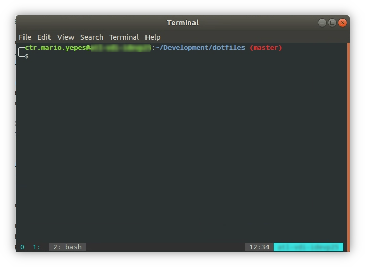
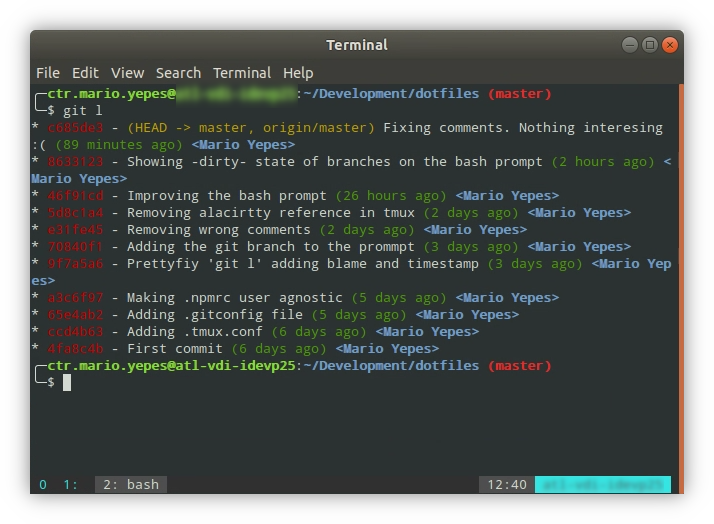
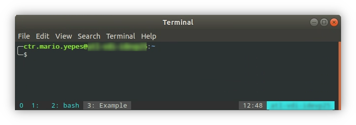

# Setup a restricted machine for node development

Recently I've been asigned an Linux machine with an _Ubuntu standard installation_ for node development. Where all the tools "that I need" are already there.

I can only access this machine using [Vmware Horizon](https://vmc-horizon.vmware.com), I can not install anything from what is already there, and **I can only access the corporate GitHub and the local npm registry**. There is no access to Google, StackOverflow, npm, etc.

In theory I can develop in this machine just fine. But since I'm old and _old dogs can't learn new tricks_ I was having a hard time to do so since none of my regular tools was available. Tools like:

- A heavily configured [NeoVim](https://neovim.io) with [CoC](https://github.com/neoclide/coc.nvim)
- Zsh with [Oh My Zsh](https://ohmyz.sh)
- [VMD](https://github.com/yoshuawuyts/vmd) to preview markdown files
- A very stiled [tmux](https://github.com/tmux/tmux/wiki) terminal multiplexer
- A very personalized [Alacritty](https://github.com/alacritty/alacritty) terminal emulator
- [LazyGit](https://github.com/jesseduffield/lazygit) to review git changes and commits

So here is how I tried to personalize that machine so I could be more comfortable while developing:

## TOC

```toc

```

## Enable global packages for NodeJS

One of the most problematic things I found with the handed setup, is that I could not install npm packages **globally**.

Most of the time this is not an issue since I try to include everything a node project needs inside the project itself. This leaves me sometimes with big `package.json` files but that's a trade off I'm willing to make for the sake of universal compatibility.

But in this case, I needed to install `eslint` and `prettier` globally to verify stand-alone `.js` scripts.

The solution to install global packages "locally" is to create a `~/.npmrc` file with the following contents:

```ini
registry = https://registry.company.com:3000
prefix = ~/.npm-global
```

This changes the behaviour of npm in 2 ways:

- It will look for packages in the local registry
- Any package installed with the `-g` (global) flag. Will be saved in `~/.npm-global` **directory**

This way, I don't need special privileges to install global packages.

There is still a missing piece for this to work and that is to change the `.bashrc` file so bash to change the _path_. That's what comes next.

## Configure Bash

What I missed the most from _oh-my-zsh_ was the fact that it showed the git branch and git status of the current repository if the current directory was a Git project.

To solve this issue I created the following `.bashrc-personal` file. Which, aside from including the "new" global npm PATH, it also changed the _prompt_ to include the current git branch and status.

```bash {13,18,19}
# Increase the history size
HISTSIZE=10000
HISTFILESIZE=20000

# Change the default editor from nano to vi
EDITOR=vi
alias vim="vi"

# I only use one tmux session at the time
alias tm="tmux attach || tmux new"

# Since I can't install packages globally... (needs the .npmrc file)
export PATH=$PATH:~/.npm-global/bin

# Showing the git branch and status on the bash prompt
export GIT_PS1_SHOWDIRTYSTATE=1
PS1='╭─${debian_chroot:+($debian_chroot)}\[\033[01;32m\]\u@\h\[\033[00m\]:\[\033[01;34m\]\w\[\033[01;31m\] $(__git_ps1 "(%s)")\[\033[00m\]\n╰─\$ '
```

To make this file work, I have to change the `~/.bashrc` file, adding the following at the end:

```bash
# ...
source ~/.bashrc-personal
```

And now I have git information in the prompt.



## Git aliases

I love using the terminal. And there is no better git terminal tool than [`lazygit`](https://github.com/jesseduffield/lazygit).

There is no way I can replicate the functionality of `lazygit` using _dotfiles_. But I can make the `git` command more useful and colorful by creating a couple of aliases:

```ini
[user]
	name = Mario Yepes
	email = mario.yepes@example.com

[userna]
	name = Mario Yepes

[alias]
	l = log --graph --pretty=format:'%Cred%h%Creset -%C(yellow)%d%Creset %s %Cgreen(%cr) %C(bold blue)<%an>%Creset' --abbrev-commit
	s = status
	co = checkout
	tags = tag -l
	branches = branch -a
	remotes = remote -v

[color]
	branch = auto
	diff = auto
	pager = true
	status = auto
	ui = true

[color "branch"]
	current = yellow reverse
	local = yellow
	remote = green
```

The coolest change is with the _log_ command. Which now it is `git l`: 



Much more compact and friendly than the original one.

## Vi configuration

Yes, `vi` not _vim_... It's a _standard Ubuntu installation_. And that excludes vim or NeoVim:

So, to make vi _bearable_ this is the configuration I used in `~/.vimrc`:

```vim
" Mario's vimrc

set nocompatible
set number                " Show numbers on the left
set relativenumber        " Its better if you use motions like comfortable or 5yk
set hlsearch              " Highlight search results
set ignorecase            " Search ignoring case
set smartcase             " Do not ignore case if the search patter has uppercase
set noerrorbells          " I hate bells when an error occurs
set belloff=esc           " Disable bell if type <esc> multiple times
set tabstop=4             " Tab size of 4 spaces
set softtabstop=4         " On insert use 4 spaces for tab
set shiftwidth=0

set nowrap                " Wrapping sucks (except on markdown)
set noswapfile            " Do not leave any backup files
set showmatch             " Highlights the matching parenthesis
set termguicolors         " Required for some themes
set splitright splitbelow " Changes the behaviour of vertical and horizontal splits


set foldlevel=1           " Better for markdown and PHP classes
set cursorline            " Highlight the current cursor line (Can slow the UI)
set hidden								" Enable more that 1 unsaved buffer


" Keep Visual Mode after indenting a block with > or <
vmap < <gv
vmap > >gv

" Move Visual blocks up or down with J an K
vnoremap J :m '>+1<CR>gv=gv
vnoremap K :m '<-2<CR>gv=gv

" search will center on the line it's found in.
nnoremap n nzzzv
nnoremap N Nzzzv
```

## Tmux

On the handed setup, Gnome terminal was available and it has support to multiple tabs which makes it A-OK with me. But still I preffer tmux multiplexing.

So I did 2 things to work with `tmux`:

- I added the `tm` alias in `.bashrc-personal` to start/resume `tmux` sessions
- I changed the style and behaviour of tabs:

```bash
# Increase the scroll history
set-option -g history-limit 9999

# It's easier to change windows if we start from 1 instead of 0
set -g base-index 1

# Start pane number from 1 similar to windows
set -g pane-base-index 1

# Allow mouse scrolling
set -g mouse on

# Attach or create a new session https://unix.stackexchange.com/questions/103898/how-to-start-tmux-with-attach-if-a-session-exists
new-session -n $HOST

# True colors on Vim+Tmux https://github.com/tmux/tmux/issues/1246
set -g default-terminal "tmux-256color"
set -ga terminal-overrides ",*256col*:Tc"

# Fix home-key issue on 256 terminal
bind -n End send-key C-e
bind -n Home send-key C-a

# Remove the ESC delay. It's a nightmire with Vim.
set -sg escape-time 1

# re-number and re-name windows dynamically
setw -g automatic-rename on
set -g renumber-windows on

#
# Theme based in https://gist.github.com/meskarune/ef3ed0f15ca5d423627ef9b9a54227ab
#
set -g status-justify left
set -g status-bg "colour236"
set -g status-fg "colour14"
setw -g clock-mode-colour "colour14"
setw -g status-left " #S "
set -g status-right-length "100"
# 24 hour time: `%H:%M`
# 12 hour time: `%-I:%M %p`
set -g status-right "#[bg=colour239,fg=white] %H:%M #[bg=colour14,fg=black] #h "
setw -g window-status-format " #I: #W "
setw -g window-status-separator ""
setw -g window-status-current-format "#[bg=colour239,fg=white] #I: #W "
```

And this is how it looks like now:



## Final toughs

With this article I hope that if you are in a similar situation, where you are not the owner of the work machine, you can make your file more bearable with the examples I gave.
