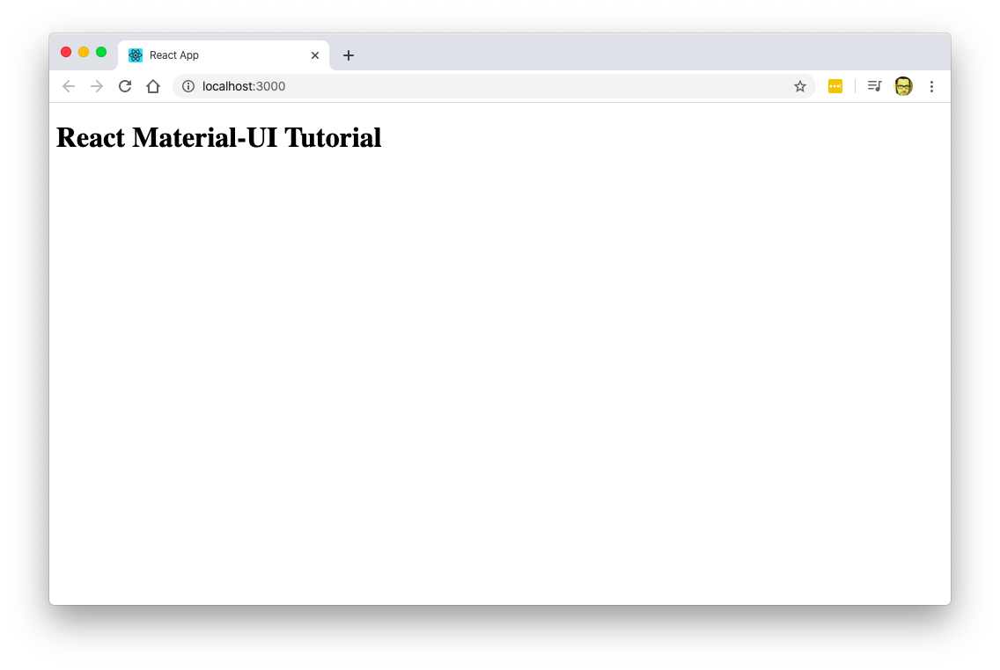
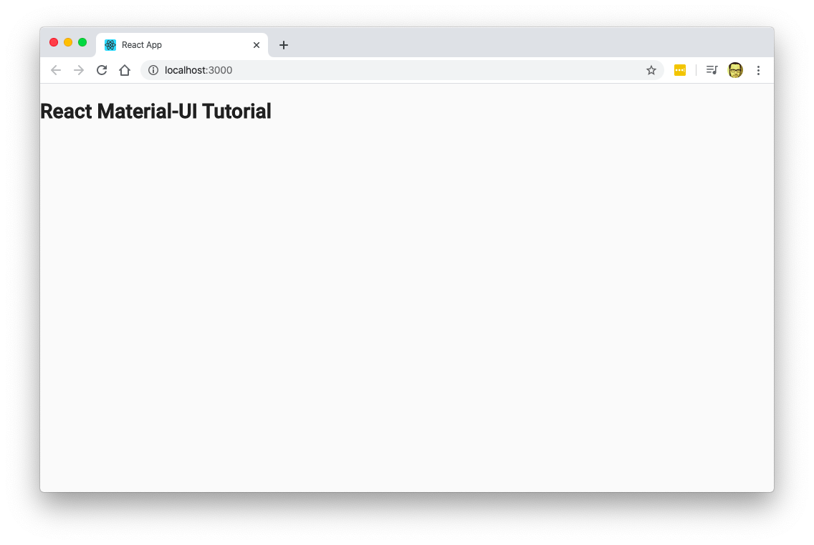

# Getting Started with React Material-UI

So I wanted to learn [Material UI](https://material-ui.com/) since it seems to be the best way to use Material Design in a React Applications.

But the problem is that the official docs assume that you already are familiar with other UI frameworks for react and just point you to example projects instead of covering the basics on how to start a project using the toolkit.


So I decided to create my own documentation just for that and here it is.

In this blog entry I'm going to create a very simple React App that does nothing, but that it looks good thanks to Material-UI.

## What is Material-UI ?

If you are here is very probable that you already know Material-UI is... But just in case, Material-UI its just a number of React components styled using the [material design principles](https://material.io), that are ready to use in any React App.

If you want to start a React Project and don't want to get caught up in the details of styling you app, then Material-UI is just what you need.

## Create a react project and install Material-UI

Lets start our App by doing the following:

- Create the project with `create-react-app`
- Install Material-UI to the project
- Add the Roboto Google font
- Cleanup files
- Add the responsive meta-tag

**Note I'm using `yarn` instead of `npm` for installing packages and executing commands since its  faster. You can use `npm` without any problems.**

### Create the react app and install Material-UI

You must know this by now. If not, then you should be following [this tutorial instead](https://reactjs.org/tutorial/tutorial.html)

```bash
mkdir react-material-ui-tutorial
cd react-material-ui-tutorial
yarn create react-app . # npx create-react-app .
yarn add @material-ui/core
```

### Add the Roboto Font and add the responsive meta-tag

This 2 lines should go into `public/index.html` before the closing of the `<head>` tag.

The first one makes our layout to be responsive. The second one loads the _Roboto_ font form [Google Fonts](https://fonts.google.com)

```html
    <meta name="viewport" content="minimum-scale=1, initial-scale=1, width=device-width" />
    <link href="https://fonts.googleapis.com/css?family=Roboto:300,400,500&display=swap" rel="stylesheet" />
```


> We could bundle the font using the package `typeface-roboto` but we would increase the size of our bundle considerable. If you want to know more follow [this link](https://v3.material-ui.com/style/typography/#migration-to-typography-v2)


### Project cleanup

Now lets remove unneeded files the `src/` folder, leaving only `index.js` and `App.js` in that dir.

```bash
rm src/{App.css,App.test.js,index.css,logo.svg,serviceWorker.js,setupTests.js}
```

> Were using some Bash magic there. Curly brackets allow you to append a list of files.

The `src/` directory should look like this:

```bash
$ tree src
src
├── App.js
└── index.js

0 directories, 2 files
```

### Refactor `App.js` and `index.js`

Then refactor `src/index.js` so it doesn't try to import the removed files. At the end it should look like this:

```js
// src/index.js
import React from 'react';
import ReactDOM from 'react-dom';
import App from './App';

ReactDOM.render(<App />, document.getElementById('root'));

```

And finally. We should refactor `App.js` so it does not issue any errors:

```js
// src/App.js
import React from 'react';

function App() {
  return (
    <div className="App">
      <h1>React Material-UI Tutorial</h1>
    </div>
  );
}

export default App;
```

Now, lets start the development by issuing this in the terminal:

```bash
yarn start
```



Great now we can start adding Material-UI components

## Normalize or CssBaseline

If you've worked with a framework like Bootstrap, Bulma, Tailwind, etc. You've noticed that one of the first things they recommend is to use a CSS library like `normalize.css` or `reboot.css` to unify or reset the display of native controls.

Material-UI has its own Control just for that and it called [CssBaseline](https://material-ui.com/components/css-baseline/).

Adding baseline couldn't be easier. Just import the component and add it in  `src/index.js`

```js {4,8-11}
// src/index.js
import React from 'react';
import ReactDOM from 'react-dom';
import CssBaseline from '@material-ui/core/CssBaseline';
import App from './App';

ReactDOM.render(
  <>
    <CssBaseline />
    <App />
  </>,
  document.getElementById('root'));
```

### What did we do?

- We imported `CssBaseline`
- We added it before the `<App />` component so it covers all of our application
- We wrapped everything in a fragment so React doesn't complain

That would render the following:



Notice how the font is a `sans-serif` family font, and the background is now a light gray. Also, this is how its going to look the same in all browsers. So we have a common _Baseline_.

## Adding our first elements

Adding Material-UI components is usually a 2 step process:

- Import the component you need
- Include it in your JSX

Of course you can (and sometimes must) use properties to configure the component to your needs.

So lets change our `src/App.js` file to include some content and to **add our first components**. We'll be adding a couple of buttons:

```js {2,9-16}
// src/App.js
import React from 'react';
import { Button } from '@material-ui/core'

function App() {
  return (
    <div className="App">
      <h1>React Material-UI Tutorial</h1>
      <h2>This Could be a subtitle</h2>
      <p>And this is a paragraph</p>
      <Button variant="contained" color="primary">
        A Primary button
      </Button>
      <Button variant="contained" color="secondary">
        A Secondary button
      </Button>
    </div>
  );
}

export default App;
```

Which would render this:


As you can see, we now have a page with 2 buttons: One primary (the blue one) and one secondary.

## Typography

One important aspect of the _Material Design Language_ is the font management.

If you go over the [Material Design Documentation](https://material.io), you can see that there are a ton of options and rules for font usage and management.

That's why Material-UI has the very powerful component `<Typography />`  which as a ton of options as you [can see in the documentation](https://material-ui.com/api/typography/).  The cool thing is that is only one component.

So lets change hour headings and paragraphs to use the `<Typography />` component:

```js {2,7-9}
import React from 'react';
import { Button, Typography } from '@material-ui/core';

function App() {
  return (
    <div className="App">
      <Typography variant="h1" align="center">React Material-UI Tutorial</Typography>
      <Typography variant="h2">This Could be a subtitle</Typography>
      <Typography color="textSecondary">And this is a paragraph</Typography>
      <Button variant="contained" color="primary">
        A Primary button
      </Button>
      <Button variant="contained" color="secondary">
        A Secondary button
      </Button>
    </div>
  );
}

export default App;
```

That will yield


Now we're starting to make some progress.

## Create layouts using Grid

Right now our content seems kind of _Thrown out There_. that's because we're not using any kind of layout or placement.

Lets fix that by using a [Material-UI Grid system](https://material-ui.com/components/grid/) so our content is in the middle and centered. Lets edit `src/App.js` with the following:

```js {2,7-8,12-13,17-18,22-25}
import React from 'react';
import { Button, Typography, Grid, Container } from '@material-ui/core';

function App() {
  return (
    <div className="App">
      <Container maxWidth="md">
        <Grid item md={12}>
          <Typography variant="h1" align="center">React Material-UI Tutorial</Typography>
          <Typography variant="h2">This Could be a subtitle</Typography>
          <Typography color="textSecondary">And this is a paragraph</Typography>
          <Grid container>
            <Grid item md={6}>
              <Button variant="contained" color="primary">
                A Primary button
              </Button>
            </Grid>
            <Grid item md={6}>
              <Button variant="contained" color="secondary">
                A Secondary button
              </Button>
            </Grid>
          </Grid>
        </Grid>
      </Container>
    </div>
  );
}

export default App;
```


If you look closely, you can see that we added a `<Container />` tag and multiple `<Grid />` tags.

If you've worked with [Bootstrap](https://getbootstrap.com) you'll see that `<Container />` works very similar to the `.container` Bootstrap class: It incloses the content in a container with a fixed with. In my case I used a container of 960px wide, hence the `maxWidth="md"` parameter.

Keeping the analogy to Bootstrap, you can see that the `<Grid />` component works both as the `.row` and the `.col` Boostrap classes.

When used with the parameter `container` the `Grid` component **creates a row** that contains one or more columns. If you want to be more technical, the `<Grid container />` creates an element with `display: flex`.

When used with the `item` parameter, it works like the `.col-xx-##` Boostrap class: It create a column inside the row. And again, being technical, it means create an element with `flex-grow` and `flex-basis`.

One last peace of important information. Like most of the CSS frameworks it works by the 12 column paradigm. Dividing the with of the canvas in 12 columns. And it is very important that on the `<Grid item />` you also specify either `xs`, `sm`, `md`, `lg` or `xl`. Otherwise Material-UI wont know how big or small is the column and it wont stretch to fill the required space.

If you want to know more about the _Grid_ parameters, you can browse the [API documentation](https://material-ui.com/api/grid/).


## Paper

The idea behind Material Design is to emulate how humans perceive materials with the use of shadows and layers.

So we have `Paper` which is a way to emulate a sheet of paper with elements over it.

We're going to use `Paper` to enclose our app and making it more organized.

```js {3,10,18}
// App.js
import React, { useState } from 'react';
import { Typography, TextField, Paper } from '@material-ui/core'

function App() {
  const [excercises, setExcercises] = useState([]);
  const [title, setTitle] = useState('')

  return (
    <Paper clssName='App'>
      <Typography component='h2' variant='h1' align='center' gutterBottom>
        Excercises
      </Typography>
      <form>
        <TextField name='title' label='excercise' margin='normal' value={title}
          onChange={e => setTitle(e.target.value)} />
      </form>
    </Paper>
  );
}

export default App;


```

Notice that we are including all the _Material-UI_ elements ant that now everthihng is inclosed in `<Paper>` instead of a `<div>`


## Alter the CSS

## Create a Theme

We're going to start by creating a theme.

But do not get intimidated. We're just going to change the primary and secondary button colors. This will give us an idea on how themes works in React.

The first step is to create a `theme.js` file and call [createMuiTheme](https://material-ui.com/customization/theming/#createmuitheme-options-args-theme) with our new theme parammeters.

```js
// src/theme.js
import { createMuiTheme } from '@material-ui/core/styles';

const theme = createMuiTheme({
  palette: {
    primary: {
      main: '#00695c'
    },
    secondary: {
      main: '#c0ca33'
    },
    background: {
      default: '#fff'
    }
  }
});

export default theme;
```

And change `index.js` so the app supports themes:

```js {5,7,10,13}
// src/index.js
import React from 'react';
import ReactDOM from 'react-dom';
import CssBaseline from '@material-ui/core/CssBaseline';
import { ThemeProvider } from '@material-ui/core/styles'
import App from './App';
import theme from './theme'

ReactDOM.render(
  <ThemeProvider theme={theme}>
    <CssBaseline />
    <App />
  </ThemeProvider>,
  document.getElementById('root'));
```

And we would have the following:


## Other Tutorials

Additional Material-UI documentation is kind of scarce and there aren't many good tutorials that cover the basic. So here are a couple that you might want to check out:

- [A beginners guide to Material UI React tutorial \| Reactgo](https://reactgo.com/material-ui-react-tutorial/)
-
