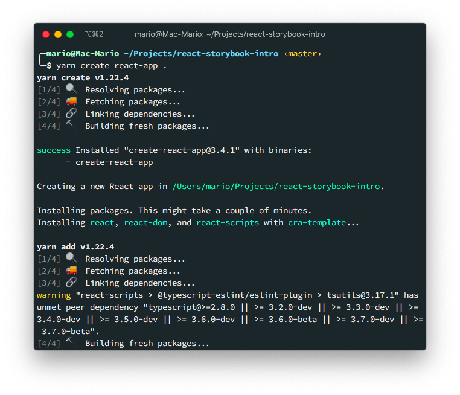
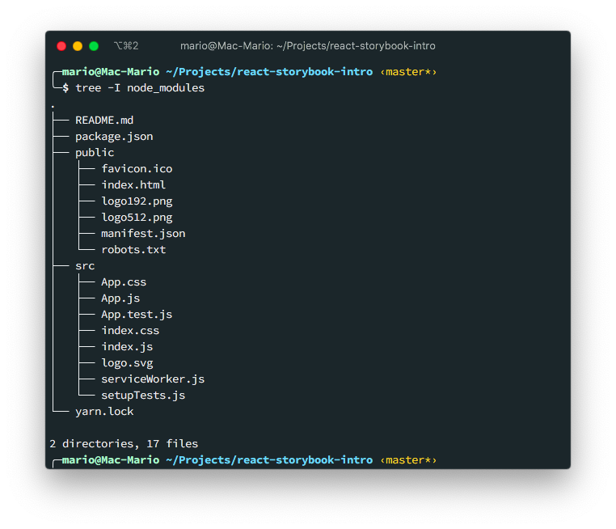
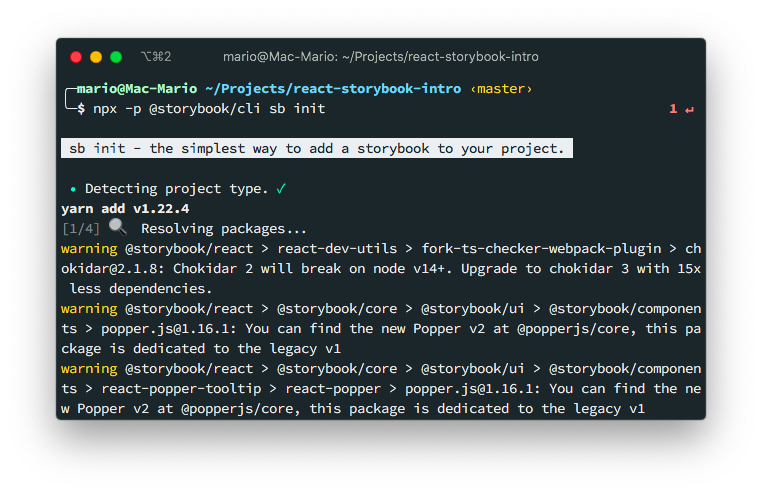
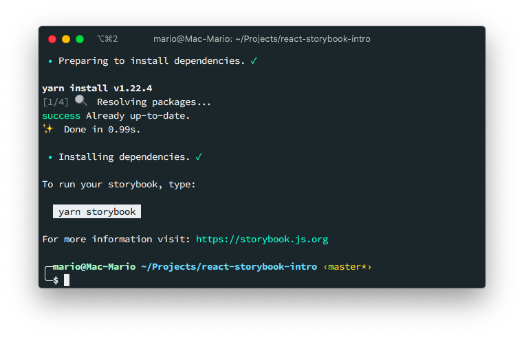
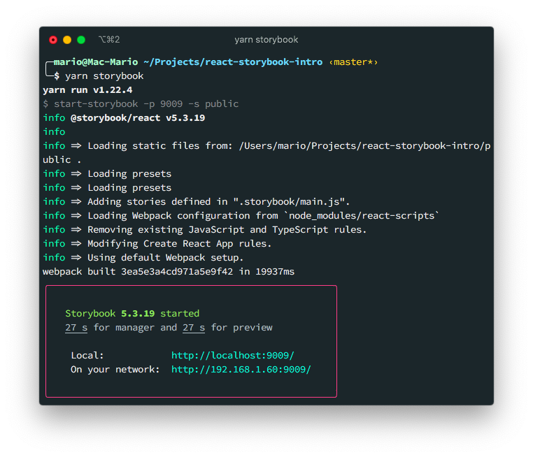
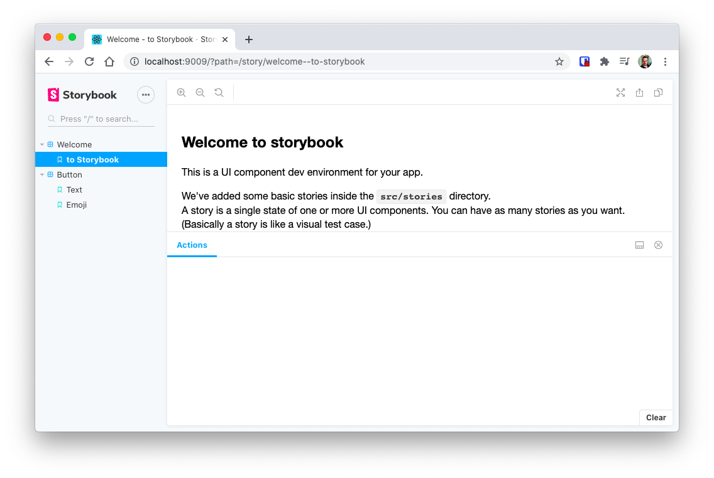
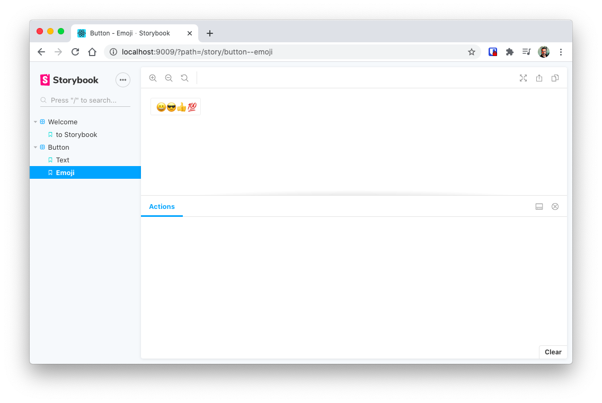

# React Storybook Intro and Setup

Development environment and playground for creating UI component

Allows you to create component in your project but in an isolated environment

Runs outside your application, but can belong to a react project

Helps team development since you can showcase the components and have them displayed outside the business logic

Allows you to change components `props` directly in the browser and see the changes interactively

You can get accessibility feedback on your components (color and contrast)


## Create a Project

```bash
mkdir react-storybook-intro
cd $_
yarn create react-app .
```






## Install storybook

```bash
npx -p @storybook/cli sb init
```




## Changes in `package.json`
```diff
diff --git a/package.json b/package.json
index 24bc6dd..8e43467 100644
--- a/package.json
+++ b/package.json
@@ -14,7 +14,9 @@
     "start": "react-scripts start",
     "build": "react-scripts build",
     "test": "react-scripts test",
-    "eject": "react-scripts eject"
+    "eject": "react-scripts eject",
+    "storybook": "start-storybook -p 9009 -s public",
+    "build-storybook": "build-storybook -s public"
   },
   "eslintConfig": {
     "extends": "react-app"
@@ -30,5 +32,12 @@
       "last 1 firefox version",
       "last 1 safari version"
     ]
+  },
+  "devDependencies": {
+    "@storybook/addon-actions": "^5.3.19",
+    "@storybook/addon-links": "^5.3.19",
+    "@storybook/addons": "^5.3.19",
+    "@storybook/preset-create-react-app": "^3.1.4",
+    "@storybook/react": "^5.3.19"
   }
 }
 ```

## The `storybook/` directory
 ```bash
 $ tree .storybook
 .storybook
└── main.js
```


```javascript 
// .storybook/main.js

module.exports = {
  stories: ['../src/**/*.stories.js'],
  addons: [
    '@storybook/preset-create-react-app',
    '@storybook/addon-actions',
    '@storybook/addon-links',
  ],
};
```

- `stories`: All the files in `src/` that end with `.stories.js` will be treated as stories
- `addons`: 

## The `src/stories/` directory

Storybook creates 2 stories for us in the `src/stories/` directory:

```bash
 $ tree src/stories
src/stories
├── 0-Welcome.stories.js
└── 1-Button.stories.js
```

```javascript
// src/stories/1-Button.stories.js

import React from 'react';
import { action } from '@storybook/addon-actions';
import { Button } from '@storybook/react/demo';

export default {
  title: 'Button',
  component: Button,
};

export const Text = () => <Button onClick={action('clicked')}>Hello Button</Button>;

export const Emoji = () => (
  <Button onClick={action('clicked')}>
    <span role="img" aria-label="so cool">
      😀 😎 👍 💯
    </span>
  </Button>
);
```

## Start storybook

A storybook is a collection of stories

We should create stories for each of the ui components in the app

```bash
yarn storybook
```







## Create our first story

We need to have 3 files

- The component file itself
- The stiles for the component
- The story for the component

```bash
mkdir -p src/components/custom-button
touch src/components/custom-button/custom-button.{js,css,stories.js}
```

```bash
$ tree src/components
src/components
└── custom-button
    ├── custom-button.css
    ├── custom-button.js
    └── custom-button.stories.js

1 directory, 3 files
```

The component:
