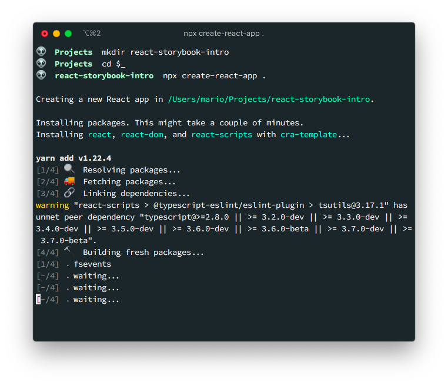
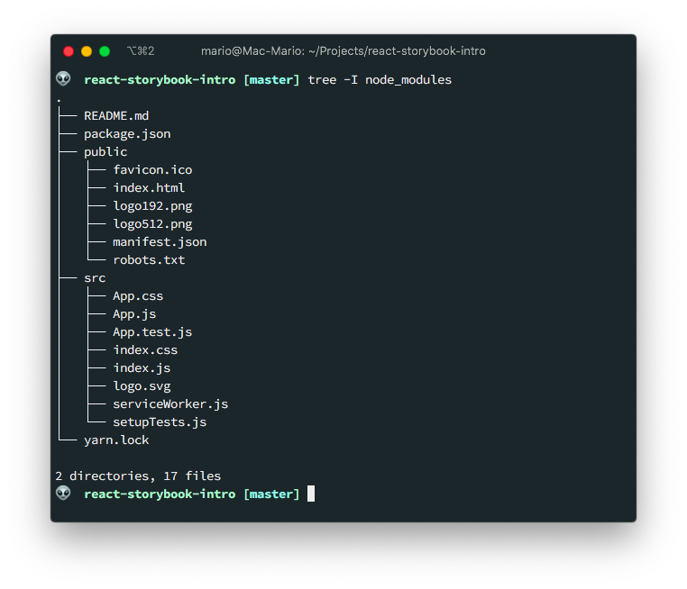
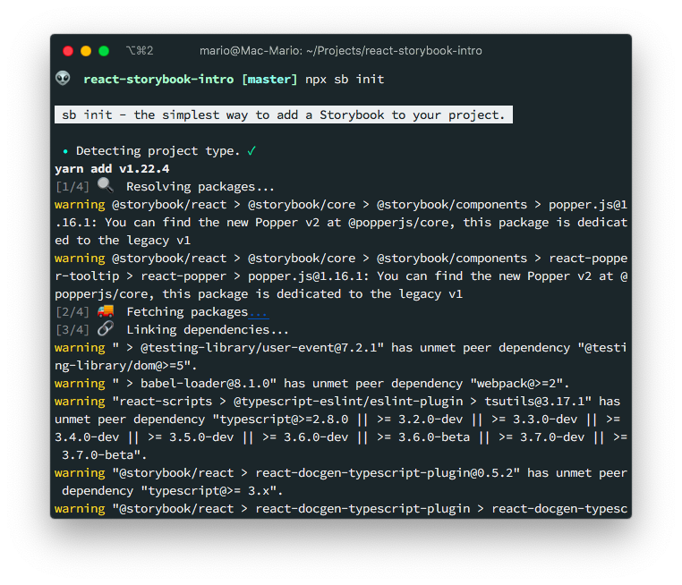
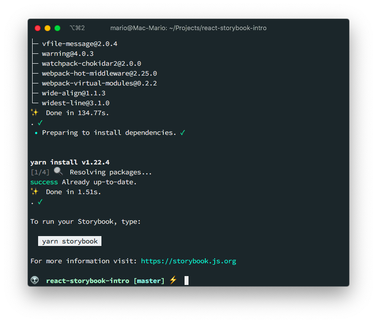

# React Storybook Intro and Setup

Recently I needed to create a [React](https://reactjs.org) project for a client that required multiple complex components including an Week Calendar widget, and Image Selection widget, and a small Survey widget. This turned out to be the perfect excuse to apply [Component Driven Development](https://blog.hichroma.com/component-driven-development-ce1109d56c8e):

> Component-Driven Development (CDD) is a development methodology that anchors the build process around components. It is a process that builds UIs from the “bottom up” by starting at the level of components and ending at the level of pages or screens. — @tmeasday https://blog.hichroma.com/component-driven-development-ce1109d56c8e

That's where [Storybook](https://storybook.js.org/) enters.

Storybook is a development environment and playground for creating UI components in an isolated environment **inside** your React (or Angular or Vue o Svelte) project but **outside** your application.

This means that you can develop your components, style them and see the graphical outcome before you integrate them into your application.

...I can't think on something more useful.

<video autoplay="" muted="" playsinline="" loop="" style="min-width: 50%; max-width: 350px; display: block; margin: 0 auto"><source src="https://media.giphy.com/media/108lJruWBp7EBO/giphy.mp4" type="video/mp4"></video>

Take a look at the video from the [official documentation](https://storybook.js.org/docs/react/get-started/introduction) on how Storybook allows you to review components in an isolated environment:

<video autoplay="" muted="" playsinline="" loop="" style="max-width: 100%"><source src="https://storybook.js.org/7e71705d211e17a2967606c49059e891/storybook-hero-video-optimized.mp4" type="video/mp4"></video>

Other advantages of storybook are:

- Helps team development since you can showcase the components and have them displayed outside the business logic
- Allows you to change components `props` (or [args](https://storybook.js.org/docs/react/writing-stories/args)) directly in the browser, and see the changes interactively.
- You can get accessibility feedback on your components (color and contrast)

Storybook is _Framework Agnostic_. This means that you can use it on your [React](https://storybook.js.org/docs/react), [Anglular](https://storybook.js.org/docs/angular), [Vue](https://storybook.js.org/docs/vue/get-started), [Svelte](https://storybook.js.org/docs/svelte), etc. You can even use it into your vanilla [HTML/JavaScript projects](https://storybook.js.org/docs/html/get-started/introduction).

In this article I'm going to give you a brief introduction to [Storybook](https://storybook.js.org) and apply it into a **React** project.

## TOC

- [Project Setup](#project-setup)
- [Install Storybook](#install-storybook)
- [Start Storybook](#start-storybook)
- [Storybook stories](#storybook-stories)
- [Create our first story](#create-our-first-story)
- [Using templates and `args`](#using-templates-and-args)
- [Using controls](#using-controls)
- [Global parameters](#global-parammeters)
- [Adding external style sheets](#adding-external-style-sheets)
- [Upgrading Storybook](#upgrading-storybook)
- [Decorators](#decorators)
- [Final toughs](#final-toughs)

## Project setup

To setup Storybook, we first need a React project. So create one using `create-react-app`:

```bash
mkdir react-storybook-intro
cd $_
yarn create react-app .
```

> If you have an existing React project you don't need to execute this step:



This will generate the typical React project **files**:



And just like that we're ready to add Storybook to our project.

## Install storybook

As I said before, storybook requires an existing project. If you already have one (or created one following the preview step) then you can execute the following command to add it:

```bash
npx sb init
```

> You have to execute it while in your project directory




This command takes a while to complete and does a myriad of things:

- Detects the framework or type of project you are working with
- Install the storybook `npm` package in `package.json` and some requirements like [Babel](https://babeljs.io)
- Install some basic [Storybook Add-ons](https://storybook.js.org/addons) in `package.json`. These are `npm` packages obviously
- Adds 2 new scripts in `package.json` to run (`yarn storybook`) and build (`yarn build-storybook`) storybook stories
- Creates the `.storybook` directory with the `storybook` configuration
- Creates the `src/stories/` folder with example stories

We'll be touching on some of those items latter.

## Start Storybook

As I said in the previous section, there are 2 new **scripts** in you `package.json` to run storybook.

- `yarn storybook`
- `yarn buld-storybook`

We can execute the first one with `npm run storybook`. Or, if you are using `yarn` like I am, with:

```bash
yarn storybook
```


This will start a **new development server** (not the same one as the react's one), that you can access on port `6006`, showing the **demo** stories that `npm sb init` created:


Notice how Storybook created 3 **example** stories for us, and an _Introduction_ with some shortcuts.

And you can browse those test stories by clicking on the names of each one on the left sidebar. For instance this is how the **example** story `src/stories/Header.stories.js` looks in Storybook:


Before we go into creating our own components and stories, lets first review what a story is

## Storybook stories

If you review the `src/stories/` folder, you can see that there are a bunch of `.js`, `.stories.js` and `.css` files:

```bash
$ tree src/stories
src/stories
├── Button.js
├── Button.stories.js
├── Header.js
├── Header.stories.js
├── Introduction.stories.mdx
├── Page.js
├── Page.stories.js
├── assets
│   ├── code-brackets.svg
│   ├── colors.svg
│   ├── comments.svg
│   ├── direction.svg
│   ├── flow.svg
│   ├── plugin.svg
│   ├── repo.svg
│   └── stackalt.svg
├── button.css
├── header.css
└── page.css

1 directory, 18 files
```

This files where created by the `npx sb init` command and the contain a bunch of components and stories.

For instance, there is a component called **Button** created in `src/stories/Button.js` with the corresponding story in `src/stories/Button.stories.js`

This is the component:

```javascript
// src/stories/Button.js

import React from "react"
import PropTypes from "prop-types"
import "./button.css"

/**
 * Primary UI component for user interaction
 */
export const Button = ({ primary, backgroundColor, size, label, ...props }) => {
  const mode = primary
    ? "storybook-button--primary"
    : "storybook-button--secondary"
  return (
    <button
      type="button"
      className={["storybook-button", `storybook-button--${size}`, mode].join(
        " "
      )}
      style={backgroundColor && { backgroundColor }}
      {...props}
    >
      {label}
    </button>
  )
}

Button.propTypes = {
  /**
   * Is this the principal call to action on the page?
   */
  primary: PropTypes.bool,
  /**
   * What background color to use
   */
  backgroundColor: PropTypes.string,
  /**
   * How large should the button be?
   */
  size: PropTypes.oneOf(["small", "medium", "large"]),
  /**
   * Button contents
   */
  label: PropTypes.string.isRequired,
  /**
   * Optional click handler
   */
  onClick: PropTypes.func,
}

Button.defaultProps = {
  backgroundColor: null,
  primary: false,
  size: "medium",
  onClick: undefined,
}
```

In this particular component, there is also a `.css` file that corresponds to the styles apply to it. This means that story book is capable of displaying the component **with its styles**.

And this **are** the stories that test or display that component:

```javascript
// src/stories/Button.stories.js

import React from "react"

import { Button } from "./Button"

export default {
  title: "Example/Button",
  component: Button,
  argTypes: {
    backgroundColor: { control: "color" },
  },
}

const Template = args => <Button {...args} />

export const Primary = Template.bind({})
Primary.args = {
  primary: true,
  label: "Button",
}

export const Secondary = Template.bind({})
Secondary.args = {
  label: "Button",
}

export const Large = Template.bind({})
Large.args = {
  size: "large",
  label: "Button",
}

export const Small = Template.bind({})
Small.args = {
  size: "small",
  label: "Button",
}
```

Notice that there are multiple stories on that file ant each story is displaying the button in a different state or configuration.

And here is "Primary" story of the Button stories in Storybook:


So, in conclusion:

- Each `.js` file is a component
- Each `.stories.js` are the stories that test or display the component
- A component can include a `.css` file and it will be displayed

> Storybook looks for `.stories.js` files because that's how its configured in `.storybook/main.js`. You can instruct Storybook to look of another sufix or prefix by configuring the `stories` setting in that file.

## Create our first story

Just for fun, lets create a component that displays an `<input>` field with minal styling.

To create a component and its corresponding story then we need to create 3 files:

- The component file itself
- The styles for the component
- The story for the component

Its recommended that each component has its own sub folder with this 3 files

```bash
mkdir -p src/components/input-field
touch src/components/input-field/input-field.{js,stories.js,css}
```

```bash
tree src/components/input-field
src/components/input-field
├── input-field.css
├── input-field.js
└── input-field.stories.js

0 directories, 3 files
```

The style file is just a simple CSS file with the custom styles of the component.

```css
/* src/compoents/input-field/input-field.css */

.input-field {
  font-size: 1.2rem;
  padding: 0.5rem 1rem;
}

.input-field.small {
  font-size: 0.9rem;
}

.input-field.big {
  font-size: 2rem;
}
```

> Take into account that if your project uses external styles like [Bootstrap](https://getbootstrap.com), [Material](https://material.io/), [Tailwind](https://tailwindcss.com), [Bulma](https://bulma.io), etc. This have to be added in the configuration file which I will touch upon latter.

The component really has noting special. Its just an input that receives the `placeholder` and `type` _props_, and output the corresponding HTML With the stiles that we created a second ago:

```javascript
// src/components/input-field/input-field.js

import React from "react"
import "./input-field.css"

const InputField = ({ placeholder, type, ...props }) => {
  const lPlacehoder = placeholder || "Text Input"
  const lType = type || ""
  return (
    <input
      type="text"
      className={`form-control input-field ${lType}`}
      placeholder={lPlacehoder}
      {...props}
    />
  )
}

export default InputField
```

Notice that there is a _class_ called `form-control` that is not included in the `.css` file. We'll be working with that class latter.

**Finally, we create the stories!**

Quoting the Storybook documentation, "The key ingredients (of a story) are the [default export](https://developer.mozilla.org/en-US/docs/Web/JavaScript/Reference/Statements/export#Using_the_default_export) that describes the component, and [named exports](https://developer.mozilla.org/en-US/docs/Web/JavaScript/Reference/Statements/export#Using_named_exports) that describe the stories."

```javascript
// src/components/input-field/input-field.stories.js

import React from "react"
import InputField from "./input-field"

// The default export
export default {
  title: "New Items/Input Field",
  component: InputField,
}

// Named exports
export const InputFieldDefault = () => <InputField />
export const InputFieldSmall = () => <InputField type="small" />
export const InputFieldBig = () => <InputField type="big" />
```

In the previous _stories_ example, the `default` object contains information on which component this story belongs to (`InputField`) and where in the menu should it be placed.

The _const's_ `InputFieldDefault`, `InputFieldSmall`, and `InputFieldBig` are the stories we'll be displaying in storybook.

Here are the results in Storybook:


Notice how Storybook converted the _camelCased_ words in actual sentences on the sidebar. For instance, it changed `InputFieldDefault` to _Input Field Default_. **Take this into account when naming your stories**.

**You now have enough information to create your stories in Storybook**. But there are still, are a couple of additional

## Using templates and args

In React we use `props` to pass arguments to a component, but Storybook calls them `args`. The reason for the name change is that in Angular and Vue they are called different.

The idea of using `args` in our stories, its that allows you to use controls and play with your components more interactively (more on that latter). It also allows you to re-use parameters on your stories and reduce the amount of work to create them.

To use `args`, you have to change how you create the stories. You first have to create a **Template** object and then you change the `.args` parammeter or that template for each story.

So, change the `.stories.js` file to use a template like this:

```javascript {11-31}
// src/components/input-field/input-field.stories.js

import React from "react"
import InputField from "./input-field"

export default {
  title: "New Items/Input Field",
  component: InputField,
}

// First create a template
const Template = args => <InputField {...args} />

// Create the story as a copy of the template object
export const InputFieldDefault = Template.bind({})
// change its args
InputFieldDefault.args = { placeholder: "Hello there" }

// Do the same for the "small" version of the input
export const InputFieldSmall = Template.bind({})
InputFieldSmall.args = {
  ...InputFieldDefault.args,
  type: "small",
}

// Do the same for the "big" version of the input
export const InputFieldBig = Template.bind({})
InputFieldBig.args = {
  ...InputFieldDefault.args,
  type: "big",
}
```

This might seem a little over complicated just by looking at how to code got bigger but the result is the same. But there are several advantages of using this approach:

- You can **reuse** parameters from story to story
- Combined with `PropTypes` allow you to change `prop` values (`args`) interactively (Next section)
- You can configure the template, an those options will get passed down to the stories

You can also pass `args` in the default export like so:

```javascript {4-6}
export default {
  title: "New Items/Input Field",
  component: InputField,
  args: {
    type: "small",
  },
}
```

Which is a nice alternative.

In the next section we'll see how using `args` allows you to change a component `prop` using controls.

## Using controls

To change the stories `args` interactively, you have 2 options:

- Use `PropTypes` in the component
- Use the `argTypes` in the default export

Let's start by using `PropTypes`

### `PropTypes` for Interactive controls

I actually prefer this option, since this way, by using comments, you also get [documentation on](https://storybook.js.org/docs/react/api/argtypes) your stories.

For instance, in the `InputField` component, we could specify that the `type` prop is one of "normal", "big" or "small" by using the `PropTypes.oneOf` option. And that the `placeholder` is of type `string`.

```javascript {4,20-28}
// src/components/input-field/input-field.js

import React from "react"
import PropTypes from "prop-types"
import "./input-field.css"

const InputField = ({ placeholder, type, ...props }) => {
  const lPlacehoder = placeholder || "Text Input"
  const lType = type || "normal"
  return (
    <input
      type="text"
      className={`form-control input-field ${lType}`}
      placeholder={lPlacehoder}
      {...props}
    />
  )
}

InputField.propTypes = {
  placeholder: PropTypes.string,
  type: PropTypes.oneOf(["", "small", "big"]),
}

InputField.defaultProps = {
  placeholder: "Input default text",
  type: null,
}

export default InputField
```

Then, we can simplify our stories to be just one.

```javascript {11-14}
// src/components/input-field/input-field.stories.js

import React from "react"
import InputField from "./input-field"

export default {
  title: "New Items/Input Field",
  component: InputField,
}

const Template = args => <InputField {...args} />

export const Default = Template.bind({})
Default.args = { placeholder: "Hello World" }
```

### By using `argTypes`

This is an excellent option too. Specially if you would like to manage all of your storybook settings in the **story's** `export default` object. 

The downsize of this method, is that you would have to add more code to your stories instead of your components, and in the case of a refactor **you would have to make changes in both parts** and not only on your component.

> I like to keep my stories as small as possible.

```javascript
// src/components/input-field/input-field.stories.js
...
export default {
  title: "New Items/Input Field",
  component: InputField,
  argTypes: {
    type: { control: "text" }
  }
}
...
```

There are extra options on the `argTypes`, that let you _fine control_ the type and labels of the control. You can take a look at the [documentation](https://storybook.js.org/docs/react/api/argtypes) to find out about them.

### Using the controls

This is the great part. Storybook will display the user a _Controls_ panel where you can change the settings


> If you don't see the panel, then type the key `A` on your keyboard, or in the menu next to the Storybook logo, slect **Show Addons**


## Global Parameters

Parameters allows you to configure how an [Add-on](https://storybook.js.org/docs/react/essentials/introduction) works. For instance, using parameters you can change how a [control](#using-controls) is displayed, the background on a story or the documentation of a component.

Parameters can work on a particular _story_, on a particular _component_ or **globaly**.

A common use case of a parameter is to add a custom background to the canvas on _all_ your stories. And since its on all the stories, you have to use `.storybook/preview.js` file.

So, lest modify the [Backgrounds](https://storybook.js.org/docs/react/essentials/backgrounds) add-on, by creating a parameter that controls the _background_ of the canvas.

```javascript {5-16}
// .storybook/preview.js

export const parameters = {
  actions: { argTypesRegex: "^on[A-Z].*" },
  backgrounds: {
    values: [
      {
        name: "Light Bg",
        value: "#fcfcfc",
      },
      {
        name: "Dark Bg",
        value: "#333333",
      },
    ],
  },
}
```

Here I'm creating 2 new background colors. One Light and One dark. And in the preview they would look like this:


Remember, I'm changing the behaviour of the [Background](https://storybook.js.org/docs/react/essentials/backgrounds) Add-on. And I'm doing it at the **global** level.

If I wanted to do this change only on one group of _stories_ then I would have to do something like this in the `input-field.stories.js` file:

```javascript {9-13}
// src/components/input-field/input-field.stories.js

import React from "react"
import InputField from "./input-field"

export default {
  title: "New Items/Input Field",
  component: InputField,
  parameters: {
    backgrounds: {
      values: [{ name: "WhiteBg", value: "#ffffff" }],
    },
  },
}

const Template = args => <InputField {...args} />

export const Default = Template.bind({})
Default.args = { placeholder: "Hello World" }
```

## Action feedback

There are times where your component receives a callback and you need to know if that callback is gettings executed and how the output of tha callback looks.

Well... Storybook has a solution for that also. Its called [Actions](https://storybook.js.org/docs/react/essentials/actions) and it allows you to specifya `args` that are actually functions that will get called.

To tests actions, lets add a `onFocus` parameter to our `<InputField />`

```javascript {3,11}
// src/components/input-field/input-field.js
// ...
const InputField = ({ placeholder, type, onFocus, ...props }) => {
  const lPlacehoder = placeholder || "Text Input"
  const lType = type || "normal"
  return (
    <input
      type="text"
      className={`form-control input-field ${lType}`}
      placeholder={lPlacehoder}
      onFocus={onFocus}
      {...props}
    />
  )
}
// ...
```

And on our `.stories.js` file we have to add a new element in our `defaults`:

```javascript {11}
// src/components/input-field/input-field.stories.js
// ...
export default {
  title: "New Items/Input Field",
  component: InputField,
  parameters: {
    backgrounds: {
      values: [{ name: "WhiteBg", value: "#ffffff" }],
    },
  },
  argTypes: { onFocus: { action: "Focused..." } },
}
// ...
```

What this does is that in our **component** we now receive a new _function_ parameter that well get triggered when the field gets focused (we called the new parameter and as the action: `onFocus`).

Then, in our **story** we configured _Storybook_ to show the `Focused...` paragraph when the action `onFocused` got triggered:


And now we can see if our actions are getting triggered correctly.

## Decorators

Let's say that we want to test this `<input>` component, but we want to know how does it look like inside a `<div>` with a `<label>`.

One approach, would be to create a new component that includes our _input_ inside such a _div_. This is not a bad idea if we actually plan to use this new component. But, not so great if we just want to test out how it looks. That's a prefect use case for [decorators](https://storybook.js.org/docs/react/writing-stories/decorators).

Think of decorators as a way to **wrap your component** in another component, or simply `jsx` (like in our example) so you have a better understanding on how it will look in your final application.

So lets change our `input-field-stories.js` to look like this:

```javascript {15-24}
// src/components/input-field/input-field.stories.js

import React from "react";
import InputField from "./input-field";

export default {
  title: "New Items/Input Field",
  component: InputField,
  parameters: {
    backgrounds: {
      values: [{ name: "WhiteBg", value: "#ffffff" }],
    },
  },
  argTypes: { onFocus: { action: "Focused..." } },
  decorators: [
    (Story) => (
      <div className="form-group row">
        <label className="col-form-label col-sm-2">Test Label</label>
        <div className="col-sm-10">
          <Story />
        </div>
      </div>
    ),
  ],
};

const Template = (args) => <InputField {...args} />;

export const Default = Template.bind({});
Default.args = { placeholder: "Hello World" };
```


Notice that `decorators` is an array of functions, where each functions receives  a `Story` parameter. 

A great use for decorators is if you are creating a component that is a `<tr>` and you need to see it inside a table.


## Adding external Style Sheets

If you look closely at our `InputField` component, you can see that I'm using a `form-control` class that has not style defined anywhere. That's because I'll be using Bootstrap as an external CSS file to add some additional styling to my input.

If you are using a component project like [Chakra](https://chakra-ui.com/), [Material-UI](https://material-ui.com/), [Reactstrap](https://reactstrap.github.io/) then you are already set, and you can ignore this. But if you want to use external style sheets read along.

To use an external stylesheet, you need to create a new file in the `.storybook/` folder called `.storybook/preview-head.html`. The contents of this file will be added to the `<head>` section of the `<iframe>` where the components are displayed.

So create the file:

```bash
touch .storybook/preview-head-.html
```

And add the following:

```html
<!-- .storybook/preview-head.html -->

<link
  rel="stylesheet"
  href="https://stackpath.bootstrapcdn.com/bootstrap/4.4.1/css/bootstrap.min.css"
  integrity="sha384-Vkoo8x4CGsO3+Hhxv8T/Q5PaXtkKtu6ug5TOeNV6gBiFeWPGFN9MuhOf23Q9Ifjh"
  crossorigin="anonymous"
/>
```

Since this is a configuration change, **you have to restart storybook** to view the changes.

Once you restart you can see that the input field is 100% wide and has a blue hue when you focus it.


**NOTE: Adding external style sheets can interfere with the add-on parameters. Like this case, the Bootstrap styles will override the background parameters added in the previous section**

## Upgrading Storybook

Storybook is a very actively developed project so its common that you get the following notice:


To upgrade Storybook in your project you just have to execute the following command.

```bash
npx sb@next upgrade
```

Take into account that upgrading Storybook can take time. And depending on your network it can teke up to 5 minutes. So don't be scared if its taking too long to upgrade.

## Final toughs

There are a lot of additional things you can do with Storybook like

- Use MDX for the component testing
- Create a complete documentation system for your components
- Publish your stories to a server as a documentation asset for your team
- Auto wrap components in external libraries elements
- Change the background of the _preview_ frame to test against light and dark environments
- Display accessibility results
- Etc.

Head over to the [official documentation](https://storybook.js.org/docs) to know more about all this options.

If you want to take a look to the resulting files for this article just head to [https://github.com/marioy47/react-storybook-intro](https://github.com/marioy47/react-storybook-intro)
