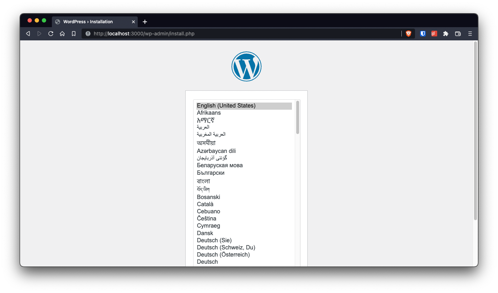
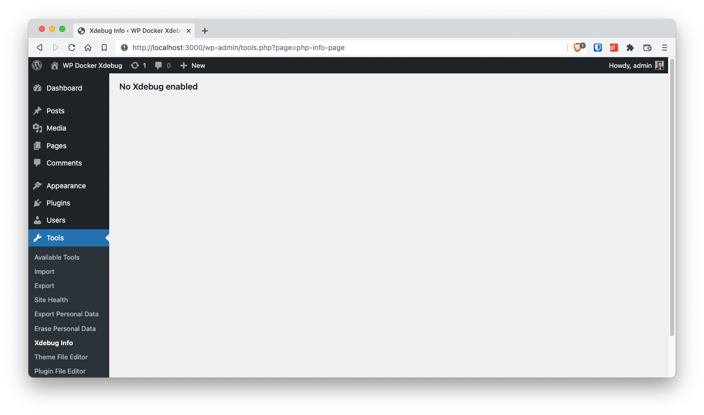
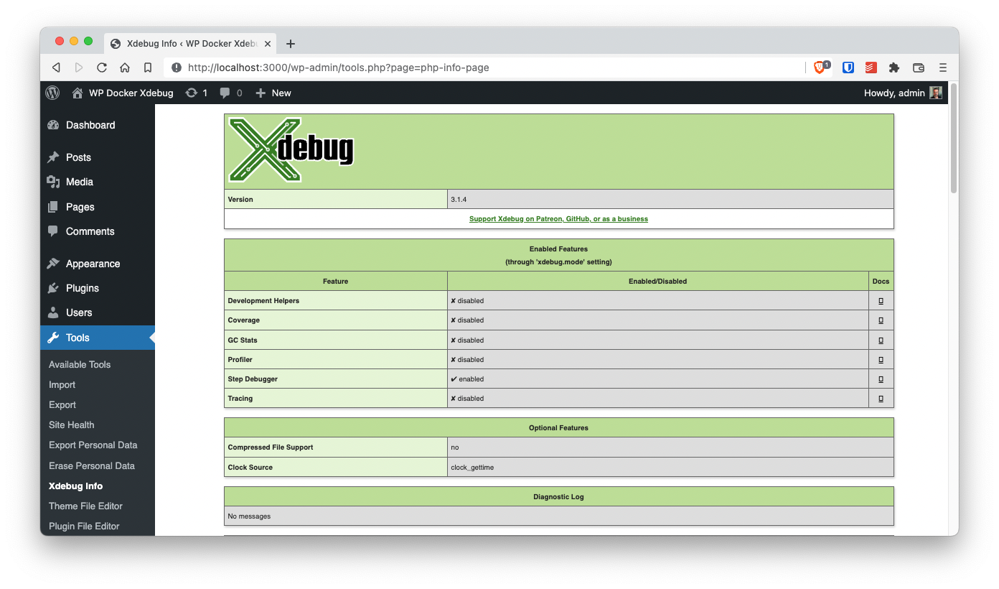
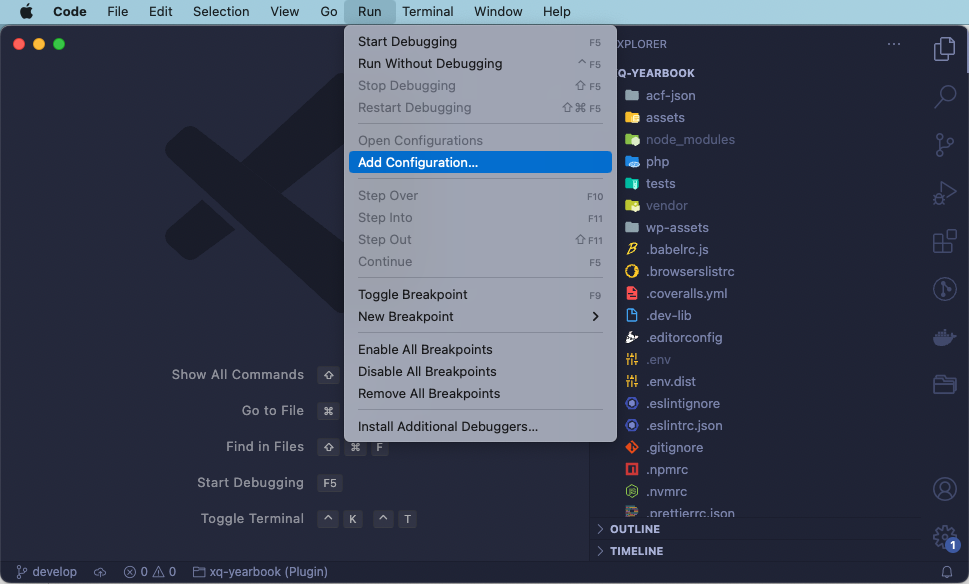
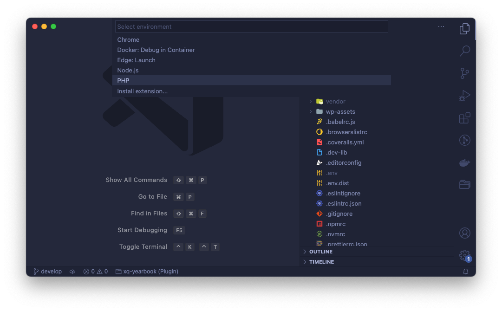
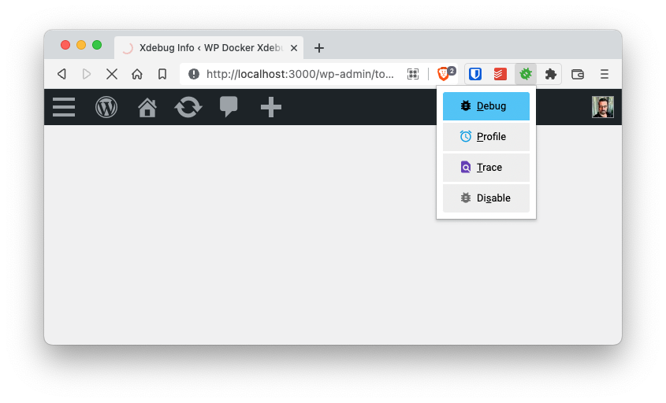

# Wordpress (PHP) debugging in your IDE using Docker and Xdebug

So I started using WordPress as a [REST API](https://developer.wordpress.org/rest-api/) server since that's _the foundation of the [Block Editor](https://developer.wordpress.org/block-editor/)_...

You might be wondering what's does the _Rest API_ has to do with Debugging?

Well, it turns out that you can no use the combination of `wp_die`  with `print_r`  to find out what a variable or object contains! (Duh!)

```php
<?php
// This does nothing when developing an API.
wp_die( print_r( $my_var, true ) );
```

When you are working with REST calls, you really need a debugger in those cases when you are not sure what the contents of a WordPress object or variable have. So Debuggin here is a must.

But, even tough setting up a debugger in PHP is not an easy tasks, is not that well documented. Specially when you are working with Docker.

So here are the steps I take to setup debugging when using WordPress inside the [Official Docker Container](https://hub.docker.org/_/wordpress).

## TOC

```toc

```

## Setup WordPress in a container

Ok, lets start by creating the development environment for a custom plugin:

```bash
mkdir wordpress-docker-xdebug
cd $_
touch Dockerfile docker-compose.yaml plugin.php
```

And on the `docker-compose.yaml` add the following code to create a minimal WordPress environment whith a [MariaDB database](https://hub.docker.org/_/mariadb) and the [official WordPress image](https://hub.docker.org/_/wordpress)

> I use MariaDB instead of MySQL because the Docker image for it is much more lighter than the MySQL Docker image

```yaml
version: '3'

services:

  db:
    image: mariadb
    container_name: wp-xdebug-db
    environment:
      MYSQL_ROOT_PASSWORD: root
      MYSQL_DATABASE: wordpress
      MYSQL_USER: wordpress
      MYSQL_PASSWORD: wordpress
    volumes:
      - wp-xdebug-data:/var/lib/mysql

  wp:
    image: wordpress:5-apache
    container_name: wp-xdebug-wp
    environment:
      WORDPRESS_DB_HOST: wp-xdebug-db
      WORDPRESS_DB_USER: wordpress
      WORDPRESS_DB_PASSWORD: wordpress
      WORDPRESS_DB_NAME: wordpress
    volumes:
      - wp-xdebug-html:/var/www/html
      - ./:/var/www/html/wp-content/plugins/wordpress-docker-xdebug
    ports:
      - 3000:80

volumes:
  wp-xdebug-data:
  wp-xdebug-html:

networks:
  default:
    name: wp-xdebug-network
```

Most of the magic on the `docker-compose.yaml` file happens is in the placement of environment variables. For information on what the variables for [MariaDB](https://hub.docker.com/_/mariadb) and [WordPress](https://hub.docker.com/_/mariadb) mean, head over to the respective [dockehub](https://hub.docker.com) pages.

Notice how I'm instructing Docker to **run WordPress in port 3000**

Finally, just start the image

```bash
docker-compose up
```

Now, open up a browser on <http://localhost:3000> and install WordPress:



## Create a plugin for Xdebug info

In the previous step we told Docker that the current directory (`./`) is mapped to a plugin directory (`/var/www/html/wp-content/plugins/wordpress-docker-xdebug`). So, just by placing the following code in the `plugin.php` file, we'll be creating a new plugin…

```php
<?php
/**
 * WordPress Docker Xdebug plugin
 *
 * @package           WpDockerXdebug
 * @author            Mario Yepes
 * @copyright         2020 Mario Yepes
 * @license           GPL-2.0-or-later
 *
 * @wordpress-plugin
 * Plugin Name:       WordPress Docker Xdebug plugin
 * Plugin URI:        https://marioyepes.com
 * Description:       A plugin that shows the status of Xdebug in Tools > Xdebug Info
 * Version:           1.0.0
 * Requires at least: 5.2
 * Requires PHP:      7.2
 * Author:            Mario Yepes
 * Author URI:        https://marioyepes.com
 * Text Domain:       wordpress-docker-xdebug
 * License:           GPL v2 or later
 * License URI:       http://www.gnu.org/licenses/gpl-2.0.txt
 * Update URI:        https://marioyepes.com
 */

add_action( 'admin_menu', 'add_php_info_page' );

function add_php_info_page() {
    add_submenu_page(
        'tools.php',           // Parent page
        'Xdebug Info',         // Menu title
        'Xdebug Info',         // Page title
        'manage_options',      // user "role"
        'php-info-page',       // page slug
        'php_info_page_body'); // callback function
}

function php_info_page_body() {
    if ( function_exists( '_xdebug_info' ) ) {
        xdebug_info();
    } else {
        echo '<h2>No Xdebug enabled</h2>';
    }
}
```

What this plugin does is just to create a new page in the _WordPress Dashboard_ under `Tools > Xdebug` with info of the status of Xdebug:



Up to here we have a full WordPress installation with a plugin that will tell us the status of Xdebug. Let's change the WordPress image to include Xdebug

## Create a custom Docker Image

First a disclosure. You could actually make this work without using a custom image, and sticking to commands inside the `docker-compose.yaml` file. But this would make the file way too complicated, and very rigid. That's why we are going to create a custom, and **very simple**, Docker image.

So on the `Dockerfile` add the following:

```dockerfile
FROM wordpress:5-apache

ARG XDEBUG_INI="/usr/local/etc/php/conf.d/xdebug.ini"

RUN pecl install xdebug \
    && docker-php-ext-enable xdebug \
    && echo "[xdebug]" > $XDEBUG_INI \
    && echo "xdebug.mode = debug" >> $XDEBUG_INI \
    && echo "xdebug.start_with_request = trigger" >> $XDEBUG_INI \
    && echo "xdebug.client_port = 9003" >> $XDEBUG_INI \
    && echo "xdebug.client_host = 'host.docker.internal'" >> $XDEBUG_INI \
    && echo "xdebug.log = /tmp/xdebug.log" >> $XDEBUG_INI

```

Lets explain a little:

- We're instructing Docker to create an image using as base the `wordpress:5-apache` image
- Then we declare the `XDEBUG_INI` variable with the path of the `xdebug` configuration. This is just to make the file a little cleaner
- Next, on a single command we do 3 things:
  - Install the `xdebug` extension using `pecl`
  - Enable the extension using the `docker-php-ext-enable` command
  - We create the `/user/local/etc/conf.d/xdebug.ini` using multiple `echo` calls

Next, you need to **modify** the `docker-compose.yaml` file. Just changing the image for the cutom one we just created in the `Dockerfile`:

```yaml {3}
# ...
  wp:
    build: ./
    container_name: wp-xdebug-wp
    environment:
      WORDPRESS_DB_HOST: wp-xdebug-db
      WORDPRESS_DB_USER: wordpress
      WORDPRESS_DB_PASSWORD: wordpress
      WORDPRESS_DB_NAME: wordpress
    volumes:
      - wp-xdebug-html:/var/www/html
      - ./:/var/www/html/wp-content/plugins/wordpress-docker-xdebug
    ports:
      - 3000:80
# ...
```

Notice that we don't have a `image` field, but a `build` field!

For this changes to take effect, you need to restart your docker environment:

```bash
docker-compose down
docker-compose up -d
```

And now, if you visit the _Xdebug info_ page, you should see something like this:



Great! and now let's start debugging:

## Explaining some _Gotchas_

OK, so we've been running over the `xdebug` configuration. Lets explain some things:

### How does Xdebug works

In a very summarized way, what xdebug does is that when **debugging is active** it will try to connect to port **9003** of the `xdebug.client_host` to send **and receive** debugging information.

The way to instruct Xdebug that it should connect to our IDE is by passing the `XDEBUG_TRIGGER` URL parammeter when calling our script: <http://localhost:3000/?XDEBUG_TRIGGER>

We can also pass that variable as a cookie variable. More on that latter.

### The xdebug.ini file

The `xdebug.ini` file should be placed in PHP's `conf.d` directory, which can change from installation to installation. In my case, to figure out where this directory was placed, I executed `php -i` **inside the WordPress** container, and review the output searching for where the `ini` files where placed.

In case your are wondering how this file loos, here are the contents:

```ini
# /usr/local/etc/php/conf.d/xdebug.ini
[xdebug]
xdebug.mode = debug
xdebug.start_with_request = trigger
xdebug.client_port = 9003
xdebug.client_host = 'host.docker.internal'
xdebug.log = /tmp/xdebug.log
```

### The `host.docker.internal` host

One of the biggest issues with Xdebug, is that it will connect to a specific host that needs to be configured in the `xdebug.ini` file.

Fortunately, Docker provides use with a [workaround](https://docs.docker.com/desktop/mac/networking/#use-cases-and-workarounds) to connect **from de container to the host**: Use the special host `host.docker.internal`, _which resolves to the internal IP address used by the host. This is for development purpose and will not work in a production environment outside of Docker Desktop_.

### Installing Xdebug

Another advantage of using Docker's WordPress image is that it comes with [`pecl`](https://pecl.php.net/) pre-configured and it provides the `docker-php-ext-enable` command, which allows us enable/disable extensions with just one command:

```bash
pecl install xdebug
docker-php-ext-enable xdebug
service apache2 reload
```

## Configure Visual Studio Code

To configure VSCode we need 2 things:

- Install the [PHP Debug](https://marketplace.visualstudio.com/items?itemName=xdebug.php-debug) extension
- Create the `.vscode/launch.json` by using the _Run_ menu

To create the `.json` file just add a new launch configuration:



Select the **PHP** option



And on the resulting file **modify** the entry _Listen for Xdebug_ to look like this:

```jsonp
{
  "version": "0.2.0",
  "configurations": [
    // ...
    {
      "name": "Listen for XDebug",
      "type": "php",
      "request": "launch",
      "port": 9003,
      "pathMappings": {
        "/var/www/html/wp-content/plugins/wordpress-docker-xdebug": "${workspaceFolder}"
      },
      "log": true
    }
    // ...
  ]
}
```

Take into account that:

- Xdebug 2 uses port 9000. Xdebug 3 uses port 9003. That's why we need to specify the port
- Use the `hostname` : `0.0.0.0` This comes from the _PHP Debug_ extension documentation
- Update the `pathMappings`: `"/var/www/html": "${worspaceRoot}" since that's where our WordPress live **inside** our container

## Start a debugging session

To start a debugging session just:

- Create a breakpoint in your code
- Click on the _start_ icon on Visual Studio or select _Run > Start Debugging_
- Visit a page passing the trigger variable in the URL

Remember, you have to pass the `XDEBUG_TRIGGER` variable either as an URL parameter or as a cookie parameter to the script you are debuggin.

`youtube: https://youtube.com/shorts/MQdC3FrBFIA`

And since passing the `XDEBUG_TRIGGER` variable constantly can be very frustrating, I recommend using the [Xdebug helper for chrome](https://github.com/mac-cain13/xdebug-helper-for-chrome) extension and have it pass that variable as a cookie for you:



And that's it! You are debugging WordPress.

## Resources

- Xdebug settings for the `xdebug.ini` file: <https://xdebug.org/docs/all_settings#start_with_request>

- Another approach on setting debugging in Docker: <https://www.larry.dev/xdebug-on-docker/>
