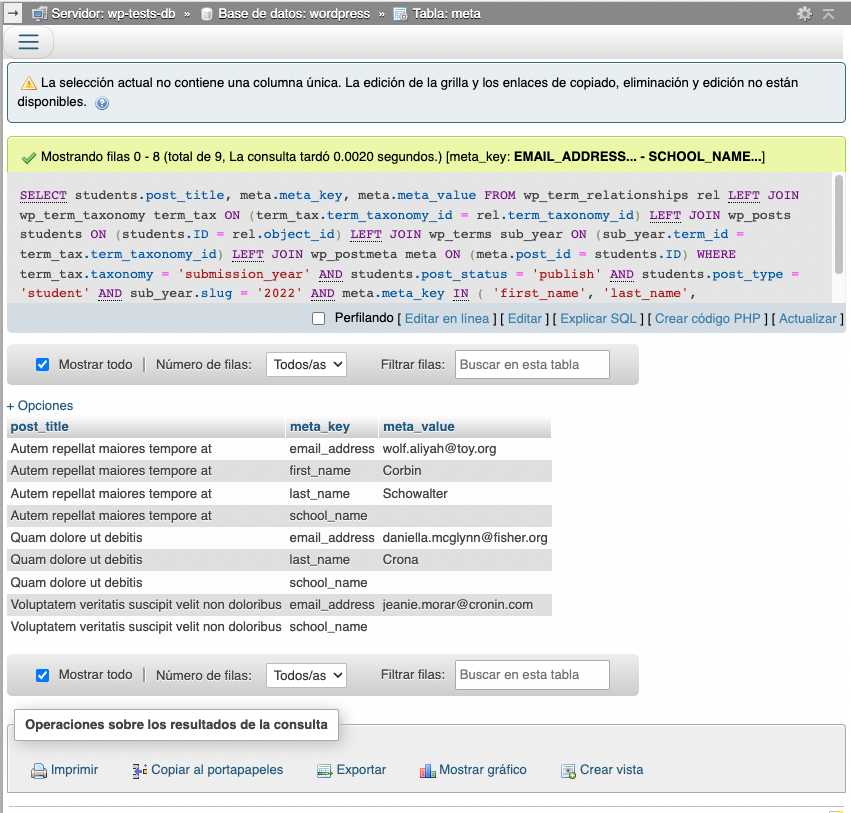
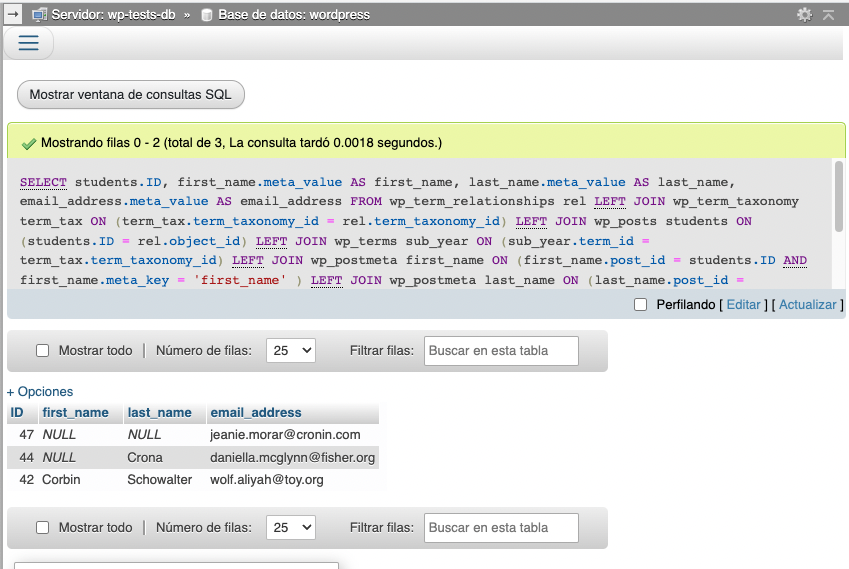

# Create a query to display custom fields and custom taxonomies in WordPress

The tasks was simple, or so I tought: _Create a **sql** query to display the **custom fields** for a **custom post type** that have a set of specific **custom tags**_.

Errrr. Not so simple.

Let's back up, let me describe the project that I'm currently working on and what the client needed so we can understand what I'm talking about:

Currently I'm working on a WordPress project where we have a custom post type called `student` to register, you gessed it... Students. On that custom post type, we have also custom fields to save the students `first_name`, `last_name`, `email_address`, `school_zip`  and `school_name`. Finally, for that custom post type, we created a custom taxonomy called `submission_year` since is possible for a student to have multiple records on the `student` post type.

Now, let's say it again: Create a **sql** query to display the `first_name`, `last_name`, `email_address`, `school_zip`  and `school_name` for the **students** that have a submitted record for the **current year**.

Let me show you how I came up with the solution for this report.

## TOC

```toc

```

## The WordPress ER

If we want to understand the final solution for the requested report, we need to understand the [WordPress database structure](https://codex.wordpress.org/Database_Description). Which is actually not that complicated for 2 reasons:

- WordPress has just one table for all the post types like post, pages and images
- If you need to store complex data, like an array or an object. WordPress will serialize that data and store it in a text field on a table.

Here is the current ER for WordPress 5.9, which is the latest one as the time of this writing:


So, instead of having a table and a field for each type of data you want to store like other CMS's, WordPress reuses the few table it has to store [serialized](https://www.php.net/manual/en/function.serialize.php) data.

I'm not saying WordPress does it better, I'm saying that WordPress keeps things simple (which most of the time is better 😏).

## Understanding the problem

Now that we know how the WordPress tables relate to one another and what the client wants from us, let's put into _table names_ terms: We need a query that show the `wp_postmeta.meta_key`, `wp_postmeta.meta_value` for all the `wp_post.post_type` equal to _student_ where `wp_terms` is _current year_.

The task then is to find a _path_ to join the `wp_postmeta` table with the `wp_terms` and `wp_post` table. Easy right?

## Starting the query

The best place to start this kind of joins, is by finding any _Many to Many_ table included in the _path_ we just talked about. In our case that would be the `wp_term_relationships table.

Then we create our first query. A query to join the `wp_term_relationships` with `wp_term_taxonomy` and `wp_posts` table:

```sql
SELECT
  students.post_title
FROM
  wp_term_relationships rel
  LEFT JOIN wp_term_taxonomy term_tax
    ON (term_tax.term_taxonomy_id = rel.term_taxonomy_id)
  LEFT JOIN wp_posts students
    ON (students.ID = rel.object_id)
WHERE
  term_tax.taxonomy = 'submission_year'
  AND students.post_status = 'publish'
  AND students.post_type = 'student'
```

This query basically will show us **all** the publised students with the _issue_ that we still will get multiple submission for each student. Remember, a student can have multiple submission with different _terms_.

Additionally, notice:

- We're using alias for our tables so our query is more readeable
- We're filtering the posts to only show the students that are publised

And the tidbit: The `object_id`  is the key that joins the `wp_term_relationships`  with the `wp_post`. That one took me by surprise actually.

## Displaying the required fields

Until now, we just joined the iner tables required in our query. Lets continue by joining the `wp_term_relationships` and `wp_terms` so we can filter out student without a submission for a specific year and actually get the information that we require like first and last name, zip code, etc.

```sql
SELECT
  students.post_title,
  meta.meta_key,
  meta.meta_value
FROM
  wp_term_relationships rel
  LEFT JOIN wp_term_taxonomy term_tax
    ON (term_tax.term_taxonomy_id = rel.term_taxonomy_id)
  LEFT JOIN wp_posts students
    ON (students.ID = rel.object_id)
  LEFT JOIN wp_terms sub_year
    ON (sub_year.term_id = term_tax.term_taxonomy_id)
  LEFT JOIN wp_postmeta meta
    ON (meta.post_id = students.ID)
WHERE
  term_tax.taxonomy = 'submission_year'
  AND students.post_status = 'publish'
  AND students.post_type = 'student'
  AND sub_year.slug = '2022'
  AND meta.meta_key IN ( 'first_name', 'last_name', 'email_address', 'school_zip', 'school_name')
ORDER BY students.ID, meta.meta_key
```

And now we start having meaningful results:



## One student per line

We could have stopped with our query in the last section. But wouldn't it be nice if could have one student per row, instead of multiple rows per student?

Well, we can! We just have to change the join to the `wp_postmeta` table and execute it multiple times:

```sql
SELECT
  students.ID,
  first_name.meta_value AS first_name,
  last_name.meta_value AS last_name,
  email_address.meta_value AS email_address
FROM
  wp_term_relationships rel
  LEFT JOIN wp_term_taxonomy term_tax
    ON (term_tax.term_taxonomy_id = rel.term_taxonomy_id)
  LEFT JOIN wp_posts students
    ON (students.ID = rel.object_id)
  LEFT JOIN wp_terms sub_year
    ON (sub_year.term_id = term_tax.term_taxonomy_id)
  LEFT JOIN wp_postmeta first_name
    ON (first_name.post_id = students.ID AND first_name.meta_key = 'first_name' )
  LEFT JOIN wp_postmeta last_name
    ON (last_name.post_id = students.ID AND last_name.meta_key = 'last_name' )
  LEFT JOIN wp_postmeta email_address
    ON (email_address.post_id = students.ID AND email_address.meta_key = 'email_address' )
WHERE
  term_tax.taxonomy = 'submission_year'
  AND students.post_status = 'publish'
  AND students.post_type = 'student'
  AND sub_year.slug = '2022'
ORDER BY first_name.meta_value, last_name.meta_value
```

And this will result in:



Take into account that if a student doesn't have meta, all the fields will be `NULL` for that student.

## Resources

If you want to understand what each WordPress table stores, then I suggest [this blog post](https://blogvault.net/wordpress-database-schema/) by _Sufia Banu_.
