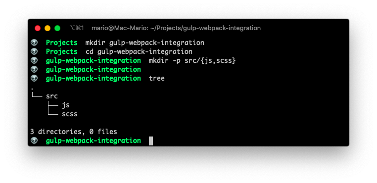
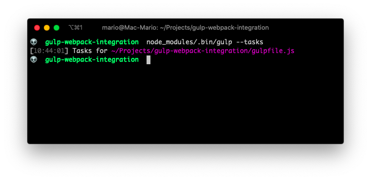
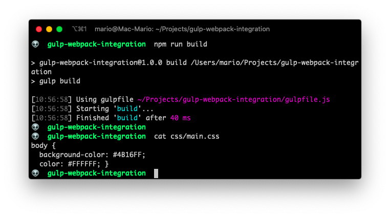
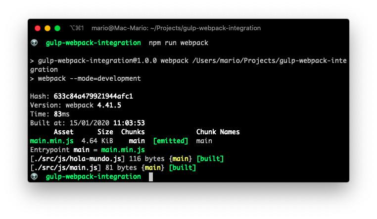
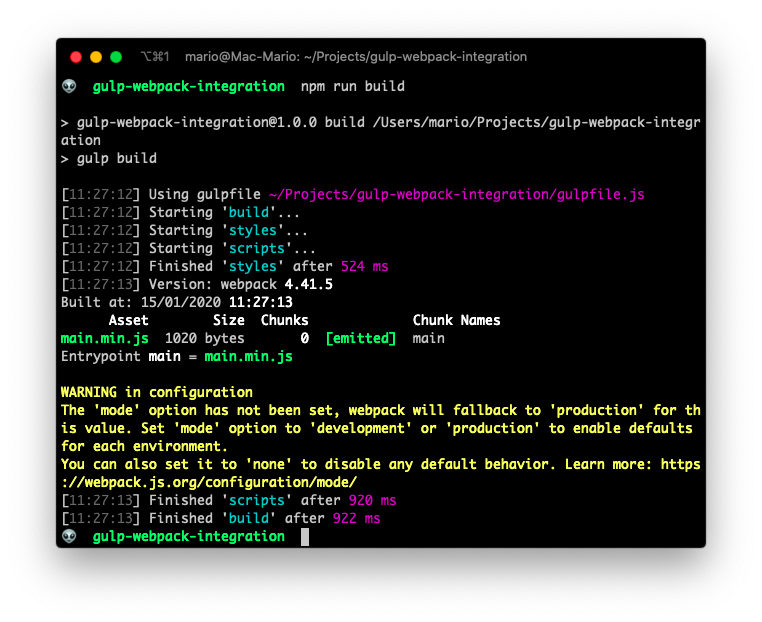
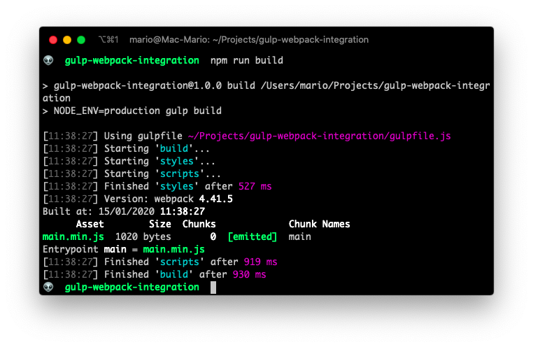

# Use Gulp and Webpack together for you asset bundling needs

I [love Webpack](https://marioyepes.com/posts/webpack-wordpress-config/), it allows me to bundle scripts in just one file. And if you par it with [babel](https://babeljs.io/) you can use next generation javascript syntax and still make your scripts compatible with older browsers.

The fact of the matter is that if you are going to create a full stack javascript project, you HAVE TO use webpack...

But there is a problem... Webpack is not design for task automation, even though it can do them.

For tasks automation, I still think there is no better tool than [gulp](https://gulpjs.com/). Specially when we want to compile SASS files, create zip archives, or deploy code on remote servers.

So here, i'm going to show you have to use gulp for task automation with the following tasks

- One tasks to compile SASS files into CSS files
- One tasks to _compile js files with webpack_

I'm not going to cover how to do complex things like deployment or clean up since I just want to show you how to make this 2 tools work together.

## Project setup.

First lets create a project directory with some sub directories:

```bash
mkdir gulp-webpack-integration
cd gulp-webpack-integration
mkdir -p src/{js,scss}
tree
```

You should have then the following structure:

```
.
└── src
    ├── js
    └── scss

3 directories, 0 files
```



Now lets create some test CSS and JS files so we have something to test with:

Create `src/scss/main.scss` with the following contents:

```scss
// src/scss/main.scss

$background-color: #4B16FF;
$foreground-color: #FFFFFF;

body {
  background-color: $background-color;
  color: $foreground-color;
}
```

Now create `src/js/hola-mundo.js` With the following contents:

```js
// src/js/hola-mundo.js

export default HolaMundo = name => {
    console.log(`Hello ${name} from hola-mundo.js`)
}
```

And finally create `src/js/main.js` with

```js
// src/js/main.js

import HolaMundo from './hola-mundo.js';

HolaMundo('Mario');
```

As you can see, this are very basic files, but enough for testing our setup.

Now that we have our test files, we can start the configuration. This are the steps we are going to follow:

- Start npm's package.json file
- Install and configure `gulp`
- Install and configure a sass compiler
- Install and configure `webpack`
- Install `babel` and configure it with webpack
- Configure webpack in gulp


## Create `package.json`

So lets create our npm's `package.json` file by issuing:

```bash
npm init -y
```

This will create a very basic file:

```json
{
  "name": "gulp-webpack-integration",
  "version": "1.0.0",
  "description": "",
  "main": "index.js",
  "scripts": {
    "test": "echo \"Error: no test specified\" && exit 1"
  },
  "keywords": [],
  "author": "",
  "license": "ISC"
}
```
That was easy... Lets continue by installing and configuring Gulp.

## Install Gulp

Now install `gulp` as a dev dependency by executing:

```bash
npm install --save-dev gulp
```

And create a `gulpfile.js` with just this code:


```js
// gulpfile.js

const gulp = require('gulp');
```

Just for testing: execute `node_modules/.bin/gulp --tasks` to find out if all is good.




## Install and configure a sass compiler

For compiling `scss` files, we're going to use [node-sass](https://www.npmjs.com/package/node-sass).

But we also need the package [gulp-sass](https://www.npmjs.com/package/gulp-sass) to make that bridge between the gulp and the compiler. So execute the following to install both packages.

```bash
npm install --save-dev gulp-sass node-sass
```

Now that we have installed both packages, make the following changes to `gulpfile.js` adding a task to compile `scss` files into `css`:

```js {4-14}
// gulpfile.js

const gulp = require('gulp');
const sass = require('gulp-sass');

sass.compiler = require('node-sass');

function styles() {
    return gulp.src('src/scss/*.scss')
        .pipe(sass())
        .pipe(gulp.dest('css/'));
}

exports.build = styles;
```

And lastly (for this step) change `package.json` to access this new **task** with just `npm run build` by creating a new _script_ entry:

```json {7}
{
  "name": "gulp-webpack-integration",
  "version": "1.0.0",
  "description": "",
  "main": "index.js",
  "scripts": {
    "build": "gulp build"
  },
  "keywords": [],
  "author": "",
  "license": "ISC",
  "devDependencies": {
    "gulp": "^4.0.2",
    "gulp-sass": "^4.0.2",
    "node-sass": "^4.13.0"
  }
}
```

With this 3 steps you can now compile `scss` files and have them stored in the `css/` directory:



## Install and configure Webpack

This step can be kind of cumbersome since there are a lot of sub-steps required, but is well worth it.

First lest install `webpack` with npm:

```bash
npm install --save-dev webpack webpack-cli
```

Then create a basic `webpack.config.js` file to instruct webpack where are the js files and where to store the output:

```js
// webpack.config.js

const path = require('path');

module.exports = {
    entry: {
        main: './src/js/main.js'
    },
    output: {
        filename: '[name].min.js',
        path: path.resolve(__dirname, 'js')
    }
}
```

This will instruct webpack to compile the file `src/js/main.js` into `js/main.min.js`.

And finally, change the `package.json` to add a script that executes webpack in development mode for us:

```json {5}
{
  ...
  "scripts": {
    "build": "gulp build",
    "webpack": "webpack --mode=development"
  },
  ...
}
```

Now you can compile scripts with webpack...



But we're not done yet with webpack. We need to instruct webpack to convert the compiled javascript into something that old browsers can understand.

## Adding babel to webpack

As always, it all starts with some packages installation. We have to install Webpack's `babel-loader` and all the Babel required files for transpiling code.

```bash
npm install --save-dev babel-loader @babel/core @babel/cli @babel/preset-env
```

Then, we have to modify `webpack.config.js` so any `js` file is converted to old javascript versions after compiling:

```js {13-21}
// webpack.config.js

const path = require('path');

module.exports = {
    entry: {
        main: './src/js/main.js'
    },
    output: {
        filename: '[name].min.js',
        path: path.resolve(__dirname, 'js')
    },
    module:{
        rules: [
          {
              test: /\.js$/,
              exclude: /node_modules/,
              loader: 'babel-loader'
          }
        ]
    }
}
```

The output of `npm run webpack` should't change, since we just told it to convert old format javascript. But we also should not get any errors.


## Configure webpack in Gulp

We're almost finished!

We just need to add a task in `gulpfile.js` that instructs gulp to calls webpack for compiling javascript files.

So again, open up the terminal and execute the following command to install the bridge between `gulp` and `webpack`:

```bash
npm install --save-dev webpack-stream
```

Then make the following changes to the `gulpfile.js`

```js {5,15-21}
// gulpfile.js

const gulp = require('gulp');
const sass = require('gulp-sass');
const webpack = require('webpack-stream');

sass.compiler = require('node-sass');

function styles() {
    return gulp.src('src/scss/*.scss')
        .pipe(sass())
        .pipe(gulp.dest('css/'));
}

function scripts() {
    return gulp.src('.')
        .pipe(webpack(require('./webpack.config.js')))
        .pipe(gulp.dest('js/'));
}

exports.build = gulp.parallel(styles, scripts);
```

And test it out:



Awesome... We're done

## Some cleanup

If you looked closely on the previous image, you can see that webpack is complaining about not having a _"mode"_ seated up. And its right! (you can read about what that means [here](https://marioyepes.com/posts/webpack-wordpress-config/)).

So lets fix that by adding a node env variable the script `build` on the file `package.json`. And also adding a new script called `dev`:

```json {4,5}
{
  ...
  "scripts": {
    "build": "NODE_ENV=production gulp build",
    "dev": "gulp build",
    "webpack": "webpack --mode=development"
  },
  ...
}
```

Next we need to modifiy `webpack.config.js` to be aware of this new variable:

```js {22}
// webpack.config.js

const path = require('path');

module.exports = {
    entry: {
        main: './src/js/main.js'
    },
    output: {
        filename: '[name].min.js',
        path: path.resolve(__dirname, 'js')
    },
    module:{
        rules: [
          {
              test: /\.js$/,
              exclude: /node_modules/,
              loader: 'babel-loader'
          }
        ]
    },
    mode: process.env.NODE_ENV == 'production' ? 'production': 'development'
}
```

And verify that there aren't any complaints.



Perfect.

## Missing steps

So here I showed you how to make `gulp` and `webpack` play nice together. What is missing from this article is how to configure a _watch task_ for automatic compiling of js and sass files.

The short answer is... There is no difference!. You create _watch_ tasks **in gulp** (not in webpack) as you've always have.

