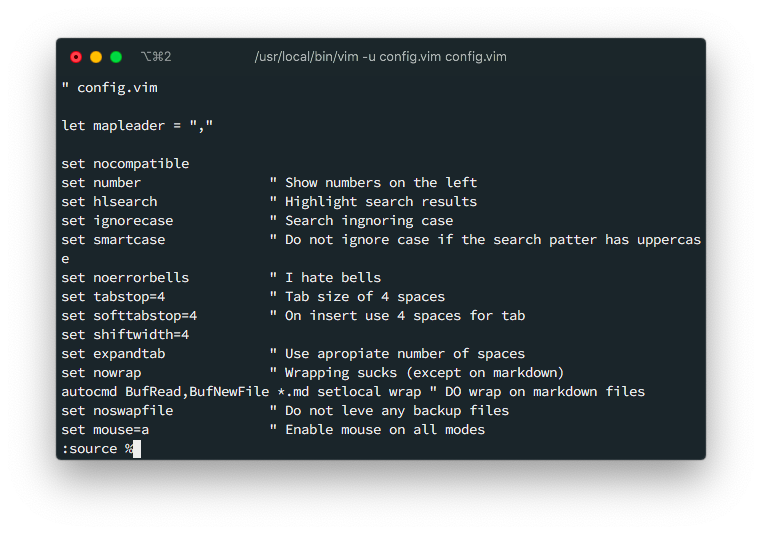
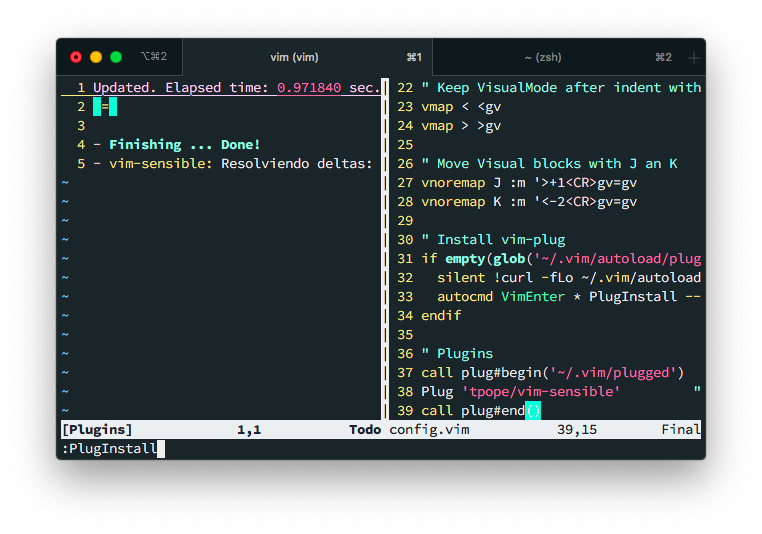
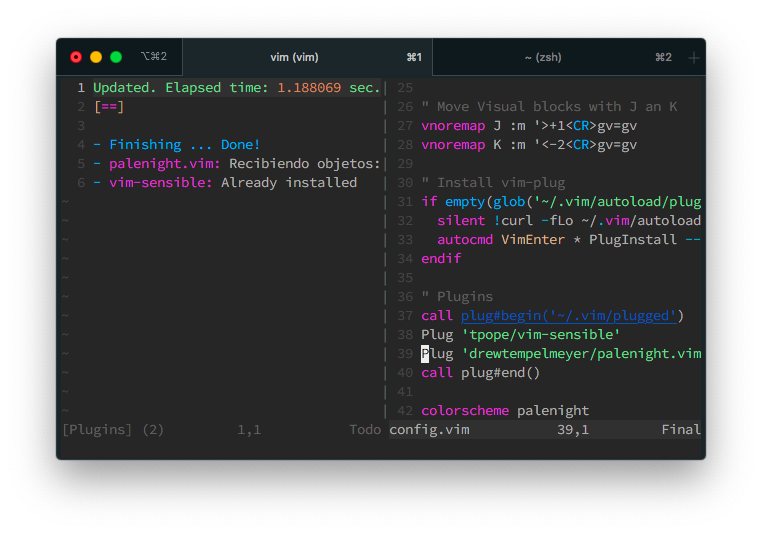

# Vim setup for Web Development: Php, WordPress, JavaScript, JXS, (S)CSS, Python and Flutter.

If you've read some of my blog posts, you can see that PHP and WordPress are a big part of my day to day... But I love vim.

I say "but" because there is a problem: Even though PHP is still one of the [most popular languages](https://octoverse.github.com/#top-languages) around, the tooling is not up to par with the likes of JavaScript, TypeScript or Python. At least not when it comes to open tools like Visual Studio or (NEO)VIM.

So if you want a decent PHP editor that does everything, you better be prepared to [spend some dough](https://www.jetbrains.com/es-es/phpstorm/)... or read this article where I'll teach you how to setup your (Neo)Vim to work much like and IDE like Visual Studio or PhpStorm.

We'll be setting up:

- Plugins
- Error detection
- Auto complete
- Adding closing brackets/keys/quotes automaticalle
- And pretty colors of course.

## Disclaimer

This article is not for Vim beginners. I assume that you know where your `.vimrc` or `init.vim` file resides. Also how to use (Neo)Vim _plugin managers_ and how to save and quit from Vim.

## Install required software

Since we're going to be starting from scratch, I'm only going to assume that you have access to the terminal in your Linux or Mac.

So Just install the following pieces of software

- NeoVim or Vim 8
- Node 10
- git
- curl


You might be wandering why do I need [NodeJS](https://nodejs.org)? Well, that's going to be our secret souce for this configuration. But lets not get ahead of ourselves lets first focus on setting up a simple developmet environment for our new configuration.

Also, I'm using brew in MacOS to speed up my installation. But you can install it in the traditional way.

Finally, if you are in Mac, I've experienced the best results when using [iTerm2](https://www.iterm2.com/) and [Alacirtty](https://github.com/alacritty/alacritty)

## Basic Vim configuration

Vim is powerful, _very very_ powerful, there is no doubt about that. But the fact is that after installation, vim it's kind of a dumb editor and makes no asumptions. It doesn't have any _code highlighting_, nor any file management. And the help is kind of hard to reach. But there is a reason for that. Vim expects that you configure it to make it you own.

So, to configure `vim` you have to create a configuration file in you home directory that can be `~/.vimrc` if you are using **Vim** or `~/.config/nvim/init.vim` if you are using **NeoVim**.

But just to be sure that we're not making any mistakes, and also that this configuration file works for both _Vim 8_ and _NeoVim_ we're going to use the temporary file `config.vim` in a custom directory:

**And here is the trick**: We're going to instruct _vim_ to use that file as a configuration file and edit it by using the command `vim -u config.vim config.vim`


> Here is another trick. You can start _Vim_ without a config file but in _nocompatible_ mode by issuing `vim -u NONE -N`

Now, lets open this file with with _our trick_ and add the following directives:

```vim
" config.vim

let mapleader = ","

set nocompatible
set number                " Show numbers on the left
set hlsearch              " Highlight search results
set ignorecase            " Search ingnoring case
set smartcase             " Do not ignore case if the search patter has uppercase
set noerrorbells          " I hate bells
set belloff=esc
set tabstop=4             " Tab size of 4 spaces
set softtabstop=4         " On insert use 4 spaces for tab
set shiftwidth=4
set expandtab             " Use apropiate number of spaces
set nowrap                " Wrapping sucks (except on markdown)
autocmd BufRead,BufNewFile *.md,*.txt setlocal wrap " DO wrap on markdown files
set noswapfile            " Do not leve any backup files
set mouse=a               " Enable mouse on all modes
set clipboard=unnamed,unnamedplus     " Use the OS clipboard
set showmatch
set termguicolors
set splitright splitbelow
set list lcs=tab:\¦\      "(here is a space)
let &t_SI = "\e[6 q"      " Make cursor a line in insert
let &t_EI = "\e[2 q"      " Make cursor a line in insert

" Keep VisualMode after indent with > or <
vmap < <gv
vmap > >gv
"
" Move Visual blocks with J an K
vnoremap J :m '>+1<CR>gv=gv
vnoremap K :m '<-2<CR>gv=gv

" Autocomand to remember las editing position
augroup vimrc-remember-cursor-position
  autocmd!
  autocmd BufReadPost * if line("'\"") > 1 && line("'\"") <= line("$") | exe "normal! g`\"" | endif
augroup END

```

You can read the comments if you want to know exactly what I'm doing here. But the summary is that I'm making sure of 2 things:

- That `vim` (Vim 8) and `nvim` (Neovim) work **almost** exactly the same
- That the editor will behave more like an IDE which is the hole reason for this post

Notice that I said _almost_ and not **exactly** the same. And the reason for that is that there are plugins that will help us achieve that similarity and I don't what to repeat directives.

Now, here is the second trick. _Save and re-source the current file to make the new configuration take effect_

- First save with `:w`
- The re-source the current file with `:source %`



And you'll get something like this:


We're still a long way to go, but we made some good progress.

## Install a Plugin Manager

One thing that I didn't mention before, is that `vim's` config file is actually written in `vimscript`, which is a [complete programming language](https://learnvimscriptthehardway.stevelosh.com/). So we could make vim behave like an IDE by adding functions and directives in this file. The problem is that it would take too long to do it and we would en up with a configuration file with a size that could be measured in Megs. That's why we'll be using plugins.

In our case, we're going to use the [vim-plug](https://github.com/junegunn/vim-plug) plugin manager to take care of downloading installing and configuring the plugins we're going to use.

So add the following to the `config.vim` file at the end:

```vim
" Install vim-plug for vim and neovim
if empty(glob('~/.vim/autoload/plug.vim'))
  silent !curl -fLo ~/.vim/autoload/plug.vim --create-dirs https://raw.githubusercontent.com/junegunn/vim-plug/master/plug.vim
  autocmd VimEnter * PlugInstall --sync | source $MYVIMRC
endif

" Plugins
call plug#begin('~/.vim/plugged')
" Plugins here !!!!
call plug#end()
```

Now, save and re-source this file with `:w` and then `:source %` to make the changes take effect.


Did you get that "download progress"??? That's what this new directives do. Download the _vim-plug_ plugin manager into `./.vim/autoload/plug.vim` file.

**At this point, its better to exit vim and re-open it with `vim -u config.vim config.vim` since there are some directives that only take effect at start up.**

We should have some syntax highlight now:


## Our first plugin

Remember that I said that the configuration we added was to make `vim` and `nvim` **almost** exactly the same?

We'll the reason for not making the **exactly** the same at that point, was because there is a plugin that will help us with that.

The plugin is called [tpope/vim-sensible](https://github.com/tpope/vim-sensible) and what it does is that configures our vim editor with some "sensible" defaults.

To install the plugin lets make the following change at the end of the `config.vim` file:

```vim {4}
" config.vim
" ...
call plug#begin('~/.vim/plugged')
Plug 'tpope/vim-sensible'         " Sensible defaults
call plug#end()
```

We just added our first plugin! but we still need to install it.

This are the steps to install _and activate_ our new plugin:

- Save the file with `:w`
- Execute `:source %` to re-source
- **Execute `:PlugInstall` to install the new plugin**
- Close the _Install Progress Buffer_ with `:bd`

The `PluginInstall` command is courtesy of the `vim-plug` plugin manager, and what it does it that downloads and install any uninstalled plugin.



And notice the change... Now we have an Status Bar at the bottom!!!.

That plugin adds some additional functionality, that can be reviewed by looking ant the short [source code](https://github.com/tpope/vim-sensible/blob/master/plugin/sensible.vim) including new shorthand commands and some behavioral changes that makes our `vim` more usable.

## Themes

What is an IDE without out some pretty colors??? 😅

In vim themes are also plugins. So we are going to add one new plugin: [drewtempelmeyer/palenight.vim](https://github.com/drewtempelmeyer/palenight.vim).

To install it, make the following changes on `config.vim` in the plugins section:

```vim {5,8}
" config.vim
"...
call plug#begin('~/.vim/plugged')
Plug 'tpope/vim-sensible'            " Sensible defaults
Plug 'drewtempelmeyer/palenight.vim' " Soothing color scheme for your favorite [best] text editor
call plug#end()

colorscheme palenight " Activate the theme
```

Again:

- Save the file with `:w`
- Re-source it with `:source %`
  - Here you are going to get an error saying that the theme is not installed. Which is true.
- Install the plugins with `:PlugInstall`
- Close the _install buffer_ with `:q`
- Re-source (for the second time) the config with `:source %`


And you'll see a new set of colors:



_Palenight_ is a great color scheme but in case you want to take a look to som
other cool options, This are the themes that I use the most:

- [Material theme](https://github.com/kaicataldo/material.vim#usage)
- [Gruvbox](https://github.com/morhetz/gruvbox/wiki/Configuration)
- [Nigh Owl](https://github.com/haishanh/night-owl.vim#usage)
- [Palenight](https://github.com/drewtempelmeyer/palenight.vim#usage)

And before you say something... yes, _Palenight_ theme is also included in the _Material Theme_. Its just that in my terminal the stand alone _Palenight_ looks better.

Also, there is the plugin [flazz/vim-colorschemes](https://github.com/flazz/vim-colorschemes) which includes about 300 additional color themes.

### Fix italic issue

Material and Gruvbox have options to enable _italics_ and true color that can have issues with Vim8 (I haven't had any issues with NeoVim).

Most of this issues are [related to the terminal](https://gist.github.com/XVilka/8346728) and not so much with the editor.

The only solution that worked for me, was to create the file `xterm-256color-italic.terminfo` with the contents:

```
xterm-256color-italic|xterm with 256 colors and italic,
  sitm=\E[3m, ritm=\E[23m,
  use=xterm-256color,
```

Then source it with the `tic` command:

```bash
tic -c xterm-256color-italic.terminfo
```

Also, I needed to create an alias for `vim` so every time I executed `vim` it first instructed the terminal to use the new _terminfo_:

```bash
alias vim="TERM=xterm-256color-italic vim"
```

But as I said, with NeoVim I haven't had any issues.

## File management

One essential part of an IDE, it's file management... preferably by using some kind of sidebar that shows the project's files. And to complement that, it would be nice to have some kind of _fuzzy file opener_ that lets you open a file just by typing part of the name. Much like `Cmd-P` in Visual Studio Code.

It turns out that there are also plugins for that!.

We'll install [NERDTree](https://github.com/preservim/nerdtree) for file exploring and [`fzf`](https://github.com/junegunn/fzf.vim) for fuzzy file finding (think Cmd-p open file):

So lets add the following lines to the `config.vim` file:

```vim {6-8,13-16}
" config.vim
" ...
call plug#begin('~/.vim/plugged')
Plug 'tpope/vim-sensible'            " Sensible defaults
Plug 'drewtempelmeyer/palenight.vim'  " Soothing color scheme for your favorite [best] text editor
Plug 'scrooloose/nerdtree', { 'on':  'NERDTreeToggle' } " File navigator
Plug 'junegunn/fzf', { 'do': { -> fzf#install() } }     " Install fuzzy finder binary
Plug 'junegunn/fzf.vim'               " Enable fuzzy finder in Vim
call plug#end()

colorscheme palenight                 " Activate the Palenight theme

" Use Ctrl-k Ctrl-k to open a sidebar with the list of files
map <C-k><C-k> :NERDTreeToggle<cr>
" Use Ctrl-P to open the fuzzy file opener
nnoremap <C-p> :Files<cr>
```

The reason that _fzf_ requires 2 plugins is because the first installs the `fzf` binary in our file system, and the second adds commands that allows us to use it easily inside Vim.

Again, save the file with `:w`, re-source the file with `:source %` and install the plugins with `:PlugInstall`. Finally re-source again to enable the new plugins in our current vim instance.


Now, when you type `Ctrl-k` and then `Ctrl-k` you'll get a tree view of the files of the current directory.


And when you type `Ctrl-P` you'll get a file finder at the bottom of the terminal, where you find files by just typing part of the name:


Both NERDTree and FZF are pretty configurable. I encourage you to read [this article](https://medium.com/@victormours/a-better-nerdtree-setup-3d3921abc0b9) for additional options for NERDTree

The FZF [GitHub Page](https://github.com/junegunn/fzf.vim) its pretty good. But you might want to take a look at this [blog post](https://blog.avahe.tk/posts/neovim/fzf-ripgrep/) for additional information on how **also** fuzzy find inside files using [RipGrep](https://github.com/BurntSushi/ripgrep).

## Tabs vs Spaces, Line Feed vs Carriage Return (Editor Config)

Now, if you are working in a team, is probable that your developers are using different code editors and different OSs. This leads to "conflicts" on how to format the files in your project.

To solve that, I use a [.editorconfig](https://editorconfig.org) file in my projects.

What this does is that it **configures your editor** to use spaces or tabs... Also to use CRLF or just LF for line endings.

To make that work on vim, you have to use another plugin, the `editorconfig` plugin.

So just add the following line int the _PLugins_ section of your `config.vim` file and thats it:

```vim
Plug 'editorconfig/editorconfig-vim'  " Tab/Space trough projects
```

To check if things are working create the following `.editorconfig` in your directory

```yaml
# This file is for unifying the coding style for different editors and IDEs
# editorconfig.org

# WordPress Coding Standards
# https://make.wordpress.org/core/handbook/coding-standards/

root = true

[*]
end_of_line = crlf
insert_final_newline = true
trim_trailing_whitespace = true
indent_style = tab
indent_size = 8
```

And in vim use the command `set list lcs=trail:·,tab:»·` so tabs and spaces are visible on the current buffer.


And as you can see, **in this buffer** we are using tabs even tough we configured Vim from the start to use spaces.

## IntelliSense

Now the most interesting part, _Code Completion_ and _Intellisense_.

The project [Conquer of Completion](https://github.com/neoclide/coc.nvim) (or **CoC**) it's a very big Vim plugin that brings [Language Server Protocol](https://langserver.org/) over to Vim.

If you are not familiar with LSP, then let me explain.

Upon the development of [Visual Studio Code](https://code.visualstudio.com), Microsoft decided to extract the language analysis and completition functions of their IDE in it's own "server". That way, multiple projects (like vim) could use and contribute to development of code analysis.

Even tough the LSP server is an standard more than an application, the only useful implementation of it is written in node, and that's why we need [Node JS](https://nodejs.org) installed on our machine. To use the code competition offered by CoC.

So, to enable CoC on vim we need to add the following line to the plugins section in our `config.vim` file:

```vim {4}
" config.vim
call plug#begin('~/.vim/plugged')
" ...
Plug 'neoclide/coc.nvim', {'branch': 'release'} " Intelisense
call plug#end()
```

But wait!!! we're not finished. The CoC plugins has a big set of commands that are not configured by default **and that you need to setup by yourself**.

Instead of showing you here what additional configuration you should add to de `config.vim` file. I think its better you head over to the CoC [configuration documentation](https://github.com/neoclide/coc.nvim#example-vim-configuration) and _Copy & Paste_ what's there.

> As the GitHub page says. That's an "example" configuration. But I always use whats there without any changes.

So add the CoC configuration at the end of `config.vim` file. Then write the changes with `:w`, then `:source %` so it recognizes the new plugin. Then then `:PlugInstall` to install it and finally `:source %` again to have _Intellisense_.


And test the _Intellisense_ just by typing something:


Cool, isn't it?

### CoC extensions

CoC by itself is very capable, but it does just auto suggest competition for only a small set of languages. Which is pretty normal since there number of available programming languages its very big.

Fortunately, CoC supports extensions that add support to additional languages (intellisense for additional languages) and also extensions that adds additional behavior like markdown linting and even discord connections.

You install _CoC extensions_ by By using the `:CocInstall <extension-name>` command inside vim.


Here I'm installing the `coc-phpls` extension by issuing inside `vim` the command

```vim
:CocInstall coc-phpls
```

And now I to have PHP code completition!.

To have CoC install extensions automatically you have to set up the `coc_global_extensions` variable inside the `config.vim` file, with a list of _CoC_ extensions you want to install at **start up time**.

So lets add some extensions by adding the following directive to your `config.vim` file and **restarting vim**:

```vim
let g:coc_global_extensions = [
    \ 'coc-tsserver',
    \ 'coc-json',
    \ 'coc-html',
    \ 'coc-css',
    \ 'coc-phpls',
    \ 'coc-python',
	\ 'coc-diagnostic'
    \]
```

This will install the `tsserver` (for javascript), `json`, `html`, `css`, `php` and `python` extensions. Also will install a **diagnostic** extension that can take care of linting and formating using external tools.

If you require support for additional languages, just take a look at the available [list of extensions](https://github.com/neoclide/coc.nvim/wiki/Using-coc-extensions#implemented-coc-extensions)

### CoC Diagnostics (Linting)

CoC not only provides _autocompletion_. It also provides **linting** and **formatting** out the box.

But there are ocations where [external](https://github.com/squizlabs/PHP_CodeSniffer) [tools](https://github.com/PyCQA/flake8) work better. We need then to instruct _CoC_ to use one of those external tools in some languages.

That's why we added the `coc-diagnostic` extension on the list extensions to
install on the previous step. We just have to configure it to specify which languages will use external tools

_CoC_ uses and additional `json` configuration file that can be accesed by executing inside vim `:CocConfig`.

In that file I'm going to add the following content:

```json
{
  "diagnostic-languageserver.filetypes": {
    "php": ["phpcs"]
  },
  "diagnostic-languageserver.linters": {
    "phpcs": {
      "command": "./vendor/bin/phpcs",
      "debounce": 300,
      "rootPatterns": ["composer.json", "composer.lock", "vendor", ".git"],
      "args": ["--report=emacs", "-s", "-"],
      "offsetLine": 0,
      "offsetColumn": 0,
      "sourceName": "phpcs",
      "formatLines": 1,
      "formatPattern": [
        "^.*:(\\d+):(\\d+):\\s+(.*)\\s+-\\s+(.*)(\\r|\\n)*$",
        {
          "line": 1,
          "column": 2,
          "message": 4,
          "security": 3
        }
      ],
      "securities": {
        "error": "error",
        "warning": "warning"
      }
    }
  },
  "diagnostic-languageserver.formatFiletypes": {
    "php": "phpcbf"
  },
  "diagnostic-languageserver.formatters": {
    "phpcbf": {
      "command": "./vendor/bin/phpcbf",
      "rootPatterns": ["composer.json", "composer.lock", "vendor", ".git"],
      "args": ["%file"],
      "isStdout": false,
      "doesWriteToFile": true
    }
  }
}
```

I know its kind of confusing. The short explanation is that I'm doing 2 things:

- I'm telling _CoC_ which languages will use external tools for formating and linting (phpcs and phpcbf in my case)
- Then I configure **the command** that has to be executed for each formatter and each sniffer

## Syntax highlighting

Vim has pretty decent syntax highlighting out of the box. But with hundreds of possible languages there is room for improvement. For instance, take the following `jsx` file.


Can you see that none of the import parameters is highlighted?

That's where the [Vim Poliglot](https://github.com/sheerun/vim-polyglot) comes into play. What `vim-poliglot` does is that loads the language syntax highlighting commands when you load a file. So it doesn't slows down the editor in no sensible way.

To install it you have to follow the same procedure. Add the plugin in `config.vim` and save, source, `:PlugInstall` and source again.

```vim{3}
" config.vim
call plug#begin('~/.vim/plugged')
" ...
Plug 'sheerun/vim-polyglot'
call plug#end()
```

To make it run, you don't have to do anything else. Since the `set syntax on` and `set filetype on` directives in our `config.vim` takes care of everything.

Now, take a look at the same file after `vim-poliglot` is installed.


Pretty... right?

For a list of available languages, you can [visit the GitHub page](https://github.com/sheerun/vim-polyglot#language-packs). I find it hard that your language of choice is not there.

## Install your configuration file

Up until now we've been using a "temporary" config file (that's why we used the `vim -u config.vim config.vim` command) so its easier to modify and keep as a separate project. But now that we have all the settings that we want we can install it so it get auto loaded by Vim8 and Neo vim

### Vim

To have this file be read every time you start Vim, you just have to copy it to your home directory with the name `.vimrc`

```bash
cp config.vim ~/.vimrc
```

### NeoVim

For Neo Vim we are going to use a little trick (looks like we're full of trick here !!!) Lest instruct _NeoVim_ to use _Vim's_ file.

Create the `~/.config/nvim/` directory and in the file `~/.config/nvim/init.vim` add the following content:

```vim
set runtimepath^=~/.vim runtimepath+=~/.vim/after
let &packpath=&runtimepath
source ~/.vimrc
```

By adding this to `init.vim` you are telling NeoVim to look for configuration settings int `~/.vimrc` and use the `~/.vim/autoload` directory for plugin storage.

And we're done.

## Final thougts

I've created Git repo for testing my `.vimrc` file in [GitHub](https://marioyepes.com/vim-setup-for-modern-web-development/). You can take a look there to the final result.

Also, if you want to browse my current `.vimrc` file, you can browse it in [my dotfiles repo](https://github.com/marioy47/dotfiles/)
