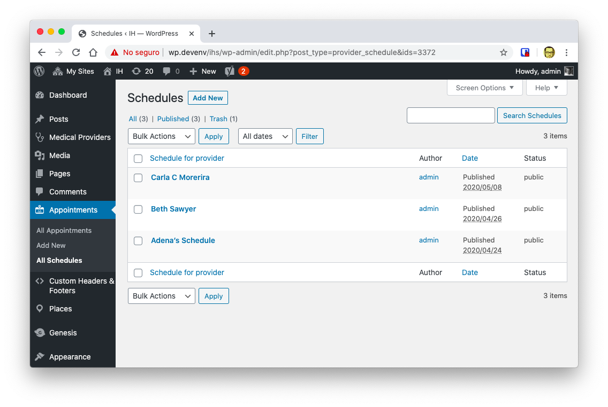
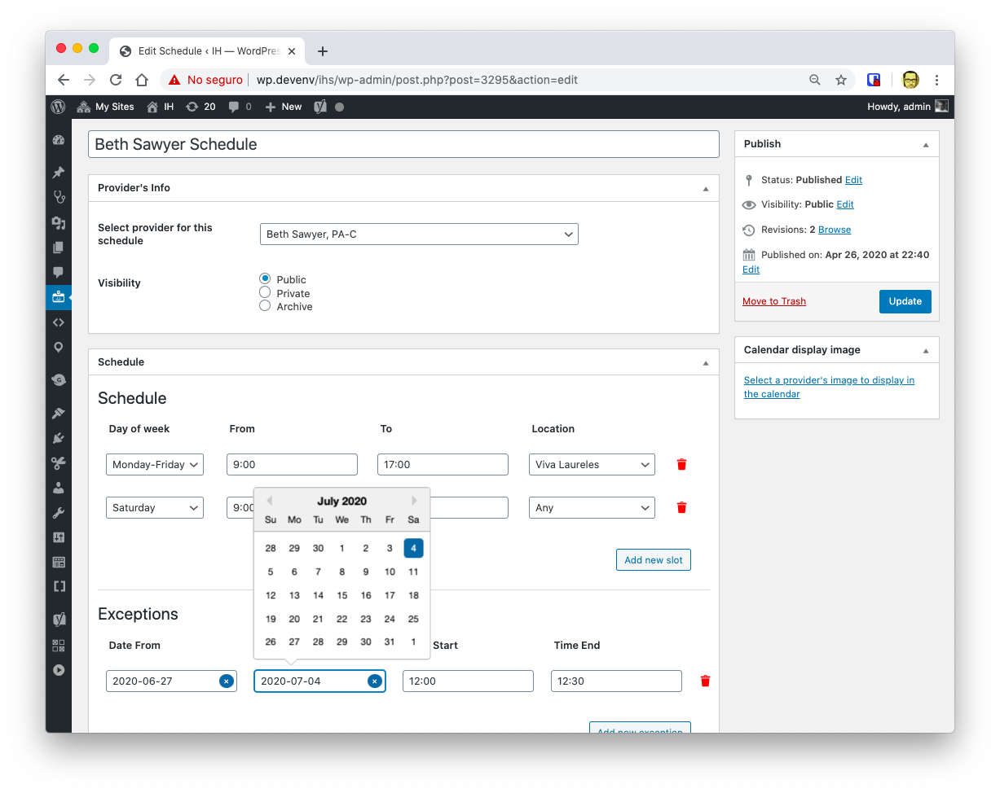

# WordPress as an Appointments Scheduling System

The project consisted on adding into WordPress scheduling capabilities. Where a patient could schedule an appointment with a specific provider or doctor.

I use the name provider since the appointment could be scheduled with an Doctor, a Therapist, a Nurse, etc.

## The project

To talk about this project requires to talk first about the client.

[iHealthSpot](https://ihealthspot.com) is a Miami based company that specializes in the creation of website for Medical Practices. Being clinics their main type of client.

One of the most common requested features of iHealthSpot clients is the ability to receive appointment requests from patients directly from the website.

The project was then to create a complementary plug-in, that interacted with the [Provider Directory Plug-in](../provider-directory-wordpress-plugin), that enabled clinic to publish its providers availability. And to enable its patients to request an appointment directly from the web-site by filling a series of configurable questions and selecting a time slot.

## Requirements

The requirements for the project where:

- It should work like a WordPress plug-in with out the need to install external ERPs or CRMs.
- The provider (doctor) information should be pulled from the data already stored in the [Provider Directory Plug-in](../provider-directly-wordpress-plugin)
- For each provider there should be an schedule where the provider's availability could be configured
- On the front-end the patient could select
  - The location if the clinic had multiple locations
  - Which provider (filtered by the selected location)
  - The time slot for the appointment
  - Add configurable information about the patients insurance and symptoms
- Selected information should be stored in an external service in order to be HIPAA compliant
- The appointment should send an Email to a staff member to confirm the appointment
- One day before the appointment, the patient should get an SMS asking for confirmation for the appointment
- The patient could confirm/deny the appointment by answering the SMS with a "yes" or a "no"
- The scheduler could be embedded in any page of the website by using a [Shortcode](https://codex.wordpress.org/shortcode)

## Solution

The consisted basically in the creation of a WordPress prolugin with 3 parts:

- A scheduler
- A REST API
- A front-end GUI for the patientients appointment creation

The front-end would communicate with the back-end using the new REST API

### The Scheduler

On the back-end a staff member could create a schedule for a doctor and select which days she/he would be available for appointments.

Also, a range of unavailable dates can be configured.

## Challenges

### Using React in the backend

At first, on the back-end, vanilla JavaScript would be used for all the scheduler interactions.

This proved to be extremely difficult since the date and time selection as the creation of time slost requried a lot of interactivity.

So after several attempts, it was decided to create the scheduler as a React application, and then embed that application on the backend.

### REST API validation

At first, I tried to make the fron-end talk to the back-end using the [ajax API](https://codex.wordpress.org/AJAX_in_Plugins). Which up to a certain point, provided all I needed.

But when the requirement of adding custom question to the patient arose, I had to switch the `ajax-admin.php` to use instead the [WordPress REST API](https://developer.wordpress.org/rest-api/) which is more flexible.

