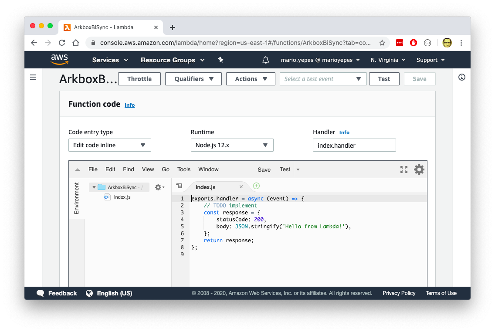

# Multiple data sources synchronization using AWS Lambda

In this project I was part of a team of 2 engineers in charge of creating a _Business Intelligence_ system for a software development client in Medellín, Colombia.

## The project

The main idea of the project was to use [Power BI](https://powerbi.microsoft.com/) to generate interactive reports for the client so it could take better decisions on how its product was working.

The main problem is that the information was scattered in several places:

- Text files in AWS S3 buckets
- MS SQL databases using AWS RDS
- PostgresSQL databases also on AWS RDS

It was decided to create a new PostgreSQL database where all the information would be unified, organized and cleaned so _Power BI_ could connect and query for records

I was in charge of creating this new PostgreSQL database, and unifying all the information there.

## The solution

As I said before, the solution was to unify all the information on a single database (a PostgreSQL database) and have all the information stored there.

And to pull all the information into a single database, 2 Lambda functions where created:

1. A lambda function that would query the SQL Server every hour looking for new records. And if any new record was found it would be inserted in the new PostgreSQL database
2. A Lambda function that would be triggered every time a new file was stored in the S3 Bucket. This Lambda would take care of parsing this new file and insert its contents in the same PostgreSQL database

## Challenges

There where several challenges aside of being a new development platform for me.

### Develop a lambda function offline

AWS Lambda is designed (at the time of this writing) to be used and developed using their online tool. This makes the version control much harder and also makes the overall development slower.

I ended up solving this problem by simulating AWS S3, AWS Dynamo and AWS RDS using [Serverless Offline](/serverless-s3-dynamodb-local-development/). I also installed an instance [PostgreSQL Locally](/install-postgresql-on-mac-with-brew/).

In this way I had all required elements to develop locally and with version control.

### PostgreSQL connection exhaustion

Maybe the hardest problem to solve, was that the files in AWS S3 came to fast. This would cause timeouts in the Lambda functions since Postgres didn't permit more that 100 of simultaneous connections.

The solution for this problem was using _Connection Pooling_ in the [PostgreSQL Node Driver](https://node-postgres.com/api/pool). Unfortunately this required a complete rewrite of the lambda function since the way to create a connection is somewhat different than using a client connection directly.

### Access control

This was an small problem at the beginning of the project where all the permissions weren't available to create triggers for the new Lambda Functions.

With the help of the client, we had to try several ACL combinations in [AWS IAM](https://aws.amazon.com/es/iam/) to achieve the final solution.

## Deliverables

Only 2 deliverables where given in this project:

- A zip file with all the Lambda Source Code
- A document on how to install the lambda function on the clients cloud
