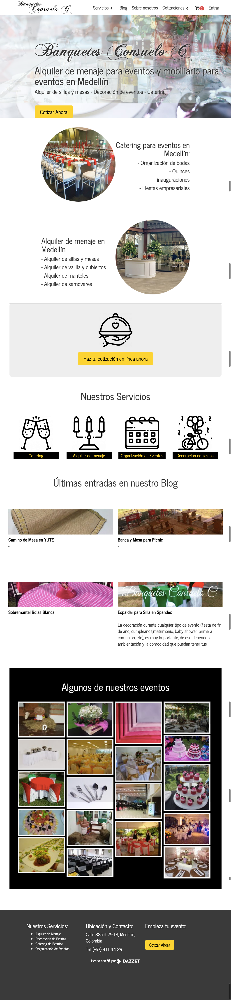
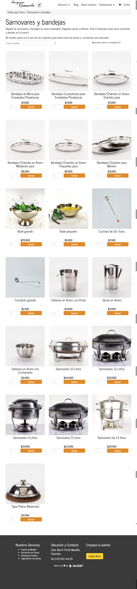
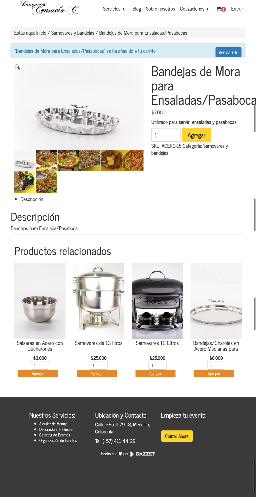
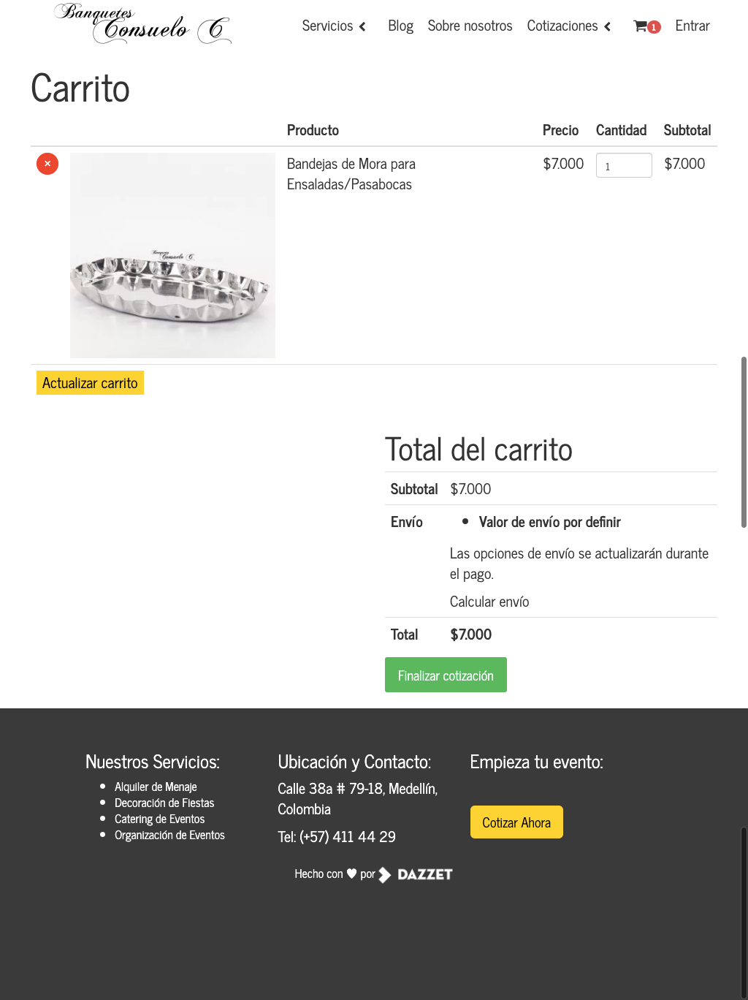
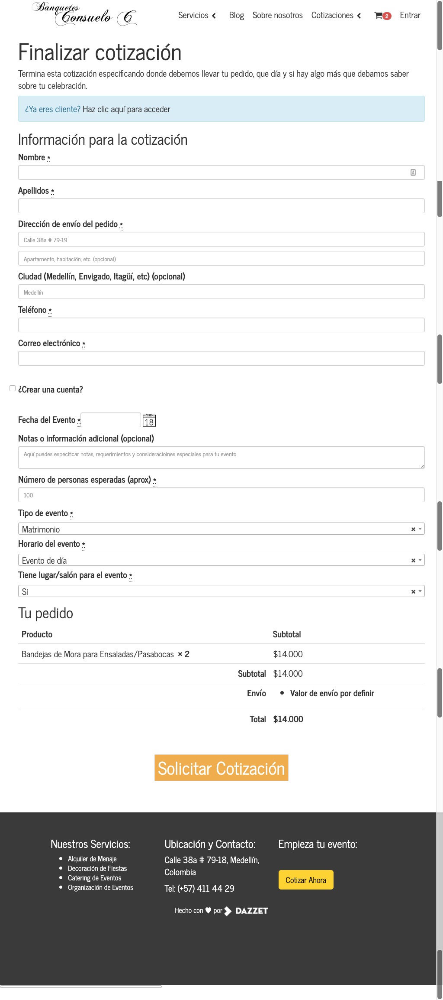

# Banquetes Consuelo C Ecommerce Implementation

This is one of the oldest sites that I created. And is for a local catering company.

This site was done using WooCommerce but with modifications so the cart works as a quotation tool.

## Home page

## Store Page

## Product Page

## Cart Page

## Checkout Page

There is a new design for the site, but its still not in production.

<iframe style="border: none;" width="800" height="450" src="https://www.figma.com/embed?embed_host=share&url=https%3A%2F%2Fwww.figma.com%2Ffile%2F2Btu84hPAA4zAM4444xZsa%2FBanquetes-Consuelo-C" allowfullscreen></iframe>
