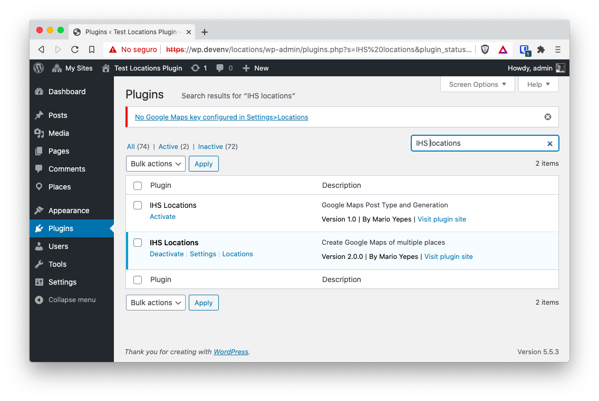
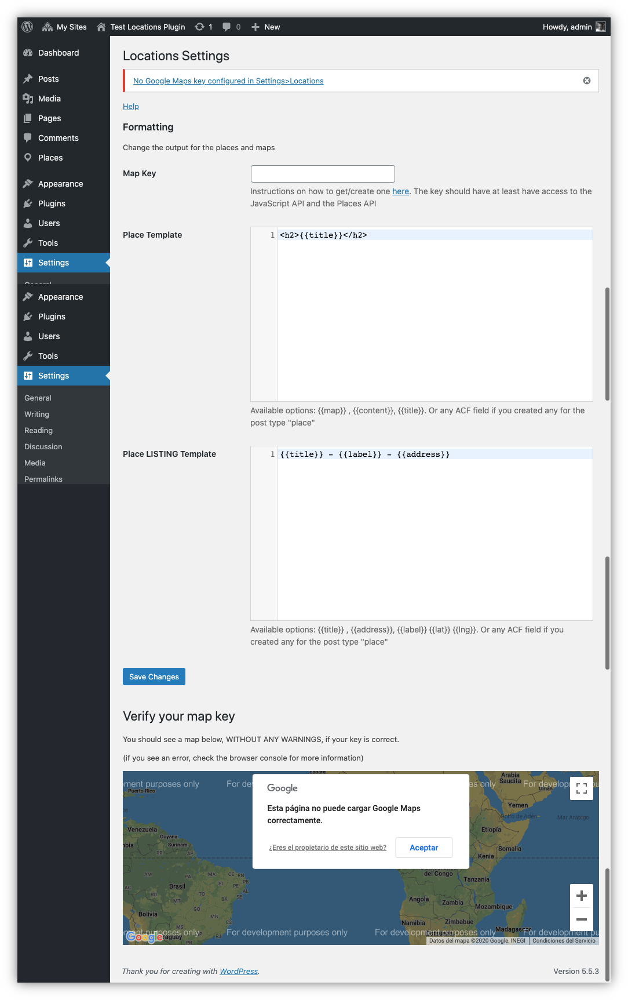
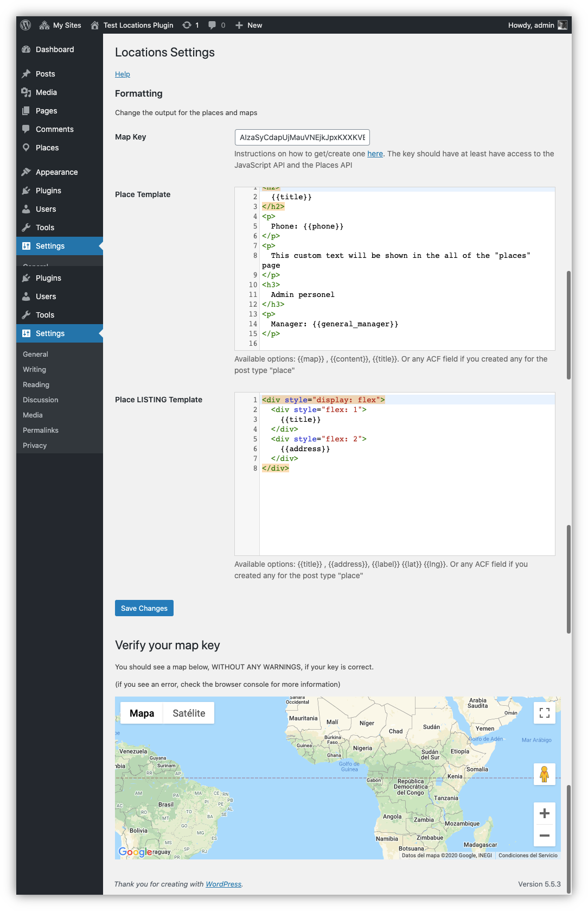
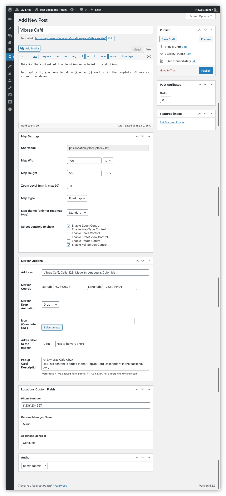
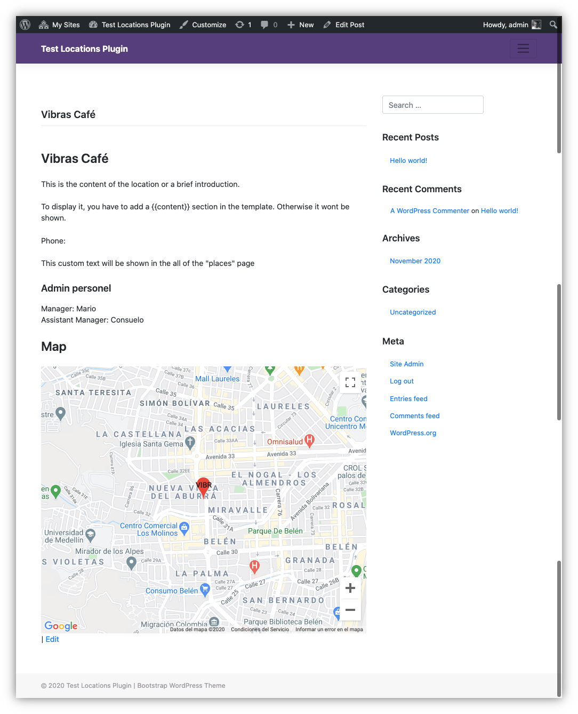
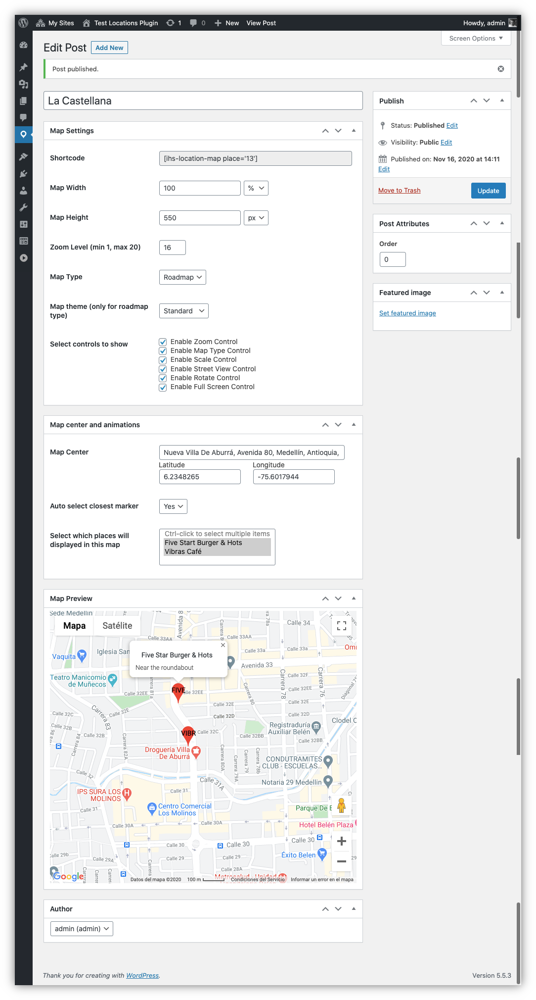
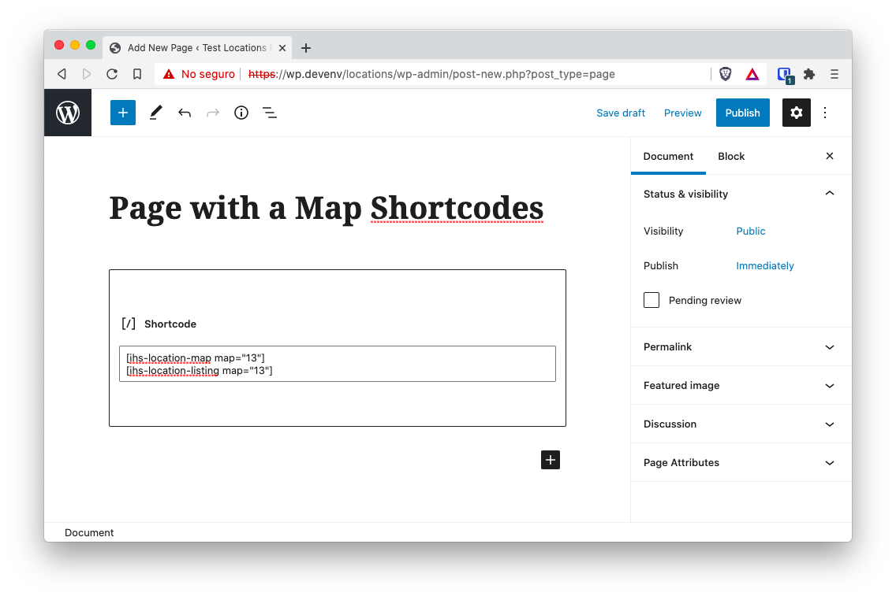
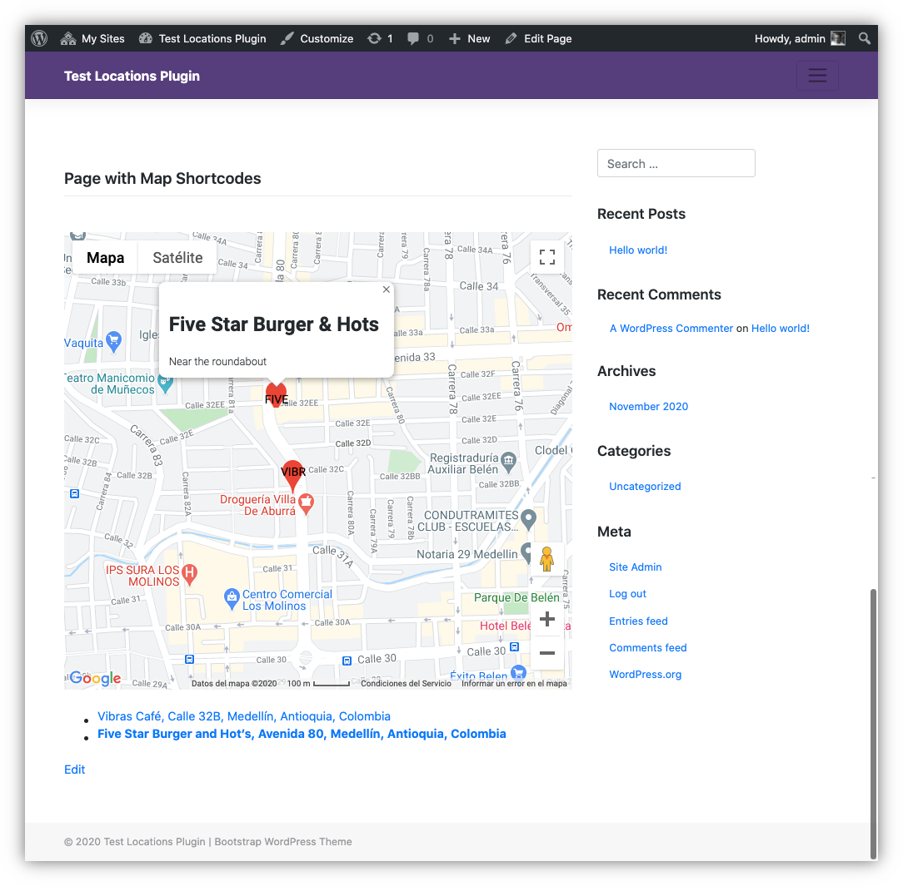

# Google Maps WordPress Plugin

The project consisted on creating a WordPress plugin that allowed a WordPress _site editor_ (a person) to embed a Google Map with multiple markers, using just a shortcode.

WordPress already has a lot of maps plugins that work with Google Maps, Bing Maps, Here WeGo and even the Open Street Map at the same time. Unfortunately, the available solutions did not meet the client requirements or were just to expensive for a multisite installation that goes over 500 sites.

The main reason to require a custom plugin, was that the client needed to create maps and have them linked to a custom database of employees, so you could show a map in a employee profile to specify where she was stationed.

## Initial Requirements

The client didn't provided a requirement list or use cases document. But this are roughly what she wanted after a couple of meetings:

- It should be a custom WordPress plugin and not an external piece of software
- The plugin should be self contained. Meaning that no other services or libraries should be required outside the Google Maps API
- The installation should be a standard WordPress installation without the need of changing variables in files like `wp-config.php`
- An _site editor_ should be able to place a map on any page or blog post using a shortcode
- A map should be able to contain multiple markers
- For each marker, the plugin should create automatically an additional map with that only marker
- The plugin should connect with the _Provider Directory_ plugin (a custom plugin the client already has) so you could link a _provider_ to a _place_ or marker
- In the _Provider Directory_ plugin, a field to select a marker should be placed
- For each map, there should be a search form that allows you to filter out markers by name or distance
- When entering a page with a map, the nearest marker to the users browser, should be animated

## The Solution

The solution was a _Locations_ plugin with the following components:

- A settings page for api configuration and template creation
- A _custom post type_ for marker information
- A _custom post type_ for map creation
- 4 shortcodes:
  - One for marker display
  - One for map display
  - One for showing the markers of a map in an _unordered list_ (`<ul>`)
  - One for adding a form next to a map so you could search for the nearest maker

## Screenshots

### Plugin activation and notifications

Upon activation, the plugin asks the _site editor_ to configure the Google Maps API

### Settings page

The Settings where you can enter the Google Maps API Key.

It also allows you to enter HTML templates on how to display the **marker** page and how to display the list of places when using the _list places_ shortcode.

The HTML templates use the [tiwg](https://twig.symfony.com/) template engine so the _site editors_ could create their templates using fields, loops, conditionals, etc. Right in the settings page.

This is an example of a settings page with all the fields.

### Marker creation page

On the plugin you have to create markers (called places per client request) and then add those markers to a map.

This is the marker creation page. There you can specify how the marker is diplayed on the front end and where th marker is placed.

> On the marker page you can see that a `[ihs-location-place place="8"]` code. This is the shortcode that you can use to place this marker in any page or blog post.

Once the marker fields are completed, you can access it on the front-end.

As you can see, the content of the _place page_ or _marker page_ is dictated by what you provided on _template field_ on the _settings page_.

### Map creation page

The _map creation_ page, is very similar to the _marker creation_ page. With two big differences:

- Instead of specifying where a marker should be place, you specify **the map center**
- You have to **select** (since you already created the markers) which markers should be added to the map.

Contrary to the markers, a _Map Page_ **is not** created. So, to display the map, you have to use the shortcode inside a page or post.

And this will be the result.

## Challenges

Aside from acquiring knowledge of the Google Maps API. Some technical and design challenges where faced.

- Since we used the JavaScript Google Maps API, it was required to encode and embed JSON code in the map pages to pass data from PHP to JavaScript
- A complete rewrite of the JavaScript was required when the client requested that the distance API should be included for _distance search_
- To make the project more manageable, it was required to use webpack for javascript bundling
- Configuring ESLint for WordPress standards required a reorganization of the code
- Some JavaScript functions required renaming to avoid conflicts with jQuery
