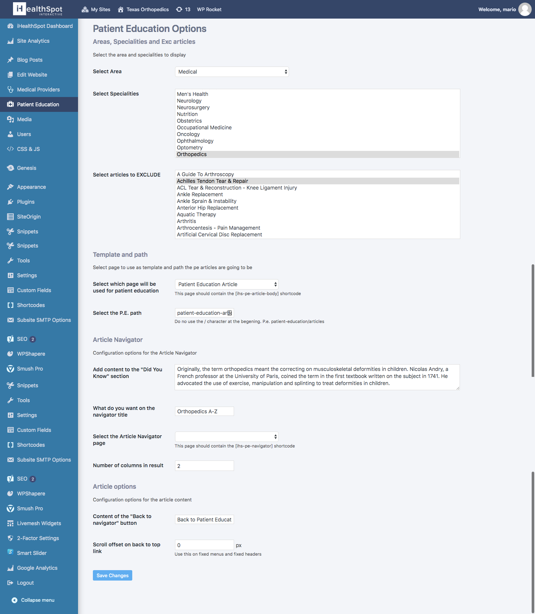

# "Patient Education" WordPress Plugin

This plugin was created for [iHealthSpot](https://ihealthspot.com), which is a Miami based company that offers website design and hosting for medical practices and hospitals.

This plugin was made so they could embed their medical database in a WordPress site just by using shortcodes.

## The Problem

The main advantage of _iHealthSpot_ over the competition is that they build a database of conditions and diagnoses with the help of a medical board, that can be published on their websites without any worries of lawsuits and copyright infractions.

The problem lied that this database resided on an external MySQL server and was designed to be used in other systems outside of WordPress.

## The Solution

The solution can be summarized in the following requirements.

- We needed a way to extract information from that eternal MySQL database into WordPress sites
- There should be a way to specify which information should be extracted into each website.
  - Which areas of knowledge
  - Which articles to exclude
- How the information got display should be possible to configure
  - The base path for each article
  - The list of diagnoses/conditions should be configurable
  - Copyright information
- The list of diagnoses/conditions should have filter tools
- It should be easy to embed the information in any page of a WordPress website.

## Example Site

There are many sites using this plugin, but one of the best examples is in the [Texas Orthopedics](https://www.txortho.com/patient-education/) website:

**Note**: The styling for this particular website was made by an internal iHealthSpot employee.

### Configuration of the plugin in one site

### The "Patient Education" database in displayed in one site

### Displaying One Article

