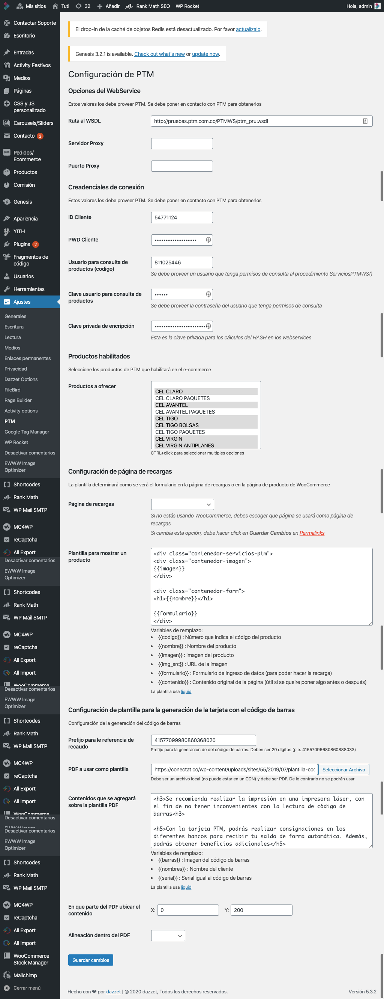
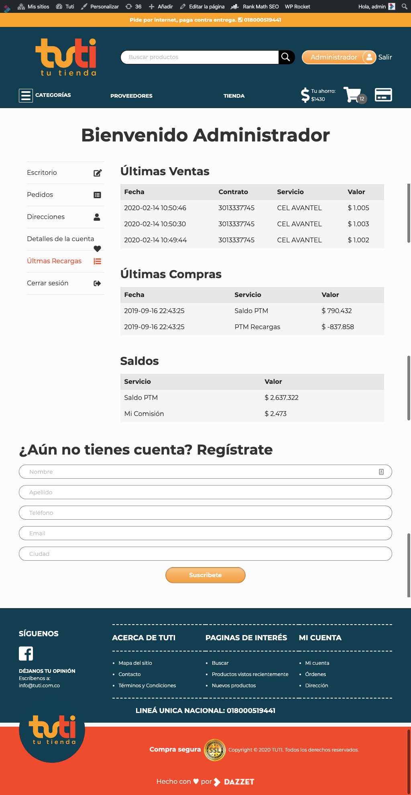
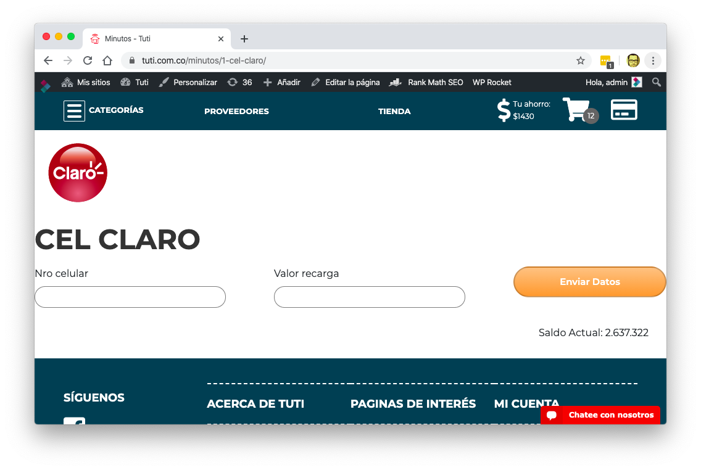

# PTM & Tuti Soap Integration

This is one of the more complex projects that I've built for a client.

The main idea of the project was to integrate [Tuti's](https://tuti.com.co) WordPress E-commerce with [PTM's](https://ptm.com.co) WebService.

[Tronex](http://www.tronex.com/es-es/NUESTRA-COMPA%C3%91%C3%8DA/QUIENES-SOMOS) is a Colombian company that started as a battery factory, and now is changing its focus to provision small neighborhood stores with products like milk, eggs, batteries, lighters, snacks, etc. without the need of the store owner to contact hundreds of providers.

[Tuti](https://tuti.com.co/) is an e-commerce platform created by Tronex so this small store owners could make quotes and orders in an E-commerce like environment with the main difference being the payment was done offline directly to a Tronex representative 20 days after the delivery. Also, this e-commerce can only be accessed by pre-registered store owners.

One of the products that this small owners sell very frequently to its clients are "minutes plans".

Minute Plans allows a user to purchase something like "10 minutes of talk time on my phone". And that's where PTM comes in: PTM allows any person to sell minutes to any kind of client.

For a store owner to be able to sell "minute plans" he/she needs to create an account in PTM recharge a balance using an special document with personal barcode directly on a bank or authorized "minutes resellers".

The main idea of this integration was to sell _PTM minute plans_ directly in _Tuti's e-commerce_.

The initial requirements for this project where:

- Display PTM's products inside Tuti's e-commerce like regular WooCommerce products
- Display only approved PTM's products in tuti.com.co
- Each store owner has a balance with PTM. Only store owners with available balance could make sells.
- An store owner should be able to verify his/her balance once logged in.
- On PTM's products show an inline form that allows the store owner to sell "minute plans"
- Before each minute purchase was done, the store owner should be able to see his/her balance.
- The e-commerce should be able to create the barcode document (a PDF) for each store owner.

## Technologies used

For the development environment I used a [Vagrant Machine](https://www.vagrantup.com/) with [Ubuntu](https://ubuntu.com/) 18.04 installed inside of it.

Also, I used a pre-created script to install [WordPress](https://wordpress.org) using [WP-CLI](https://wp-cli.org/) from the command line. This script installs Wordpress and a short list of required plugins like [ACF](https://www.advancedcustomfields.com/), [Code Snippets](https://wordpress.org/plugins/code-snippets/) and a basic template.

## Coding Standards

This project followed WordPress coding standards almost to a 100%. To achieve that I used the following [packagist](https://packagist.org) packages:

- `dealerdirect/phpcodesniffer-composer-installer` To install coding standards locally
- `phpcompatibility/php-compatibility` To verify compatibility with PHP version 7 and up
- `phpcompatibility/phpcompatibility-wp` To verify WordPress compatibility 5.0 and up
- `sirbrillig/phpcs-variable-analysis` To check for unused variables
- `wp-coding-standards/wpcs` For general WordPress coding standards

## Testing

A project of this magnitude _has to have testing_

Mainly on the integration steps. Its very hard to have a good integration without some kind of tests.

I used for testing the following packages.

- `phpunit/phpunit` To execute the test cases.
- `vlucas/phpdotenv` To create a file with usernames and passwords to be use in the test.

## Soap Integration

SOAP is something that PHP does not handle very well. Specially when you want to convert SOAP calls to PHP objects.

To achieve that, I used `wsdl2phpgenerator/wsdl2phpgenerator` which is a project that analyzes a local or remote WSDL file and creates a hierarchy of PHP classes so you can make calls to a remote server just by creating and calling methods on PHP objects.

## PDF Generation from HTML

For the PDF generation I used `mpdf/mpdf` since it allows you to create PDF files from correctly formatted **html**.

And since I was creating a PDF from HTML, I also needed a template system. The client already had experience with _Shopify's Liquid_ system, so I used `liquid/liquid` template system.

## Barcodes

Also, the PDF file needed custom barcodes that where different for each of the e-commerce clients. So the barcode needed to be created on the fly. I ended up using  `picqer/php-barcode-generator`, which generates a PNG file that could be embedded in the PDF.

## Currency format

Finally, I used `indibeast/currency-formatter` version 1.0 to display balances in currency format.

## Screenshots

### Settings Page

The settings page for this project was somewhat long since you needed to configure the following:

- The _SOAP_ end point to make the requests and send information
- The proxy if any was used for the SOAP server
- The auth credentials for querying for information on the WebService
- On which page the _Refill_ form should be displayed
- A selection box to chose which products of all the available will be offered in the e-commerce
- A template for the generation of a PDF with barcode information

### Account Page

In the account page we added a new path for showing the last sells recorded in PTM and the PTM Balance:

### Sell minute plans

For each PTM product, there was a form to sell minute plans.

The form had to send information using ajax requests and the number and type of fields changed from product to product
