Recently I had a client that asked that the documentation of the application I made for them to be on videos posted privately on YouTube.

That's no problem...

But there is the inconvenience of having to upload videos one by one using the [YouTube](https://studio.youtube.com) interface.

That's why I recurred to the [YouTube Uploader](https://github.com/porjo/youtubeuploader) tool. To be able to script the upload of all the videos.

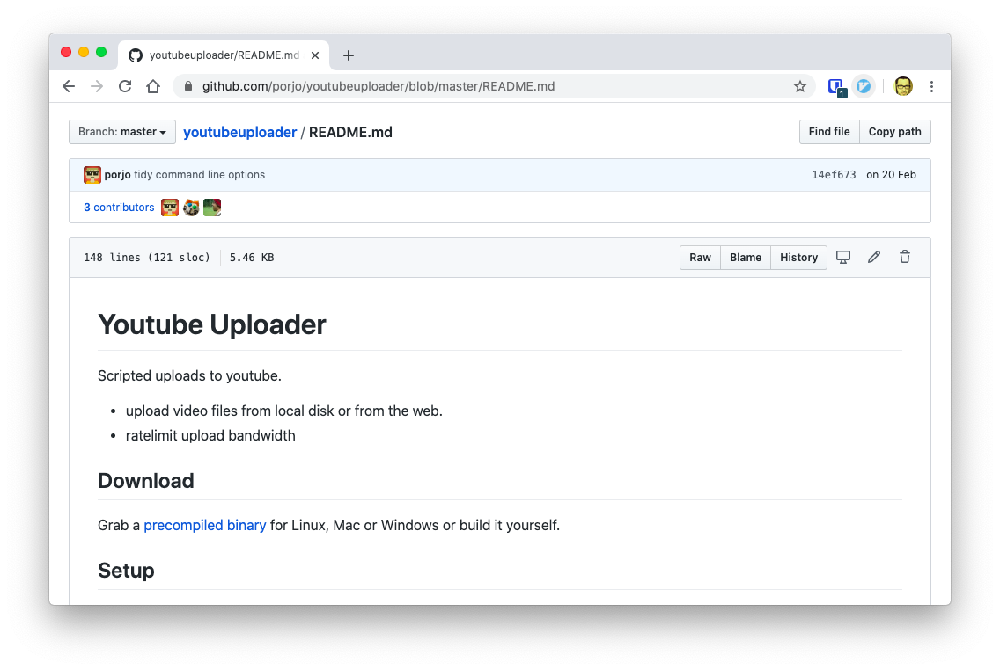

So lets see how you can grab this tool and how can you install it to upload videos to _Youtube_ from the command line.

## Installation

_YouTube Uploader_ is written in [Go](https://golang.org). And if a tool is written in Go it's very, very likely that the product is a binary file and that is multi platform.

This is exactly the case with _YouTube Uploader_. The download its just a zipped binary file. And there are multiple binary files, one for each architecture.

So the installation consist in:

- Download the correct **binary** from it's [GitHub Releases](https://github.com/porjo/youtubeuploader/releases) page.
- Place the binary somewhere where you can execute it
- There is no 3rd step.

```bash
# The Mac version is suffixed by mac_amd64
curl -o youtubeuploader.zip -L  https://github.com/porjo/youtubeuploader/releases/download/20.04/youtubeuploader_mac_amd64.zip
unzip youtubeuploader.zip
mv youtubeuploader_mac_amd64 youtubeuploader
chmod 755 youtubeuploader # Make it executable
sudo mv youtubeuploader /usr/local/bin
youtubeuploader -v
```

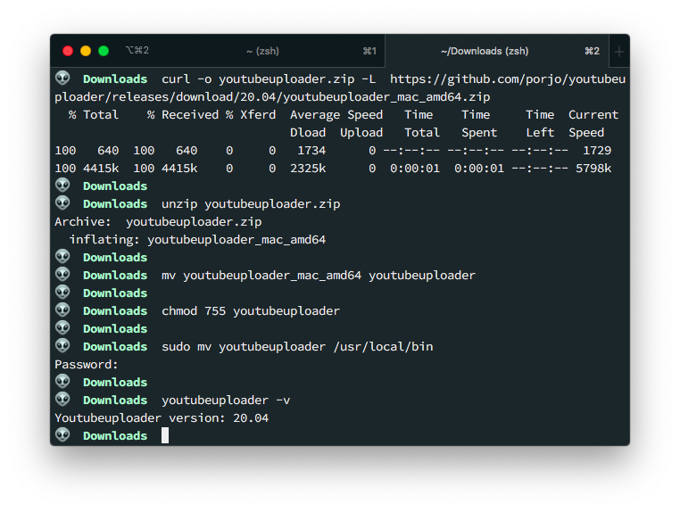

## Create Google's Developers Account

Before we start to upload videos to YouTube, we need to authorize the tool using an API key. And for that you need to have an account in [Google's Developer Console](https://console.developers.google.com/).

So if you don't have an account there yet. Go and create one... Done? good, lets move on.

## Create a new Client ID and Secret for Youtube Uploader

_Youtube Uploader_ uses OAuth to authenticate itself to Youtube. This means that you have to create a **Client ID** and a **Secret** in [Google Developer Console](https://console.developers.google.com/).

So start by creating a new project for this.

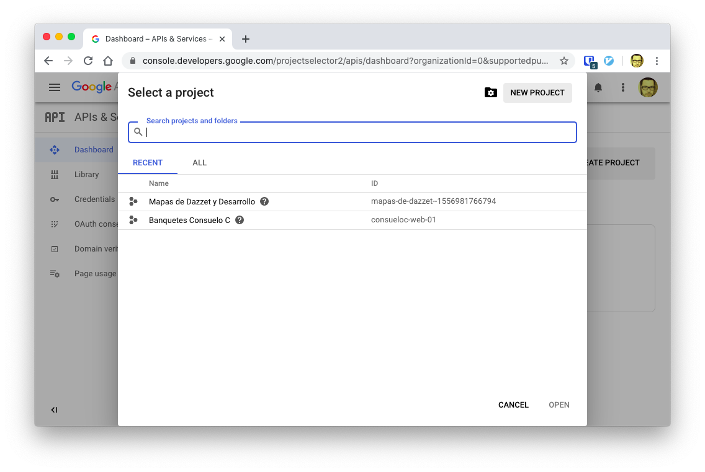

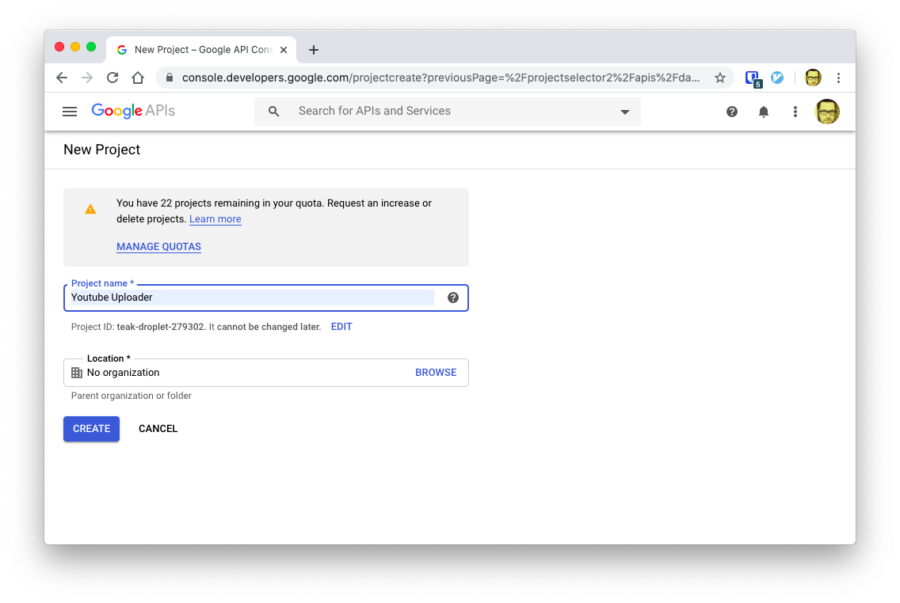

Actually, creating a project is not required, but its a good idea in case you have any security issue.

## Enable the Youtube API

Now that we have a new project, head over to the API library by clicking on **Library** on the **Left Sidebar**


And look for _YouTube Data API V3_

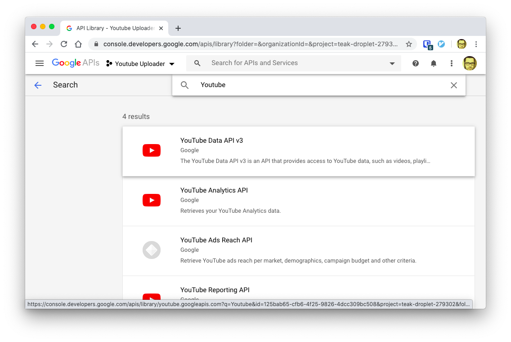

And enable it

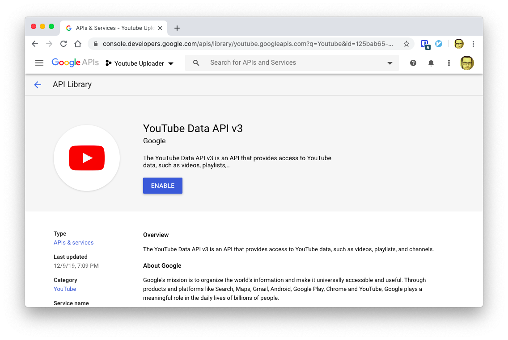

## Create OAuth credentials

First of all, be sure that you are still on the Youtube API configuration and then select _Create Credentials_ for a _OAuth Client_


On the next screen select _Web Application_

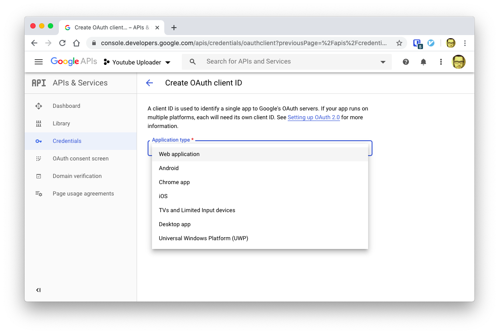

Give it a **name** and use the callback `http://localhost:8080/oauth2callback`. This is very important!.

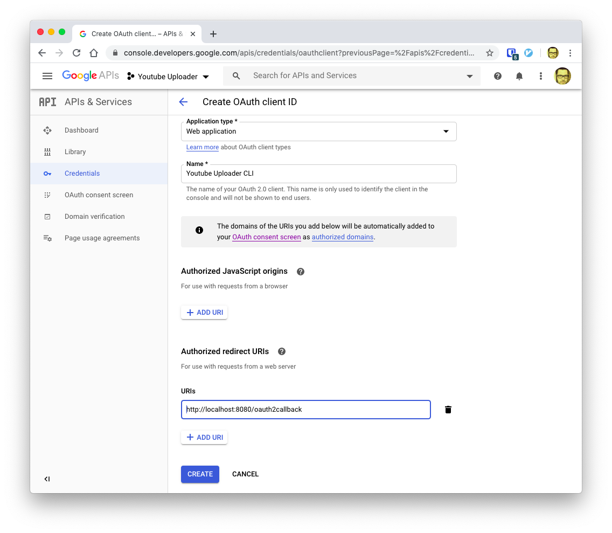

Finally take a not of the `Client API ID` and the `Secret` since we're going to need them on the next step.

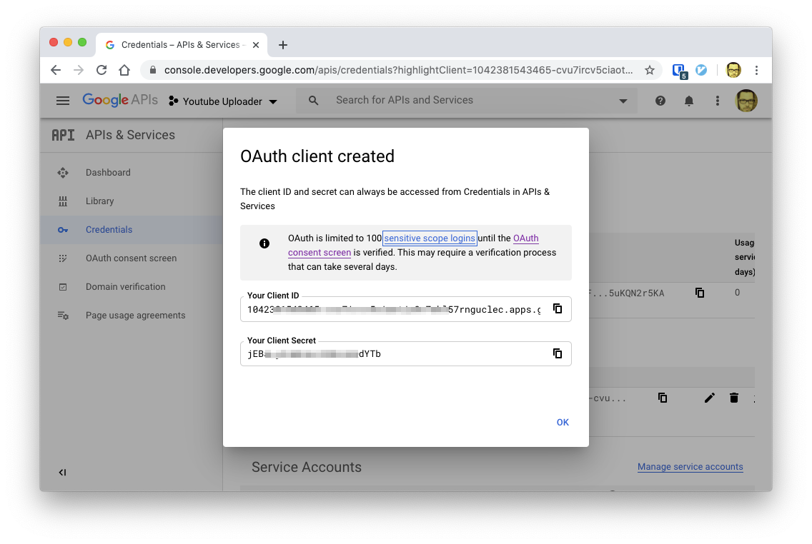

## Configure your workspace

_Youtube Uplaoder_ needs 2 files on your local file system in order to work:

- An `client_secrets.json` file
- A `request.token` file

This files have to be placed in the directory where you are going to execute the command.

The creation of the `client_secrets.json` is pretty straight forward. Just use a text editor to create the file with the following structure:

```json
{
  "installed": {
    "client_id": "YOUR_CLIENT_ID",
    "client_secret": "YOUR_CLIENT_SECRET",
    "redirect_uris": ["http://localhost:8080/oauth2callback"],
    "auth_uri": "https://accounts.google.com/o/oauth2/auth",
    "token_uri": "https://accounts.google.com/o/oauth2/token"
  }
}
```

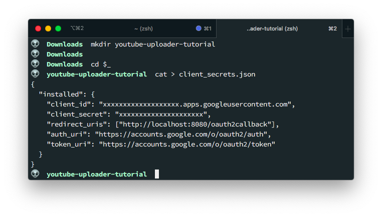

Remember to change `YOUR_CLIENT_ID` and `YOUR_CLIENT_SECRET` for your actual data:


The `request.token` file will be created for us **in the first upload**. Meaning, the next step.

## Uploading your first file

As I said before, **when you upload your first file, the `request.token` will get created**. That's why the first upload is so important.

So have a `.mp4` file at hand and execute the following **upload command**:

```bash
youtubeuploader -filename "my-local-file.mp4" -title "This is my first vide"
```

> Obviously, change the name of the file and the title accordingly


_Youtube Uploader_ will open a new browser window asking to select an account to use for the uploading:

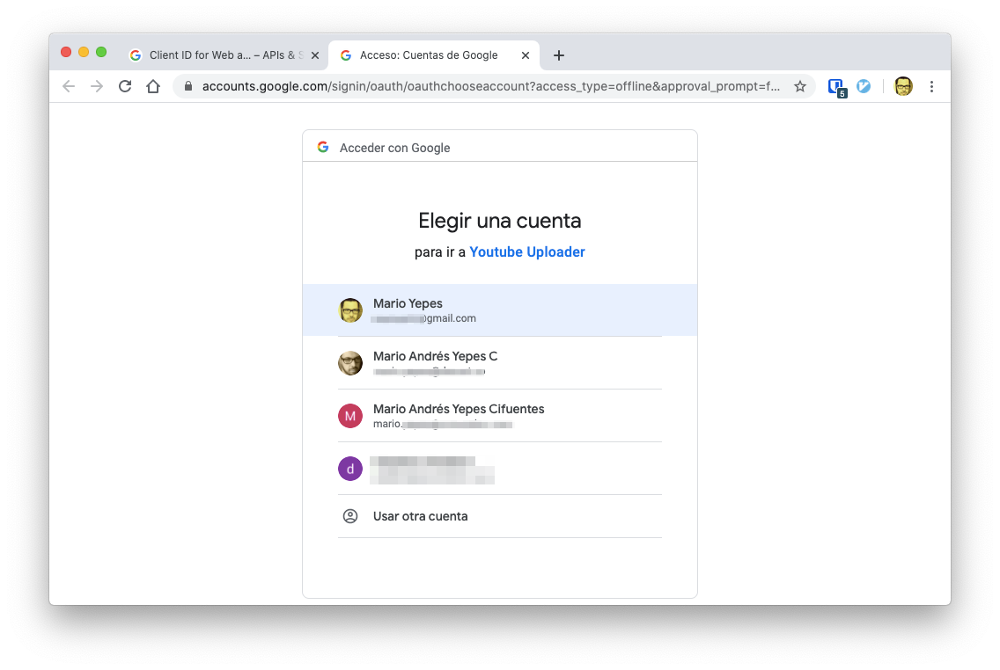

You'll get a **certificate error** which is pretty normal in our case

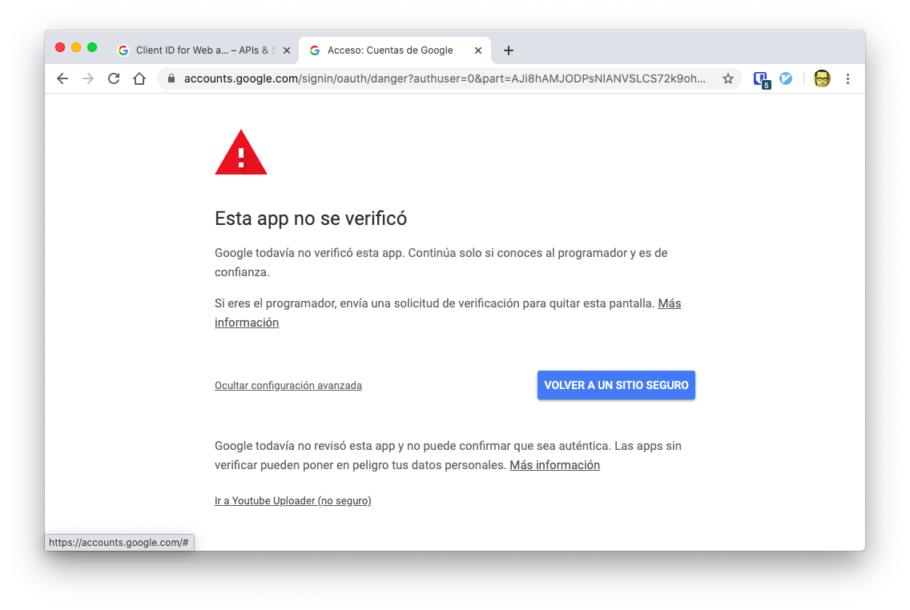

And then you'll get asked if you want to grant upload permissions to _Youtube Uploader_

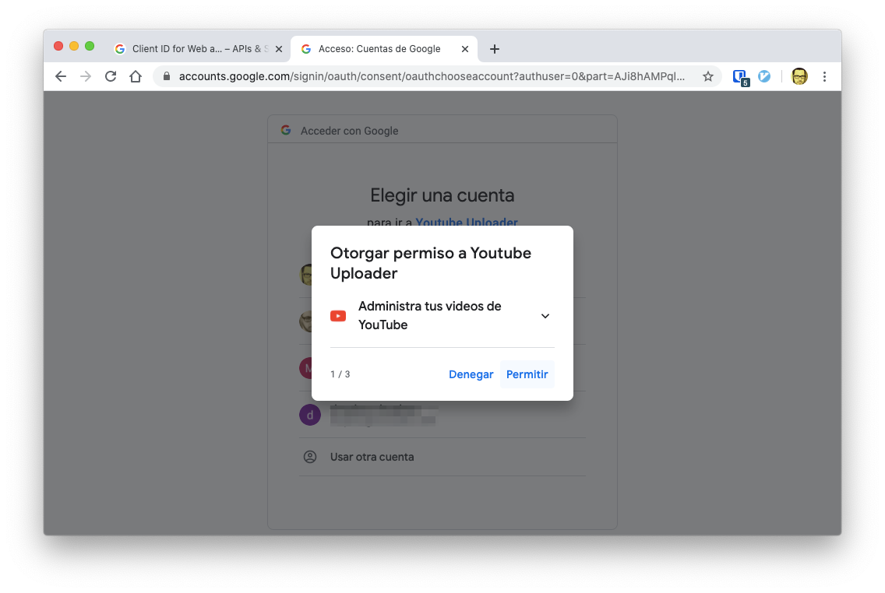

And then a success message of permissions granted:

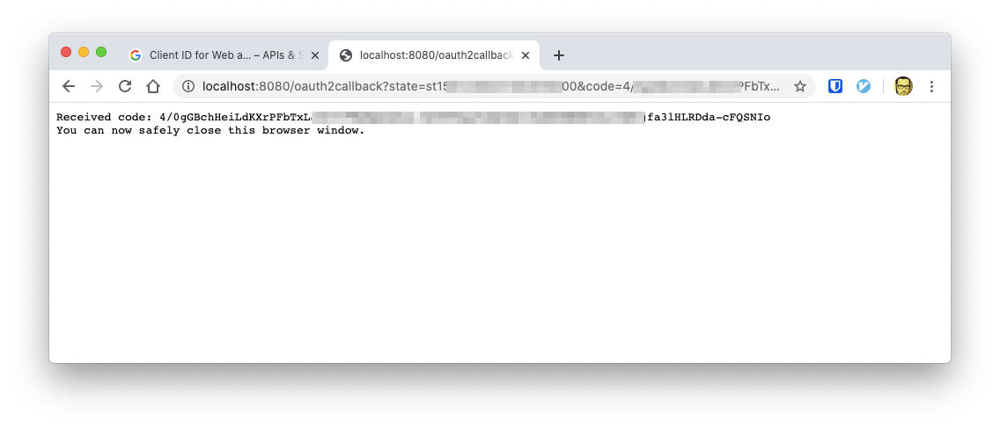

In that moment. The `request.token` will get created, and your file will start uploading.

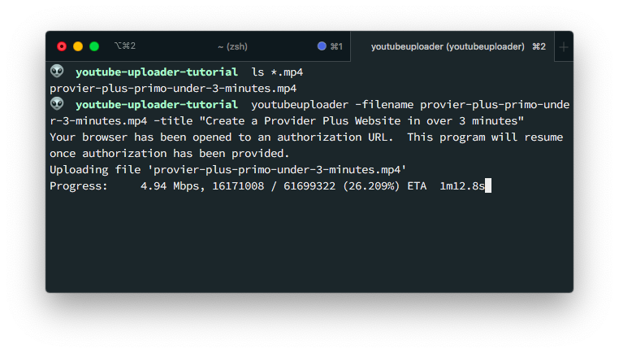

You can check that the `request.token` got created

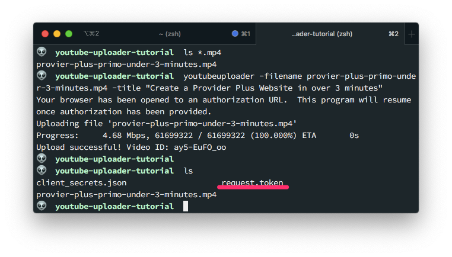

## Next Uploads

Fortunately the Auth section for _Youtube Uploader_ only has to be executed once. **But you have to remember to keep the `client_secrets.json` and your `request.token` around**!

Otherwise you have to go trough the authorization part again.

## Summary

So to use _Youtube Uploader_ you just have to:

- Create a Google Developer Account
- Enable the YouTube API library
- Create an OAuth Client ID and Secret for Youtube
- Create a `client_secrets.json` file with the Client ID and Secret
- Execute the upload command to create the `request.token`
- Save those 2 files for future uploads
- Unless specified, the uploaded videos are _private_

## Interesting Parammeters

You can get a complete list of the supported parammeters by executing

```bash
youtubeuploader -h
```

But here is a list of the most useful ones:

- `-description "The description"` If none specified the description will be _Uploaded by Youtubeuploader_
- `-filename /path/to/video/file.mp4` The local file to upload
- `-privacy <private|public|unlisted>` One of `private`, `public`, `unlisted`
- `-secrets /path/to/client_secrets.json` When you have the `.json` file on another directory
- `-title "The video title"`
- `-thumbnail /path/or/url/to/thumbnail.png` You can upload the thumbnail too
