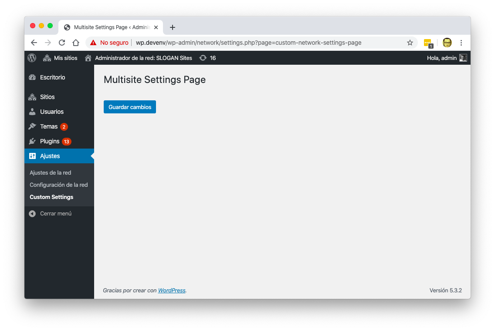
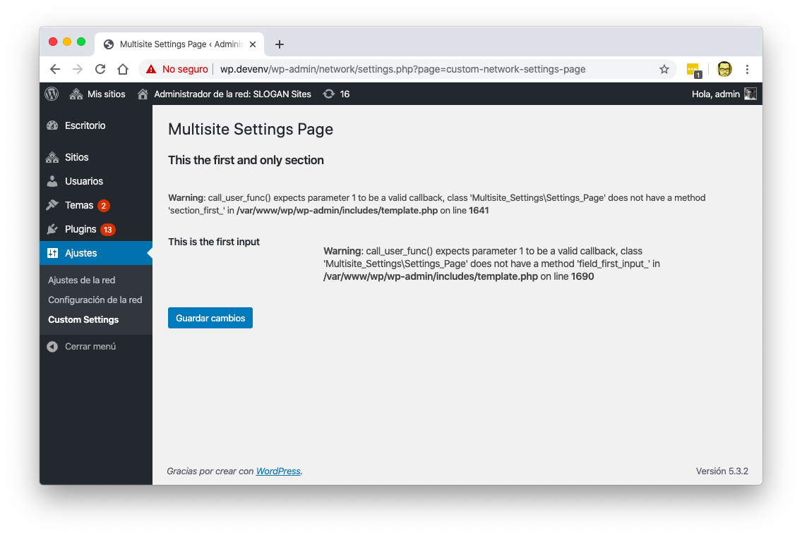
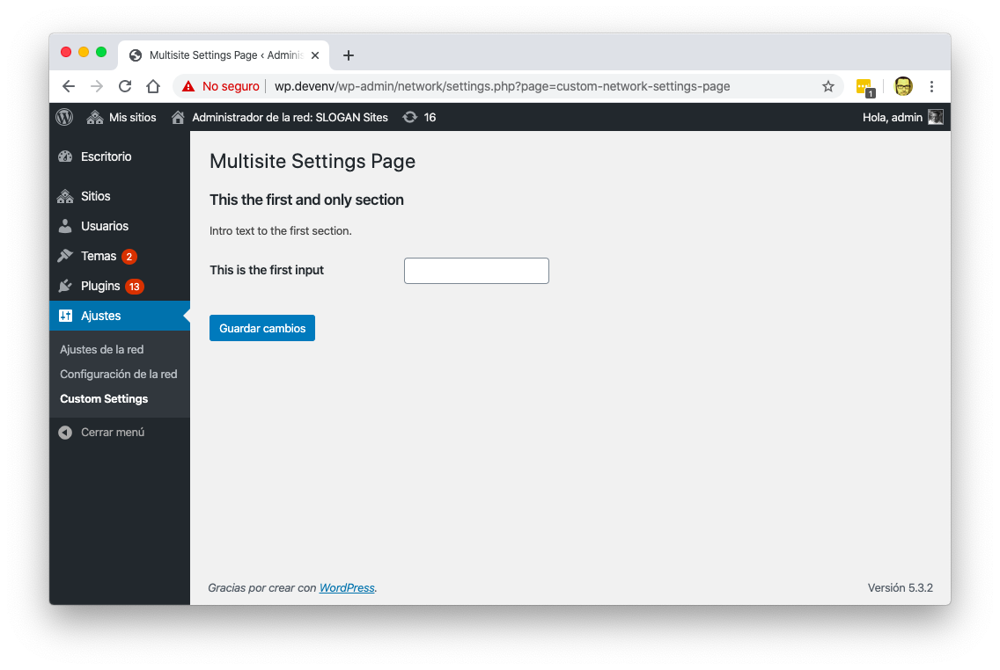
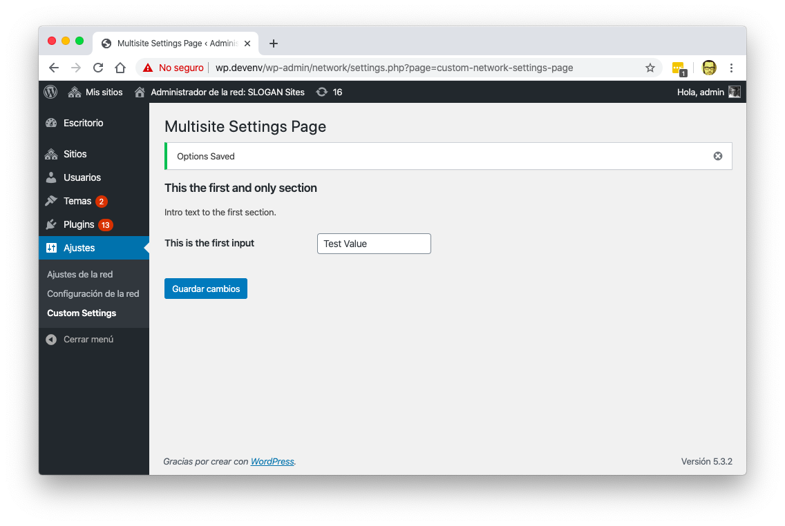

Creating a settings page with the [WordPress settings API](https://developer.wordpress.org/plugins/settings/settings-api/) is pretty straight forward, just add a sub-menu, add the page content and finally create the sections and fields.

But creating a **Network** Settings Page, well... Thats a completely different animal.

_Network Settings_ or _Multisite Settings_ do not follow the same process because the _Wordpress Settings API_ saves data on a **site level** instead of a network level. So you have to do some custom steps to have a settings page for a multisite.

By the end of this tutorial you'll have a 1 file plugin with just a settings page that saves data on the multisite.

## Start the plugin

This is pretty easy, just create a file in the plugins directory:

```bash
cd /path/to/wordpress
mkdir wp-content/plugins/wordpress-multisite-settings
touch wp-content/plugins/wordpress-multisite-settings/wordpress-multisite-settings.php
```

And add the comments for a new plugin:

```php
<?php
/**
 * WordPress Multisite Settings
 *
 * Add here your plugin description, and change all the fields.
 *
 * @link              https://marioyepes.com
 * @since             1.0.0
 * @package           Wordpress_Multisite_Settings
 *
 * @wordpress-plugin
 * Plugin Name:       WordPress Multisite Settings
 * Plugin URI:        https://marioyepes.com
 * Description:       This is a short description of what the plugin does. It's displayed in the WordPress admin area.
 * Version:           1.0.0
 * Author:            Mario Yepes
 * Author URI:        https://marioyepes.com
 * License:           GPL-2.0+
 * License URI:       http://www.gnu.org/licenses/gpl-2.0.txt
 * Text Domain:       multisite-settings
 * Domain Path:       /languages
 * Network:           true
 */
```

## Create a class that contains all the functionality

I really like to enclose all the functionality I add to WordPress in a class. So **in that same file** create a new class:

```php
class Settings_Page {

  /**
   * This will be used for the SubMenu URL in the settings page and to verify which variables to save.
   *
   * @var string
   */
  protected $settings_slug = 'custom-network-settings';

  /**
   * Class Constructor.
   */
  public function __construct() {

  }

}

// Initialize the execution.
new Settings_Page();
```

So, that class has just one instance variable called `$settings_slug`.

The idea behind that variable is that _detecting_ and _saving_ **Network** options requires _name pattern recognition_. So I have to create a bunch of calls and variables with the same prefix. And that prefix its what we just saved in that variable.

## Create a submenu and the page

Now lets add some functionality. Lets create a new Page called `Custom Settings` in the `Settings` section of the **admin sidebar**

```php {7,15-26,31-50}
<?php
  /**
   * Class Constructor.
   */
  public function __construct() {
    // Register function for settings page creation.
    add_action( 'network_admin_menu', array( $this, 'menu_and_fields' ) );
  }

  /**
   * Creates the sub-menu page and register the multisite settings.
   *
   * @return void
   */
  public function menu_and_fields() {

    // Create the submenu and register the page creation function.
    add_submenu_page(
      'settings.php',
      __( 'Multisite Settings Page', 'multisite-settings' ),
      __( 'Custom Settings', 'multisite-settings' ),
      'manage_network_options',
      $this->settings_slug . '-page',
      array( $this, 'create_page' )
    );
  }

  /**
   * This creates the settings page itself.
   */
  public function create_page() {
    ?>
    <?php if ( isset( $_GET['updated'] ) ) : ?>
      <div id="message" class="updated notice is-dismissible">
        <p><?php esc_html_e( 'Options Saved', 'multisite-settings' ); ?></p>
      </div>
    <?php endif; ?>

    <div class="wrap">
      <h1><?php echo esc_attr( get_admin_page_title() ); ?></h1>
      <form action="edit.php?action=<?php echo esc_attr( $this->settings_slug ); ?>-update" method="POST">

        <?php
            settings_fields( $this->settings_slug . '-page' );
            do_settings_sections( $this->settings_slug . '-page' );
            submit_button();
        ?>
      </form>
    </div>
    <?php
  }

```

2 new functions??? How come?

Well, by adding the `network_admin_menu` hook in the constructor, you are required to create a new function that registers the new sub-menu hence the function `menu_and_fields`. And the function that register the new sub-menu requires you to create a function that generates the page html hence the function `create_page`. That's why we had to add 2 new functions.

Also, notice that we're using `$this->settings_slug` as a suffix for page and variable creation all over the place. That will make our life easier when we're trying to track which variables we need to store.

And we're done... Creating and **empty settings page** that is.



## Creating the sections and fields

Lets continue by creating a section and a field in that new settings page. for that we need to **change** the `menu_and_fields` function. Specifically we'll be calling the `add_settings_section`, `register_setting` and `add_settings_field` functions:

```php {18-34}
  /**
   * Creates the sub-menu page and register the multisite settings.
   *
   * @return void
   */
  public function menu_and_fields() {

    // Create the submenu and register the page creation function.
    add_submenu_page(
      'settings.php',
      __( 'Multisite Settings Page', 'multisite-settings' ),
      __( 'Custom Settings', 'multisite-settings' ),
      'manage_network_options',
      $this->settings_slug . '-page',
      array( $this, 'create_page' )
    );

    // Register a new section on the page.
    add_settings_section(
      'default-section',
      __( 'This the first and only section', 'multisite-settings' ),
      array( $this, 'section_first' ),
      $this->settings_slug . '-page'
    );

    // Register a variable and add a field to update it.
    register_setting( $this->settings_slug . '-page', 'first_input_var' );
    add_settings_field(
      'test-input',
      __( 'This is the first input', 'multisite-settings' ),
      array( $this, 'field_first_input' ), // callback.
      $this->settings_slug . '-page', // page.
      'default-section' // section.
    );
  }
```

What did we do?...

- We created a new section called `default-section` in the settings page with the title **This the first and only section**,
- We registered a new settings option called `first_input_var`
- We created a new field called `test-input` with the title **This is the first input**

If we where to visit that settings page, we would get an errors asking for 2 missing functions: `section_first` and `field_first_input`.



The `section_first` function is used to declare the beginning of a section in the settings page. The `field_first_input` function should take care of creating a form input field:

```php
  /**
   * Html after the new section title.
   *
   * @return void
   */
  public function section_first() {
    esc_html_e( 'Intro text to the first section.', 'multisite-settings' );
  }

  /**
   * Creates and input field.
   *
   * @return void
   */
  public function field_first_input() {
    $val = get_site_option( 'first_input_var', '' );
    echo '<input type="text" name="first_input_var" value="' . esc_attr( $val ) . '" />';
  }
```

And that's it. We have a _Settings Page_ that does NOT save settings. In the next step we have to fix that.



## Saving Network Settings

To save network settings as opposed to site settings we have to build our own saving function and registered in WordPress.

So first add the following line in the constructor:

```php {9}
  /**
   * Class Constructor.
   */
  public function __construct() {
    // Register function for settings page creation.
    add_action( 'network_admin_menu', array( $this, 'menu_and_fields' ) );

    // Register function to execute when saving data.
    add_action( 'network_admin_edit_' . $this->settings_slug . '-update', array( $this, 'update' ) );
  }
```

Notice again the usage of `$this->settings_slug`. Hope you appreciate now the fact that we stored the slug in a variable 😉.

Now. This is where the magic happens. This is what you need to do different when working in a multisite: You have to create a function (I called it `update`) that takes care of saving the site-wide options:

```php
  /**
   * Multisite options require its own update function. Here we make the actual update.
   */
  public function update() {
    check_admin_referer( $this->settings_slug . '-page-options' );
    global $new_whitelist_options;

    $options = $new_whitelist_options[ $this->settings_slug . '-page' ];

    foreach ( $options as $option ) {
      if ( isset( $_POST[ $option ] ) ) {
        update_site_option( $option, $_POST[ $option ] );
      } else {
        delete_site_option( $option );
      }
    }

    wp_safe_redirect(
      add_query_arg(
        array(
          'page'    => $this->settings_slug . '-page',
          'updated' => 'true',
        ),
        network_admin_url( 'settings.php' )
      )
    );
    exit;
  }
```

And that's really it.. We're done.



## Complete code

Instead of showing you the complete class. Let me point you to the [GitHub Repo](https://github.com/marioy47/wordpress-multisite-settings) where all the code I created here is saved.
