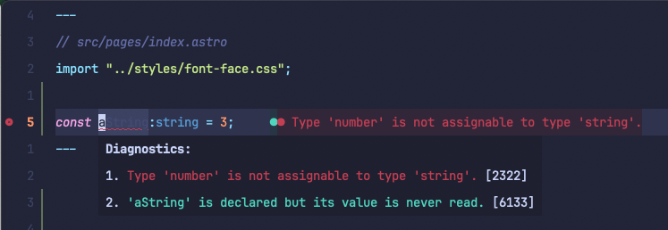
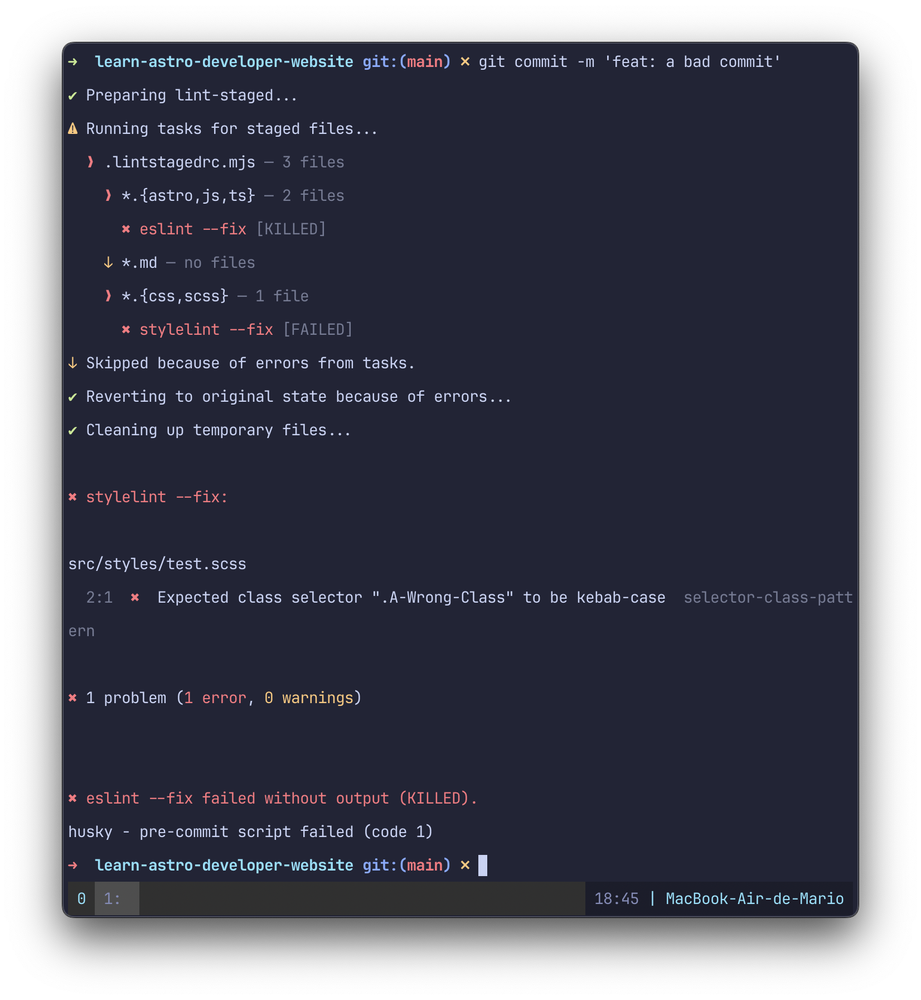
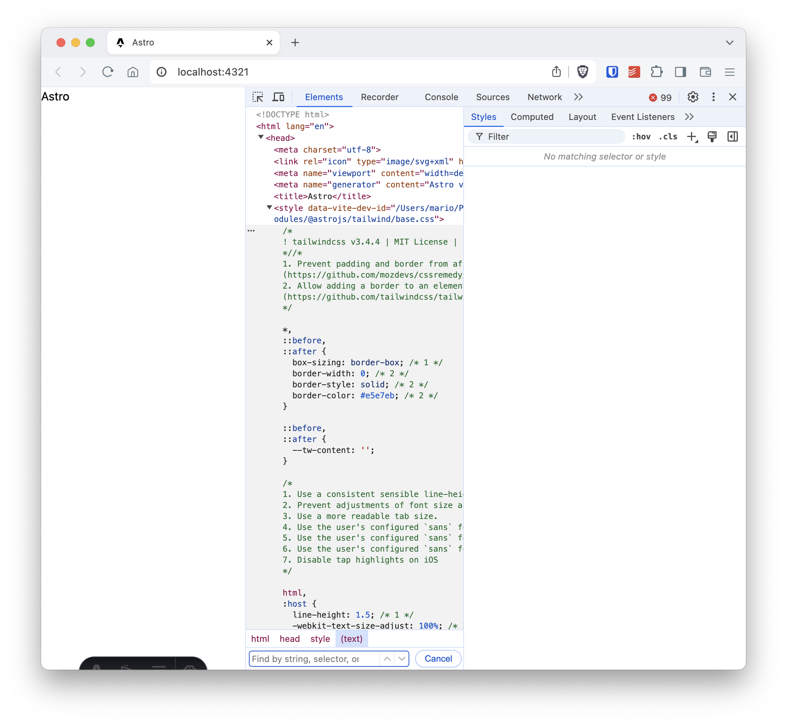
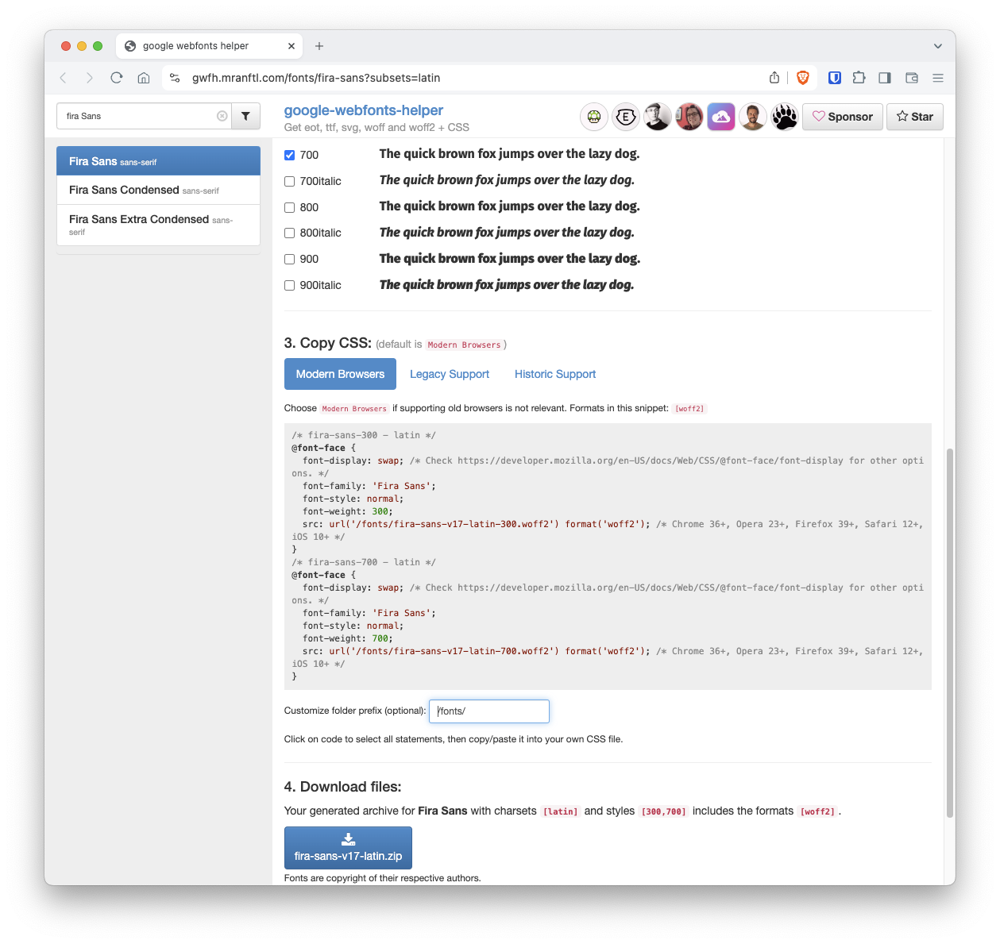
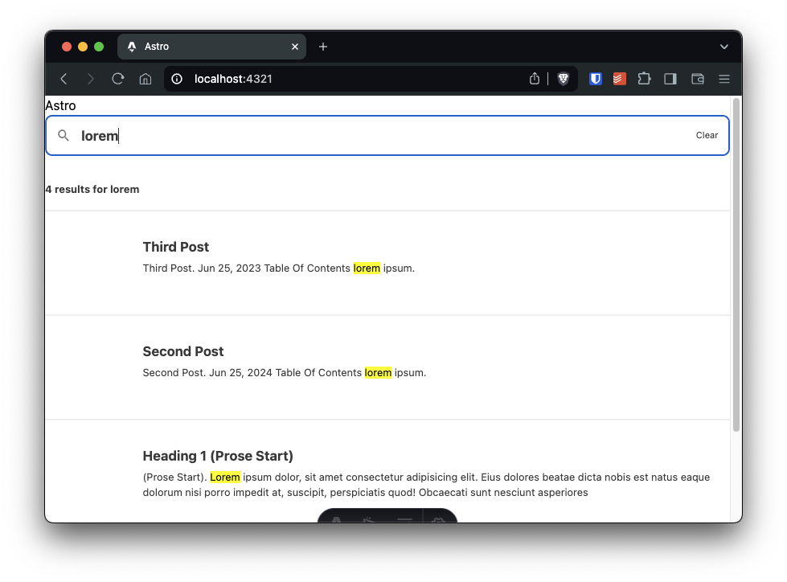

I create developer websites with Astro once in a while, and one of the annoyances is that I find is that most of the starters either do too much or not enough for my needs. So I decided to create my own starter with the following items:

- Use _Code Quality_ tools for catching code and spelling errors before the code gets to the repository
- Uses a supported CSS framework (Tailwind) for styling pages
- Supports multiple collections for archive content like blog posts
- Content is created in Markdown
- Supports syntax highlighting in code blocks
- Has local search

## TL;DR

If you don't want to read this whole article, and just want to use this starter, you can just execute `astro@create` like this:

```bash
npm create astro@latest my-new-website -- --template=marioy47/astro-developer-website-starter
cd my-new-website
echo "SITE_NAME=My Blog" >> .env
echo "SITE_URL=https://my-site-domain.com" >> .env
npm start
```

Just change `my-new-website` with the name of your site

## Starter Setup

The first step is to install Astro without a template obviously

```bash
npm create astro@latest learn-astro-developer-website -- --install --git --typescript strict --no
```

You'll get is if you want sample files or an empty site. I opted for **empty**.

This will render the following structure:

```bash
learn-astro-developer-website
├── README.md
├── astro.config.mjs
├── package-lock.json
├── package.json
├── public
│   └── favicon.svg
├── src
│   ├── env.d.ts
│   └── pages
│       └── index.astro
└── tsconfig.json

4 directories, 8 files
```

As you can see, the only "real" source file is `src/pages/index.astro`. The rest are configuration files (and an icon).

## Code Quality Setup

The idea is that any code issue or spelling errors are catch **locally** before it even hits the repository in GitHub. In my case I'll be installing and configuring

- Editor Config
- Prettier
- ESLint
- Markdownlint
- StyleLint
- Commit Lint

### Editor Config

If your IDE supports [EditorConfig](https://editorconfig.org) configuration (most IDEs do), [this](https://github.com/withastro/astro/blob/main/.editorconfig) is the one the official project uses:

```toml
# ./.editorconfig

# top-most EditorConfig file
root = true

[*]
charset = utf-8
end_of_line = lf
indent_size = 2
indent_style = tab
insert_final_newline = true
trim_trailing_whitespace = false

[{.*,*.md,*.json,*.toml,*.yml,*.json5}]
indent_style = space
```

### Prettier Setup

Lest's continue by adding [Prettier](https://prettier.io) to the project. But take into account that we need formatting for JavaScript/TypeScript **and** Astro code. That's why we have to install 2 Prettier plugins:

- `prettier-plugin-astro`. Which adds support for `.astro` files and does code formatting in the _Front Matter_ section
- `prettier-plugin-organize-imports`. Which will sort imports in JavaScript/TypeScript files

```bash
npm i -D prettier prettier-plugin-astro prettier-plugin-organize-imports
```

After the installation, we need to create a `.prettierrc.mjs` file with the following configuration as [`prettier-plugin-astro`](https://github.com/withastro/prettier-plugin-astro?tab=readme-ov-file#recommended-configuration) recommends:

_Note: The `m` in `.mjs` is to force the use of modules without the need of updating `pacakge.json`_

```javascript
// .prettierrc.mjs

/** @type {import("prettier").Config} */
export default {
  plugins: ["prettier-plugin-astro", "prettier-plugin-organize-imports"],
  overrides: [
    {
      files: "*.astro",
      options: {
        parser: "astro",
      },
      printWidth: 1200, // because tailwind uses VERY long lines
    },
  ],
};
```

A little test we can do would be to use execute `prettier` agains a couple of test files:

```bash
npx prettier src/scripts/test-prettier.ts src/pages/test-prettier.astro
```

```typescript
// src/scripts/test-prettier.ts (BEFORE)
function testFunction() {
  return "a string";
}
```

```typescript
// src/scripts/test-prettier.ts (AFTER)
function testFunction() {
  return "a string";
}
```

```astro
---
// src/pagest/test-prettier.astro (BEFORE)

let a: string;
---

<div><p>A Test</p></div>
```

```astro
---
// src/pagest/test.astro (AFTER)
let a: string;
---

<div><p>A Test</p></div>
```

### ESLint

For code _linting_ I've chosen [ESLint](https://eslint.org) even though there are some faster tools now. The reason being that ESLint is the only linting tool mature enough to handle such an heterogeneous configuration.

To install it you can use the `@eslint/config` package like so:

```bash
npm init @eslint/config@latest
```

This will start a wizard, to which I answer in the following fashion:

```text
✔ How would you like to use ESLint? · problems
✔ What type of modules does your project use? · esm
✔ Which framework does your project use? · none
✔ Does your project use TypeScript? · typescript
✔ Where does your code run? · browser
The config that you've selected requires the following dependencies:
    eslint@9.x, globals, @eslint/js, typescript-eslint
    ✔ Would you like to install them now? · Yes
✔ Which package manager do you want to use? · npm
```

Since at the time of this writing, ESLint 9.5 was fairly new, I got this warning:

```text {4}
Note that some plugins currently do not support ESLint v9 yet.
You may need to use '--force' when installing, or add the following to your package.json:
"overrides": { "eslint": "^9.5.0" }
```

I recommend you add that _overrides_ in your `package.json` to avoid any "conflict" errors in the **next steps**.

Also, to avoid any TypeScript issues in the future, I renamed the config file to make it a _module_:

```bash
mv eslint.config.js eslint.config.mjs
```

You can execute `npx eslint src/scripts/test-eslint.ts` to tes that it works on **JavaScript** errors:

```text
/Users/mario/Projects/learn-astro-developer-website/src/scripts/test-eslint.ts
  2:10  error  'testFunction' is defined but never used  @typescript-eslint/no-unused-vars

✖ 1 problem (1 error, 0 warnings)
```

Now, `npx eslint src/pages/index.astro` will render errors because `eslint` doesn't know how to handle `*.astro` files:

```text
/Users/mario/Projects/learn-astro-developer-website/src/pages/index.astro
  0:0  warning  File ignored because no matching configuration was supplied

✖ 1 problem (0 errors, 1 warning)
```

Let's fix that by installing and configuring [`eslint-plugin-astro`](https://github.com/ota-meshi/eslint-plugin-astro/):

```bash
npm i -D eslint-plugin-astro @typescript-eslint/parser
```

_Note: The "parser" is to detect **TypeScript** errors in Astro files_

To also catch **and fix format errors**, we need to install Prettier's ESLint plugin and rules:

```bash
npm i -D eslint-plugin-prettier eslint-config-prettier
```

With all plugins installed, lets modify the default `eslint.config.mjs` file:

```javascript
// eslint.config.mjs

import pluginJs from "@eslint/js";
import globals from "globals";
import tseslint from "typescript-eslint";

// Additional plugins
import eslintPluginAstro from "eslint-plugin-astro";
import eslintPluginPrettierRecommended from "eslint-plugin-prettier/recommended";

/** @type {import("typescript-eslint").Config} */
export default [
  { files: ["**/*.{js,mjs,cjs,ts,astro}"] }, // Add the astro extension
  { languageOptions: { globals: globals.browser } },
  pluginJs.configs.recommended,
  ...tseslint.configs.recommended,
  // Add the following plugin rules
  ...eslintPluginAstro.configs.recommended,
  eslintPluginPrettierRecommended,
  {
    settings: { react: { version: "detect" } }, // in case you install React latter
  },
  {
    rules: {
      "prettier/prettier": "warn", // Code style as "errors" and not "warnings" seem like an overkill to me.
    },
  },
];
```

Now your IDE should be able to catch errors.



Also, you can test it out by executing `eslint` directly on files:

```bash
npx eslint src/scripts/test-eslint.ts src/pages/test-prettier.astro
```

```text

/Users/mario/Projects/learn-astro-developer-website/src/pages/test-prettier.astro
   4:4    warning  Replace `⏎a:string` with `·a:·string;`                                                                                   prettier/prettier
   5:1    error    'a' is defined but never used                                                                                            @typescript-eslint/no-unused-vars
   6:4    warning  Insert `⏎`                                                                                                               prettier/prettier
   7:305  warning  Delete `⏎⏎↹↹`                                                                                                            prettier/prettier
  12:1    warning  Replace `#id_and_underscores·{·text-transform:·uppercase;` with `↹#id_and_underscores·{⏎↹↹text-transform:·uppercase;⏎↹`  prettier/prettier
  13:1    warning  Insert `↹`                                                                                                               prettier/prettier
  14:1    warning  Insert `↹↹`                                                                                                              prettier/prettier
  15:1    warning  Insert `↹`                                                                                                               prettier/prettier

/Users/mario/Projects/learn-astro-developer-website/src/scripts/test-eslint.ts
  3:10  error    'testFunction' is defined but never used                     @typescript-eslint/no-unused-vars
  3:26  warning  Replace `·return·"a·string";·` with `⏎↹return·"a·string";⏎`  prettier/prettier

✖ 10 problems (2 errors, 8 warnings)
  0 errors and 8 warnings potentially fixable with the `--fix` option.


```

Since Astro is changing so much lately, you might need to read [ESLint configuration](https://eslint.org/docs/latest/use/configure/configuration-files) document to add or remove rules from your config.

### Markdownlint

A developer blog will most likely be written in [Markdown](https://www.markdownguide.org/). So lets install configure a linter for it:

```bash
npm i -D markdownlint-cli
```

To configure it, create the file `.markdownlint.json` configuration file with the errors you want to catch and/or ignore:

```javascript
// .markdownlint.json
{
  "default": true,
  "heading-style": {
    "style": "atx"
  },
  "line-length": false,
  "no-inline-html": {
    "allowed_elements": ["iframe", "video", "source"]
  },
  "no-hard-tabs": {
    "code_blocks": false
  }
}
```

This configuration basically says:

- Apply the `default` rules
- Force [ATX](https://github.com/DavidAnson/markdownlint/blob/main/doc/md003.md) heading style. This marks as errors heading created with underlined `=` signs for instance
- Disable the `line-length` rule since a blog can have very long prose lines
- Allow "some" HTML tags that I normally use
- And do not reformat "tabs" in blocks of code since I write a lot about WordPress and WordPress uses tabs.

The easiest way to test this is executing

```bash
npx markdownlint README.md
```

If you get errors of the `line-length` being more 80, then you have an error in your configuration file.

### Stylelint

When it comes to Stylelint, we need to make sure the [configuration](https://stylelint.io/user-guide/configure/) supports Astro. That's why we need to add the [`styelint-config-astro`](https://github.com/mattpfeffer/stylelint-config-astro) package.

```bash
npm i -D stylelint stylelint-config-standard stylelint-prettier stylelint-config-astro
```

And in the configuration file we need to enable both the _recommended_ and _astro_ configurations:

```javascript
// .stylellintrc.mjs

/** @type {import('stylelint').Config} */
export default {
  extends: [
    "stylelint-config-standard",
    "stylelint-config-astro",
    "stylelint-prettier/recommended",
  ],
};
```

Now you can have formatting for your `*.astro`, `*.css` and `*.scss` files:

```bash
npx stylelint src/styles/test-stylelint.scss src/pages/test-prettier.astro
```

```text
src/styles/test-stylelint.scss
  1:1  ✖  Replace "⏎.A-Wrong-Class·{·background-color:·red;·" with ".A-Wrong-Class·{⏎↹background-color:·red;"  prettier/prettier
  2:1  ✖  Expected class selector ".A-Wrong-Class" to be kebab-case                                            selector-class-pattern
  3:2  ✖  Expected empty line before at-rule                                                                   at-rule-empty-line-before
  4:1  ✖  Delete "⏎"                                                                                           prettier/prettier
  6:1  ✖  Delete "⏎"                                                                                           prettier/prettier

src/pages/test-prettier.astro
  13:1  ✖  Expected id selector "#id_and_underscores" to be kebab-case  selector-id-pattern
  14:1  ✖  Expected empty line before rule                              rule-empty-line-before
  14:1  ✖  Expected class selector ".A-WRONG_NAME" to be kebab-case     selector-class-pattern

✖ 8 problems (8 errors, 0 warnings)
  2 errors potentially fixable with the "--fix" option.
```

### cSpell

You wan to have good spelling in your articles, right? Let's configure cSpell then:

```bash
npm install -D cspell
```

And the configuration file is basically which source code paths and which words we want to ignore:

```json
// .cspell.json
{
  "version": "0.2",
  "language": "en",
  "words": [
    "astro",
    "astrojs",
    "fira",
    "mario",
    "pagefind",
    "tsconfigs",
    "tseslint",
    "yepes"
  ],
  "ignorePaths": [
    ".cspell.json",
    ".git/",
    ".gitattributes",
    ".gitignore",
    ".gitignore",
    ".vscode/**",
    "node_modules"
  ]
}
```

To test it out, just execute `cspell` with `npx`:

```bash
npx cspell .
```

In my case, the `README.md` file was giving me a lot of issues because of astro related terminology. So I remove most of it's contents.

An finally a small tip: You can add a custom dictionary to **a file** to limit the number of errors. For instance, in the `src/pages/index.astro`, I added the `lorem-ipsum` dictionary to prevent any errors because of that:

```html {4}
---
// src/pages/test.astro

// cSpell:dictionaries lorem-ipsum
---

<html lang="en">
  <!-- ... -->
  <body>
    <h1>Astro</h1>
    <p>
      Lorem ipsum dolor sit amet consectetur, adipisicing elit. Mollitia
      repudiandae illo blanditiis! Aperiam officiis, placeat repellat architecto
      nihil amet! Nobis dolorem dicta beatae maiores aspernatur officia libero
      nam inventore accusantium.
    </p>
  </body>
</html>
<!-- ... -->
```

### Commitlint, Lintstaged and Husky

I've discussed [multiple](https://marioyepes.com/blog/laravel-project-linting-formatting-code-analysis-setup/) [times](https://marioyepes.com/blog/eslint-prettier-wordpress-config/) how to configure this tools. So I'm just going to add here the install commands and the configuration files:

```bash
npm i -D @commitlint/{cli,config-conventional} lint-staged husky
```

To configure `commitlint` we just need to tell it that we are going to use the _conventional_ rules:

```javascript
// .commitlintrc.mjs

/** @type {import("@commitlint/config-conventional").Config} */
export default {
  extends: [
    "@commitlint/config-conventional", // scoped packages are not prefixed
  ],
};
```

To configure `lint-staged` is just a matter of specifying the "format" or "lint" command we want to run when a file is staged:

```javascript
// .lintstagedrc.mjs

/** @type {import("@commitlint/config-conventional").Config} */
export default {
  "*.{astro,js,ts}": "eslint --fix",
  "*.md": "markdownlint --fix",
  "*.{css,scss}": "stylelint --fix",
};
```

To configure Husky use the `init` wizard and then add the `commitlint` and `lint-staged` commands to the scripts:

```bash
npm init husky

echo "npx --no -- commitlint --edit \$1" > .husky/commit-msg
echo "npx lint-staged --relative" > .husky/pre-commit
```

Now, every time you try to commit, you'll get linting and formatting automatically:



## Adding Tailwind CSS Framework

With the _Code Quality_ section finished, we can focus on configuring a CSS framework. In my case I opted for [Tailwind](https://tailwindcss.com/).

The process we are going to follow is:

- Install the Astro Tailwind integration
- Create a global CSS file
- Install a custom font family
- Configure the custom font family in Tailwind
- Configure the "dark" mode to work with a toggle instead of the OS preferences
- Configure the code quality tools to recognize Tailwinds syntax

### Installing and Configuring Tailwind

Since we will use a custom font, we are not only going to install the [Astro Tailwind integration](https://docs.astro.build/en/guides/integrations-guide/tailwind/), but also the [Tailwind's Typhography](https://docs.astro.build/en/recipes/tailwind-rendered-markdown/#setting-up-tailwindcsstypography) plugin

```bash
npx astro add tailwind
# You can safely say Yes to all
```

This will:

- Add the `tailwind()` integration in `astro/config/mjs`
- Create the `tailwind.config.mjs` in the root of the project
- Automatically inject Tailwind CSS to all pages

You can test that you have tailwind by looking at the source code of the `index.astro` page in your browser:



If you are curious on what astro `npx astro add tailwind` does, you can review [this](https://docs.astro.build/en/guides/integrations-guide/tailwind/#manual-install) documents with the steps that the command executes.

### Create a `global.css` file to add CSS

Easy:

```bash
mkdir src/styles/
touch src/styles/global.css
```

Then add the following contents to that file:

```css
/* src/styles/global.css */

@tailwind base;
@tailwind components;
@tailwind utilities;
```

And in import that file in all the `.astro` files:

```astro
---
// src/pages/index.astro
import "../styles/global.css";
---
```

### Customize Tailwind's Font Family

In my case (and almost every case) you want to change the default `sans` font in Tailwind. This requires the following:

- Download the correct `woff2` font files and place them in the `public/fonts/` folder.
- Create a CSS file (I created min in `src/styles/font-face.css`) with the correct `@font-face` CSS declarations for this font
- Use the font in an `.astro` file trough the `import` statement

An easy way to achieve the first 2 goals is to use the [Google-Webfonts-Helper](https://gwfh.mranftl.com/fonts/fira-sans?subsets=latin) tool. This will create a `.zip` file with the required fonts, and create the correct `@font-face` CSS code that you can **copy & paste**.



Just as a reference, my `font-face.css` file looks like this:

```css
/* src/styles/font-face.css */

/* fira-sans-300 - latin */
@font-face {
  font-display: swap; /* Check https://developer.mozilla.org/en-US/docs/Web/CSS/@font-face/font-display for other options. */
  font-family: "Fira Sans";
  font-style: normal;
  font-weight: 300;
  src: url("../fonts/fira-sans-v17-latin-300.woff2") format("woff2"); /* Chrome 36+, Opera 23+, Firefox 39+, Safari 12+, iOS 10+ */
}
/* fira-sans-300italic - latin */
@font-face {
  font-display: swap; /* Check https://developer.mozilla.org/en-US/docs/Web/CSS/@font-face/font-display for other options. */
  font-family: "Fira Sans";
  font-style: italic;
  font-weight: 300;
  src: url("../fonts/fira-sans-v17-latin-300italic.woff2") format("woff2"); /* Chrome 36+, Opera 23+, Firefox 39+, Safari 12+, iOS 10+ */
}
/* fira-sans-700 - latin */
@font-face {
  font-display: swap; /* Check https://developer.mozilla.org/en-US/docs/Web/CSS/@font-face/font-display for other options. */
  font-family: "Fira Sans";
  font-style: normal;
  font-weight: 700;
  src: url("../fonts/fira-sans-v17-latin-700.woff2") format("woff2"); /* Chrome 36+, Opera 23+, Firefox 39+, Safari 12+, iOS 10+ */
}
/* fira-sans-700italic - latin */
@font-face {
  font-display: swap; /* Check https://developer.mozilla.org/en-US/docs/Web/CSS/@font-face/font-display for other options. */
  font-family: "Fira Sans";
  font-style: italic;
  font-weight: 700;
  src: url("../fonts/fira-sans-v17-latin-700italic.woff2") format("woff2"); /* Chrome 36+, Opera 23+, Firefox 39+, Safari 12+, iOS 10+ */
}
/* jetbrains-mono-regular - latin */
@font-face {
  font-display: swap; /* Check https://developer.mozilla.org/en-US/docs/Web/CSS/@font-face/font-display for other options. */
  font-family: "JetBrains Mono";
  font-style: normal;
  font-weight: 400;
  src: url("/fonts/jetbrains-mono-v18-latin-regular.woff2") format("woff2"); /* Chrome 36+, Opera 23+, Firefox 39+, Safari 12+, iOS 10+ */
}
```

After placing your fonts in `public/fonts` and creating the font loading code in `src/styles/font-face.css`, we have to change the `theme.fontFamily` value in Tailwinds conf file:

```javascript
// tailwind.config.mjs
import tailwindTypography from "@tailwindcss/typography";
import defaultTheme from "tailwindcss/defaultTheme";

/** @type {import('tailwindcss').Config} */
export default {
  content: ["./src/**/*.{astro,html,js,jsx,md,mdx,svelte,ts,tsx,vue}"],
  theme: {
    extend: {},
    fontFamily: {
      sans: ["Fira Sans", ...defaultTheme.fontFamily.sans],
    },
  },
};
```

You can revisit the `index.astro` page in your browser and verify that the default font is now your custom font (in my case _Fira Sans_).

Finally, you need to include this file in the `global.css` file:

```css {2}
/* src/styles/global.css */
@import url("font-face.css") layer(base);

@tailwind base;
@tailwind components;
@tailwind utilities;
```

### Install Tailwind's "typography" Plugin

From the [Tailwind's Typography page](https://tailwindcss.com/docs/plugins#typography)

> The `@tailwindcss/typography` plugin adds a set of `prose` classes that can be used to quickly add sensible typographic styles to content blocks that come from sources like markdown or a CMS database.

```bash
npm i @tailwindcss/typography
```

To install it. Then we need to add one line to the Tailwind's configuration:

```javascript {14}
// tailwind.config.mjs
import tailwindTypography from "@tailwindcss/typography";
import defaultTheme from "tailwindcss/defaultTheme";

/** @type {import('tailwindcss').Config} */
export default {
  content: ["./src/**/*.{astro,html,js,jsx,md,mdx,svelte,ts,tsx,vue}"],
  theme: {
    extend: {},
    fontFamily: {
      sans: ["Fira Sans", ...defaultTheme.fontFamily.sans],
    },
  },
  plugins: [tailwindTypography], // Adds the `prose` class
};
```

To test it, the easiest would be to create a test page and visit it with the browser:

```html {3}
---
// src/pages/test-fonts.astro

// cSpell:dictionaries lorem-ipsum
import "../styles/font-face.css";
---

<html lang="en">
  <head>
    <title>Astro</title>
  </head>
  <body class="bg-orange-50 text-lime-300">
    <div class="prose">
      <h1 class="prose text-6xl font-bold">Astro</h1>
      <p>
        Lorem ipsum dolor, sit amet consectetur adipisicing elit. Eius dolores
        beatae dicta nobis est natus eaque dolorum nisi porro impedit at,
        suscipit, perspiciatis quod! Obcaecati sunt nesciunt asperiores
        recusandae illo!
      </p>
    </div>
  </body>
</html>

<style>
  .prose {
    margin-inline: auto;
    @apply text-lime-950;
  }
</style>
```

Note that the `prose` class is provided by the [Tailwind Typography](https://github.com/tailwindlabs/tailwindcss-typography) project

### (Optional) Enable Tailwind's "Manual" light/dark Mode

An in my case, I wanted to support Tailwind's [**manual** dark mode](https://tailwindcss.com/docs/dark-mode#toggling-dark-mode-manually). So I did a small change in `tailwind.config.mjs` file

```javascript {6}
// tailwind.config.mjs

/** @type {import('tailwindcss').Config} */
export default {
  // ...
  darkMode: "selector",
};
```

And to enable _dark_ mode in a page or component, just add the `dark` class to the top-most level element and then style the `<body>` to have a dark option:

```html
---
// src/pages/test-dark-mode.astro
---

<!doctype html>
<html lang="en" class="dark">
  <body class="bg-gray-200 text-gray-900 dark:bg-gray-800 dark:text-gray-200">
    <p>This should be in dark mode</p>
  </body>
</html>
```

### Add Tailwind Support to Stylelint and Prettier

If we want to apply tailwind's linting recommendations, like the [recommended class oder](https://tailwindcss.com/blog/automatic-class-sorting-with-prettier#how-classes-are-sorted) we need to install a couple of packages and update the `.prettierrc.mjs` and the `.stylelintrc.mjs` configuration files.

```bash
npm i -D prettier-plugin-tailwindcss stylelint-config-tailwindcss
```

And add the `prettier-plugin-tailwindcss` to the `.prettierrc.mjs` file:

```javascript {3}
// .prettierrc.mjs

export default {
  plugins: [
    "prettier-plugin-astro",
    "prettier-plugin-organize-imports",
    "prettier-plugin-tailwindcss",
  ],
  // ...
};
```

Now, you'll get warnings about the class not being in the correct order:

```bash
npx eslint src/pages/test-prettier-tailwind.astro
```

```text
/Users/mario/Projects/learn-astro-developer-website/src/pages/test-prettier-tailwind.astro
   5:13  warning  Replace `font-light·mt-3·p-3` with `mt-3·p-3·font-light`  prettier/prettier
  11:10  warning  Replace `pt-2·mb-3·` with `mb-3·pt-2`                     prettier/prettier

✖ 2 problems (0 errors, 2 warnings)
  0 errors and 2 warnings potentially fixable with the `--fix` option.
```

The Stylelint configuration is very simple also:

```javascript
// .stylellintrc.mjs

/** @type {import('stylelint').Config} */
export default {
  extends: [
    "stylelint-config-standard",
    "stylelint-config-astro",
    "stylelint-prettier/recommended",
    "stylelint-config-tailwindcss",
  ],
};
```

Now, when you try to lint a `*.{s,}css` file, you get errors:

```bash
npx stylelint src/styles/test-stylelint.scss
```

```text
src/styles/test-stylelint.scss
  3:9  ✖  Replace "dark:font-bold·mt-5·font-sans" with "mt-5·font-sans·dark:font-bold"                         prettier/prettier
  4:1  ✖  Delete "⏎"                                                                                           prettier/prettier
  6:1  ✖  Delete "⏎"                                                                                           prettier/prettier

✖ 6 problems (6 errors, 0 warnings)
  1 error potentially fixable with the "--fix" option.
```

## Content Collections

To display a list of blog posts (and eventually a list of projects), you have to create a [content collection](https://docs.astro.build/en/guides/content-collections/). This involves:

- Add content to `./src/content/blog` as Markdown, Astro or MDX files (I opted for Markdown).
- Define the collection and the the schema (the frontmatter elements) that have to be present.
- Create an `index.astro` and a `[...slug].astro` files to display the list of elements and a single element

### Create Content

I created 3 Markdown files in `src/content/blog`:

```text
$ tree src/content/blog
src/content
├── blog
│   ├── first
│   │   └── index.md
│   ├── second
│   │   └── index.md
│   └── third
│       └── index.md
└── config.ts

5 directories, 4 files
```

Note that ALL the Markdown files in the `.src/content/blog` subfolder require a complete and valid Front-matter.

This is the contents of the `src/content/blog/first/index.md` file:

```markdown
---
title: First Post
author: Mario Yepes
date: 2024-06-25
tags: [tag1, tag2]
---

Intro...

## A heading

Lorem ipsum `dolor sit amet consectetur` adipiscing elit quam nostra, lectus platea lacus habitant vivamus a nam velit tristique aliquam, quisque mauris viverra pharetra aenean nisi aliquet placerat. Magnis sollicitudin himenaeos lobortis nam quisque odio metus risus ridiculus, fringilla cursus quis fames suscipit tristique senectus curabitur, convallis ac faucibus class inceptos fermentum lacinia nunc.
```

### Define Schemas Using Zod

You define a collection by creating the `src/content/config.ts` file and there call the `defineCollection` function with the type of the collection(s) and how the schema gets validated. Note that Astro uses [Zod](https://zod.dev/) for the validation

```typescript
// src/content/config.ts

import { defineCollection, z } from "astro:content";

const blog = defineCollection({
  type: "content",
  schema: ({ image }) => {
    return z.object({
      title: z.string(),
      date: z.coerce.date(),
      update: z.coerce.date().optional(),
      tags: z.array(z.string()),
      cover: image().optional(),
      draft: z.boolean().optional().default(false),
    });
  },
});

export const collections = { blog };
```

### Define a "index" File to List the Collection

You need to create a `.astro` file that **implements** the [`getCollection`](https://docs.astro.build/en/reference/api-reference/#getcollection) function and lists the contents:

```astro
---
// src/pages/blog/index.astro

import { getCollection, type CollectionEntry } from "astro:content";
type YearlyPosts = {
  [year: string]: CollectionEntry<"blog">[];
};

const posts = await getCollection("blog", ({ data }) => {
  return import.meta.env.PROD ? !data.draft : true;
});
posts.sort((a, b) => b.data.date.valueOf() - a.data.date.valueOf());

/**
 * Array of array of posts. The keys are the posts years.
 */
const postsByYear = posts.reduce((accum: YearlyPosts, post) => {
  const year = post.data.date.getFullYear().toString();
  if (!(year in accum)) {
    accum[year] = [];
  }
  accum[year].push(post);
  return accum;
}, {});

/**
 * Years where there are posts, sorted descending.
 */
const years = Object.keys(postsByYear).sort(
  (a, b) => parseInt(b) - parseInt(a),
);
---

<ul>
  {
    years.map((year) => (
      <li>
        <h2 class="text-2xl font-bold">{year}</h2>
        <ul>
          {postsByYear[year].map((post) => (
            <li>
              <a href={`/blog/${post.slug}`}>
                &rarr; {post.data.title} - {post.data.date.toDateString()}{" "}
              </a>
            </li>
          ))}
        </ul>
      </li>
    ))
  }
</ul>

<style>
  a {
    @apply hover:underline;
  }
</style>
```

### Define Dinamic Routing

It's pretty simmilar to NextJS: You need to crete a file with the special name `[...slugh].astro` that **implements** the [`getStaticPaths`](https://docs.astro.build/en/reference/api-reference/#getstaticpaths) function and formats the content of **one** entry.

```html
---
import type { MarkdownHeading } from "astro";
import "../../styles/global.css";
import { getCollection, type CollectionEntry } from "astro:content";

type Props = CollectionEntry<"blog">;

export const getStaticPaths = async () => {
	const entries = await getCollection("blog");
	return entries.map((entry) => ({
		params: { slug: entry.slug, title: entry.data.title },
		props: entry,
	}));
};

const entry = Astro.props;
const { Content, headings } = await entry.render();
console.log(headings);
---

<main class="prose">
  <h1>{entry.data.title}</h1>
  {headings.reduce((prev: string, curr: MarkdownHeading) => prev + "|" +
  curr.slug, "Table of contents: ")}
  <content />
</main>
```

## RSS

Defining a RSS feed involves the following:

- Install the `@astrojs/rss` package
- Create the `src/pages/rss.xml.ts` file to generate the RSS code
- Optionally, if you are going to include the post content in the feed, sanitize the XML

### Install Required Packages

We install `sanitize-html` and `markdown-it` since we are going to output the post content in the feed:

```bash
npm i @astrojs/rss sanitize-html markdown-it
npm i -D @types/markdown-it  @types/sanitize-html
```

The "@types" modules are required because we are using _strict_ TypeScript in the `src/pages/rss.xml.ts` file.

### Create the Endpoint in TypeScript

You create an endpoint by creating a page with the name you want, but give it an `.ts` extension. This tells Astro that we are taking care of the rerun ourselves

**Make sure that you have the `site` key configured in `astro.config.mjs`**. This is because the RSS standard requires a `site` key that should be your URL and that's a value that resides in `astro.config.mjs`:

```typescript
// src/pages/rss.xml.ts

import rss from "@astrojs/rss";
import { type AstroConfig } from "astro";
import { getCollection } from "astro:content";
import MarkdownIt from "markdown-it";
import sanitizeHtml from "sanitize-html";
const markdownParser = new MarkdownIt();

export const GET = async (context: AstroConfig) => {
  const entries = await getCollection("blog", (entry) => {
    return import.meta.env.PROD ? !entry.data.draft : true;
  });
  return rss({
    title: "Mario's Blog",
    description: "Mario Yepes Portfolio and Blog",
    site: context.site || "https://astro.config.mjs/not/configured/yet",
    items: entries
      .map((entry) => ({
        title: entry.data.title,
        pubDate: entry.data.date,
        description: "No desc",
        link: `/${entry.collection}/${entry.slug}`,
        content: sanitizeHtml(markdownParser.render(entry.body), {
          allowedTags: sanitizeHtml.defaults.allowedTags.concat(["img"]),
        }),
      }))
      .sort((a, b) => b.pubDate.valueOf() - a.pubDate.valueOf()),
  });
};
```

Note that we are converting the original Markdown to HTML with `markdown-it` and then remove any invalid tags with `snitize-html`.

### Enabling Auto-discovery on a Page

If you want to help RSS readers to find your feed, then you should add the `<link type="application/rss+xml" ...` tag in the head of at least your homepage file:

```html
---
// src/pages/index.astro
---

<html lang="en">
	<head>
        <!-- ... -->
		<link rel="alternate" type="application/rss+xml" title="My Blog Site" href={new URL("rss.xml", Astro.site)} />
        <!-- ... -->
	</head>
	<body>
		<h1>Astro</h1>
	</body>
</html>
```

## Table of Contents Component

This component creates a very simple table of contents if you provide the headings of your post:

```typescript
---
// src/components/table-of-contents.astro

import type { MarkdownHeading } from "astro";

interface Props {
	headings: MarkdownHeading[];
	title?: string;
	open?: boolean;
}
type MarkdownSubHeading = MarkdownHeading & {
	subheadings: MarkdownHeading[];
};

const { headings, title = "Table Of Contents", open = true } = Astro.props;

/**
 * @link https://gist.github.com/maciejpedzich/000da5c6b3a91290d49a91c9fe940ca3
 */
const grouppedHeadings = headings.reduce((accum, heading) => {
	if (2 === heading.depth) {
		accum.push({ ...heading, subheadings: [] });
	} else {
		accum.at(-1)?.subheadings.push(heading);
	}
	return accum;
}, [] as MarkdownSubHeading[]);
---

<details open={open}>
	<summary>{title}</summary>
	<nav>
		<ol>
			{
				grouppedHeadings.map((heading) => (
					<li>
						<a href={`#${heading.slug}`}>{heading.text}</a>
						{heading.subheadings.length > 0 && (
							<ol>
								{heading.subheadings.map((subheading) => (
									<li>
										<a href={`#${subheading.slug}`}>{subheading.text}</a>
									</li>
								))}
							</ol>
						)}
					</li>
				))
			}
		</ol>
	</nav>
</details>
```

To use it, you have to place it in your `src/pages/blog/[...slug].astro` file wherever you want the TOC to be:

```typescript
---
// src/pages/blog/[...slug].astro

import "../../styles/global.css";
import { getCollection, type CollectionEntry } from "astro:content";
import Toc from "../../components/table-of-contest.astro";

type Props = CollectionEntry<"blog">;

export const getStaticPaths = async () => {
	const entries = await getCollection("blog");
	return entries.map((entry) => ({
		params: { slug: entry.slug, title: entry.data.title },
		props: entry,
	}));
};

const entry = Astro.props;
const { Content, headings } = await entry.render();
---

<main class="prose">
	<h1>{entry.data.title}</h1>
	<Toc headings={headings} />
	<Content />
</main>
```

## Pagefind

[Algolia](https://www.algolia.com/) is great, but kind of an overkill for personal sites. So I opted for [Pagefind](https://pagefind.app/) as a local search solution.

2 **very** important notes:

- You have to "build" the project every time you add a new article
- Pagefind looks for a `<body>` tag. So make sure that the `[...slug].astro` files has one directly in the file or trough a component

Installing it is as easy as:

```bash
npm i astro-pagefind
```

And then include the integration.

```javascript
// astro.config.mjs

import tailwind from "@astrojs/tailwind";
import pagefind from "astro-pagefind";
import { defineConfig } from "astro/config";

// https://astro.build/config
export default defineConfig({
  site: "https://marioyepes.com/",
  build: {
    format: "file",
  },
  integrations: [tailwind(), pagefind()],
});
```

To actually make it work, you have to include the component in a page:

```astro
---
// src/pages/index.astro
import Search from "astro-pagefind/components/Search";
---

<html lang="en">
  <body>
    <h1>Astro</h1>
    <Search />
  </body>
</html>
```



## Copy Code Button

Astro includes [Shiki](https://shiki.style/) out of the box to highlight source code in your pages or in your Markdown files.

What it doesn't include is any functionality to copy the code in a code block. But we can create the following script to enable it:

```typescript
// src/scripts/copy-code-button.ts

let copyButtonInactive: string;
let copyButtonActive: string;

const buttonDeafultStyle = `
position: absolute;
top: .3em;
right: .5em;
`;

async function copyCode(
  codeBlock: HTMLPreElement,
  copyButton: HTMLButtonElement,
) {
  const codeText = codeBlock.innerText;
  const buttonText = copyButton.innerText;
  const textToCopy = codeText.replace(buttonText, "");

  await navigator.clipboard.writeText(textToCopy);
  copyButton.innerText = copyButtonActive;

  setTimeout(() => {
    copyButton.innerText = copyButtonInactive;
  }, 2000);
}

export function addCopyCodeButtons(
  iconButtonInactive: string,
  iconButtonActive: string,
) {
  copyButtonInactive = iconButtonInactive;
  copyButtonActive = iconButtonActive;
  const codeBlocks = Array.from(document.querySelectorAll("pre"));

  for (const codeBlock of codeBlocks) {
    const wrapper = document.createElement("div");
    wrapper.style.position = "relative";

    const copyButton = document.createElement("button");
    copyButton.innerText = copyButtonInactive;
    copyButton.classList.value = "copy-code";
    copyButton.setAttribute("style", buttonDeafultStyle);

    codeBlock.setAttribute("tabindex", "0");
    codeBlock.appendChild(copyButton);

    codeBlock.parentNode?.insertBefore(wrapper, codeBlock);
    wrapper.appendChild(codeBlock);

    copyButton?.addEventListener("click", async () => {
      await copyCode(codeBlock, copyButton);
    });
  }
}
```

And then we have to include the script in the pages where we want to add this functionality:

```astro
---
// src/pages/blog/[...slug].astro
---

<!-- ... -->
<main class="prose">
  <h1>{entry.data.title}</h1>
  <Content />
</main>
<script>
  import { addCopyCodeButtons } from "../../scripts/copy-code-button";
  addCopyCodeButtons("📋", "✅");
</script>
<!-- ... -->
```

## SEO and Head Items with astro/SEO

We already touched on the modifying the `<head>` of a page when we created the RSS feed auto-discovery functionality. But there is a better option than to add a lot of `<link>` and `<meta>` tags in the head: [astro-seo](https://github.com/jonasmerlin/astro-seo).

This package will also take care of creating any [Open Graph](https://ogp.me/) tags you require

```bash
npm i astro-seo
```

And then replace all of your _meta_ and _links_ on your `<head>` with the [SEO component](https://github.com/jonasmerlin/astro-seo?tab=readme-ov-file#how-to-use).

```astro
---
// src/pages/index.astro
// ...
import { SEO, type SEOProps } from "astro-seo";

const headItems: SEOProps = {
  title: "My Site Title",
  titleTemplate: "%s | My Portfolio site",
  description: "This is my blog and online portfolio",
  openGraph: {
    basic: {
      type: "website",
      title: "OG Title",
      image:
        "https://gravatar.com/avatar/b7635ffd87fc354b559fc1e4aef1a981?s=500",
    },
    article: {
      authors: ["Mario Yepes"],
      tags: [],
    },
  },
  twitter: {
    card: "summary_large_image",
    image: "https://gravatar.com/avatar/b7635ffd87fc354b559fc1e4aef1a981?s=500",
    creator: "@marioy47",
  },
  extend: {
    meta: [
      { name: "generator", content: Astro.generator },
      { name: "viewport", content: "width=device-width" },
    ],
    link: [
      {
        rel: "alternate",
        type: "application/rss+xml",
        title: "My Blog Site",
        href: new URL("rss.xml", Astro.site).toString(),
      },
      { rel: "icon", type: "image/svg+xml", href: "/favicon.svg" },
      { rel: "sitemap", href: "/sitemap-index.xml" },
    ],
  },
};
---

<html lang="en">
  <head>
    <SEO {...headItems} />
  </head>
  <body class="bg-gray-200 text-gray-900 dark:bg-gray-800 dark:text-gray-200">
    <h1>Astro</h1>
  </body>
</html>
```

Here it is in a page. But would be more useful if you use it in a _Layout_

## Sitemap

Astro's [sitemap](https://docs.astro.build/en/guides/integrations-guide/sitemap/) integration will create a sitemap with all the contents of your site after every build.

```bash
npx astro add sitemap
```

Accepting the defaults is more than OK

```bash
npm run build
ls dist/sitemap-index.xml
```

Optionally, you can help search engines find your sitemap by adding the `sitemap` `<rel>` tag in your head. And since we're using `astro-seo`, it's just a matter of adding the following line on the head of your pages:

```diff
diff --git a/src/pages/index.astro b/src/pages/index.astro
index f0dffa2..0b6ac6f 100644
--- a/src/pages/index.astro
+++ b/src/pages/index.astro
@@ -26,6 +26,7 @@ const headItems: SEOProps = {
 		link: [
 			{ rel: "alternate", type: "application/rss+xml", title: "My Blog Site", href: new URL("rss.xml", Astro.site).toString() },
 			{ rel: "icon", type: "image/svg+xml", href: "/favicon.svg" },
+			{ rel: "sitemap", href: "/sitemap-index.xml" },
 		],
 	},
 };
```

## Configure All with Environment Variables

You can use environment variables to **build** your site. This is particularly convinient if you don't want to add information that differs from site to site directly in your pages or components.

```bash
# .env.production

SITE_URL=https://marioyepes.com

# Head Site title and description
SITE_TITLE="Hello I'm Mario"
SITE_TITLE_TEMPLATE="%s | Mario's Blog & Portfolio"
SITE_DESCRIPTION="This is my blog and online portfolio"
SITE_IMAGE=https://gravatar.com/avatar/b7635ffd87fc354b559fc1e4aef1a981?s=500

# Head twitter card
TWITTER_CREATOR="@marioy47"
TWITTER_IMAGE=https://gravatar.com/avatar/b7635ffd87fc354b559fc1e4aef1a981?s=500

```

Here is the `src/pages/index.astro` file configured using environment variables:

```diff
diff --git a/src/pages/index.astro b/src/pages/index.astro
index 79a6cbe..ae70fcf 100644
--- a/src/pages/index.astro
+++ b/src/pages/index.astro
@@ -6,25 +6,27 @@ import { SEO, type SEOProps } from "astro-seo";

 import "../styles/global.css";

+const { title, description, image, authors } = Astro.props;
+
 const headItems: SEOProps = {
-	title: "My Site Title",
-	titleTemplate: "%s | My Portfolio site",
-	description: "This is my blog and online portfolio",
+	title: title ?? import.meta.env.SITE_TITLE ?? "No title",
+	titleTemplate: import.meta.env.SITE_TITLE_TEMPLATE ?? "%s | My Site",
+	description: description ?? import.meta.env.SITE_DESCRIPTION ?? "This is my site",
 	openGraph: {
 		basic: {
 			type: "website",
-			title: "OG Title",
-			image: "https://gravatar.com/avatar/b7635ffd87fc354b559fc1e4aef1a981?s=500",
+			title: title ?? import.meta.env.SITE_TITLE ?? "Undefined title",
+			image: image ?? import.meta.env.SITE_IMAGE ?? "https://gravatar.com/avatar/b7635ffd87fc354b559fc1e4aef1a981?s=500",
 		},
 		article: {
-			authors: ["Mario Yepes"],
+			authors: authors ?? ["Mario Yepes"],
 			tags: [],
 		},
 	},
 	twitter: {
 		card: "summary_large_image",
-		image: "https://gravatar.com/avatar/b7635ffd87fc354b559fc1e4aef1a981?s=500",
-		creator: "@marioy47",
+		image: image ?? import.meta.env.TWITTER_IMAGE ?? "https://gravatar.com/avatar/b7635ffd87fc354b559fc1e4aef1a981?s=500",
+		creator: import.meta.env.TWITTER_CREATOR ?? "@marioy47",
 	},
 	extend: {
 		meta: [
```

Astro delegates environment variable management [to Vite](https://vitejs.dev/guide/env-and-mode.html). This means that you can access environment variables with the global `import.meta.env`. But there is one caveat: Astro reads the `astro.config.mjs` file before starting the build. And that's why you can **not** that global in that files.

So, to use environment variables in the config file, you have to import `loadEnv` and read the variable manually:

```diff
diff --git a/astro.config.mjs b/astro.config.mjs
index 0eb7e11..60dc59d 100644
--- a/astro.config.mjs
+++ b/astro.config.mjs
@@ -4,10 +4,13 @@ import sitemap from "@astrojs/sitemap";
 import tailwind from "@astrojs/tailwind";
 import pagefind from "astro-pagefind";
 import { defineConfig } from "astro/config";
+import { loadEnv } from "vite";
+
+const { SITE_URL } = loadEnv(process.env.NODE_ENV, process.cwd(), "");

 // https://astro.build/config
 export default defineConfig({
-	site: "https://marioyepes.com/",
+	site: SITE_URL ?? "https://localhost:4321",
 	build: {
 		format: "directory",
 	},
```

## Configure Google Tag Manager

```bash
npx astro add partytown
```

You can answer all questions with _yes_

Then, modify the `astro.config.mjs` configuration file to add the new integration:

```diff
diff --git a/astro.config.mjs b/astro.config.mjs
index 0eb7e11..caf0e28 100644
--- a/astro.config.mjs
+++ b/astro.config.mjs
@@ -1,5 +1,6 @@
 // astro.config.mjs

+import partytown from "@astrojs/partytown";
 import sitemap from "@astrojs/sitemap";
 import tailwind from "@astrojs/tailwind";
 import pagefind from "astro-pagefind";
@@ -11,7 +12,7 @@ export default defineConfig({
 	build: {
 		format: "directory",
 	},
-	integrations: [tailwind(), pagefind(), sitemap()],
+	integrations: [tailwind(), pagefind(), sitemap(), partytown()],
 	markdown: {
 		shikiConfig: {
 			// List of themes here: https://shiki.style/themes
@@ -22,3 +23,4 @@ export default defineConfig({
 		},
 	},
 });
+
```

To install GTM we are going to use the [`astro-google-tagmanager`](https://github.com/digi4care/astro-google-tagmanager) integration

```bash
npm install @digi4care/astro-google-tagmanager
```

To use it I did 2 things:

- Added the GTM code to my `.env` file
- Included the component in the `<head>` section:

```bash
# .env

# ...
GTM_VERIFICATION_ID=GTM-ABCD1234
```

```diff
diff --git a/src/pages/index.astro b/src/pages/index.astro
index ae70fcf..85d12b2 100644
--- a/src/pages/index.astro
+++ b/src/pages/index.astro
@@ -2,6 +2,7 @@
 // src/pages/index.astro
 import Search from "astro-pagefind/components/Search";
 import ToggleLightDarkMode from "../components/toggle-light-dark-mode.astro";
+import { GoogleTagmanager } from "@digi4care/astro-google-tagmanager";
 import { SEO, type SEOProps } from "astro-seo";

 import "../styles/global.css";
@@ -45,6 +46,7 @@ const headItems: SEOProps = {
 <html lang="en">
 	<head>
 		<SEO {...headItems} />
+		<GoogleTagmanager id={import.meta.env.GTM_VERIFICATION_ID} partytown={true} />
 	</head>
 	<body class="bg-gray-200 text-gray-900 dark:bg-gray-800 dark:text-gray-200">
 		<h1>Astro</h1>
```

## Astro icons

The [`astro-icon`](https://astroicon.dev) is a great package that allows you to use any icon in [iconify](https://icon-sets.iconify.design/?palette=false) trough a component.

To install it, to the good 'ol:

```bash
npx astro add astro-icon
```

This will change the astro.config.mjs file

```diff
diff --git a/astro.config.mjs b/astro.config.mjs
index 65a97a3..ea0924a 100644
--- a/astro.config.mjs
+++ b/astro.config.mjs
@@ -4,6 +4,7 @@ import partytown from "@astrojs/partytown";
 import sitemap from "@astrojs/sitemap";
 import tailwind from "@astrojs/tailwind";
 import { transformerMetaHighlight } from "@shikijs/transformers";
+import icon from "astro-icon";
 import pagefind from "astro-pagefind";
 import { defineConfig } from "astro/config";
 import { loadEnv } from "vite";
@@ -16,7 +17,7 @@ export default defineConfig({
 	build: {
 		format: "directory",
 	},
-	integrations: [tailwind(), pagefind(), sitemap(), partytown()],
+	integrations: [tailwind(), pagefind(), sitemap(), partytown(), icon()],
 	markdown: {
 		shikiConfig: {
 			// List of themes here: https://shiki.style/themes
@@ -28,3 +29,4 @@ export default defineConfig({
 		},
 	},
 });
+
```

You could use a local `.svg` file as long is placed in `src/icons` or you could use a icon set. In my case I opted for Tabler since it has the most icons include the _Astro_ icon:

```bash
npm install @iconify-json/tabler
```

You can check all the collections [here](https://icon-sets.iconify.design/)

```diff
diff --git a/src/pages/blog/index.astro b/src/pages/blog/index.astro
index 182b259..26b6f5c 100644
--- a/src/pages/blog/index.astro
+++ b/src/pages/blog/index.astro
@@ -1,4 +1,5 @@
 ---
+import { Icon } from "astro-icon/components";
 import { ViewTransitions } from "astro:transitions";
 import { getCollection, type CollectionEntry } from "astro:content";
 import ToggleLightDarkMode from "../../components/toggle-light-dark-mode.astro";
@@ -36,6 +37,7 @@ const years = Object.keys(postsByYear).sort((a, b) => parseInt(b) - parseInt(a))
 	<ViewTransitions />
 </head>
 <body class="bg-gray-200 text-gray-900 dark:bg-gray-800 dark:text-gray-200">
+	<Icon name="tabler:brand-astro" size={32} title="The Astro logo"/>
 	<ToggleLightDarkMode />
 	<h1>Blog entries</h1>
 	<ul>
```

## References

- <https://www.youtube.com/watch?v=e-hTm5VmofI>
- [Define typography in TailWind](https://www.themes.dev/blog/typographic-defaults-in-tailwind-css/)
- [Astro Micro Theme](https://github.com/trevortylerlee/astro-micro)
