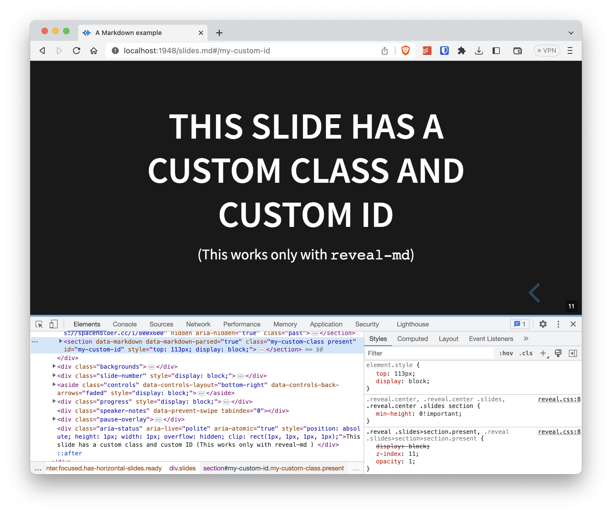

I know people that just hate markdown. They hate the fact that they can not see **bold** or _underlined_ text while editing. That you have to enclose text in batiks or asterisks to change how it's displayed. Or that headlines and regular text have the same size.

I am not one of those people... I loooove Markdown.

As a text driven guy that does everything in the keyboard, that uses NeoVim and Zsh on a regular basis, and that hates to touch the mouse or trackpad, I have to say that there is nothing better than writing documentation or articles in Markdown.

Let me give you some additional reasons:

- Markdown can be converted to almost everything: HTML, PDF, Latex, etc. And all of this with open source tools.
- Markdown documents are pretty readable by themselves. They are just text with some simple _decoration symbols_. Try doing that on an HTML or LateX file.
- You can write Markdown in literally any editor. No need of MS Word or Mac Pages. Or any other kind of tool for that matter.
- Markdown is _Version Control_ friendly. You can keep versions of your documents using Git, SVN, CVS, etc. After all, its just text.

That's why I use Markdown for almost everything, including this blog. Is written in Markdown and converted to HTML with JavaScript using [Gatsby](https://www.gatsbyjs.org/)

So I wanted to implement the same workflow, but for presentations. I wanted to create **Slides** using markdown, and then converted them to PDF or HTML.

But it turns out that there is more than one way to do it. Here I'll show a few.

## So how do you create _Slides_ with Markdown?

Before we get into the actual tools to convert Markdown to PDF, or HTML, lets first talk on how to create a Markdown presentation. In other words, how to create slides.

If you already know Markdown, you only have to take into account 3 things when creating Markdown slides documents:

- You only need **one** markdown file for **all** your slides
- You separate slides by using `---` (3 dashes) between the content of each slide. And this can be configured on _some_ conversion tools
- The first **Heading 1** or `#` is the title of the slide

So this could be a 3 slide markdown presentation:

```markdown
# First slide

- List item 1
- List item 2
- List item 3

---

# Second slide


---

## Third slide

> Just a quote here
```

And that's it, that's a 3 slide presentation!

If you open the previous markdown with Marp (which I'll will explain further down) this is what You'll get:


_Slide 2_

The BIG caveat on creating slides with Markdown is that **it depends on the tools you are using to covert markdown to PDF/HTML/ODF**. Fortunately, most of the tools follow the previous 3 principles.

## Front matter

The previous "presentation" consisted of only 3 slides. Easy right? But what if you want to add Meta information to your final PDF or HTML file? Information like:

- The Author
- The Creation Date
- The Title that gets displayed in the browser tab when the markdown gets converted to HTML for instance

Also, what about styling:

- Set a background color
- Apply a theme
- Override some of the styling

That's what the [Front Matter](https://jekyllrb.com/docs/front-matter/) of the presentation is used for.

This is a presentation of one slide, but with _Front Matter_:

```markdown {1-6}
---
title: Presentation with Front Matter
author: Mario Yepes
date: 2022-03-27
theme: gaia
---

# First Slide

Content of the first slide
```

As you can see, the _Front Matter_ is a small section with keys and values that can be almost anything. But as as suggestion you should provide a Front Matter with at lest:

- A Title of the presentation with the key `title`
- The Authors name with the key `author`
- The Creation Date with `date`

**Note**: Some tools will break if you use unsupported _Front Matter_ options. An example of this is the tool `lookatme` which doesn't support the `theme` key.

How the _Front Matter_ affects the final presentation and which keys are valid **changes from tool to tool**, so I'll try to specify which items can be in the front matter but it's up to you to find out the complete list of items that can be placed in the front matter depending on the tools you end up selecting.

You can read more about the _Front Matter_ [here](https://jekyllrb.com/docs/front-matter/)

## Creating a test presentation

OK, enough of theory. Les's create a Markdown Presentation and convert it to HTML and PDF with different tools. Our first step will be creating a Git repo and initialize it with `npm`:

```bash
mkdir learn-markdown-presentations
cd $_
npm init -y
touch slides.md
```

The reason why I'm using `npm` is to create the `package.json` file which I'll use to automate some of the steps and have some sort of a [`Makefile`](https://makefiletutorial.com/) where I can save all the commands I'll be using to convert the presentation to HTML or PDF. Also, because even though all the tools can be installed globally, I prefer to install them locally.

Next, add the following contents to the `slides.md` file:

```markdown
---
title: A Markdown example
date: 2022-03-27
author: Mario Yepes
---

# A test presentation

By: _Mario Yepes <https://marioyepes.com>_

---

# Headers

## Heading 2

### Heading 3

#### Heading 4

More text

---

# Bulleted Lists

- Top level
  - Level 2
    - Level 3
      - Level 4

---

# Apearing lists

Some tools support showing items one by one

- Item 1
- Item 2
- Item 3

---

# Code Blocks

Some tools support syntax highlighting

``javascript
const axios = require('axios');

axios.get('https://marioyepes.com')
.then( resp => {
console.log(resp);
})
.catch( err => {
console.error(err);
});
``

---

# Numbered Lists

- Top level
  1. Level 2
     1. Level 3
     1. Level 3
     1. Level 3
        - Level 4

---

# Tables

| h1     | h2     | h3     |
| ------ | ------ | ------ |
| value1 | value2 | value3 |
| value1 | value2 | value3 |
| value1 | value2 | value3 |
| value1 | value2 | value3 |
| value1 | value2 | value3 |
```

What is left to do is to **install** and **configure** the tool we'll use to convert and/or lint our presentation.

## Linting your markdown with Markdownlint

I'm an absolute nerd for code quality. That's why I use tools like `eslint`, `prettier`, `phpcs` and of course `markdownlint`.

If you are like me, then I recommend you install `markdownlint-cli` to lint your presentation:

```bash
npm install --save-dev markdownlint-cli
```

And then create the file `.markdownlint.json` with the following contents:

```json
{
  "line-length": false,
  "single-h1": false,
  "ul-style": false
}
```

This will allow you to fix format issues in your markdown file ignoring 3 rules:

- Do not complain about lines longer than 80 characters. This one is for me since I tend to write long lines in my slides and I don't like to break them
- Do not complain about having more than one `H1` heading. Very important since **each slide** will start with an `H1`
- Do not change the `*` to `-` in bulleted lists. This is very specific to Marp.

Now you can use the command `npx markdownlint --fix slides.md` to fix any linting issues.

And better yet if you add the following new scripts in `package.json` (see, already useful):

```json {5,6}
{
  "...",
  "scripts": {
    "...",
    "lint": "markdownlint *.md",
    "format": "markdownlint --fix *.md"
  }
}
```

Now you can lint and format your files with:

```bash
npm run lint
npm run format
```

With linting in place, we're ready for our first conversion tool.

## First tool: Marp

By far, the easies way to convert Markdown presentations to HTML is using [Marp](https://marp.app/). And the reason is because it can be used as a [cli tool](https://github.com/marp-team/marp-cli), but also you can use it inside Visual Studio Code with an [extension](https://marketplace.visualstudio.com/items?itemName=marp-team.marp-vscode)

As I said I'm a CLI guy, so I'm going to focus on the `marp-cli` tool. That's why I'm going to install it in the current project with:

```bash
npm install --save-dev @marp-team/marp-cli
```

And here is the cool part. You can start your presentation using:

```bash
$ PORT=9999 npx marp -s .
[  INFO ] [Server mode] Start server listened at http://localhost:9999/ ...
```

The `PORT` variable is not necessary. If you omit it it will use the port `8080`. But since _us developers_ use the `8080` port so often, and that's Marp's default port, I thought it was best to mention it right from the get go.


And if you click on `slides.md` you will see your presentation right on the browser:


A useful tip is to add the previous command as a _script_ in your `package.json` file:

```json {4}
{
  "...",
  "scripts": {
    "marp:serve": "PORT=9999 marp -s .",
    "marp:export": "marp slides.md"
  },
  "..."
}
```

And run the presentation with

```bash
npm run marp:serve
```

If you want to publish your presentation somewhere, then you can execute `npx marp slides.md` and you'll get a `slides.html` file on the root directory of your project.

### Marp's Front Matter

Marp supports a lot of [configuration directives](https://marpit.marp.app/directives) in the Front Matter. But that could make your file to be incompatible with other tools. That's why I recommend the creation of a `.marprc.yml` file with the Front Matter directives:

**Note: At the time of this writing, April 10 2023, the `.marprc.yml` does not support all the configuration options**

```yaml
# .marprc.yml

theme: gaia
style: |
  section {
    background-color: #ccc;
  }
paginate: true
```

This would make your presentation look like this:


### Styling

One very cool thing about Marp is that it bundles [themes](https://github.com/marp-team/marp-core/tree/main/themes) that can be configured using CSS.

To enable a theme you could add key `theme` in the _Front Matter_. And then, before the first slide (the first Title) add a CSS code like so:

```markdown
---
marp: true
author: Mario Yepes
size: 4:3
theme: gaia
---

<style>
    :root {
        --color-background: #101010;
        --color-foreground: #FFFFFF;
    }
    h1 {
        font-family: Courier New;
    }
</style>
```

Note that this can make the markdown not compatible with other tools.

You can read more about the Theme directive [here](https://marpit.marp.app/directives?id=theme)

### Backgrounds

It's very common that you want a slide to have a different background or add an image as a background. This can be done by using a [local directive](https://marpit.marp.app/directives?id=local-directives-1).

Again, this is not compatible with other tools, but very cool to use:

```markdown
---

 <!-- Only works in Marp -->

# Slide with background to the left
```


### Marp Resources

There aren't may Marp resources outside the official [documentation](https://marpit.marp.app/). But it's worth mentioning [this great presentation about Marp](https://speakerdeck.com/yhatt/marp-basic-example) created by it's author. It explain some advanced concepts about the tool.

## Second tool: Lookatme

The second tool is my absolute favorite because is 100% terminal based.

With [lookatme](https://github.com/d0c-s4vage/lookatme) you can present directly in the terminal. Which in my opinion is very, very... Very VERY cool.


_Lookatme_ is written in [Python](https://python.org) and you need to have `pip` version 3 installed in your system. If you meet this requirement, you only have to execute `pip install` to install it:

> There is an option to run `lookatme` using Docker. But that's beyond the scope of this article.

```bash
pip3 install lookatme
```

And you start a presentation with:

```bash
lookatme slides.md
```

One big drawback with `lookatme` is that **you can NOT add non standard Front Matter keys**. If you do you'll get an exception since `lookatme` **does not ignore incompatibilities**.


### Lookatme options

Lookatme doesn't have that many options since it works in the terminal. So instead of customizing the presentation using the _Front Matter_, I recommend using the [CLI options](https://lookatme.readthedocs.io/en/latest/getting_started.html#usage). This makes your slides less error prone:

```bash
$ lookatme --help
Usage: lookatme [OPTIONS] [INPUT_FILES]...

  lookatme - An interactive, terminal-based markdown presentation tool.

  See https://lookatme.readthedocs.io/en/v2.3.2 for documentation

Options:
  --debug
  -l, --log PATH
  -t, --theme [dark|light]
  -s, --style [default|emacs|friendly|friendly_grayscale|colorful|autumn|murphy|manni|material|monokai|perldoc|pastie|borland|trac|native|fruity|bw|vim|vs|tango|rrt|xcode|igor|paraiso-light|paraiso-dark|lovelace|algol|algol_nu|arduino|rainbow_dash|abap|solarized-dark|solarized-light|sas|stata|stata-light|stata-dark|inkpot|zenburn|gruvbox-dark|gruvbox-light|dracula|one-dark|lilypond]
  --dump-styles                   Dump the resolved styles that will be used
                                  with the presentation to stdout

  --live, --live-reload           Watch the input filename for modifications
                                  and automatically reload

  -s, --safe                      Do not load any new extensions specified in
                                  the source markdown. Extensions specified
                                  via env var or -e are still loaded

  --no-ext-warn                   Load new extensions specified in the source
                                  markdown without warning

  -i, --ignore-ext-failure        Ignore load failures of extensions
  -e, --exts TEXT                 A comma-separated list of extension names to
                                  automatically load (LOOKATME_EXTS)

  --single, --one                 Render the source as a single slide
  --version                       Show the version and exit.
  --help                          Show this message and exit.
```

The one you'll use more often is `--style` which will change the color scheme for your code:

```bash
lookatme --style monokay slides.md
```

 _Lookatme With Monokai_

```bash
lookatme --style solarized-light slides.md
```


For more options and documentation you can got the [official documentation](https://lookatme.readthedocs.io/)

And as we've done before, you can add the command to `package.json`:

```json {5}
{
  "..."
  "scripts": {
    "...",
    "lookatme": "lookatme --style=monokai slides.md"
  },
  "..."
}
```

## Third Tool: Reveal-md

If you want to go for broke, then [Reveal.js](https://revealjs.com) is the tool for you!

Now, `Reveal.js` is actually a very complicated tool to use. So complicated that it's author sells a 5 hour [course](https://revealjs.com/course/#table-of-contents) on how to create presentations with the tool. If you've used [Slides.com](https://slides.com/) then you have an idea of what Reveal.js can do since that's the engine behind the site.

The "drawback", is that to create presentations you have to create a [React](https://reactjs.org) application. This means that you have to create HTML and JavaScript to have a simple presentation. And as you've noticed, we want to use Markdown, not HTML. Still, if you want to go that route, you can follow the [documentation](https://revealjs.com/installation/) on how to install and create a presentation using just Reveal.js.

Thankfully [Lars Kappert](https://github.com/webpro) created [reveal-md](https://github.com/webpro/reveal-md) which, in his own words, is _`reveal.js` on steroids_. But most importantly, it supports displaying presentations created in Markdown!

Since `reveal-md` is an `npm` package, you can install it with:

```bash
npm install --save-dev reveal-md
```

And to start the presentation you can use good 'ol `npx`:

```bash
npx reveal-md -w slides.md
```


Notice that `reveal-md` uses port `1948` by default, so keep that in mind when you are starting your presentation. Or better yet, use the `--port` parameter to change it for something more friendly.

As most of the tools we've seen, you can modify the style and several _Front Matter_ options with cli parameters:

```bash
 npx reveal-md slides.md --theme solarized --watch
```


Here the `--watch` flag will reload the presentation when the `slides.md`  file is changed.

### Themes

Reveal-md is really powerful when it comes to theming, not only you can change the slide theme, but the code highlight theme. Just pass the `--theme` flag pointing to a local or an online `css` stylesheet and you are good to go.

```bash
npx reveal-md slides.md --theme black --highlight-theme monokai
```


```bash
npx reveal-md slides.md --theme sky --highlight-theme night-owl
```


You can see a list of presentation themes [here](https://github.com/hakimel/reveal.js/tree/master/css/theme/source). And a list of highlight themes [here](https://github.com/highlightjs/highlight.js/tree/main/src/styles)

### Advanced styling

But what is really powerful is when you integrate the [reveal.js slide attributes](https://revealjs.com/markdown/#slide-attributes) to add things like background images:

```markdown {5}
# A slide with background image

(This only works in Reveal.js)

<!-- .slide: data-background="https://spaceholder.cc/i/800x600" -->
```


Or assign a custom `class` or `id` attributes

```markdown
---

# This slide has a custom class and custom ID

(This works only with `reveal-md`)

<!-- .slide: class="my-custom-class" id="my-custom-id" -->
```



### Reveal-md Override CSS

With Themes you can create or use a complete look for your presentation, but if you only want to change a couple of things from your presentation, then you can use a _separate_ CSS file with just then thing you want to change.

And if you add to this the fact that you Reveal use CSS variables to customize parts of the presentation like the background color, you have a pretty powerful and flexible way to make the presentations your own.

Take for instance this CSS file:

```css
:root {
  --r-background-color: tan;
}
```

If you execute `reveal-md` with the `--css` parameter, you can change the background color:

```bash
npx reveal-md slides.md --css reveal-custom.css --watch
```

The css variables can change from theme to theme, so just open the Chrome Tools and look for what you can change.

### Reveal-md options

In a similar fashion as _Marp_, you can configure your presentation by using a JSON file called `reveal-md.json` and place it in the root of your project. Here you can add all of the [`reveal.js` options](https://revealjs.com/config/)

```json
{
  "assetsDir": "assets",
  "css": ["reveal-custom.css"],
  "highlightTheme": "atom-one-dark",
  "port": "3000",
  "revealOptions": {
    "transition": "fade"
  },
  "staticDir": "docs",
  "staticDirs": ["slides/images"]
}
```

This way, you just need to execute `npx reveal-md slides.md` and reveal will pick up all of your changes

### Examples

In case you want to understand the power of reveal-md, take a look at [this](https://github.com/smithbm2316/vimconf-2021/tree/main/slides) presentatio

## Resources

All the code used in this blog post, can be accessed in [this](https://github.com) GitHub repo.
