Quoting the ESLint [Getting Started Guide](https://eslint.org/docs/user-guide/getting-started)

> ESLint is a tool for identifying and reporting on patterns found in ECMAScript/JavaScript code, with the goal of making code more consistent and avoiding bugs.

So, it basically analyzes JavaScript code, looking for errors or code-smells, without executing it. Which is great! This avoids many issues that other kind of linters have.

What about a Prettier?...

Well, [Prettier](https://prettier.io/) is an **Opinionated code formatter** that ensures that the code of your project looks the same.

So if you are developing a JavaScript applications you should certainly use both of them.

But you might be asking yourself ¿Why would you want to use a _command line_ tools for analyzing and formatting code if _VS Code_ already does it out of the box?

Well, the reason is that by using ESLint and Prettier, you can add the linting and formatting configuration to your project and share it across your team. Also, you can include it in your _Continuous Integration_ platform and ensure that your code is correct.

So lets see how to configure them one by one.

## The Caveat

Even though all tools are excellent, its not all roses.

It turns out that ESLint has its own code formatter. Which is good, but it doesn't do as good a job as Prettier. So its not a bad idea to use both tools at the same time. And that can bring some weird issues.

- ESLint formatter will make some changes that Prettier could revert
- If you use a _watch_ function you could get and endless loop where one formatter fixes and then the other undoes the action
- You need to set up formatting rules on 2 places

So there are some simple steps that you can take to have both tools working together without stepping on each other toes.

## Preparing a project

For this tutorial, we're going to create a WordPress plug-in, and we're going to have the `.js` files be linted by ESLint and formatted by Prettier.

So, just create a directory in your plug-ins dir and start git in it.

```bash
cd /path/to/wordpress/wp-content/plugins
mkdir wordpress-eslint-prettier-config
cd $_
```

Also create an empty `package.json` file since we're going to add `npm` packages to it:

```bash
npm init -y
```

It's a good idea to edit your `package.json` so the information about author, keywords and such is correct.

```json
{
  "name": "wordpress-eslint-prettier-config",
  "version": "1.0.0",
  "description": "This is a basic repo that serves as a guide on how to configure eslint and prettier for a WordPress project.",
  "scripts": {},
  "repository": {
    "type": "git",
    "url": "git+https://github.com/marioy47/wordpress-eslint-prettier-config.git"
  },
  "keywords": ["eslint", "prettier", "wordpress", "editorconfig"],
  "author": "Mario Yepes <marioy47@gmail.com>",
  "license": "MIT",
  "bugs": {
    "url": "https://github.com/marioy47/wordpress-eslint-prettier-config/issues"
  },
  "homepage": "https://github.com/marioy47/wordpress-eslint-prettier-config#readme",
  "devDependencies": {}
}
```

## ESLint Setup

ESLint and Prettier are tools that can be run in the command line. That's why some developers install them globally on their system:

```bash
### This can be useful but NOT RECOMMENDED
npm install -g eslint prettier
```

This is totally fine. But [as the documentation suggests](https://eslint.org/docs/user-guide/getting-started#installation-and-usage) you should install eslint **per project**. And the reason is because having them locally in your project willl facilitate the _code linting_ and _code beautifying_ on your **Continuous Integration** step.

Personally, I never install them globally and I recommend you don't also. That way there wont be any confusion on why the "_CI_ step is not working".

To start the initial setup use `npx` to call `eslint` with the `--init` flag:

```bash
npx eslint --init
```

This will start a wizard asking you for you project preferences:

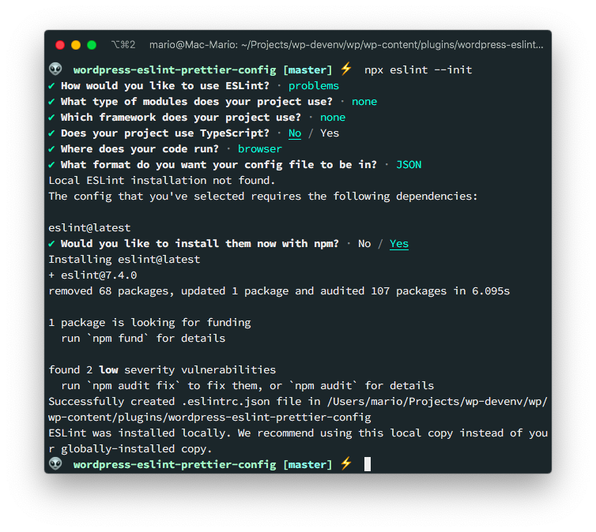

As you can see, the wizard asks you for pretty basic questions:

- Which standard to use
- If you use React, Vue or Angular
- If the current project uses Typescript
- Etc.

Here, you should be as agnostic as possible, since all the configuration will be done by editing _init files_.

> The final question is if you want to install `eslint` locally. You should say **Yes** here.

The result of this command, is that you'll get a `.eslintrc.json` file similar to this:

```json
// .eslintrc.json
{
  "env": {
    "browser": true,
    "es2020": true
  },
  "extends": "eslint:recommended",
  "parserOptions": {
    "ecmaVersion": 11
  },
  "rules": {}
}
```

And that in your `packages.json` file you'll have a new dev requirement called `eslint`.

This `.eslintrc.json` file is very important since ESLint wont work without it. It declares which **rules** you are going to apply to you project.

## A brief explanation of ESLint options

A complete explanation of the configuration file can be found in the [official documentation](https://eslint.org/docs/user-guide/configuring). But here is the gist of it:

- `parserOptions`: How do you want to parse your code. Pe. The ECMAScript (`ecmaVersion`) version (ES6, ES2018, etc); If you want to use modules (`sourceType`). Etc.
- `env`: Defines which global [environment variables](https://eslint.org/docs/user-guide/configuring#specifying-environments) you can use. Pe. if you declare `jest: true`, you can use the `describe`, `it` or `test` global variables. Using `browser: true` allows you to use the `document` global. Setting `node: true` allows you to use the `process` variable.
- `global`: Personalized globals. In the case of WordPress the `ajaxurl` can be very useful to be defined here.
- `plugins`: Imports sets of rules from other _npm modules_. More on that latter
- `rules`: This is the core of the configuration and can be very large if you don' use plugins. For a list for rules [refer to the official documentation](https://eslint.org/docs/rules/)
- `extends`: Allows you to make the current configuration an extension of an external one defined in another module.

## Using ESLint with the new configuration

Now, lets create a test `.js` file with some bad formatted code and code-smells.

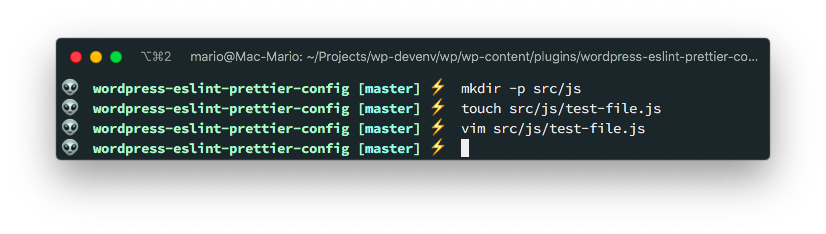

```javascript
// src/js/test-file.js

var first_var

function aSimpleFunction() {
  console.log("Hola mundo") }

            function anotherFunction(event) {
        console.log("This one is used");
      }

let other =
document.getElementById("the-element-id")

          anotherFunction(                          null)
```

And execute **our local ESLint** to figure out if it has any errors:

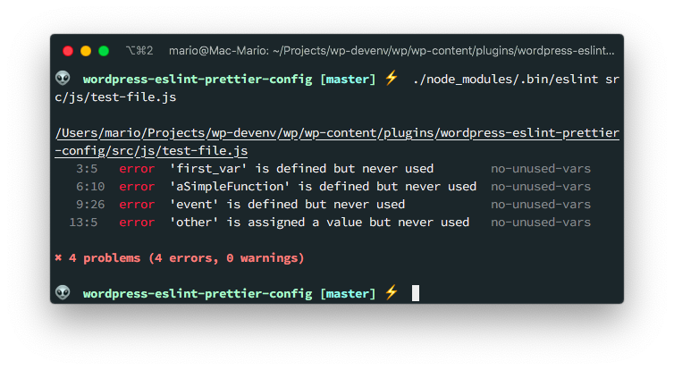

Great! We have a way to **detect code errors** but still no code styling.

A couple of things to note:

- I used the path `./node_modules/.bin/eslint` to call the `eslint` command. That's the path where our local `eslint` is placed. Latter we'll make this more friendly.
- On the configuration wizard I answered **problems** when it asked if "How would you like to use ESLint:". That's why is not reporting any code style issues.

## Prettier configuration

With ESLint installed, we can now move to configuring Prettier so we can format our code.

The issue is that ESLint can do some formatting that can conflict with Prettier. So we have to make the them talk to each other.

Fortunately, Prettier has [official support for ESLint](https://prettier.io/docs/en/integrating-with-linters.html) so the process is not that complicated.

Lest continue by installing the `prettier` module and a couple of supporting modules so ESLint understands that it has to use prettier for the formatting:

```bash
npm install -D prettier eslint-config-prettier eslint-plugin-prettier
```

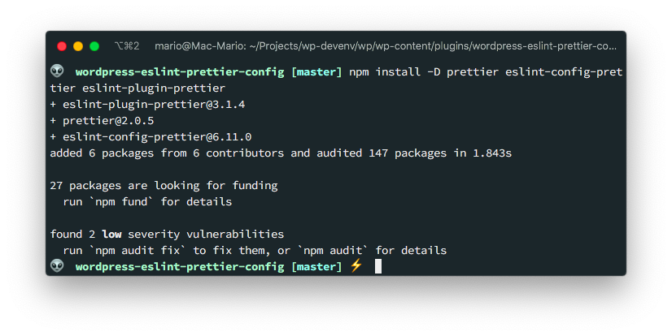

- `prettier` is the Prettier command but on our project.
- `eslint-config-prettier` [Turns off all rules that are unnecessary or might conflict with Prettier.](https://github.com/prettier/eslint-config-prettier#eslint-config-prettier).
- `eslint-plugin-prettier` [Runs Prettier as an ESLint rule and reports differences as individual ESLint issues](https://github.com/prettier/eslint-plugin-prettier#eslint-plugin-prettier-).

Then we have to edit `.eslintrc.json` to add the **prettier plugin** and the **prettier config**.

```json {7,12}
// .eslintrc.json
{
  "env": {
    "browser": true,
    "es2020": true
  },
  "extends": ["eslint:recommended", "plugin:prettier/recommended"],
  "parserOptions": {
    "ecmaVersion": 11
  },
  "rules": {
    "prettier/prettier": "warn"
  }
}
```

As advised by the documentation, leave the `prettier` be the last _extend_ configuration.

Now, when you issue eslint again, you'll get some additional warnings about the code style:

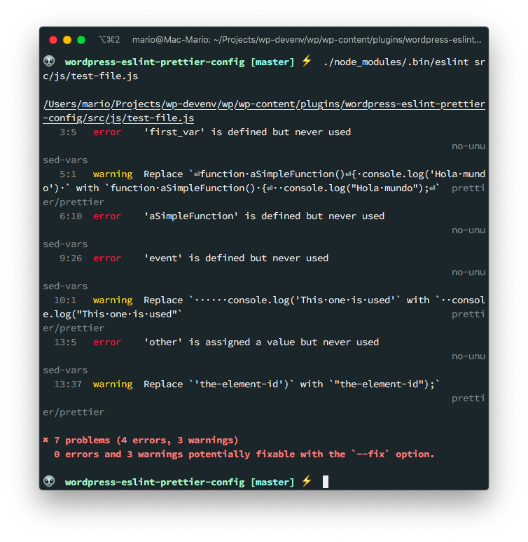

Awesome... We're getting code errors **and** style errors at the same time.

## WordPress configuration

If you take a look at the `.eslintrc.json` file in the [Guetenberg Project](https://github.com/WordPress/gutenberg/blob/master/.eslintrc.js), you can see that WordPress uses A LOT of rules.

Since we're lazy, I'm going to use an already created [ESLint WordPress Package](https://www.npmjs.com/package/@wordpress/eslint-plugin)

This package has _configurations and custom rules for WordPress development_. Which is exactly what we need.

So lets install it with

```bash
npm install @wordpress/eslint-plugin --save-dev
```

And again, edit the `.eslintrc.json` file adding this new package:

```json {9}
// .eslintrc.json
{
  "env": {
    "browser": true,
    "es2020": true
  },
  "extends": [
    "eslint:recommended",
    "plugin:@wordpress/eslint-plugin/recommended"
  ],
  "parserOptions": {
    "ecmaVersion": 11
  },
  "rules": {
    "prettier/prettier": "warn"
  }
}
```

Take into account that I've deleted the `plugin:prettier/recommended` since according [to the documentation](https://www.npmjs.com/package/@wordpress/eslint-plugin#usage) _The recommended preset will include rules governing an ES2015+ environment, and includes rules from the eslint-plugin-jsx-a11y, eslint-plugin-react, and eslint-plugin-prettier projects._

And now take a look at the output when I run `eslint` again:

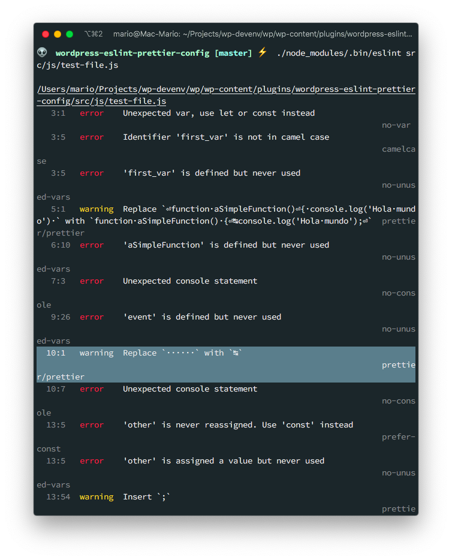

In the highlighted line you can see that its recommending to use **Tabs** instead of spaces which is what WordPress recommends.

## Disabling rules

I don't know about you, but when I'm developing I really need to use the `console.log()` function in my JavaScript code... But eslint complains about that all the time.

So if you want to temporary disable that check, add the following to your `.eslintrc.json` file:

```json {16}
// .eslintrc.json
{
  "env": {
    "browser": true,
    "es2020": true
  },
  "extends": [
    "eslint:recommended",
    "plugin:@wordpress/eslint-plugin/recommended"
  ],
  "parserOptions": {
    "ecmaVersion": 11
  },
  "rules": {
    "prettier/prettier": "warn",
    "no-console": "off"
  }
}
```

This way you wont get any errors about the `no-console` issue:

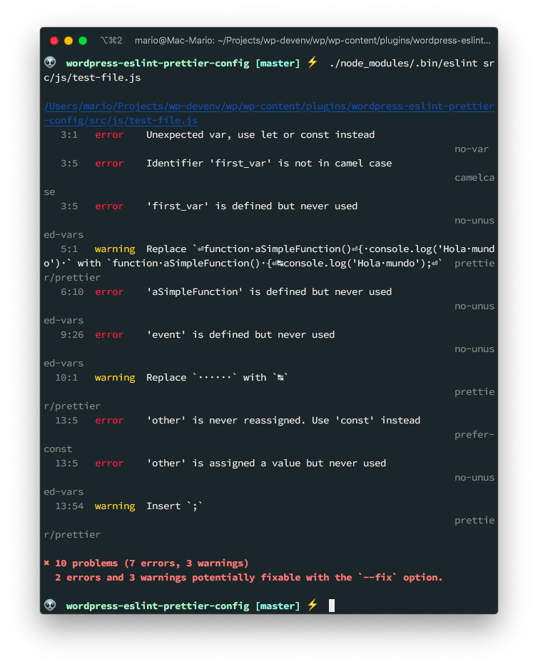

As you can see there are no `no-console` errors on that output.

## Prettier local configuration

This part is completely optional, but I like to add some **local** prettier rules so the code is a close as the final product _while I'm writing it_. For instance, I want the code to use [tabs over spaces](https://developer.wordpress.org/coding-standards/wordpress-coding-standards/javascript/#spacing) as the WordPress coding standard recommends:

This rules are taken from the [Jetpack Github site](https://github.com/Automattic/jetpack/blob/master/.prettierrc) and are kind of redundant, but work as a fall-back.

So lets create the `.prettierrc` file, and add the following:

```yaml
useTabs: true
tabWidth: 2
printWidth: 100
singleQuote: true
trailingComma: es5
bracketSpacing: true
parenSpacing: true
jsxBracketSameLine: false
semi: true
arrowParens: avoid
```

This way, we can have extra configurations in case we need them.

## Add npm script to run it

Up until now, we've been executing `eslint` with the command:

```bash
./node_modules/.bin/eslint src/js/test-file.js
```

Which is not practical or confortable by any means...

Also, we've just limited ourselves to **find** errors, but not fix them.

So lets fix both issues by adding 2 **scripts** in the `packages.json` file:

```json
{
  ...
  "scripts": {
    "lint": "eslint src/js/**/*.js",
    "lint:fix": "eslint src/js/**/*.js --fix"
  }
  ...
}
```

The first command is going to find errors on all of our JavaScript files, and the second will fix them.

Let's give them a try:

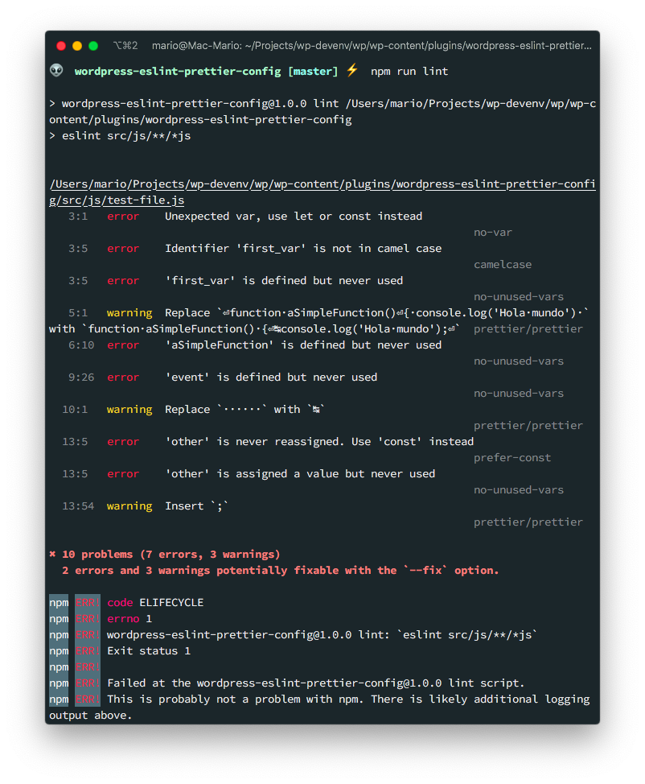

As you can see `npm run lint` will find errors.

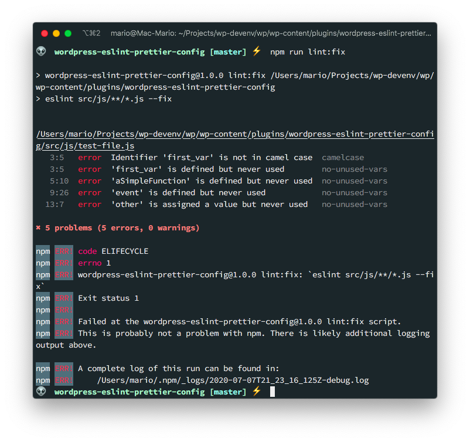

And `npm run lint:fix` will find and fix them.

Take into account that `eslint` wont fix some errors that will actually break your code. Errors like:

- Wrong case for names
- Unused vars or functions
- Empty functions
- etc.

Wont be fixed and its up to you to actually fix them without breaking your code.

## Husky and lint-staged

We're almost done with the environment configuration.

No, we're going to add 2 tools that will execute the linting and formatting tools for us when we do a `git commit`.

The first one is going to be [Husky](https://typicode.github.io/husky/), which is a tool that connects with [Git](https://git-scm.com/) to improve your commits by executing commands on the _pre_ and _post_ git hooks. Which is great if it wasn't for the fact that by default _Husky_ will lint and fix **all of the files** on our project.

That's why we need the second tool; [lint-staged](https://github.com/okonet/lint-staged#readme). _Lint-staged_ will executing the linting only on the committed files and will not touch any file that hasn't been modified.

Installing them is pretty easy since `lint-staged` has a command that

- Will install all the required packages (`husky` and `lint-staged`)
- Will check that we're using `eslint`
- Will change the file `package.json` adding the required configuration

The command is:

```bash
npx mrm lint-staged
```

This will show a bunch of messages, but at end of the execution we'll have the following changes on hour `package.json`:

```json {8-9,12-19}
{
  ". . .",
  "devDependencies": {
    "@wordpress/eslint-plugin": "^7.3.0",
    "eslint": "^7.11.0",
    "eslint-config-prettier": "^6.13.0",
    "eslint-plugin-prettier": "^3.1.4",
    "husky": "^4.3.0",
    "lint-staged": "^10.4.2",
    "prettier": "^2.1.2"
  },
  "husky": {
    "hooks": {
      "pre-commit": "lint-staged"
    }
  },
  "lint-staged": {
    "*.js": "eslint --cache --fix"
  }
}
```

The first batch of changes is pretty familiar: We just installed `husky` and `lint-staged`.

The second batch has 2 sections:

- The `husky` sub-object is telling git which command to execute before committing
- The `lint-staged` sub-object is telling git to execute `eslint --cache --fix` **on the changed files**.

We have the best of both worlds: We get linting before each commit but only on the changed files... Clean and fast!

Now, let's test it. Let's make a change on our bad formatted file and try to commit it to the repo:

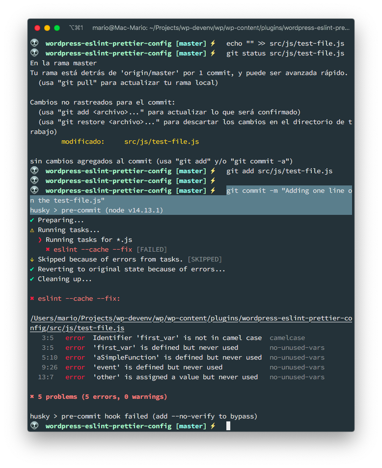

We get an error!!!

We cant commit unless **we fix the errors that eslint could not fix** (like camel case errors or unused functions errors). So we either...

- We ignore linting on the file by [adding it to .eslintignore](https://eslint.org/docs/user-guide/configuring#eslintignore)
- Or, we add exceptions on the file ([more info on that here](https://eslint.org/docs/user-guide/configuring#disabling-rules-only-for-a-group-of-files))

I opted for the second option. So I added the following at the top of the `src/js/test-file.js`:

```javascript {3}
// src/js/test-file.js

/* eslint-disable no-var, no-unused-vars, camelcase, prefer-const, prettier/prettier */
var first_var;

// ....
```

I really do not recommend this. **Its always better to actually adhere to standards and write clean code**.

## Stylelint

I think this is a little bit overkill, but if you want to lint and fix CSS/SCSS errors, then you have to use [Stylelint](https://stylelint.io/).

It works very simmilar to ESLint, where you have a program that does the linting (the `eslint` command) and you have a set of rules to apply.

To install it just issue

```bash
npm install stylelint stylelint-config-wordpress --save-dev
```

The first package is the linter, and the second one is the set of rules we are going to use for WordPress.

After the packages are installed, you have to 2 to additional steps to execute:

- Create a `.stylelintrc.json` file that specifies which rules we are going to apply
- Open the `pacakge.json` file and tell `husky` to also lint the `.scss` and `.css` files

The `.stylelintrc.json` its pretty simple, it just configures which **rules** to apply. In our case where goint to apply the WordPress rules. After all that's why we installed them:

```json
{
	"extends": "stylelint-config-wordpress/scss"
}
```

The second step is in `package.json` lets configure _Husky_:

```json {4}
{
  "...",
  "husky": {
    "hooks": {
      "pre-commit": "lint-staged"
    }
  },
  "lint-staged": {
    "*.js": "eslint --cache --fix",
    "*.(sa|sc|c)ss": "stylelint --cache --fix"
  }
}

```

And now, when you commit a `.css` or `.scss` file, they will get linted.

> At the time of this writing, the WordPress ruleset has some deprecated issues. Don't worry, they will get ignored.

## Vim configuration

To make it work with **Vim** you have to install [Conquer of Completion](https://github.com/neoclide/coc.nvim) vim plugin (You can see an article on how to configure it [here](https://marioyepes.com/vim-setup-for-modern-web-development/)). And then install the [coc-eslint](https://github.com/neoclide/coc-eslint) extension by executing this inside vim

```vim
:CocInstall coc-eslint
```

Then, in your `coc-config.json`, add

```json
  "eslint.autoFixOnSave": true,
```

This will make your files get auto fixed.

> You can open your `coc-config.json` file in vim by issuing the `:CocConfig` command

After you've completed this steps, you'll get warnings and fixes right in your editor like this:

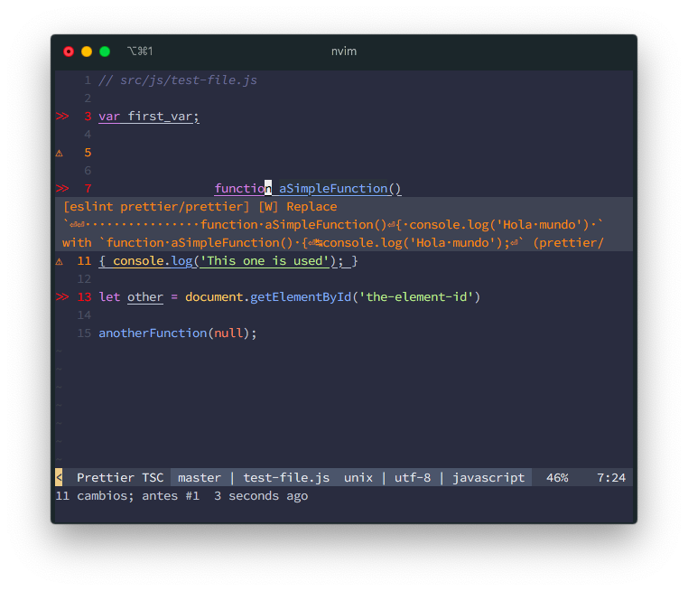

You can also issue the Vim command

```
:CocCommand eslint.executeAutofix
```

to manually fix your files

## Visual Studio

For visual studio you need to install 2 extensions:

- [ESLint](https://marketplace.visualstudio.com/items?itemName=dbaeumer.vscode-eslint)
- [Prettier](https://marketplace.visualstudio.com/items?itemName=esbenp.prettier-vscode)

You can install them both from the command line by issuing the `code` command like so:

```bash
code --install-extension dbaeumer.vscode-eslint esbenp.prettier-vscode
```

And that's it. Your set up.

## Tips

This are common solutions to recurring problems that happen from time to time in a WordPress project.

### 1. Allow CamelCase variables

Its probable that you'll be passing variables from a WordPress PHP file, which uses _snake_case_ standard. To JavaScript, that uses _CamelCase_ syntax.

If that's the case, you might want to add a rule to allow some _snake_case_ variables by adding a `camelcase` rule in `.eslintrc.json`

```json {7}
// .eslintrc
{
  "...",
  "rules": {
    "prettier/prettier": "warn",
    "no-console": "off",
    "camelcase": ["warn", { "allow": ["element_id"] }]
  }
}
```

A complete explanation of `camelcase` options can be found [here](https://eslint.org/docs/2.0.0/rules/camelcase)

### 2. Declare global variables

If you have to use an external JavaScript library from a CDN, that declares global variables, you'll be getting a `no-undef` error on your scripts.

This is the case for instance if you are using the [Google Maps JavaScript API](https://developers.google.com/maps/documentation/javascript/overview#Loading_the_Maps_API). Where you include the library and you have a `google.map` variable available for your scripts.

To avoid _eslint_ error about that variable not being declared, you have to create a `globals` section in your `.eslintrc.json`:

```json
// .eslintrc.json
{
  "...",
  "globals": {
    "google": false
  }
}
```

There are options for declaring _read only_ and _read write_ global variables. You can take a look at those options [here](https://eslint.org/docs/user-guide/configuring.html#specifying-globals)

## Final toughs

One additional piece you can add to your development environment is [`editorconfig`](https://editorconfig.org/) so your editor writes you code in the correct format from the get go. But its not really necessary.

Also, there is an excellent article about ESLint for React in the [thomlom.dev](https://thomlom.dev/setup-eslint-prettier-react/) blog.

And, if you want to take a look at the resulting files, you can see the final result in this [Github Repo](https://github.com/marioy47/wordpress-eslint-prettier-config)
