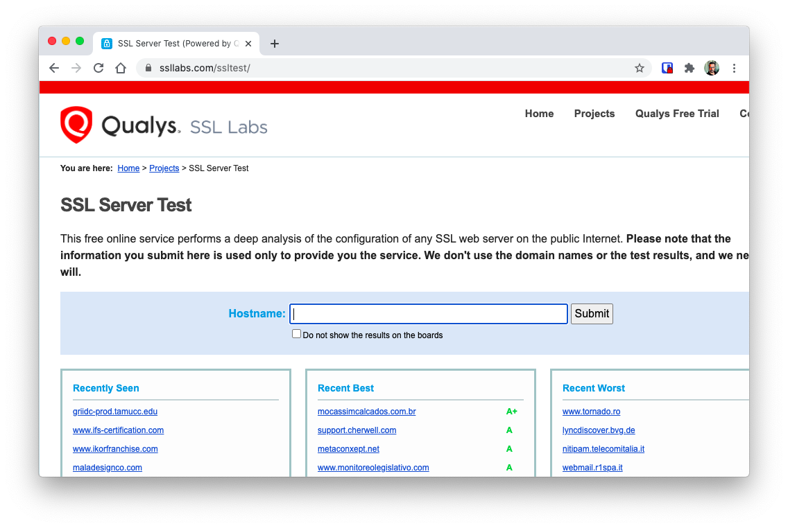
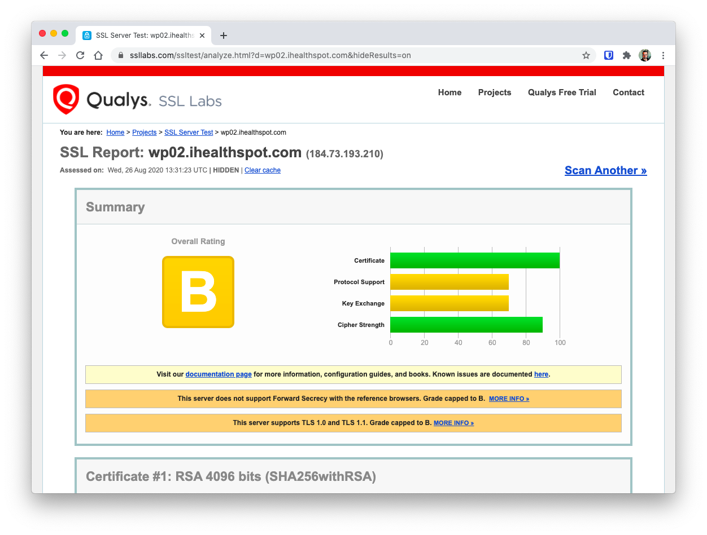
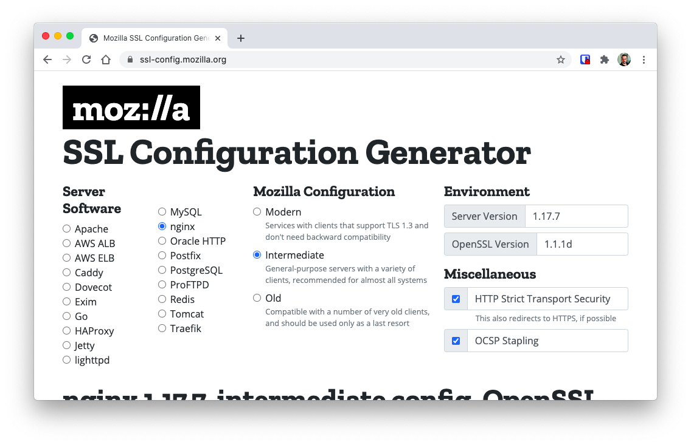
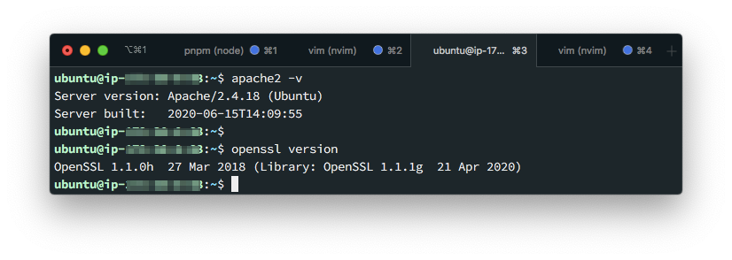
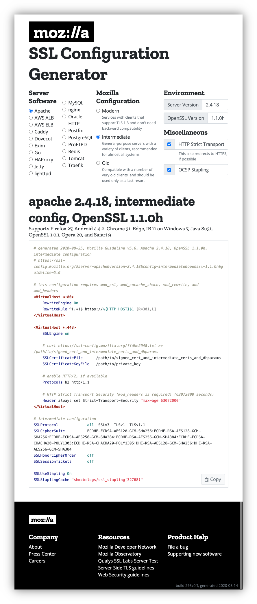
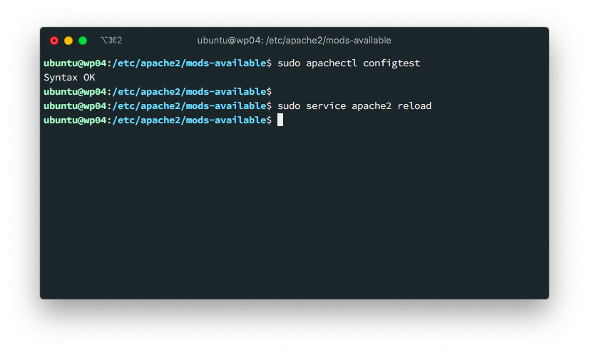
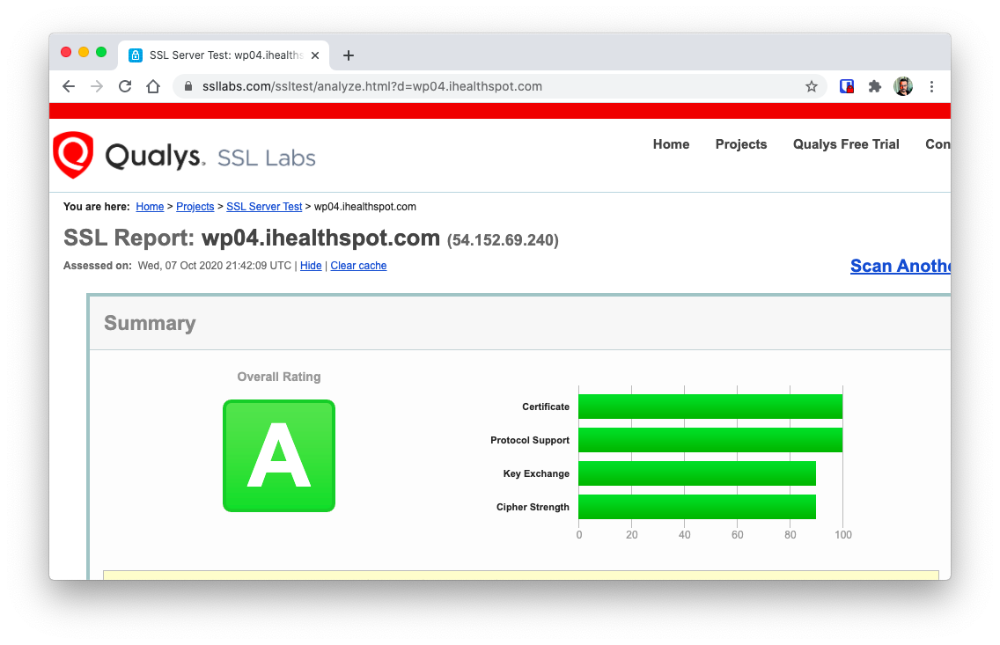

Since Google [anounced](https://webmasters.googleblog.com/2014/08/https-as-ranking-signal.html) that they would be giving secure sites a ranking boost in 2014, webmasters all over the wold started taking security seriously.

[I've already covered](/certbot-introduction-and-usage/) how to secure your site using [Certbot](https://certbot.eff.org/) using free SSL Certificates. Now I want to discuss, is how to improve your server's security configuration so you can pass the [SSL Labs](https://www.ssllabs.com/) [SSL Server Test](https://www.ssllabs.com/ssltest/) which can further improve your SEO ranking **and** be less prone to attacks from the network.

## What is the SLL Server Test?

Who better to tell you what the _SSL Server Test_ is than [its creators](https://https://wwww.ssllabs.com/)

> This free online service performs a deep analysis of the configuration of any SSL web server on the public Internet. -- [SSL Labs](https://www.ssllabs.com/ssltest/)

What this means is that this test will scan your server and not only review if you have valid certificates, but if the protocols you are using to stablish secure connections are the more secures ones.

## Running the test

To run the test you don't need to prepare anything. Just head over to the [SSL Server Test](https://ssllabs.com/ssltest/) page and enter the URL of your site:



And **wait for the results** since they can take a couple of minutes.

After a while, you'll get something like this:



In this case, this server got a **B** grade because it still uses some not-so secure [TLS](https://en.wikipedia.org/wiki/Transport_Layer_Security) versions and some outdated cypher protocols.

> The page is actually pretty long with a lot of information on which protocols, handshakes and signatures your server supports. But the interesting part is the top section where it indicates you where you can get more information on the issues.

Links that explain each particular issue is found after the grade and in my case pointent to this 2 blog articles:

- [SSL Labs Grade Change for TLS 1.0 and TLS 1.1 Protocols](https://blog.qualys.com/ssllabs/2018/11/19/grade-change-for-tls-1-0-and-tls-1-1-protocols)
- [Forward Secrecy, Authenticated Encryption and ROBOT](https://blog.qualys.com/ssllabs/2018/02/02/forward-secrecy-authenticated-encryption-and-robot-grading-update)

## Creating a secure configuration

The number of errors found the _SSL Labs Test_ depends on your server software and version. So there is no _one size fits all_ solution.

But not all hope is lost...

The [moz://a SSL Config Generator](https://ssl-config.mozilla.org/) allows you to generate the correct configuration for your server. You just need to find out

1. Your web server software
2. Your web server version
3. The OpenSSL version of your machine

Additionally, it allows you to specify the level of security you want to add by letting you select

- How modern the browsers have to be to access your server (modern, intermediate or old)
- If [HTTP Strict Transport Security (or HSTS)](https://wikipedia.org/wiki/HTTP_Strict_Transport_Security) should be used (Recommended)
- If [Online Certificate Status Protocol (or OCSP)](https://en.wikipedia.org/wiki/OCSP_stapling) should be enabled (Recommended)



## Apache Configuration Generation

To configure Apache 2, you first need to find out which version of the software you are running:

This can be done by executing the commands

```bash
apache2 -v
openssl version
```



And then enter those values on the configuration generator:



The _Generator_ will automatically generate an Apache Config with the correct values to make your server super secure.

### Editing Apache's configuration files

Now, the complex part.

**Apache has its SSL Configuration spread across multiple files** so you might have to adjust.

The default configuration is as follows:

- The file `/etc/apache2/sites-available/default` have the configuration about the virtual hosts.
- The files `/etc/apache2/mods-available/ssl.conf` have the configuration about the ciphers and handshakes to use.

So paste this section in `/etc/apache2/sites-available/default`:

```apache
# /etc/apache2/sites-available/default
<VirtualHost *:80>
    RewriteEngine On
    RewriteRule ^(.*)$ https://%{HTTP_HOST}$1 [R=301,L]
</VirtualHost>

<VirtualHost *:443>
    SSLEngine on

    # curl https://ssl-config.mozilla.org/ffdhe2048.txt >> /path/to/signed_cert_and_intermediate_certs_and_dhparams
    SSLCertificateFile      /path/to/signed_cert_and_intermediate_certs_and_dhparams
    # Change this to point to the correct path
    SSLCertificateKeyFile   /path/to/private_key

    # enable HTTP/2, if available
    Protocols h2 http/1.1

    # HTTP Strict Transport Security (mod_headers is required) (63072000 seconds)
    Header always set Strict-Transport-Security "max-age=63072000"
</VirtualHost>
```

> You might need to remove some conflicting configuration

And paste the following in `/etc/apache2/mods-available/ssl.conf`

```apache
SSLProtocol             all -SSLv3 -TLSv1 -TLSv1.1
SSLCipherSuite          ECDHE-ECDSA-AES128-GCM-SHA256:ECDHE-RSA-AES128-GCM-SHA256:ECDHE-ECDSA-AES256-GCM-SHA384:ECDHE-RSA-AES256-GCM-SHA384:ECDHE-ECDSA-CHACHA20-POLY1305:ECDHE-RSA-CHACHA20-POLY1305:DHE-RSA-AES128-GCM-SHA256:DHE-RSA-AES256-GCM-SHA384
SSLHonorCipherOrder     off
SSLSessionTickets       off

SSLUseStapling On
SSLStaplingCache "shmcb:logs/ssl_stapling(32768)"
```

> You might need to remove some conflicting configuration

And your done with the file changes

### Test and reload the configuration

With the configuration in place. You can test and restart your server

```bash
sudo apachectl configtest
sudo service apache2 reload
```



And head over to the _SSL Labs Test_ page and test again:



And if you did everything well, you'll be getting an **A** score.

## Tips

### Save the configuration URL

One cool thing about the configurator is that it generates a URL with the parameters you used.

For instance, in the Apache Configuration we used the following parameters:

- Server: Apache
- Apache Version: 2.4.18
- OpenSSL Version: 1.1.0h
- Config level: Intermediate
- HTTP Strict Mode: on
- OCSP: On

And that generated the URL

```markdown
https://ssl-config.mozilla.org/#server=apache&version=2.4.18&config=intermediate&openssl=1.1.0h&guideline=5.6
```

You can save this URL for future reference and re-generation of the configuration

### Use the diff tool to find changes

This tip is for Apache. And its here because Apache comes with its own SSL configuration.

The tip consists in creating a new file in `/etc/apache2/mods-available/ssl.conf.new` with the configurator data and use the `diff` tool to look for changes.

```diff
$ diff ssl.conf ssl.conf.new

59c59,60
< 	SSLCipherSuite HIGH:!aNULL
---
> 	SSLCipherSuite ECDHE-ECDSA-AES128-GCM-SHA256:ECDHE-RSA-AES128-GCM-SHA256:ECDHE-ECDSA-AES256-GCM-SHA384:ECDHE-RSA-AES256-GCM-SHA384:ECDHE-ECDSA-CHACHA20-POLY1305:ECDHE-RSA-CHACHA20-POLY1305:DHE-RSA-AES128-GCM-SHA256:DHE-RSA-AES256-GCM-SHA384
> 	# Changed by Mario
68c69,70
< 	#SSLHonorCipherOrder on
---
> 	SSLHonorCipherOrder off
> 	# Changed by Mario
73c75,76
< 	SSLProtocol all -SSLv3
---
> 	SSLProtocol all -SSLv3 -TLSv1 -TLSv1.1
> 	# Changed by Mario
81a85,90
>
> 	SSLSessionTickets off
> 	SSLUseStapling On
> 	SSLStaplingCache "shmcb:logs/ssl_stapling(32768)"
> 	# Added by Mario
>
```

This will help you to find what changed.

### Save the scan results

Like the configurator, the _SSL Server Test_ tool creates a URL for each server. So if you want to share the results of a scan you just have to copy the resulting url:

```markdown
https://www.ssllabs.com/ssltest/analyze.html?d=wp04.ihealthspot.com&hideResults=on
```

## Further reading

Most of the information on this article came from reading the [Let's Encrypt public forum](https://community.letsencrypt.org/).

The Article [Addressing SSL Labs cipher warnings to get a better grade](https://community.letsencrypt.org/t/addressing-ssl-labs-cipher-warnings-to-get-a-better-grade/37025) was specially helpful and I highly encourage you to read it. It has a lot of information about the whys of the less than desirable grading given by the test.
