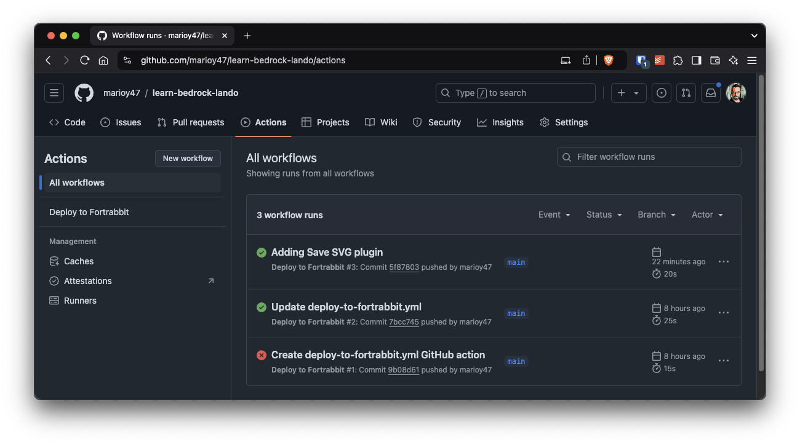
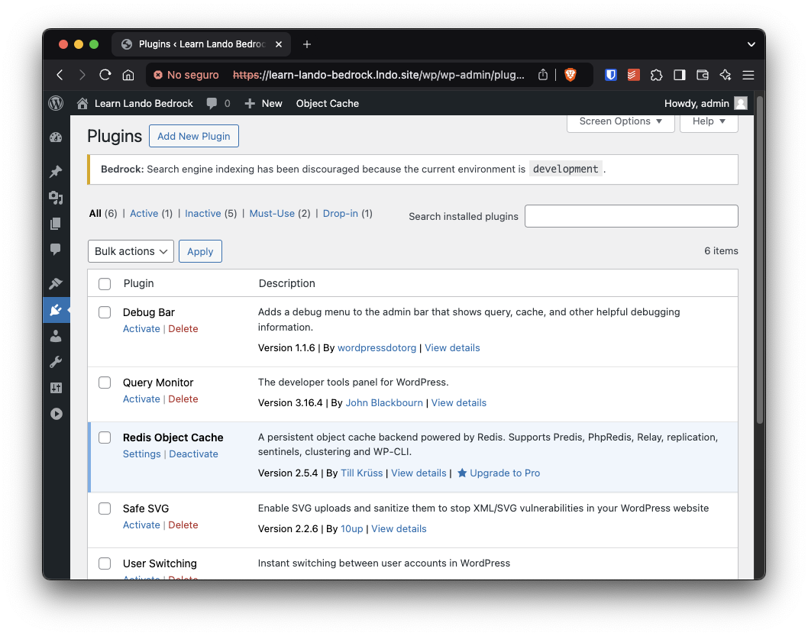

Bedrock is regarded as the gold standard of _Modern Wordpress Development_. The reason being that it uses a file structure that favors separation of concerns and leverages composer for installing plugins and themes.

If you are want to know more about Bedrock, I suggest you take a look at it's [documentation](https://roots.io/bedrock/docs/)

In this article I'm just going to show how to setup Bedrock in a [Lando](https://lando.dev) development environment, and then push that environment into production using [Fortrabbit](https://www.fortrabbit.com/).

To follow along you just need to have a working installation of [Lando](https://lando.dev) (and Docker since Lando works on top of Docker) and know a little about SSH.

## Development environment setup

### Create a Lando/Bedrock Dev Environment

Let's start by creating a local development environment. Which means to create a work dir, and there create a `.lando.yml` file

```bash
mkdir learn-bedrock-lando
cd $_
```

```yaml
# .lando.yml

name: learn-lando-bedrock
recipe: wordpress

config:
  # https://docs.lando.dev/plugins/wordpress/config.html
  php: "8.2"
  composer_version: "2"
  via: "nginx"
  webroot: web
  database: "mariadb:11.3"
  xdebug: true

services:
  appserver:
    overrides:
      environment:
        COMPOSER_CACHE_DIR: "/app/.cache/composer" # Saves a lot of time if you need to rebuild
    sslExpose: false # To avoid port scanning issues at startup https://docs.lando.dev/core/v3/proxy.html#using-https
  redis:
    type: redis
  phpmyadmin:
    type: phpmyadmin:5.0
    ssl: true
    sslExpose: false
    hosts:
      - database
  mail:
    type: mailhog
    hogfrom:
      - appserver
    ssl: true
    sslExpose: false # To avoid port scanning issues at startup https://docs.lando.dev/core/v3/proxy.html#using-https
  node:
    type: node:20
    run:
      - npm config set cache /app/.cache/npm
    command: tail -f /dev/null # Keep it running for faster command execution

proxy:
  phpmyadmin:
    - learn-lando-bedrock-pma.lndo.site

  mail:
    - learn-lando-bedrock-mail.lndo.site

tooling:
  wp:
    service: appserver
    dir: /app/web
  npm:
    service: node
  npx:
    service: node
```

Let's go over that `.lando.yml` file:

- I use theWordPress recipe as starting point
- I change the config to use Nginx instead of Apache, and MariaDB instead of MySQL
- I install 4 additional [Lando plugins](https://docs.lando.dev/plugins): Redis for objet caching, PhpMyAdmin to view and manage the database content directly, [Mailhog](https://github.com/mailhog/MailHog)to catch outgoing mails and NodeJs.
- I create 3 [Lando tooling commands](https://docs.lando.dev/core/v3/tooling.html) to be able to execute `wp` (wp-cli), `npm` and `npx` from the terminal without the need to log in into the **containers**

>[!info]
>We are not starting the Lando services just yet. This is to avoid errors related with not having an **autoload** function.

### Initialize Bedrock

Now lets initialize Bedrock and move it's contents in the project file:

```bash
lando composer create-project roots/bedrock -d . # Lando tooling command
mv bedrock/{*,.*} . # Don't forget the dot at the end
rmdir bedrock
cp .env.example .env
```

That last command will open a web browser to a "salts" generation site. You'll need that info to configure the `.env` file.

### Configure Bedrock (change the `.env` file)

Bedrock derives all it's configuration from the root `.env` file.

And all the information we need in the `.env` file we can get in 2 places:

- The output of the `lando info` command
- Visiting the site <https://roots.io/salts.html>

```txt {5}
$ lando info
[ { service: 'appserver_nginx',
    urls:
     [ 'http://learn-lando-bedrock.lndo.site/',
       'https://learn-lando-bedrock.lndo.site/' ],
    type: 'wordpress-nginx',
    webroot: 'web',
    config:
     { vhosts: '/Users/mario/.lando/config/wordpress/default.conf.tpl',
       php: '/Users/mario/.lando/config/wordpress/php.ini' },
    version: '1.25',
    api: 3,
    hostnames: [ 'appserver_nginx.learnlandobedrock.internal' ] },

...
]
```

Here is some help with some default values:

- The database values (username, password, database name) are `wordpress`. That's what Lando uses by default
- The `DB_HOST` variable is `database`
- The `WP_HOME` this comes from executing `lando info`
- Replace the auth salts with what's in roots.io/salts.html

At the end, your `.env` file should look something like this:

```bash
DB_NAME='wordpress'
DB_USER='wordpress'
DB_PASSWORD='wordpress'

# Optional database variables
DB_HOST='database'

WP_ENV='development'
WP_HOME='https://learn-lando-bedrock.lndo.site' # This comes from the lando info command
WP_SITEURL="${WP_HOME}/wp"


# Generate your keys here: https://roots.io/salts.html
AUTH_KEY='Zh4s+3K(5{icvM>MJo*`+_Z^)`I{J$![,{wu{2xh(?+{.7vRX[o2[pw^oL[iRI}F'
SECURE_AUTH_KEY='x)@jPV?axl7jPsk1I8&7|l#BI7qRtW;H|6e[SEqYrB7.IorXj7PRPk_b:-OYRD/P'
# Additional "salt" variables ...
```

### Start Lando

Now we can start Lando:

```bash
lando start
```

Just be carefule with any errors in the output

### Install Wordpress with Lando

If we open <https://learn-lando-bedrock.lndo.site> we'll get a WordPress installation dialog. That's because Bedrock install the files, but it does not execute any installation.

We can install WordPress using `lando wp` command:

```bash
lando wp core download --path=/app/web/wp/
lando wp core install --title="Learn Lando Bedrock" --admin_user=admin --admin_password=password --admin_email=admin@example.com --url=https://learn-lando-bedrock.lndo.site/wp
lando wp --path=/app/web/wp option update siteurl https://learn-lando-bedrock.lndo.site
```

> [!NOTE]
> This last 2 commands can be added to the `.lando.yml` file in the `appserver` section to have them automatically executed on first run.

```diff
   services:
     appserver:
+       run:
+           - |
+           mkdir -p /app/web/wp # In case I'm doing a rebuild
+           composer install
+           sleep 3
+           wp --path=/app/web/wp core download
+           wp --path=/app/web/wp core install --title="Learn Lando Bedrock" --url="https://learn-lando-bedrock.lndo.site/wp" --admin_user=admin --admin_password=password --admin_email=admin@example.com
+           wp --path=/app/web/wp option update siteurl https://learn-lando-bedrock.lndo.site
```

> [!WARNING]
> Bedrock installs WordPress files in the `wp/` path, that's why we need to update the `siteurl` option
> This is also the reason that your **dashboard** will be in `/wp/wp-admin/`

### Install Development Plugins

This is absolutely optional, but it's recommended you install some plugins that will help with the development and debuggin:

```bash
lando composer require wpackagist-plugin/debug-bar --dev
lando composer require wpackagist-plugin/query-monitor --dev 
lando composer require wpackagist-plugin/wp-hooks-finder --dev
lando composer require wpackagist-plugin/user-switching --dev
```

Note that we used the `--dev` flag. This is so it does not get installed in `production`.

### Redis Object Cache in `development`

It's also suggested that you install a _Redis Object Cache_ locally. This will speedup the WordPress dashboard significantly.

This is a multistep process. First install the plugin:

```bash
lando composer require wpackagist-plugin/redis-cache --dev
```

Then we need to change `config/environments/development.php` file so WordPress knows where to find the object cache server:

```php
// .config/environments/development.php

// ...
Config::define('WP_REDIS_HOST', 'redis');
```

Next we need to activate the _Redis Object Cache_ using `lando wp`

```bash
lando wp plugin activate redis-cache
lando wp redis enable
```

Finally, we need to update `.gitignore` adding `web/app/object-cache.php` in the list of ignored files (`redis enable` created this file)

>[!note]
>We are done with the _Development Environment_ configuration

## Setup Github

### Create SSH Deployment Keys

The connection between your computer and Fortrabbit, as the connection between GitHub and Fortrabbit, is done trough SSH... But there is one caveat: Since we are connecting 3 systems, it's unavoidable that you configure a **secret** key either in GitHub or in Fortrabbit.

This is why it's highly recommended that you create a **new** set of keys only for this project.

To create a new set of keys you can use `ssh-keygen`:

```bash
ssh-keygen -t ed25519 -C "learn-lando-bedrock" -f ~/.ssh/id_ed25519_fortrabbit
```

- `-C` is a comment
- You will get a new private key in `~/.ssh/id_ed25519_fortrabbit`
- Also there is a new public key in `~/.ssh/id_ed25519_fortrabbit.pub`

When you execute this command you'll get an output similar to this:

```txt
Generating public/private ed25519 key pair.
Enter passphrase (empty for no passphrase):
Enter same passphrase again:
Your identification has been saved in /Users/mario/.ssh/id_ed25519_consueloc_cloudways
Your public key has been saved in /Users/mario/.ssh/id_ed25519_consueloc_cloudways.pub
The key fingerprint is:
SHA256:eOZU6S/WACYJEqRepS5BcLHqsqliH3pGMgAI1l7Kxnk consueloc-github-cloudways-deplyment
The key's randomart image is:
+--[ED25519 256]--+
|*+Bo..           |
|=o +oo .   .     |
|o.=o+ o o o      |
|o.+B E + +       |
|oo... . S o      |
|.o..   =   +     |
|..+.    . o o    |
|o+.o.    . .     |
|B.+.             |
+----[SHA256]-----+
```

### Repository Configuration

In GitHub we have to do 2 things:

- Create a new repository
- Configure the secrets for deployment

To copy the key:

```bash
pbcopy < ~/.ssh/id_ed25519_fortrabbit
```

To configure the secret:

In _GitHub > Repo > Settings > Secrets and Variables > Actions > Secrets > New Repository Secret_ paste your the key with the name `SSH_PRIVATE_KEY`

>[!note]
>Remember the `SSH_PRIVATE_KEY` name since you'll need it for the GitHub actions section further below.

## Setup Deployment in Fortrabbit

We are going to use Fortrabbit for multiple reasons:

- Allows git-based deployments
- You configure your environment trough _Environment Variables_
- It detects _Composer Based_ (there is a `composer.json` file) projects and execute any installations automatically
- It has a free tier

So, go ahead and create an account in Fortrabbit and then create a "WordPress" App.

### Fortrabbit Environment Vars

Then get into the just create App and:

In _Settings > Env Vars_ change the database configuration, the URL and the environment:

```bash
DB_HOST=${MYSQL_HOST}
DB_NAME=${MYSQL_DATABASE}
DB_PASSWORD=${MYSQL_PASSWORD}
DB_USER=${MYSQL_USER}
WP_ENV=production
WP_HOME=https://learn-bedr-lando.frb.io
WP_SITEURL=${WP_HOME}/wp
# ... Salts configuration
```

2 things to note:

- Fortrabbit already provides a series of "salts"
- We can leverage the `MYSQL_` bash variables

### Root Path

Bedrock places WordPress inside the `web/` directory.

So in Settings > RootPath add `/web` so the final value is `htdocs/web`

### SSH Deployment Key

Note that in Fortrabbit we need to configure our **public** key.

So in your computer copy your newly created public key:

```bash
pbcopy < ~/.ssh/id_ed25519_fortrabbit.pub
```

And in Fortrabbit go to you _Your Account > Code Access. > Add a new SSH key_ and paste the copied key.

### First Code Push to Fortrabbit

As said before, Fortrabbit allow git deployments, this means that it proves a complete GitHub repo where you can push from your computer.

So go to _Fortrabbit dashboard > YourApp > Access > Git_ and copy the Git URL.

And in your local local Git repo add a new remote:

```bash
git add remote fortrabbit learn-bedr-lando@deploy.us1.frbit.com:learn-bedr-lando.git
```

>[!note]
>I called this remote `fortrabbit`. This is important for the next step.

Also, since we are using a custom key for deployment, add the **private** key to your SSH agent with [`ssh-add`](https://www.ssh.com/academy/ssh/add-command)

```bash
ssh-add ~/.ssh/id_ed25519_fortrabbit
```

And then push the code:

```bash
git push fortrabbit main
```

```txt
❯ git push fortrabbit main
Enumerating objects: 23, done.
Counting objects: 100% (23/23), done.
Total 23 (delta 0), reused 0 (delta 0), pack-reused 0 (from 0)

–––––––––––––––––––––––  ∙ƒ  –––––––––––––––––––––––
Checksum:
  c520733248dfb0c4b3628faaa445d12b728102c3

Pre-script:
  not found
  0ms

Composer:
  - - -
   Installing dependencies from lock file (including require-dev)
   Verifying lock file contents can be installed on current platform.
   Package operations: 23 installs, 0 updates, 0 removals
     - Downloading roots/wordpress-core-installer (1.100.0)
     - Downloading composer/installers (v2.3.0)
     - Downloading symfony/polyfill-ctype (v1.30.0)
 ...
     - Installing wpackagist-plugin/wp-hooks-finder (1.3.1): Extracting archive
     - Installing wpackagist-theme/twentytwentyfour (1.2): Extracting archive
   Generating optimized autoload files
   15 packages you are using are looking for funding.
   Use the `composer fund` command to find out more!

  - - -
Uploading:
  227ms

Build & release done in 2s 885ms from branch main, now queued for final distribution.
–––––––––––––––––––––––  ∙ƒ  –––––––––––––––––––––––
To deploy.us1.frbit.com:learn-bedr-lando.git
 * [new branch]      main -> main
```

>[!info]
>What we just did is calle **manual deployment**

### Install WordPress in Fortrabbit

As you already know from the Lando setup, Bedrock does not install WordPress. We need to do that manually. But since we already have in our _SSH Agent_ the deployment key and we have access with SSH, we can do that using SSH:

First, go to _Fortrabbit > Apps > YourApp > SSH Tab_ copy the SSH server

Then get the MySQL access credentials. Fortrabbit can give that to use trough the CLI `secrets`:

```bash
ssh learn-bedr-lando@deploy.us1.frbit.com secrets
```

Now you can install wordpress using the remote `wp` command trough SSH:

```bash
ssh learn-bedr-lando@deploy.us1.frbit.com "wp --path=web/wp core install --url=https://learn-bedr-lando.frb.io --title=LearnBedrockLando --admin_user=admin --admin_password=password --admin_email=admin@example.com"
```

## CI/CD With GitHub Actions

To tie all together, we need to create a new Github Action:

```bash
mkdir -p .github/workflows
```

```yaml
# .github/workflows/deploy-to-fortrabbit.yml

name: Deploy to Fortrabbit

# Trigger this workflow on push (could also be in pull or merge) on a specific branch
on:
  push:
    branches: [ main ]

# A workflow is made of multiple jobs that can run sequentially or in parallel
jobs:

  # First (and in this case only) job
  build:
    runs-on: ubuntu-latest

    # Task to be executed with this runner
    steps:
      # Checkout the repo into $GITHUB_WORKSPACE
      - uses: actions/checkout@v3

      # Sync the repo with Fortrabit
      - name: Sync Repo
        uses: wei/git-sync@v3
        with:
          source_repo: "marioy47/learn-bedrock-lando" # GitHub project
          source_branch: "main"
          destination_repo: "learn-bedr-lando.pul9c9a3seoafpi9@deploy.us1.frbit.com:learn-bedr-lando.git" # Get it from Fortrabbit panel for the App
          destination_branch: "main"
          destination_ssh_private_key: ${{ secrets.SSH_PRIVATE_KEY }} 
```

You can review your deployments in _GitHub Repo > Actions_

## Workflow: Installing a plugin

Plugins and themes are installed trough `composer`

```bash
lando composer require wpackagist-plugin/safe-svg -q
git add composer.*
git commit -m "Adding Save SVG plugin"
git push origin main
```




## Resources

Bedrock with Lando: <https://www.youtube.com/watch?v=NTWTIx-VYEc>

Bedrock with Lando in Forttrabit: <https://www.youtube.com/watch?v=BUTMzGBC-H4&t=2889s>
