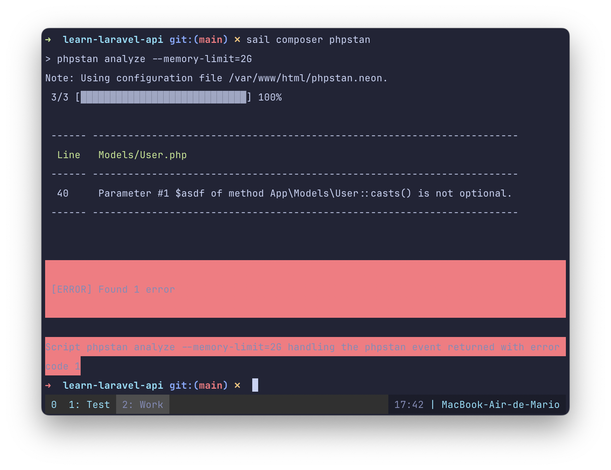
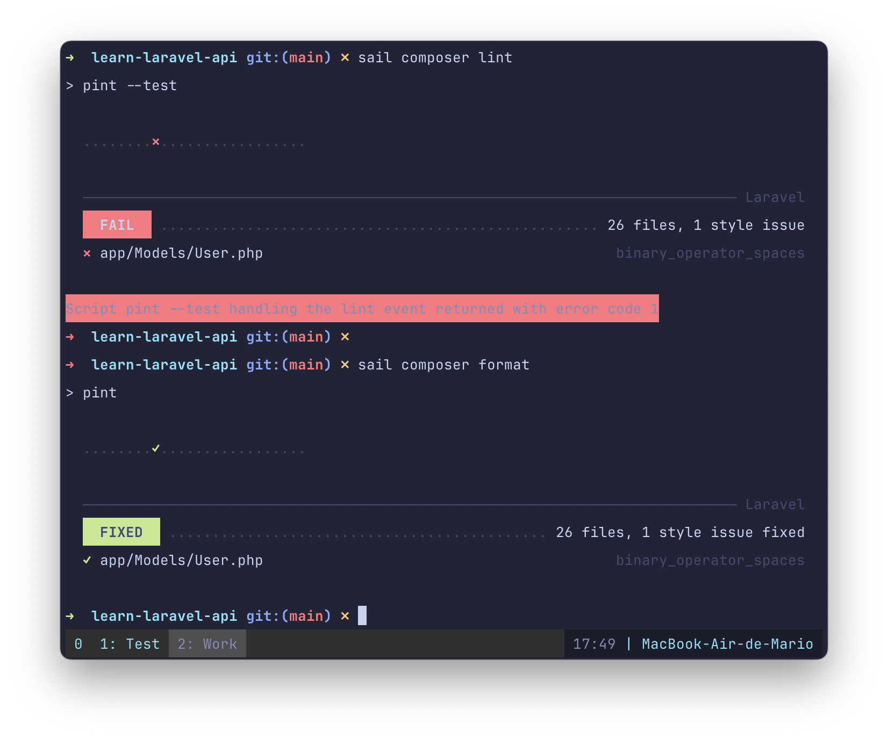
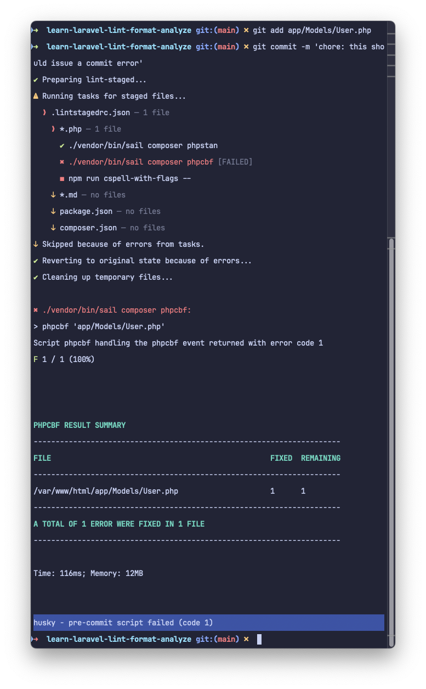

# Adding linting, formatting, static code analysis to a Laravel project created with Sail

Laravel offers multiple ways to setup a new project. You have [Herd](https://herd.laravel.com), you have `composer create-project laravel/laravel ...`, you have `lavarel new ...`, and you have [Laravel Sail](https://laravel.com/docs/sail) which is a wrapper over the `docker-compose` and `docker` commands.

Personally, I prefer Sail for my projects since I already use Docker extensively and is very easy to distribute your setup with other developers.

But one thing that is common to all of this options is that they don't make too many decisions on which tools you should use for developing, linting, formatting, code analysis, etc. And that's actually great!

Here I'm going to describe how I setup my Laravel projects so they have linting, formatting, follow a commit message standard, and makes sure that almost no mistakes are submitted to the repo.

## The `sail` Command

One thing to keep in mind when using Laravel Sail is that you no longer need to prefix with `php` any `artisan` command. And that you can execute the `composer`, `pint`, `pest` and `phpunit` commands, that **reside inside your containers**, directly if you prefix them with `sail`:

```bash
# Create a model with sail artisan
./vendor/bin/sail artisan make:model Task
```

And if you add the `sail` alias, like the [documentation](https://laravel.com/docs/sail#configuring-a-shell-alias) recommends, in your `~/.bashrc`, `~/.zshrc` or `~/.fishrc`:

```bash
# ~/.zsrc or ~/.bashrc
alias sail=[ -f sail ] && sh sail || sh vendor/bin/sail
```

... You can execute the previous `artisan` command like this:

```bash
sail artisan make:model Task
```

No need to specify the `sails` installation path.

## A Note About `artisan api:install` and Missing `package.json` File

If you have enabled [Laravel API Backend](https://laravel.com/docs/#laravel-the-api-backend) installation with

```bash
sail artisan api:install
```

The you might have noticed that the `package.json` file gets removed.

A quick fix would be to re-create the `package.json` file and add the correct values for `type` and `private`:

```bash
npm init -y
npm pkg set type=module
npm pkg set private=true --json
```

## Startup the Project

Before we start, we need an actual Laravel project. So make sure that you have **Docker** up and running, also that you have the `curl` command available (in MacOS you have to install it manually). And execute the following:

```bash
cd /path/to/projects/dir/
curl -s "https://laravel.build/learn-laravel-lint-format-analyze?with=mariadb" | bash
cd learn-laravel-lint-format-analyze
nano .env # Update the APP_PORT variable. I used 9090
sail up -d
```

_By default `laravel.build` will use MySQL as a Database. I prefer to use **MariaDB** since the Docker Image is much smaller_

And to prevent collisions with other projects, I add the following line to the `.env` file so I can access the local dev environment in <http://localhost:9090>

```bash
# .env file
# ...
APP_PORT=9090
```

Note: To destroy the docker environment just execute `sail down -v`. The `-v` is to remove volumes (data)

## Install PhpStan

The first tool to add to the repo is going to be [PhpStan](https://phpstan.org/). Which is a tool that analyses you code statically, (without executing it), allowing you to catch bugs very early and even inside your [IDE](https://github.com/SanderRonde/phpstan-vscode)

If you where to install PhpStan directly in your project, you would need to create a configuration file with hundreds of rules and exceptions. Fortunately the project [Larastan](https://github.com/larastan/larastan) has already done that for us. That's why we only need to install that package, create a `phpstan.neon` configuration file, and reference the rules of Larastan in the configuration file:

First we install Larastan with composer...

```bash
sail composer require larastan/larastan:^2.0 --dev
```

And then we create the `phpstan.neon` file referencing the Laravel Rules:

```yaml
# phpstan.neon

includes:
  - ./vendor/larastan/larastan/extension.neon

parameters:
  level: 5
  paths:
    - app/
```

Now, to execute static analysis on your project you would need to execute something like `sail ./vendors/bin/phpstan analyze --memory-limit=2G -v` which is very cumbersome. So, to makes things simpler let's just create a new _script_ in `composer.json` with all the required parammeters:

```json {7}
// composer.json
{
    // ...
    "scripts" : [
        // ...
        "phpstan": [
            "phpstan analyze --memory-limit=2G -v"
        ]
    ]
}
```

To test that PhpStan is working correctly, create an error in the `app/Models/User.php` and execute the `sail composer phpstan` command:



## Configure Php Code _linting_

When it comes to linting, there are 2 tools that I use:

- [PHPCS](https://github.com/PHPCSStandards/PHP_CodeSniffer/)
- [Pint](https://laravel.com/docs/pint)

Of this 2 I almost always use PHPCS since is more strict (and that's configurable), which is better for teams of multiple developers

### Linting and Formatting with PHPCS

Configuring `phpcs` requires that you

- Install the `php_codesniffer` package
- Create a `phpcs.xml` file with the rules you want to enforce in your project
- Modify the `composer.json` file so the correct command gets executed when you want to lint or format.

So let's install PHPCS:

```bash
sail  composer require "squizlabs/php_codesniffer=*" --dev
```

Create a configuration file with the rules we want to use in our project.

```xml
<!-- .phpcs.xml -->

<?xml version="1.0"?>
<ruleset name="Laravel Linting and Formatting">
    <!-- Configure here the paths you want to check -->
    <file>.</file>

    <config name="testVersion" value="8.3-"/>

    <!-- Coding standards and rules to check -->
    <rule ref="PEAR" />
    <rule ref="PSR1" />
    <rule ref="PSR2" />
    <rule ref="PSR12" />

    <!-- Exceptions -->

    <!-- Tailwind uses very long lines so better to have this here -->
    <rule ref="Generic.Files.LineLength">
        <properties>
            <property name="lineLimit" value="120"/>
            <property name="absoluteLineLimit" value="0"/>
        </properties>
    </rule>

    <!-- Commenting EACH file is not that useful (unless you are worried about copyrights) -->
    <rule ref="PEAR">
        <exclude name="PEAR.Commenting.FileComment.Missing" />
    </rule>

    <!-- Allow CamelCase in tests. If you are using Pest you might want to remove this rule exception -->
    <rule ref="PSR1.Methods.CamelCapsMethodName.NotCamelCaps">
        <exclude-pattern>/tests/</exclude-pattern>
    </rule>

    <!-- Since `public/index.php` is the entry point we can forgive this error just in that file -->
    <rule ref="PSR1.Files.SideEffects.FoundWithSymbols">
        <exclude-pattern>/public/index.php</exclude-pattern>
    </rule>

    <!-- A blade template might NOT have `<?php ?>` code blocks -->
    <rule ref="Internal.NoCodeFound">
        <exclude-pattern>./resources/views/</exclude-pattern>
    </rule>

    <!-- End Exceptions -->

    <!-- Show sniff codes in all reports -->
    <arg value="sp"/>
    <!-- Show sniff and progress -->
    <arg name="parallel" value="8"/>
    <!-- Enables parallel processing when available for faster results. -->
    <arg name="colors"/>
    <arg name="extensions" value="php"/>

    <!-- Configure here the paths you want to IGNORE -->
    <exclude-pattern>/node_modules/*</exclude-pattern>
    <exclude-pattern>/vendor/*</exclude-pattern>
    <exclude-pattern>/bootstrap/cache/*</exclude-pattern>
</ruleset>
```

And finally, add a _script_ in `composer.json` for easier execution:

```json
// composer.json
{
  // ...
  "scripts": {
    // ...
    "phpcbf": ["phpcbf"],
    "phpcs": ["phpcs"],
    "lint": ["phpcbf"],
    "format": ["phpcs"]
  }
}
```

To execute a quick test, just execute the script:

```bash
sail composer phpcs # To lint all files

# or

sail composer phpcbf # To format all files
```

### Linting with Pint

If you don't need the flexibility of PHPCS, and don't want to install additional software, you can just configure `pint`. After all, it comes installed default on every new project.

In our case we just need to update the `composer.json` file with the `lint` script that will execute the `pint` command

```json
{
  // ...
  "scripts": {
    // ...
    "lint": ["pint --test"],
    "format": ["pint"]
  }
}
```

### Testing linting and formatting

To test it out, _un-indent_ a line (or any other linting error) in the `app/Models/User.php` file and then execute `sail composer lint` to find it. To fix it, just execute `sail composer format`



## Composer Normalize

I like to have ALL my files linted and formatted. So I also use a tool that takes care of my `composer.json` file. It's called [composer-normalize](https://github.com/ergebnis/composer-normalize/), and can be installed using `composer`:

```bash
sail composer require "ergebnis/composer-normalize=*" --dev
```

In a similar fashion to `phpstan`, the tools requires a couple of flags to function correctly, that's why the best way to execute it trough `composer`. But instead of adding 2 new _scripts_, let's modify the `lint` and `format` script so the linting of php files and `composer.json` gets executed at the same time:

```json
// composer.json
{
  // ...
  "scripts": {
    // ...
    "composer-normalize": [
      "@composer normalize --indent-size=4 --indent-style=space --quiet"
    ],
    "format": ["phpcbf", "@composer-normalize"],
    "lint": ["phpcs", "@composer-normalize --dry-run"]
  }
}
```

This means that when you execute `sail composer lint` you would be linting your `.php` files AND the `composer.json` file. The same happens with the `format` command:

```bash
sail composer lint # Lint both *.php and composer.json file
sail composer format # Format both *.php and composer.json file
```

## Configure `cspell`

I love good spelling in my projects, that's why I install [cSpell](https://cspell.org/configuration/) in all of my projects.

the `cSpell` package is an `npm` package. And since we will be executing it locally, before we submit files to the repo, we can install it locally using `npm`:

```bash
npm install -D cspell
echo "# Laravel linting and formatting scaffold application" > README.md
```

Not that I re-wrote the `README.md` file! The reason is that there are a lot of names there that drives cSpell nuts. So we might as well remove any spelling issues from that file.

Additionally to installing the package, you need to create the file `.cspell.json` with the words you want to ignore as the paths you don't want to check for spelling

```json
// .csspell.json
{
  "version": "0.2",
  "language": "en",
  "words": [
    "EHLO",
    "autoload",
    "autoloader",
    "beanstalkd",
    "endauth",
    "envoyer",
    "failer",
    "figtree",
    "laracasts",
    "laravel",
    "mailgun",
    "mario",
    "nesbot",
    "nuno",
    "nunomaduro",
    "papertrail",
    "phpactor",
    "phpredis",
    "phpunit",
    "roundrobin",
    "ruleset",
    "sasl",
    "sslmode",
    "symfony",
    "termwind",
    "uncompromised",
    "vite",
    "yepes"
  ],
  "ignorePaths": [
    ".cspell.json",
    ".git/",
    ".gitattributes",
    ".gitignore",
    ".gitignore",
    ".phpactor.json",
    ".vscode/**",
    "artisan",
    "composer.json",
    "database/*.sqlite",
    "docker-compose.yml",
    "node_modules/**",
    "phpstan.neon",
    "phpunit.xml",
    "storage/**",
    "vendor/**"
  ]
}
```

And you can test your configuration with:

```bash
npx cspell --relative --dot --no-progress --show-suggestions --show-context .
```

And, as we did with `phpstan` let's create a script, but this time in `package.json`, with all the required parameters:

```bash
npm pkg set scripts.cspell-with-flags="cspell --relative --dot --no-progress --show-suggestions --show-context"
```

And to test that it works you can execute the following command to spell check your project files:

```bash
npm run cspell-with-flags .
```

## Install and Configure Markdownlint

Every piece of software that you write, needs some sort of documentation. You should include at least instructions to your fellow teammates on how to setup a development environment and the requirements of the software you are writing.

Most of the time you will include this documentation in your project, and most of the time you'll write this documentation in [Markdown](https://www.markdownguide.org/). And to make sure that your documentation follows the correct format we are going to use [markdownlint](https://github.com/DavidAnson/markdownlint/).

To install it you just use `npm`:

```bash
npm install -D markdownlint-cli
```

After installing it, you need to create the `./.markdownlintrc.json` file with at least a `default` directive, and optionally a list of [rules](https://github.com/DavidAnson/markdownlint/blob/main/doc/Rules.md) you want to override:

```json
// .markdownlintrc.json
{
  "default": true,
  "heading-style": {
    "style": "atx"
  },
  "line-length": false,
  "no-inline-html": {
    "allowed_elements": ["figure", "video"]
  }
}
```

To avoid `markdownlint-cli` to examine EVERY folder, we should create a `.markdownlintignore` file with the paths we don't want it to examine:

```ini
vendor/**
node_modules/**
```

To test it out, just execute

```bash
npx markdownlint .
```

## Lint the `package.json` file with `npm-package-json-lint`

If we want to be thorough, we need to make sure that our `package.json` follows some conventions, also, we need to make sure that our `package.json` has the `private` and `type` keys present **always**. So let's use the [`npm-package-json-lint`](https://npmpackagejsonlint.org/) package to make sure that everything is correct.

```bash
npm install -D npm-package-json-lint npm-package-json-lint-config-default
```

And as with most other tools, you need to create a _dotfile_, in this case `.npmpackagejsonlintrc.json`, with a list of [rules](https://npmpackagejsonlint.org/docs/rules) you want to enforce:

```json
// .npmpackagejsonlintrc.json
{
  "extends": "npm-package-json-lint-config-default",
  "rules": {
    "require-private": "error",
    "require-type": "error",
    "prefer-property-order": ["error", []]
  }
}
```

To test all of your `package.json` files (if you have more than one) you just need to execute:

```bash
npx npm-package-json-lint .
```

## Faster Execution of `npm` Script with `npm-run-all`

If you where to execute all of the linting and formatting commands before committing, you would need to type A LOT in your terminal.

One option would be then to create a _script_ in `package.json` that executes everything. But better yet it would be that this script executed everything in paralell !!!

To execute all of the linting and formatting commands in paralell we are going to use the `npm-run-all` package:

```bash
npm install -D npm-run-all
```

And to use it we just need to create the following scripts in `package.json`

```json
// package.json
{
  // ...
  "scripts": {
    "cspell-with-flags": "cspell --relative --dot --no-progress --show-suggestions --show-context --quiet",
    "lint:php": "vendor/bin/sail composer lint",
    "lint:md": "markdownlint .",
    "lint:cspell": "npm run cspell-with-flags -- .",
    "lint:package-json": "npmPkgJsonLint .",
    "lint": "run-p lint:*",
    "format:php": "vendor/bin/sail composer format",
    "format:md": "markdownlint --fix .",
    "format:package-json": "npmPkgJsonLint .",
    "format": "run-p format:*"
  }
  // ...
}
```

Note that all commands use the format `prefix:something`. That's a requirement from `npm-run-all`.

And because we used the `npm-run-all` format. We can execute `lint` or `format` and have all the linting and formatting commands execute in paralell.

```bash
npm run lint # Will execute all the linting commands

npm run format # Will run all format commands
```

## Install and Configure `lint-staged`

Up until now, we have to execute the linting and formatting scripts manually, and they will lint and format ALL THE PROJECT FILES. And if your project is large, this could take a lot of time.

Fortunately, the `lint-staged` npm command can execute the linting and formatting commands **we specify** only to the files that are staged by Git.

Installing it is as easy as always:

```bash
npm install -D lint-staged
```

And to configure it, we need to instruct it which linting or formating command has to be executed depending on the file extension. This is done trough the `.lintstagedrc.json` file:

```json
// .lintstagedrc.json
{
  "*.php": [
    "./vendor/bin/sail composer phpstan",
    "./vendor/bin/sail composer phpcbf",
    "npm run cspell-with-flags --"
  ],
  "*.md": ["npm run cspell-with-flags --", "npx markdownlint --fix"],
  "package.json": ["npmPkgJsonLint ."],
  "composer.json": ["./vendor/bin/sail composer composer-normalize"]
}
```

To test it out, let's create an error, add it to the list of files to commit, execute `lint-staged` and check that `commitlint` actually gets executed.

```bash
# Create an error on app/Model/User.php
git add app/Model/User.php
npx lint-staged --relative
# check that it catches the error
```

Note the `--relative` flag. Is needed since we are using a command inside docker

To reset the file to the previous state just do:

```bash
git reset app/Models/User.php
git checkout HEAD -- app/Models/User.php
```

## Install and Configure `commitlint`

With `commitlint` we can verify that the _git commit_ messages follows the ["Commit Conventions"](https://www.conventionalcommits.org/)

Since `commitlint` changes a lot over time, it might be a good idea to follow the [official documentation](https://commitlint.js.org/guides/getting-started.html) installation steps instead of the following. But anyway, here they are:

```bash
npm install -D @commitlint/{cli,config-conventional}
echo "export default { extends: ['@commitlint/config-conventional'] };" > .commitlintrc.js
```

To test out that `commitlint` enforces the `config-conventional` convention, lest do a small test:

```bash
echo "BAD commit message" | npx commitlint
echo "chore: good commit message" | npx commitlint
```

The first commit should output a warning, the second should output **nothing**

## Bring it all together with `husky`

To wrap everything up, make `lint-staged` and `commitlint` be executed **automatically** before any file gets committed to git. For that we need to install and configure `husky`.

```bash
npm install -D husky
npx husky init
echo "npx --no -- commitlint --edit \$1" > .husky/commit-msg
echo "npx lint-staged --relative" > .husky/pre-commit
```

As you can see we created 2 new files: `.husky/commit-msg` and `.husky/pre-commit`. This are bash scripts that will be executed automatically every time we make a new commit. The first one will execute `commitlint` and make sure that the commit message follows the selected standard. The second one will execute `lint-staged` which in place will execute the lint and format commands only on staged files.

To test it out, modify the `app/Models/User.php` adding a class variable with a bad name:

```php
// This should trigger a cspell error
protected $lksdjlfjldjf = '';
```

This should be enough to fire a linting error that can not be auto fixed... Then:

```bash
git add app/Models/User.php
git commit -m "feat: configure pre-commit linting"
```

This should issue an error



## Future Steps and Resources

One thing that we didn't do for this project is execute any new tests after they are added. Also, we didn't performed any linting and formatting for JavaScript or (S)CSS files.

If you want to take a look at a simple project with all the files, you can visit [this](https://github.com/marioy47/learn-laravel-lint-format-analyze/) GitHub repo.
