We are developers... right?

Well, maybe you aren't, but I am... And one thing that has bugged me for the last couple of years, is creating presentations using Office tools like MS Power Point, Libre Office Impress or Google Slides.

Don't get me wrong. I think all of them are terrific pieces of software. They make any user's life easier and offers a myriad of tools so you can compose your documents in a snap, specially presentations.

But, we're not average users, we're developers 🤓...

And as developer I would like to create presentations that can be tracked using version control, that you can change themes easily, that you can reuse and fork, and most of all, **something that can be done trough code** not using a graphical interfaces.

Enter [MDX Deck](https://mdxjs.com/)...

With _MDX Deck_ you can create presentations using only [MDX](https://mdxjs.org)!


_Taken from the MDX Deck [Github Page](https://github.com/jxnblk/mdx-deck)_

## Wait a minute, what is MDX?

Quoting the [Official Site](https://mdxjs.com/):

> MDX is an authorable format that lets you seamlessly write JSX in your Markdown documents. You can import components, such as interactive charts or alerts, and embed them within your content. This makes writing long-form content with components a blast 🚀. -- [MDXJs](https://mdxjs.com/):

This basically means that you can do something like this:

```markdown {5-7}
## This is _mdx_

Its like a _Markdown document_, but with embeded **React Code**:

import Button from "my-components/button"

<Button />;
```

And React would interpret it like a component!

Note that _MDX_ is alternative way to create React components. And not a replacement for Markdown. So to use MDX you need to create a React project or include React in your project with [Webpack](/webpack-wordpress-config/) or [Rollup](https://rollupjs.org/).

## MDX Deck

Now that we know what MDX is, we can start talking about _MDX Deck_.

[MDX Deck](https://github.com/jxnblk/mdx-deck) is a _React Project_ that allows you to create React based presentation decks, that can be published in web servers since the output is HTML and JavaScript (heard of the [JAM Stack](https://jamstack.org/#what) before????) but that are created using `mdx` components and not JavaScript ones.

The great thing about _MDX Deck_ is that it does all the heavy lifting of creating a React app, bundling all the required libraries (like syntax highlighting and steps libraries) and does the initial configuration so you can focus on the content creeation using Markdown.

## Start a new MDX Deck project

All right, let's get our hands dirty an lest create a new presentation using MDX Deck. For that we need to create a new node project with `npm init` or `yarn init`.

I'll be using yarn since I think is faster

```bash
mkdir mdx-deck-tutorial
cd $_
yarn init -y
touch slides.mdx
yarn add --dev mdx-deck
```

This will:

- Create the directory `mdx-deck-tutorial/`
- Create a minimal `package.json` file
- Create the empty `slides.mdx` file for the slides of our presentation.
- Place an `mdx-deck` command in `./node_modules/.bin/mdx-deck` that will take care of generating our presentation.

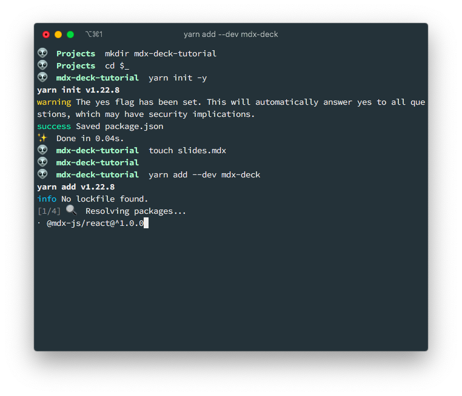

If I list the contents of the current folder, minus the `node_modules` dir, I will get the following structure:

```bash
$ tree -I node_modules
.
├── package.json
├── slides.mdx
└── yarn.lock

0 directories, 3 files
```

Since accesing the `mdx-deck` command using `./node_modules/.bin/mdx-deck` is a pain, we'll be creating a new `start` script in the `pacakge.json` file to execute it for us.

```json {10-12}
// package.json
{
  "name": "mdx-deck-tutorial",
  "version": "1.0.0",
  "main": "index.js",
  "license": "MIT",
  "devDependencies": {
    "mdx-deck": "^4.1.1"
  },
  "scripts": {
    "start": "mdx-deck slides.mdx"
  }
}
```

The `mdx-deck` comand requires the name of the `.mdx` file to execute. That's why I appended the `slides.mdx` at the end. Because that's the name that I selected for my presentation.

## First slides of your presentation

Before we create the slides of our presentation by adding content on the `slides.mdx` file, there are some things that you have to take into account:

- All the slides will be in that **one file** (`slides.mdx`)
- Each slide is **separated** by `---` (3 dashes)
- **Almost** all Markdown syntax is valid. One exception are local images
- You **have** to use the `.mdx` suffix. Otherwise your deck it won't picked up as a component.
- You get a **live reload** out of the box
- You control all the presentation aspects from the `.mdx` file. No need (although you can) to create additional files.

Now that we know that, lets add the following content to our `slides.mdx` file:

```markdown
<!-- slides.mdx -->

# My very first presentation

[@marioy47](https://twitter.com/marioy47)

---

# This is the second slide

With some content

- One
- Two
- Three

---

# Now with a remote image


```

And execute `yarn start` to start the local development server and see your first 3 slides:

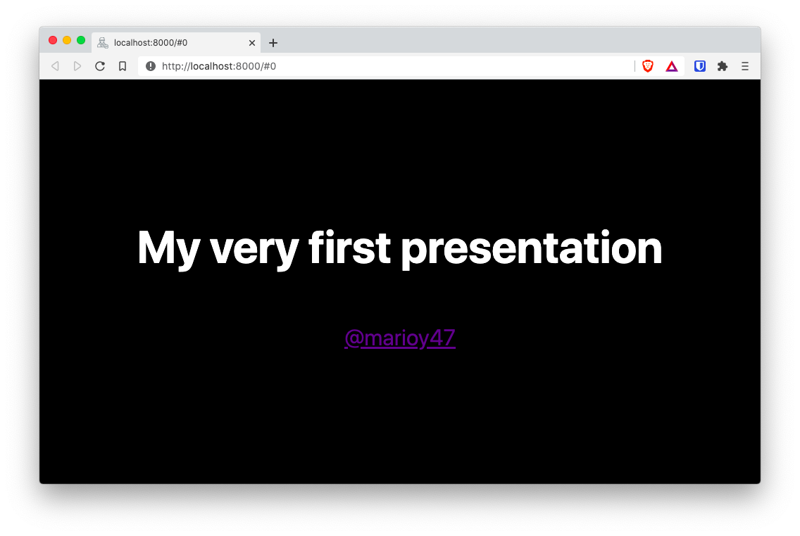

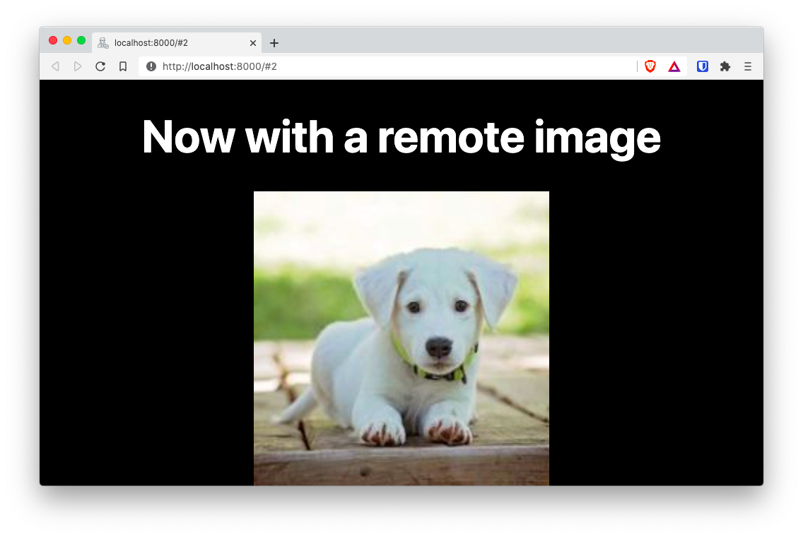

> At the time of this writing there is an issue with mdx-deck 4.1.0 where the terminal keeps reloading. You can do a `yarn add --dev mdx-deck@4.0.0` (downgrade mdx-deck) to temporary solve this issue. You might want to follow this [Github issue](https://github.com/jxnblk/mdx-deck/issues/752) for more information.

## Adding local images

The first, and hopefully only, problem you are going to run into, is the fact that you can not include **local** images using the Markdown Syntax. The reason for this is because you are building a React project.

> To include images in regular Markdown you could use something like ``

So you can not include local images, but you can create _Image_ components.

So lets create an `images/` sub-dir and download an image from [Unsplash](https://unsplash.com/photos/5DqvsOPKdlk) and place it there.

```bash {4}
$ tree -I node_modules
.
├── images
│   └── jorge-gardner-5DqvsOPKdlk-unsplash.jpg
├── package.json
├── slides.mdx
└── yarn.lock

1 directory, 4 files
```

Then lets add a new slide, on the `slides.mdx` file with the following content:

```markdown
---

# Using a local image

import ImgPath from "./images/jorge-gardner-5DqvsOPKdlk-unsplash.jpg"

<Image src={ImgPath} style={{maxWidth: `900px`}} />
```

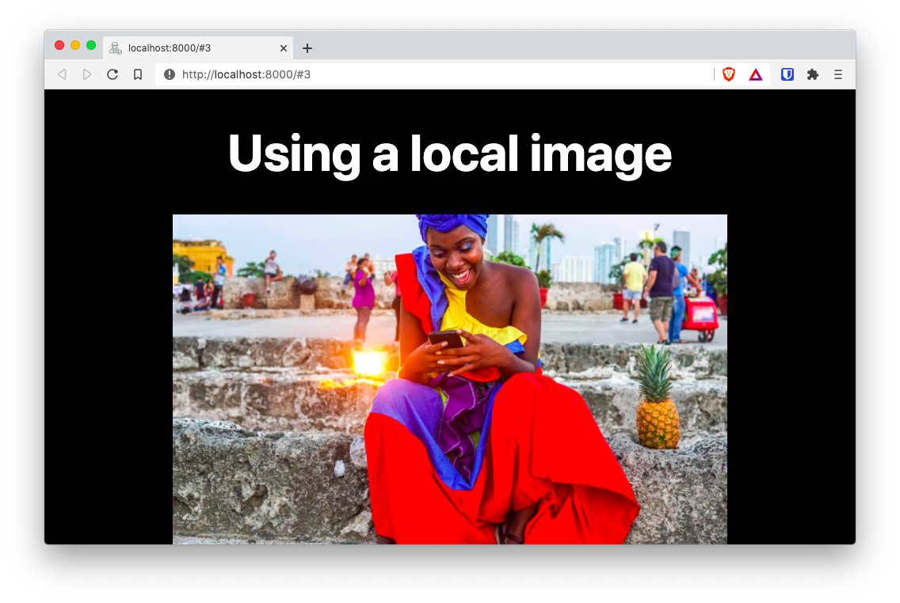

If you know react (and I'm assuming you do) you can see that you are including a local image path and then adding an `<Image>` component.

> [!NOTE]
>
> - The `<Image>` component is provided by MDX Deck and made available by default.
> - You can used something like `` too. But `<Image>` is [more powerful](https://raw.githubusercontent.com/jxnblk/mdx-deck/28d5e6dc5d328cdd11796ff898d0435b9abe3208/examples/images/deck.mdx)

Also notice that you are using the `import` right into the slide and not at the top of the file. **Its not necessary to import components at the top of the file, even tough you can**.

## Using themes

What is a presentation without fancy colors.

Quoting the [docs](https://github.com/jxnblk/mdx-deck/blob/master/docs/theming.md):

> MDX Deck uses [Theme UI](https://theme-ui.com/) and [Emotion](https://emotion.sh/) for styling, making practically any part of the presentation themeable.

So, now that you have created a basic deck with a handful of slides, lets give it some life bye adding brilliant colors provided by the `yellow` theme.

Add the following code to the top of your presentation so it covers all the slides:

```markdown {3-5}
<!-- slides.mdx -->

import { yellow } from "@mdx-deck/themes"

export const theme = yellow

# My very first presentation

[@marioy47](https://twitter.com/marioy47)

---

...
```

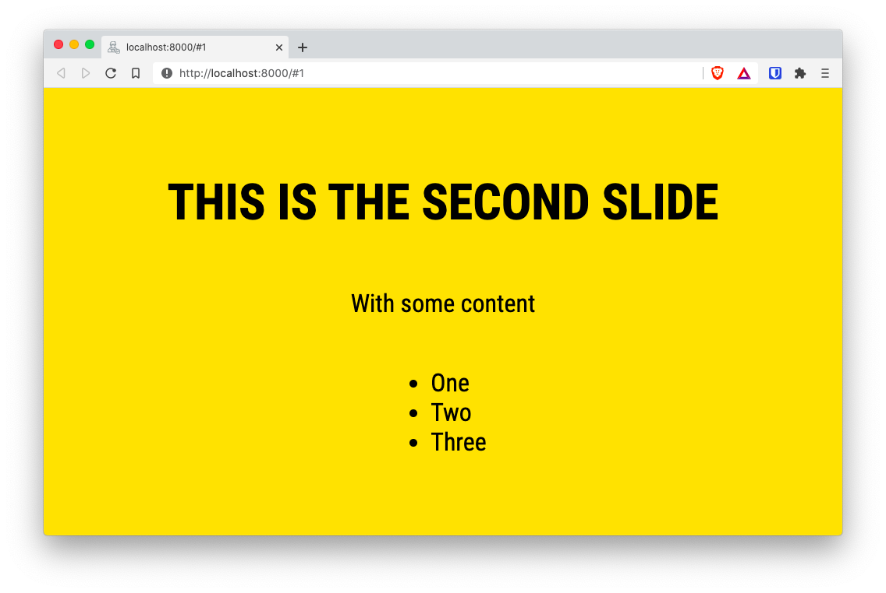

There is a list of included themes [here](https://github.com/jxnblk/mdx-deck/blob/master/docs/themes.md). And you can [create your own](https://github.com/jxnblk/mdx-deck/blob/master/docs/theming.md).

## Syntax Highlighting

This is the best part of _MDX Deck_... At least for me.

You can include code with syntax highlighting in your presentations! You just have to **include a syntax highlighting theme** and let it paint your code.

For that we have to change the top of the file `slides.mdx` with the following:

```markdown {3-8}
<!-- slides.mdx -->

import { yellow, prism } from "@mdx-deck/themes"

export const theme = {
...yellow,
...prism,
}

# My very first presentation

[@marioy47](https://twitter.com/marioy47)

---

...
```

And then add a new slide by adding the following at the **end of the same file**:

````markdown
---

# Native Syntax Highlighting

```jsx
import React from "react";

const FirstComponent = (props) => {
return &lt;h1&gt;Highlighting&lt;/h1&gt;;
};

export default FirstComponent;
```
````

And voilà. We beautiful code in our new slide.

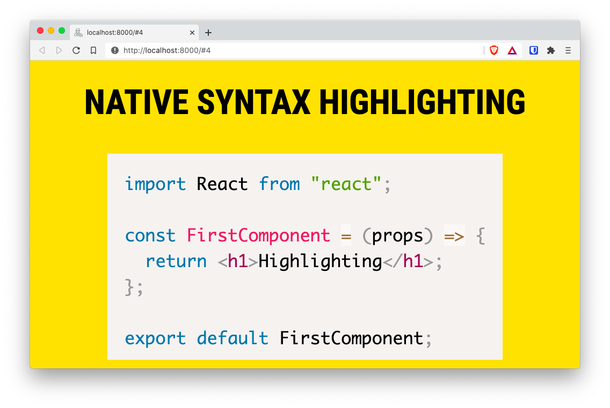

In the example I'm using the `prism` theme. But I could also use the `highlight` theme (I know... It's an awful name for a highlight theme).

Latter we'll see how to use advanced syntax highlighting with the help of an external module.

## Using components

_MDX Deck_ creates a React app that behaves like a presentation. This means that you can create an use components.

Lets test that by creating the `components/` sub-dir and add an empty file:

```bash
mkdir components/
touch components/counter-button.js
```

The content of our new component will be a simple button with a counter:

```jsx
// components/counter-button.js

import React, { useState } from "react";
import styled from "@emotion/styled";

// Button style with Emotion Styled
const Button = styled.button`
  padding: 0.7rem 2rem;
  border-radius: 0.6rem;
  font-size: 1.5rem;
`;

// Component
const CounterButton = () => {
  const [counter, setCounter] = useState(0);

  const increment = () => {
    setCounter(counter + 1);
  };

  // Button component whith the style
  return <Button onClick={increment}>Counter: {counter}</Button>;
};

export default CounterButton;
```

And in our presentation add the following "slide":

```markdown
---

# Using a custom component

import CounterButton from './components/counter-button.js';

<CounterButton />;
```

And the result is this new slide:

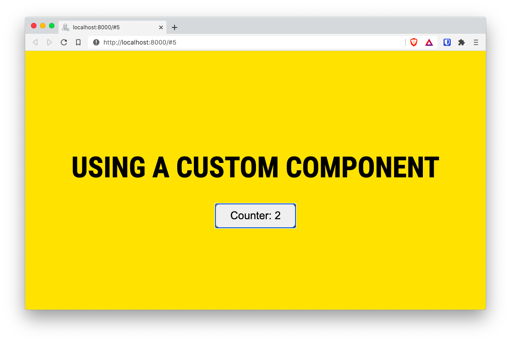

And just like that, you have a functional component inside a presentation. If you are following along, you can check that by clicking on the button the internal counter increments.

There are a couple of things to note here:

- We can import the component right in the slide. You don't have to import it at the top of the file.
- You can use [Emotion styled components](https://emotion.sh/docs/styled) out of the box since they are included when you install the MDX Deck package.

## Steps

This is the scenario: You want to include a list of _items_ in your slide, but you want to show each item only when you press the space bar or the "right" arrow.

For that, MDX Deck includes the handy `Steps` component.

When you enclose a list (or multiple components) between `<Steps>` and the `</Steps>` tags, you get a list that only show its items when the speaker presses the space bar or the right arrow key:

```markdown {7-15}
---

# Using a list with steps

Use the space bar to go to the next step

<Steps>
 
1. First step
2. Second step
3. Third step
 
</Steps>
```

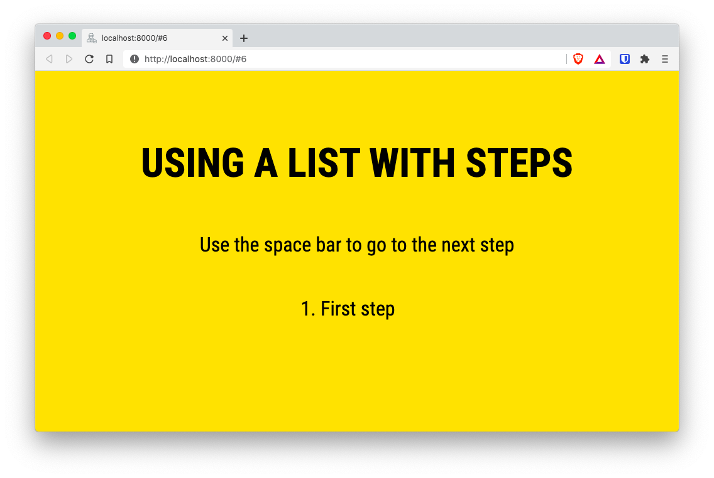

One important thing to note: **There needs to be a space before and after the list items**. Otherwise MDX wont recognize the list.

## Layouts

Slides where you have different content on the left and the right. Or where you have to specify a _before_ and an _after_ by separating content on the top and the bottom is very common.

For those use cases, MDX Deck offers multiple [layouts components](https://github.com/jxnblk/mdx-deck/blob/master/docs/layouts.md)

You have layouts for

- [Invert](https://github.com/jxnblk/mdx-deck/blob/master/docs/layouts.md#invert) to invert colors
- [Split](https://github.com/jxnblk/mdx-deck/blob/master/docs/layouts.md#split) left & Right
- [SplitRight](https://github.com/jxnblk/mdx-deck/blob/master/docs/layouts.md#splitright) Right & Left
- [Horizontal](https://github.com/jxnblk/mdx-deck/blob/master/docs/layouts.md#horizontal)
- [Full Screen Code](https://github.com/jxnblk/mdx-deck/blob/master/docs/layouts.md#fullscreencode)

Additionally, you can create your [own layouts](https://github.com/jxnblk/mdx-deck/blob/master/docs/layouts.md#layouts)!

To test the _Layout_ components, add the following slides to your deck:

````markdown
---
# Layouts: Split left & right

<Split>


</Split>
---

# Layouts: Invert

<Invert>

- First item
- Second item
- Third item

</Invert>

---

# Layouts: FullScreenCode

<FullScreenCode>

```jsx
import React, { useState } from "react"

export default const CustomButton = () => {
  const [counter, setCounter] = useState(0)

  const increment = () => {
    setCounter(counter + 1)
  }
  return <button onClick={increment}>Counter: {counter}</button>
}
```

</FullScreenCode>
````

That will render the following slides:

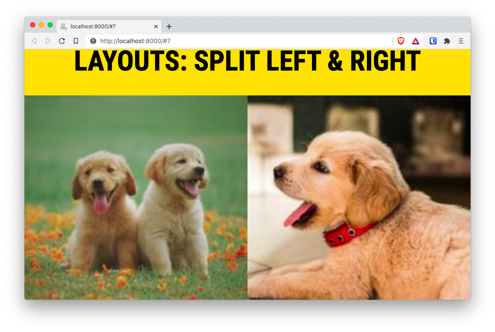

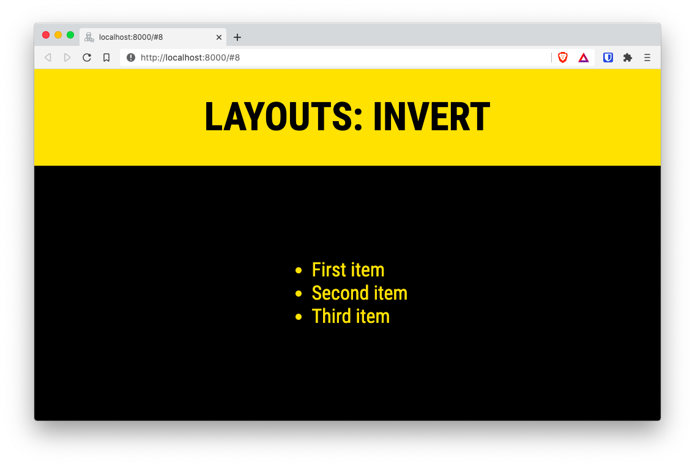

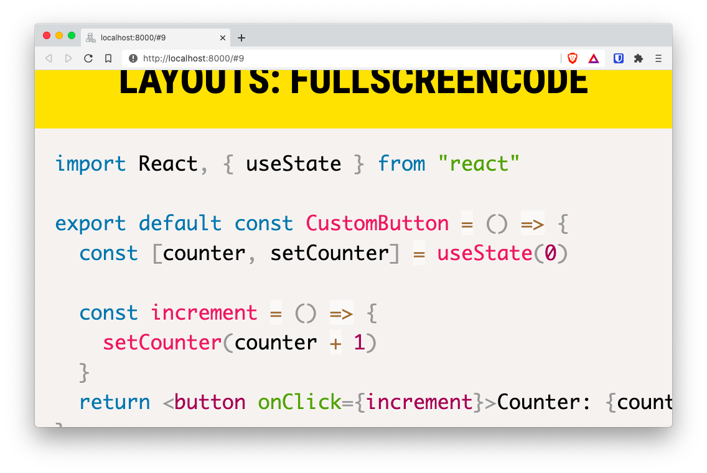

As you can see in the last one, `<FullScreenCode>` allows you to add code to to a slide that takes over the whole slide content.

## Building your presentation

There are still a lot of additional things we can do with MDX Deck. But for now lest focus on creating a "publishable" version of your presentation.

MDX Deck can build your slides into a single `.html` file and a bunch of `.js` and `.css` files. For that, we need to execute the `mdx-deck` command with the `build` parameter.

To make our life simpler, lets add a new _script_ in the `package.json` file that calls the build step with the correct options:

```json {12}
// package.json
{
  "name": "mdx-deck-test",
  "version": "1.0.0",
  "main": "index.js",
  "license": "MIT",
  "devDependencies": {
    "mdx-deck": "^4.1.1"
  },
  "scripts": {
    "start": "mdx-deck slides.mdx",
    "build": "mdx-deck build slides.mdx"
  }
}
```

And with that change done, lets build our project with `yarn build`:

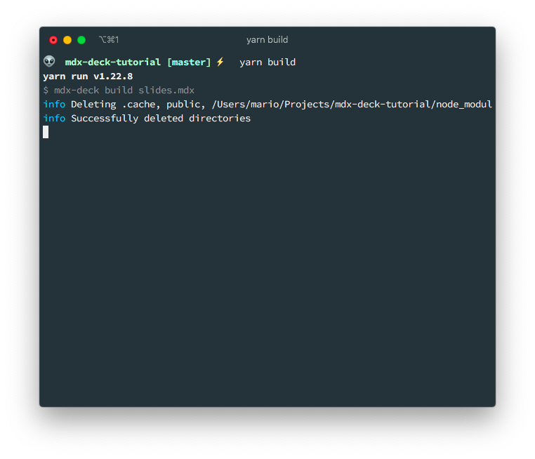

This will crate the `public/` directory with the publishable files:

```bash
$ ls public/
app-19039aec0029c6075d10.js
app-19039aec0029c6075d10.js.LICENSE.txt
app-19039aec0029c6075d10.js.map
chunk-map.json
component---slides-mdx-38ee3c0e0acfec1fe58d.js
component---slides-mdx-38ee3c0e0acfec1fe58d.js.map
framework-4ad6f72b95fab36bb534.js
framework-4ad6f72b95fab36bb534.js.LICENSE.txt
framework-4ad6f72b95fab36bb534.js.map
index.html
page-data
polyfill-53a4b90aa8233609c5bb.js
polyfill-53a4b90aa8233609c5bb.js.map
static
webpack-runtime-a8ba26beef7b8523e68b.js
webpack-runtime-a8ba26beef7b8523e68b.js.map
webpack.stats.json
```

You can do a quick test of the result by using Python's `http.server` module:

```bash
cd public/
python3 -m http.server
```

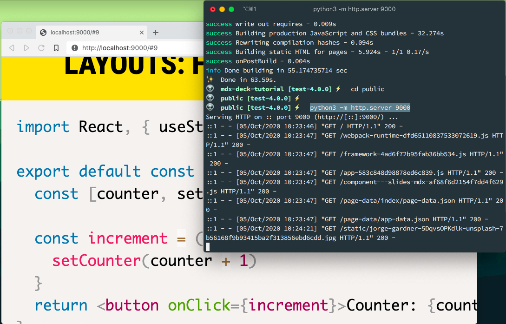

Actually this is my preferred way of presenting instead of using `yarn start`. The reason being that the this consumes much less resources since there is no _watch_ process executing and the files we're using are static.

Also, you can publish this files in a web server with one caveat:

**MDX Deck assumes that the files are going to be published on the Document Root of your web server**.

So you if you are going to use something like [GitHub Pages](https://pages.github.com/) you need to use the **Custom domain** option.

## Final thoughts

In this first part we learned how to create a basic MDX Deck presentation with local images, syntax highlight and different layouts.

In the second part we'll be looking on how to publish the presentation on a custom domain and how to take the source code presentation to the next level.

Stay safe for now.
