> [!NOTE]
> Since 2024-08 I've been using [LazyVim](https://lazyvim) with the [PHP](https://www.lazyvim.org/extras/lang/php) extra

So I have been using [Vim 8](https://vim.org) for some years now, And so far, [it has been great](https://marioyepes.com/vim-setup-for-modern-web-development/). But lately, some things have started bothering me:

- The auto-completion needed [big heavy plugins](https://github.com/neoclide/coc.nvim) that were resource hungry
- The linting and formatting for PHP did not work quite as it should. Specially the formatting, didn't worked inside Vim
- There is some lagging on some tasks. This should not happen in a Mac Book Pro M1
- The configuration became really confusing

Most of all, I wanted to have the full capabilities that [Visual Studio Code](https://code.visualstudio.com) has when you install [Intelephense](https://marketplace.visualstudio.com/items?itemName=bmewburn.vscode-intelephense-client), [PHP Sniffer](https://marketplace.visualstudio.com/items?itemName=wongjn.php-sniffer) and [Better PHPUnit](https://marketplace.visualstudio.com/items?itemName=calebporzio.better-phpunit) when it comes to developing with PHP, but in Vim.

Additionally, Gutenberg is written with [React](https://reactjs.org) and [Redux](https://redux.js.org/), so having good JavaScript support was also necessary.

After watching many videos and reading many blogs I came to the conclusion that [NeoVim](https://neovim.org) with _native_ LSP support was the way to go. But since I was about to make the switch, I might as well start using [Lua](https://www.lua.org/) for configuration instead of [vimscript](https://learnvimscriptthehardway.stevelosh.com/) and use plugins written in Lua if possible since it's proven to be crazy fast.

I this article, I'll document the process, and also explain some of the **advanced** concepts behind Vim with Lua.

## Why Lua and Why now?

In July 2021, [version 0.5](https://neovim.io/news/2021/07) of NeoVim was released with a few **very** important features:

- Lua support was added for the configuration and the creation of plugins
- It included [Treesitter](https://tree-sitter.github.io/tree-sitter/) for language parsing
- It incorporated a native _Language Server Protocol_ client

This 3 things are the ones that are going to enable us to create the perfect NeoVim setup for our purposes.

## But what is Lua?

Lua is a scripting language interpreted at runtime. This means that is not necessary to compile it to run it, much like PHP, Python and JavaScript. But it can be compiled to **bytecode**, in a similar way as Java, making it much faster to execute. Is designed to be small in footprint (about 200K) and have small memory usage. Additionally it is very fast to execute, and most of all, **embeddable**.

That last one is the reason is why is becoming so popular. Programs like [NeoVim](https://neovim.org) and games like [Roblox](https://roblox.com) are [using Lua](https://devforum.roblox.com/t/lua-scripting-starter-guide/394618) to add scripting capabilities and extensibility.

Lua is a very interesting, fun and small language. If you want to try Lua outside NeoVim, you can use an [online REPL](https://replit.com/languages/lua) or install it (in a Mac) with:

```bash
brew install lua
echo "print('Hello World')" >> hello.lua
lua hello.lua
```

An if you want to use bytecode:

```bash
luac -o hello.luac hello.lua
lua hello.luac # Executes much faster
luac -l hello.luac
```

## Lua Syntax

You could get away with configuring NeoVim with Lua without understanding much of the code. But it really helps if you do. And the best place to understand the language is in [it's official manual](https://www.lua.org/manual/).

Here are a few concepts just to get you started:

- No end of line character (p.e. `;`) needed
- One line comments are just `--`
- Block comments start with `--[[` and finish with `]]`. A lot of people use `--]]` to end the comment to preserve symmetry
- Supports loops, conditionals, functions, tables (Hash Maps) and modules
- It doesn't have arrays or dictionaries. Instead has tables that work somewhat similar to JavaScript objects
- Functions are [first class citizens](https://www.baeldung.com/cs/functional-programming#1-first-class-functions)
- It has it's own system of [pattern matching](https://riptutorial.com/lua/topic/5829/pattern-matching) that works similar to regular expressions
- Variables are global, but if you use the `local` keyword while initializing one, it's only valid in the current file
- **Tables indexes start from 1** (I'll be saying that again and again)

```lua
--[[
Some Lua concepts:
--]]

-- Print a line
print("Hello World")

-- Variables
local isNumber = 123 -- number
local name = "Mario" -- strings
local isItTrue = true -- bool
local isNull = nil -- Null or invalid

-- Increment
local myAge = 17
myAge = myAge + 1

-- String operations - Concatenate strings
local completeName = name .. " " .. "Yepes"

-- Conditional
if myAge < 18 then
  print("You are underage")
elseif myAge >= 18 and myAge < 21 then
  print("You can not drink yet")
end

if name == "Mario" then
  print("Hey... you are Mario")
end

-- Inequity (~=)
local isItFalse = false
if isItTrue ~= isItFalse then
  print("They are not the same")
end

-- Inverting (not)
local notIsNotTrue = not isItTrue

-- Nesting
if 1 == 1 then
  if "a" == "a" then
    print("Both are the same")
  end
end

-- Functions
function prettyPrintAge(theAge)
  print ("Your age is " .. theAge)
end
prettyPrintAge(20)

-- For loop
for i = 0, 10 do
  print("Current counter: " .. i)
end

-- While loop with a break
local whileCounter = 0
while whileCounter < 100 do
  print("The current counte is: " .. whileCounter)
  whileCounter = whileCounter + 1

  if whileCounter > 50 then
    break
  end
end

-- Tables (start from 1 and allow gaps)
local colors = { "yellow", "blue", "red", [12] = "cyan" }
print("Blue is " .. colors[2]) -- blue

for i = 1, #colors do
  print ("Current color is " .. colors[i])
end

-- Add/Remove values
table.insert(colors, 2, "green") -- New item on position 2
table.remove(colors, #colors) -- Remove the last item
print(colors[#colors]) -- blue

-- Key tables (hash maps)
local myHash = {
  "first" = 1,
  "second" = 2,
  "last" = "Hello"
}
myHash["newItem"] = "The last one" -- insert item

print(myHash["second"])

for key, val in pairs(myHash) do
  print(key .. " is " .. val)
end

-- Modules
local string = require("string")
local formatedString = string.format("Your complete name is %s", completeName)
print(formatedName)
print(string.reverse(formatedName))
```

### Some Lua gotchas

The idea is not to make this article a _deep dive_ into Lua. But there are some advanced concepts you need to consider when configuring Vim or creating your own plugin:

```lua
-- Single parameter functions do not required parenthesis or even spaces
print"Hola Mundo"

-- This are the same:
require"telescope.builtin".find_files {}
require("telescope.builtin").find_files({})

-- Multi-line blocks with [[ and ]]
print[[
this
are
multiple
lines]]

-- 3 forms of directory separators
require("mydir/mymodule") -- Directory separator in *Nix
require("mydir\\mymodule") -- Directory separator in Windows
require("mydir.mymodule") -- Universal directory separator

-- You can import modules into a variable
local string = require("string")
local reversedString = string.reverse("Mario")

-- You can pass a _function_ to a _variable_ using `:`. This are the same:
local name = "Mario Yepes"
string.match(name, "Mario")
name:match("Mario")

-- You can access a table item by dot or using brackets:
name.first = "Mario"
name["first"] = "Mario"
-- Specially useful in when configuring some modules with special chars
vim.g["zoom#statustext"] = "Z"

-- Functions are closures
local myFunc = function()
  print("Inside a function")
end

-- TABLES START FROM 1
local aTable = { "Hello", "World" }
print(aTable[1]) -- Hello
print(aTable[2]) -- World
```

OK, enough of Lua. Let's start talking about vim configuration with Lua.

## Configuration structure and file naming

There are three options on using Lua in your configuration:

**1. Using your current `init.vim` file with Lua Blocks**

```vim
" init.vim

lua <<EOF
print("This is part")
print("of a block")
print("of Lua")
EOF
```

**2. Preceding any Lua statement with `lua` in your `init.vim` file**

```vim
" init.vim

lua print("And this is just one line")
```

**3. Using a `init.lua` file with blocks of `vimscript`**

```lua
-- init.lua

print("This is lua")
vim.cmd[[set number]]) -- this is a vimscript statement
```

That last one is how we're going to configure NeoVim using Lua!

## Creating a new configuration file

The first step to configure NeoVim with Lua is to change the original `~/.config/nvim/init.vim` configuration file for `~/.config/nvim/init.lua`. But since this will make your editor almost useless until you finish, then I suggest you create an external directory an _symlink_ it.

```bash
mkdir nvim-lua-config
mkdir nvim-lua-config/lua
touch nvim-lua-config/init.lua nvim-lua-config/lua/options.lua
mv ~/.config/nvim ~/.config/nvim-back # Save the old nvim directory if exists
ln -s nvim-lua-config ~/.config/nvim
```

Did you noticed that where creating 2 files: `init.lua` and `lua/options.lua`? That's one of the awesome things about Lua, we can split the configuration in multiple files and include them usin the `require` statement.

In our case, the `init.lua` file will only be a bunch of `require` statements.

And the reason for putting the `options.lua` file inside a `lua/` sub-directory is becasue **NeoVim will automatically look for files to require in the `~/.config/nvim/lua` directory**

## Removing configuration cache

As I said before, Lua can be compiled to bytecode for faster startup and execution. NeoVim takes advantage of this property and keeps a copiled version of the `.lua` configuration files in `~/.local/share/nvim`. Just in case your system is different, you can find this path executing:

```lua
:lua print(vim.fn.stdpath("data"))
```

In case you settings are not being updated, you just have to delete this folder.

## Pass configuration values to NeoVim using the `vim` object

If you are going to use a pure (not so pure as we'll see) Lua configuration file, you have to get acquainted with the `vim` object inside your configuration file:

```lua
-- init.lua

vim.opt.number = true
vim.o.background = 'dark'
```

The `vim` object is the global object for all the vim configuration when **in a Lua file**. It has multiple **scopes** depending on what kind of configuration you want to apply:

- `vim.o`: General settings like `vim.o.background = 'light'`
- `vim.wo`: Window scope, for instance `vim.wo.colorcolumn = '80'`
- `vim.bo`: For buffer scope, for instance `vim.bo.filetype = 'lua'`
- `vim.g`: For global variables `vim.g.mapleader = ','` (usually variables created by plugins)
- `vim.env`: Environment variable pe `vim.env.FZF_DEFAULT_OPTS = '--layout=reverse'`
- `vim.opt`: It allows you to write any variable in any scope. So it concatenates `vim.o`, `vim.wo`and `vim.bo`.

The one you'll use almost exclusively is `vim.opt`!

One very important thing before we start the configuration: **On vimscript you used the `no` prefix for reversed configuration. For instance `set nonumber` will disable line numbering. On Lua you have to use boolean value: `vim.opt.number = false`**.

Since `init.lua` is a script. You can do cool things like:

```lua
-- config.lua
local set = vim.opt

set.tabstop = 2
set.shiftwidth = 2
set.expandtab = true
```

## First set of configuration options

Lets start with the basics. Making your NeoVim even more modern. So create an `lua/options.lua` file and add the options:

```lua
-- lua/options.lua

vim.opt.number = true         -- Show numbers on the left
vim.opt.relativenumber = true -- Its better if you use motions like 10j or 5yk
vim.opt.hlsearch = true       -- Highlight search results
vim.opt.ignorecase = true     -- Search ignoring case
vim.opt.smartcase = true      -- Do not ignore case if the search patter has uppercase
vim.opt.splitright = true     -- New vert splits are on the right
vim.opt.splitbelow = true     -- New horizontal splits, like `:help`, are on the bottom window
vim.opt.tabstop = 4           -- Tab size of 4 spaces
vim.opt.softtabstop = 4       -- On insert use 4 spaces for tab
vim.opt.shiftwidth = 0        -- Number of spaces to use for each step of (auto)indent
vim.opt.expandtab = true      -- Use appropriate number of spaces (no so good for PHP but we can fix this in ft)
vim.opt.wrap = false          -- Wrapping sucks (except on markdown)
vim.opt.swapfile = false      -- Do not leave any backup files
vim.opt.mouse="i"             -- Enable mouse on insert mode
vim.opt.showmatch  = true     -- Highlights the matching parenthesis
vim.opt.termguicolors = true  -- Required for some themes
vim.opt.cursorline = true     -- Highlight the current cursor line (Can slow the UI)
vim.opt.signcolumn = "yes"    -- Always show the signcolumn, otherwise it would shift the text
vim.opt.hidden = true         -- Allow multple buffers
vim.opt.completeopt = { "menu" , "menuone" , "noselect", "noinsert" } -- Let the user decide about the autocomplete
vim.opt.showmode = false      -- Remove the -- INSERT -- message at the bottom
vim.opt.updatetime = 750      -- I have a modern machine. No need to wait that long
vim.opt.shortmess:append("c") -- Don't pass messages to |ins-completion-menu|.
vim.opt.encoding = "utf-8"    -- Just in case
vim.opt.cmdheight=2           -- Shows better messages
```

Then, in your `init.lua` add the following:

```lua
-- init.lua

require('options')
```

The reason for creating the options file inside the `lua/` dir, is because that's where NeoVim will look for files when using `require`.

If we execute `nvim lua/options.lua`, this is what we'll get:

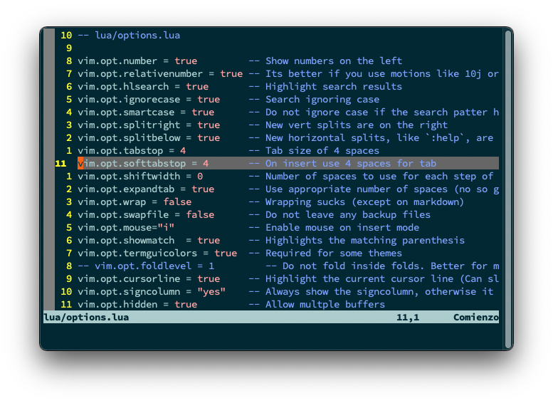

A little better than the default. We have _relative_ line numbers, the line where the cursor is is highlighted, there is some highlighting, but still a long way to go before we achieve what we want.

## More useful keymaps

Vim is all about keymaps! That's the thing that makes it hard to use but at the same time very useful.

So, let's create a new `lua/keymaps.lua` file, and require it in `init.lua`:

```lua
-- lua/keymaps.lua

-- Modes
--   normal_mode       = "n",
--   insert_mode       = "i",
--   visual_mode       = "v",
--   visual_block_mode = "x",
--   term_mode         = "t",
--   command_mode      = "c",

-- Some shortcuts to make the conf file more clean
local map = vim.api.nvim_set_keymap
local opts = { noremap = true, silent = true }
local expr = { noremap = true, silent = true, expr = true }

-- Map leader key to space
map("n", "<Space>", "<Nop>", opts)
vim.g.mapleader = " "
vim.g.maplocalleader = " "

-- Don't jump when using *
map("n", "*", "*<C-o>", opts)

-- Keep search matches in the middle of the window
map("n", "n", "nzzzv", opts)
map("n", "N", "Nzzzv", opts)

-- Toggle NetRW (Lexplore)
map("n", "<Leader>le", ":Lex 30<Cr>", opts)

-- Clear matches with Ctrl+l
map("n", "<C-l>", ":noh<Cr>", opts)

-- Reselect visual block after indent/outdent
map("v", "<", "<gv", opts)
map("v", ">", ">gv", opts)

-- YY/XX Copy/Cut into the system clipboard
vim.cmd([[
noremap YY "+y<CR>
noremap XX "+x<CR>
]])

-- Doble ESC or <C-s> to go to normal mode in terminal
map("t", "<C-s>", "<C-\\><C-n>", opts)
map("t", "<Esc><Esc>", "<C-\\><C-n>", opts)

-- Resize windows with Shift+<arrow>
map("n", "<S-Up>", ":resize +2<CR>", opts)
map("n", "<S-Down>", ":resize -2<CR>", opts)
map("n", "<S-Left>", ":vertical resize -2<CR>", opts)
map("n", "<S-Right>", ":vertical resize +2<CR>", opts)

-- Move line up and down with J/K
map("x", "J", ":move '>+1<CR>gv-gv", opts)
map("x", "K", ":move '<-2<CR>gv-gv", opts)

-- Modify j and k when a line is wrapped. Jump to next VISUAL line
map("n", "k", "v:count == 0 ? 'gk' : 'k'", expr)
map("n", "j", "v:count == 0 ? 'gj' : 'j'", expr)

-- vim: ts=2 sw=2 et
```

Don't forget to add it in your `init.lua` file:

```lua {4}
-- init.lua

require('options')
require('keymaps')
```

The only _gotcha_ is that I created the alias `map` for the built in function [`vim.api.nvim_set_keymap`](<https://neovim.io/doc/user/api.html#nvim_set_keymap()>) that actually allows you to change keymaps.

Additionally:

- I use space as the _leader_ key
- Space+l+e to show NetRw _to the side_
- Ctrl+l to clear search highlights
- Shift+<Up,Down,Left,Right> to increase decrease split sizes
- Press `<Esc>` _twice_ to leave the integrated terminal
- Use `YY` to copy to OS's clipboard (seems to only work on Mac)

This configuration doesn't change how NeoVim looks, but how it behaves.

## Plugins with Packer

Now the good stuff... Plugins!!!

NeoVim by itself is just a great, great editor. I allows you to enter code to the [to the speed of tought](https://www.amazon.com/Practical-Vim-Edit-Speed-Thought/dp/1680501275). But when you start adding plugins you begin to be amazed on how flexible and powerful it is.

For a long time [VimPlug](https://github.com/junegunn/vim-plug) was the standard for adding plugins to Vim. But since we're trying to use Lua for everything, then [Packer](https://github.com/wbthomason/packer.nvim#table-of-contents) is the way to go. Is not only written in Lua, but allows you to execute custom commands for `vimscript`, it allows you to use external configuration files for each plugin and allows you to declare dependencies, or requirements, for a plugin.

So let's create the file `lua/plugins.lua`. There we will be adding the plugins we're going to use and we'll be configuring Packer itself:

```lua {29-32,45,50-58}
-- lua/plugins.lua

-- Place where packer is goint to be saved
local install_path = vim.fn.stdpath("data") .. "/site/pack/packer/start/packer.nvim"

-- Install packer from github if is not in our system
if vim.fn.empty(vim.fn.glob(install_path)) > 0 then
  PACKER_BOOTSTRAP = vim.fn.system({
    "git",
    "clone",
    "--depth",
    "1",
    "https://github.com/wbthomason/packer.nvim",
    install_path,
  })
  print("Installing packer close and reopen Neovim...")
  vim.cmd([[packadd packer.nvim]])
end

-- Autocommand that reloads neovim whenever you save the plugins.lua file
vim.cmd([[
  augroup packer_user_config
    autocmd!
    autocmd BufWritePost plugins.lua source <afile> | PackerSync
  augroup end
]])

-- Use a protected require call (pcall) so we don't error out on first use
local status_ok, packer = pcall(require, "packer")
if not status_ok then
  return
end

-- Show packer messages in a popup. Looks cooler
packer.init({
  display = {
    open_fn = function()
      return require("packer.util").float({ border = "rounded" })
    end,
  },
})

-- Alt installation of packer without a function
packer.reset()
local use = packer.use

--[[
  Start adding plugins here
]]
use({ -- Have packer manage itself
  "wbthomason/packer.nvim",
})
use({ -- Port of VSCode's Tokio Night theme
  "folke/tokyonight.nvim",
  config = function()
    vim.g.tokyonight_style = "night" -- Possible values: storm, night and day
  end,
})

-- Automatically set up your configuration after cloning packer.nvim
-- Put this at the end after all plugins
if PACKER_BOOTSTRAP then
  require("packer").sync()
end
-- vim: ts=2 sw=2 et
```

That was kind of long, so let's explain a little:

- First verify if packer is present in a specific path, and if it is, save that info in the `install_path` variable
- If it's not, then install packer from [GitHub](https://github.com/wbthomason/packer.nvim) and save the installation state in the `PACKER_BOOTSTRAP`  variable
- Then, create an auto executable command that will install any new plugins whe the `plugins.lua` file is saved
- _Try_ to load packer (`pcall`) and initialize the `use` function
- Then initialize the `wbthomason/packer.nvim` plugin. This means that Packer will manage itself
- Next, install the [`folke/tokyonight.nvim`](https://github.com/folke/tokyonight.nvim) plugin, which is a theme, and configure it to use the `night` style
- Finally, if Packer was just installed (The `PACKER_BOOSTRAP` variable is true), the install/sync the configured plugins

How you add a plugin is documented in [Packer's github repo](https://github.com/wbthomason/packer.nvim)

To make this work, add the `lua/plugins.lua` file in `init.lua`.

```lua {10-12}
-- init.lua

-- Vim native options. Make it more modern
require("options")

-- All keymaps in one file for easier research
require("keymaps")

-- Plugins and plugin configuration
require("plugins")

vim.cmd[[silent! colorscheme tokyonight]]

```

After you restart NeoVim you should see something like this:

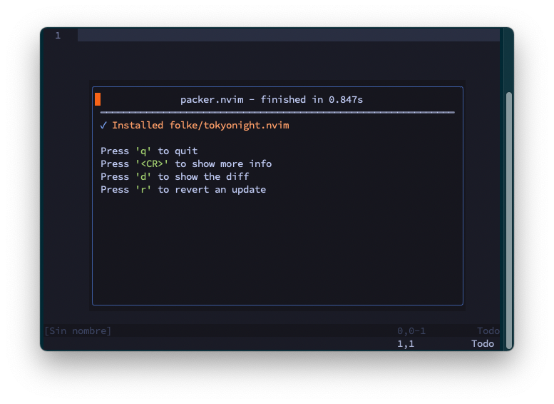

And then, after you press `q`:

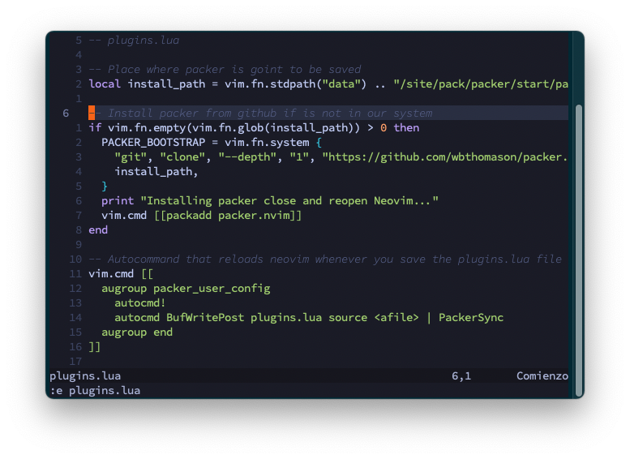

Isn't that special ;)

## Syntax highlighting improvements with Tree-sitter

One thing that I said previously is that NeoVim 0.5, now supports [Tree-sitter](https://tree-sitter.github.io/tree-sitter/) out of the box. For those how don't know (I didn't knew), Tree-sitter is a parsing library that allows IDE's to parse and understand the **structure** of the source code in a very efficient manner. This parsing improves the syntax highlighting since it helps the IDE to understand what keywords and modifiers mean in the source code. For instancee, in php file you can have PHP blocks, Html blocks, JavaScripts blocks, etc. Tree-sitter helps NeoVim understand what are block of codes and what language each block is written in.

While NeoVim has the parsing library included, what it doesn't have out of the box are the **language parsers**. For each language you want to have _good_ highlighting, you have to download and install a parser. And that's not... Confortable. But if we install the `nvim-treesitter/nvim-treesitter` plugin, you can install language parsers with the comand

```bash
:TSInstall php
```

So in your `lua/plugins.lua` file, after the _tokionight_ section, add the following:

```lua {7}
-- lua/plugins.lua
-- ...
use({ -- Install and configure tree-sitter languages
 "nvim-treesitter/nvim-treesitter",
 run = ":TSUpdate",
 config = function()
  require("config.treesitter")
 end,
})
-- ...
```

And save! Remember that we created and autocmd that install plugins when you save the `plugins.lua` file, so the new plugin will get auto-installed.

Also, if you take a look a line 7, you can se that where are requiring the file `lua/config/treesitter.lua` file. In that file we'll save all the configuration for that plugin:

```lua
-- lua/config/nvim-treesitter.lua

require("nvim-treesitter.configs").setup({
 -- To install additional languages, do: `:TSInstall <mylang>`. `:TSInstall maintained` to install all maintained
 ensure_installed = "maintained",
 sync_installed = true,
 highlight = {
  enable = true, -- This is a MUST
  additional_vim_regex_highlighting = { "php" },
 },
 indent = {
  enable = false, -- Really breaks stuff if true
 },
 incremental_selection = {
  enable = true,
  keymaps = {
   init_selection = "gnn",
   node_incremental = "grn",
   scope_incremental = "grc",
   node_decremental = "grm",
  },
 },
})

-- Enable folds (zc and zo) on functions and classes but not by default
vim.cmd([[
  set nofoldenable
  set foldmethod=expr
  set foldexpr=nvim_treesitter#foldexpr()
]])
```

On the configuration we're instructing Treesitter to auto-install all **maintained** parsers, to _enable_ highlight, to enable indent and to enable **incremental** [selection](https://neovim.io/doc/user/visual.html#gn) with `gnn` (select a function with `gnn` while inside a function)

And at the end, we're re-configuring NeoVim to enable [code folding](https://neovim.io/doc/user/fold.html) so you can use `zc` and `zo` inside a class or function and the code will get recognized and folded.

This is an example of code before Treesitter.

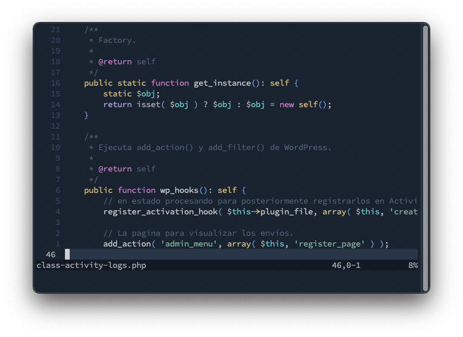

And this with Treesitter:

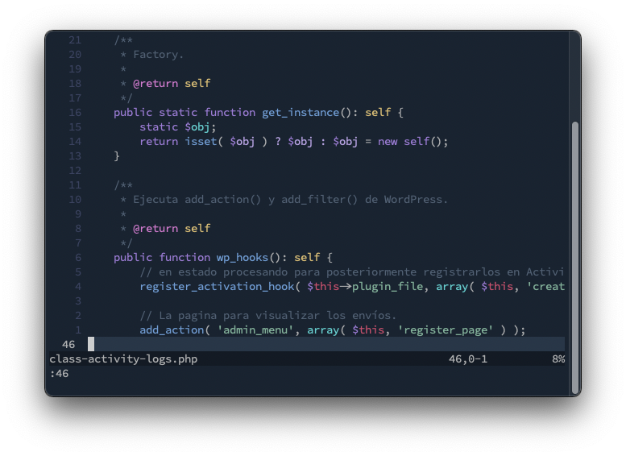

The important thing here is not the actual colors, but the fact that NeoVim now understands for instance that `public` acompanies `function` to determine it's visibility, that the `self` inside the comment is a keyword, or that `static` is a statement and not a variable type.

**One important caveat**: In the configuration file, we instructed `nvim-treesitter` to install all **maintained** languages. So any not maintained language, like [`phpdoc`](https://github.com/claytonrcarter/tree-sitter-phpdoc) have to be installed manually with the command `:TSInstall phpdoc`.

## Language Server Configuration

Having NeoVim understand the structure of the code with Treesitter is great, but you still need things like _autocompletion_ and inline function help to be productive while developing. That's where LSP or _Language Server Protocol_ enters.

The [Language Server Protocol](https://microsoft.github.io/language-server-protocol/), as it name implies, is a protocol where an IDE, in this case NeoVim, connects to a server to retrieve information about a programming language. Things like _what is a variable_ or _how to identify a function or a class_ is the information that gets interchanged.

After you install a configuration file, you'll get:

- Go-to-definition
- Find-references
- Hover
- Completion
- Rename
- Format
- Refactor

NeoVim supports the LSP protocol out of the box, but you have to install the configuration file **for each language server** you want to use. And that's an issue we have to solve.

As an example, let's add support just for PHP in NeoVim. First, **select and install** a language server, which is a separate program, in you computer.

For PHP there are several language server options, but the best right now is [Intelphense](https://www.npmjs.com/package/intelephense), which is an npm package:

```bash
npm install -g intelephense
```

Having installed the language server in you machine, go to `lua/plugins.lua` to add the `nvim-lspconfig` plugin and configure the [omnifunc](https://neovim.io/doc/user/options.html#'omnifunc') so you get LSP results when you type `<C-x><C-o>`:

```lua {6}
-- plugins.lua
-- ...
use { -- Configure LSP client for Intelephense
  'neovim/nvim-lspconfig',
  config = function()
    require('lspconfig').intelephense.setup({
      on_attach = function(client, bufnr)
        -- Enable (omnifunc) completion triggered by <c-x><c-o>
        vim.api.nvim_buf_set_option(bufnr, 'omnifunc', 'v:lua.vim.lsp.omnifunc')
        vim.api.nvim_buf_set_keymap(bufnr, "n", "K", "<cmd>lua vim.lsp.buf.hover()<CR>", opts)
        -- Here we should add additional keymaps and configuration options.
      end,
      flags = {
        debounce_text_changes = 150,
      }
    })
  end
}
-- ...
```

Notice how on line 6 we _just_ configured _Intelephense_. We passed a function to the server `on_attach` element that basically says _I want to do this things when when I attach to a buffer that has an LSP server_.

To test it out, you can create a `.php` file and execute `:LspInfo`. You'll see that NeoVim started the `intelephense` server and connected to it automatically.


Also, you'll start to get _some_ diagnostic information.

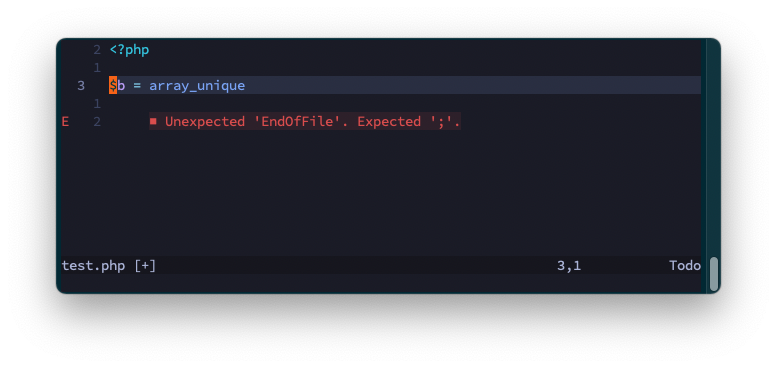

And auto complete when you type `<C-x><C-o>`.

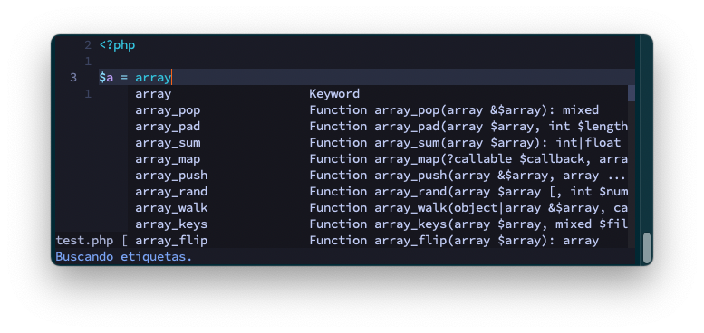

Which is great. But doing this for 10-15 languages is very cumbersome and not practical at all.

## Using a LSP server installer

Having LSP support and configuring it with a function is good an dandy, but right now we would need to add `require('lspconfig').<server>.setup(...)` function **for every language** that we want to support. And projects like WordPress require support for PHP, JavaScipt, Yaml, Dockerfile, docker-compose, TOML, SASS, CSS, etc. That's why we need the [`nvim-lsp-installer`](https://github.com/williamboman/nvim-lsp-installer) plugin. To make this process of installing and configuring servers more simple and **right from vim** without the need of external commands.

The first thing we need to do is to **remove** the previous configuration, and replace it with the following:

```lua
-- lua/plugins.lua
-- ...
use({ -- Configure LSP client and Use an LSP server installer.
 "neovim/nvim-lspconfig",
 requires = {
  "williamboman/nvim-lsp-installer", -- Installs servers within neovim
  "onsails/lspkind-nvim",            -- adds vscode-like pictograms to neovim built-in lsp
 },
 config = function()
  require("config.lsp")
 end,
})
-- ...
```

Notice that we added the [`williamboman/nvim-lsp-installer`](https://github.com/williamboman/nvim-lsp-installer) plugin to the list of `requires`. This plugin will provide the `:LspInstallInfo` command which will allow us to install servers righ from within NeoVim.

Also, notice that we're requiring the `lua/config/lsp.lua` file as the configuration file. That's why we need to create that file whith the [sugested configuration](https://github.com/neovim/nvim-lspconfig#suggested-configuration).

```lua {95-103}
-- lua/config/lsp.lua

local lsp_installer = require("nvim-lsp-installer")
local lspkind = require("lspkind")

-- Add icons to the popup
lspkind.init({
    mode = "symbol",
})

-- Mappings.
-- See `:help vim.diagnostic.*` for documentation on any of the below functions
local opts = { noremap = true, silent = true }

-- Use an on_attach function to only map the following keys
-- after the language server attaches to the current buffer
local on_attach = function(client, bufnr)
    -- Enable completion triggered by <c-x><c-o>
    vim.api.nvim_buf_set_option(bufnr, "omnifunc", "v:lua.vim.lsp.omnifunc")

    -- Mappings.
    -- See `:help vim.lsp.*` for documentation on any of the below functions
    vim.api.nvim_buf_set_keymap(bufnr, "n", "gD", "<cmd>lua vim.lsp.buf.declaration()<CR>", opts)
    vim.api.nvim_buf_set_keymap(bufnr, "n", "gd", "<cmd>lua vim.lsp.buf.definition()<CR>", opts)
    vim.api.nvim_buf_set_keymap(bufnr, "n", "K", "<cmd>lua vim.lsp.buf.hover()<CR>", opts)
    vim.api.nvim_buf_set_keymap(bufnr, "n", "gi", "<cmd>lua vim.lsp.buf.implementation()<CR>", opts)
    vim.api.nvim_buf_set_keymap(bufnr, "n", "<C-k>", "<cmd>lua vim.lsp.buf.signature_help()<CR>", opts)
    vim.api.nvim_buf_set_keymap(bufnr, "n", "<space>wa", "<cmd>lua vim.lsp.buf.add_workspace_folder()<CR>", opts)
    vim.api.nvim_buf_set_keymap(bufnr, "n", "<space>wr", "<cmd>lua vim.lsp.buf.remove_workspace_folder()<CR>", opts)
    vim.api.nvim_buf_set_keymap(
        bufnr,
        "n",
        "<space>wl",
        "<cmd>lua print(vim.inspect(vim.lsp.buf.list_workspace_folders()))<CR>",
        opts
    )
    vim.api.nvim_buf_set_keymap(bufnr, "n", "<space>D", "<cmd>lua vim.lsp.buf.type_definition()<CR>", opts)
    vim.api.nvim_buf_set_keymap(bufnr, "n", "<space>rn", "<cmd>lua vim.lsp.buf.rename()<CR>", opts)
    vim.api.nvim_buf_set_keymap(bufnr, "n", "<space>ca", "<cmd>lua vim.lsp.buf.code_action()<CR>", opts)
    vim.api.nvim_buf_set_keymap(bufnr, "n", "gr", "<cmd>lua vim.lsp.buf.references()<CR>", opts)
    vim.api.nvim_buf_set_keymap(bufnr, "n", "<space>f", "<cmd>lua vim.lsp.buf.formatting()<CR>", opts)
end

-- Remove this in nvim 0.7
local flags = {
    debounce_text_changes = 150,
}

-- Pass configurations settings to the different LSP's
local settings = {
    intelephense = {
        -- Add wordpress to the list of stubs
        stubs = {
            "apache", "bcmath", "bz2", "calendar", "com_dotnet", "Core", "ctype", "curl", "date",
            "dba", "dom", "enchant", "exif", "FFI", "fileinfo", "filter", "fpm", "ftp", "gd", "gettext",
            "gmp", "hash", "iconv", "imap", "intl", "json", "ldap", "libxml", "mbstring", "meta", "mysqli",
            "oci8", "odbc", "openssl", "pcntl", "pcre", "PDO", "pdo_ibm", "pdo_mysql", "pdo_pgsql", "pdo_sqlite", "pgsql",
            "Phar", "posix", "pspell", "readline", "Reflection", "session", "shmop", "SimpleXML", "snmp", "soap",
            "sockets", "sodium", "SPL", "sqlite3", "standard", "superglobals", "sysvmsg", "sysvsem", "sysvshm", "tidy",
            "tokenizer", "xml", "xmlreader", "xmlrpc", "xmlwriter", "xsl", "Zend OPcache", "zip", "zlib",
            "wordpress", "phpunit",
        },
        diagnostics = {
            enable = true,
        },
    },
    Lua = {
        diagnostics = {
            globals = { "vim" }, -- Gets rid of "Global variable not found" error message
        },
    },
    json = {
        schemas = {
         {
          description = "NPM configuration file",
          fileMatch = {
           "package.json",
          },
          url = "https://json.schemastore.org/package.json",
         },
        },
    },
}

-- Add borders to the popup you get when you "hover" (<S-k>)
local handlers = {
    ["textDocument/hover"] = vim.lsp.with(vim.lsp.handlers.hover, { border = "rounded" }),
    ["textDocument/signatureHelp"] = vim.lsp.with(vim.lsp.handlers.signature_help, { border = "rounded" }),
}

-- Add capabilities
local capabilities = vim.lsp.protocol.make_client_capabilities()

-- Equivalent (but not equal) to lspconfig.<langserver>.setup{}
lsp_installer.on_server_ready(function(server)
    server:setup({
        on_attach = on_attach,
        flags = flags,
        settings = settings,
        handlers = handlers,
        capabilities = capabilities,
    })
end)

-- De clutter the editor by only showing diagnostic messages when the cursor is over the error
vim.diagnostic.config({
    virtual_text = false, -- Do not show the text in front of the error
    float = {
        border = "rounded",
    },
})
```

That's a kind of big configuration so take a look at the comments to understand the details. What is important to understan is this:

- Where defining 5 variables to pass to the `setup` function: `on_attach`, `flags`, `settings`, `handlers` and `capabilities`.
- The `on_server_ready` function takes care of calling the `setup` function **for each installed server**
- Of this 5 variables, the `on_attach` is the most important, since takes care of changing the behavior for the **current buffer** when LSP detects that is a supported buffer
- Some servers allow additional configuration trough the `settings` variable. In the case of _Intelephense_ you can activate additional language stubs, and in the case of Json you can enable validation schemas

Now, you might be wondering. How do I install a server? and Where are this servers installed?

The beauty of this configuration is that the 2 step process we did before, where you had to install a server and then configure it in NeoVim, got reduced to just 1 command:

```vim
:LspInstallInfo
```

This will show the following popup:

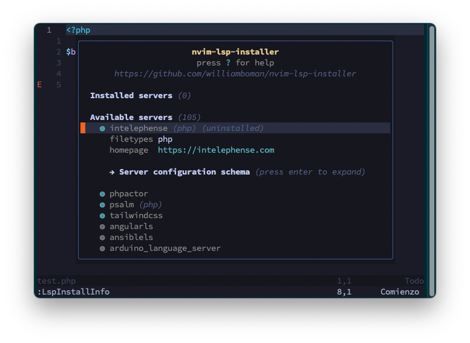

You install a server by placing the cursor over the corresponding server and typiong `i`.

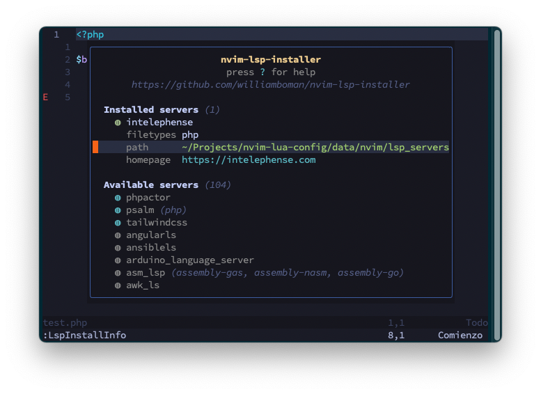

You can remove an installed server by typing `X` and if you type _Enter_ you get an expanded information of the corresponding server.

## If you have an Intelephense licence

As I said, the best LSP server for PHP is Intelephense, but the free version is incomplete. It doesn't support renaming, find implementations, go to definition or go to declaration.

So is not a bad idea to [purchase a licence](https://intelephense.com/). And the way to register it so NeoVim can use it licenced is to create a file in your hard drive:

```bash
cd $HOME
mkdir intelephense
cd $_
echo YOURLICENCE > licence.txt
```

And now you have the additional options.

## Autocomplete

As we are right now, you have to type `<C-x><C-o>` to get a popup of possible options to complete when you are programming. This is extremely cumbersome when you are programming and you are using a language like PHP where there are a miriad of similarly named functions.

The solution is to install the autocomplete plugin [`hrsh7th/nvim-cmp`](https://github.com/hrsh7th/nvim-cmp).

But there is a catch! `nvim-cmp` only provides the autocomplete functionality. It takes care of quering all the possible completion sources, like LSP, paths, snipeets, etc. Compile them in a single list and then show them to the user. It does not know what a function, a variable, a path or a command is. That's why we still need to use additional plugins to retreive the possible values to autocomplete.

And here comes the second catch... There are some LSP servers that provide _snippets_. And if we are going to use them, we need 2 additional plugins: One _snippet engine_ and a _snippet source_. So we need to install a _sorce_ plugin for each one of the sources we want to support. In our case just the LSP source plugin ([`hrsh7th/cmp-nvim-lsp`](https://github.com/hrsh7th/cmp-nvim-lsp)) and the snippets plugin([`saadparwaiz1/cmp_luasnip`](https://github.com/saadparwaiz1/cmp_luasnip)).

Argggg a third catch! The snippets source needs a _Snippets Engine_ to tell NeoVim where should the cursor jump or which possible parameters we need to use the snippet. So the third plugin we're going to use is [`L3MON4D3/LuaSnip`](https://github.com/L3MON4D3/LuaSnip).

At the end, this is what we need to add to our `lua/plugins.lua` file:

```lua
-- lua/plugins.lua
-- ...
use({ -- CMP completion engine
 "hrsh7th/nvim-cmp",
 requires = {
  "onsails/lspkind-nvim",     -- Icons on the popups
  "hrsh7th/cmp-nvim-lsp",     -- LSP source for nvim-cmp
  "saadparwaiz1/cmp_luasnip", -- Snippets source
  "L3MON4D3/LuaSnip",         -- Snippet engine
 },
 config = function()
  require("config.cmp")
 end,
})
-- ...
```

And to configure this plugins we create the `lua/config/cmp.lua` file with this contents:

```lua
-- lua/config/cmp.lua

local cmp = require("cmp")         -- The complete engine
local luasnip = require("luasnip") -- The snippet engine
local lspkind = require("lspkind") -- Pretty icons on the automplete list

-- This is almost verbatin from the Github Page
cmp.setup({
    snippet = {
        expand = function(args)
            luasnip.lsp_expand(args.body)
        end,
    },
    mapping = {
        -- Navigate the dropdown list snippet
        ["<C-p>"] = cmp.mapping.select_prev_item(),
        ["<C-n>"] = cmp.mapping.select_next_item(),
        ["<C-d>"] = cmp.mapping.scroll_docs(-4),
        ["<C-f>"] = cmp.mapping.scroll_docs(4),
        ["<C-Space>"] = cmp.mapping.complete(),
        ["<C-e>"] = cmp.mapping.close(),
        -- Enter select the item
        ["<CR>"] = cmp.mapping.confirm({
            behavior = cmp.ConfirmBehavior.Replace,
            select = true,
        }),
        -- Use <Tab> as the automplete trigger
        ["<Tab>"] = function(fallback)
            if cmp.visible() then
                cmp.select_next_item()
            elseif luasnip.expand_or_jumpable() then
                luasnip.expand_or_jump()
            else
                fallback()
            end
        end,
        ["<S-Tab>"] = function(fallback)
            if cmp.visible() then
                cmp.select_prev_item()
            elseif luasnip.jumpable(-1) then
                luasnip.jump(-1)
            else
                fallback()
            end
        end,
    },
    -- Where to look for auto-complete items.
    sources = {
        { name = "nvim_lsp" },
        { name = "luasnip" },
    },
    -- Improve the dropdown list display: Show incons and show where
    -- the automcomplete sugestion comes from
    formatting = {
        format = lspkind.cmp_format({
            mode = "symbol_text",
            menu = {
                buffer = "[Buf]",
                nvim_lsp = "[Lsp]",
                luasnip = "[Snip]",
                nvim_lua = "[Lua]",
                latex_symbols = "[Lat]",
            },
        }),
    },
    -- Show borders like the LSP autocomplte
    documentation = {
        border = { "╭", "─", "╮", "│", "╯", "─", "╰", "│" },
    },
    -- Can be anoying so experiment with it
    experimental = {
        ghost_text = true,
    },
})
```

This configuration is basically telling NeoVim how to select the correct autocompletion item when the user finds one in the autompletion menu.

There is really not much difference, but the cool thing is that we'll get complete suggestions as we type:

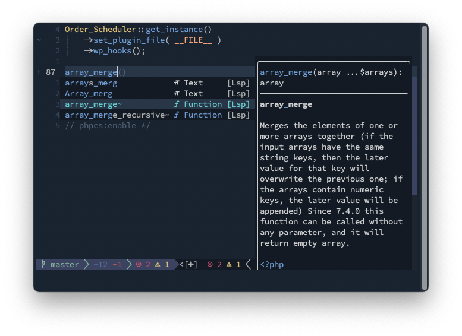

## Linting with Null-LS

Let me get this out of the way... _I'm obsessed with linting!_. I just love good, clean, readeable, consistent code. That's why for me linting and formatting right from the IDE are a must.

Most LSP's come with some kind of diagnostic information, and NeoVim includes it's own [diagnostic framework](https://neovim.io/doc/user/diagnostic.html) that can be leveraged by the different LSP servers. So when you install an LSP server you start getting warnings about invalid values or bad function declarations. What is not included, not by NeoVim and not by any of the LSP's, is how to [lint](https://www.perforce.com/blog/qac/what-lint-code-and-why-linting-important) and format your code. Which is very obvious since your code's format depends on personal preferences or project standards.

Now, linting and formatting are tasks that are taken care of external tools and not the IDE or the LSP itself. So, for instance, you need to use [ESLint](https://eslint.org/) plus [Prettier](https://prettier.io/) if you want to lint and format JavaScript. In the case of PHP you need [PHPCS](https://github.com/squizlabs/PHP_CodeSniffer) to lint and format. For Markdown you can use [markdownlint](https://github.com/markdownlint/markdownlint) and for CSS/SCSS you can use [Stylelint](https://stylelint.io/).

One approach you can take, one wich I used for a long time, is to execute the linting tool on the current file using Vim commands:

```vim
:!./vendor/bin/phpcs %
```

Or directly in the terminal:

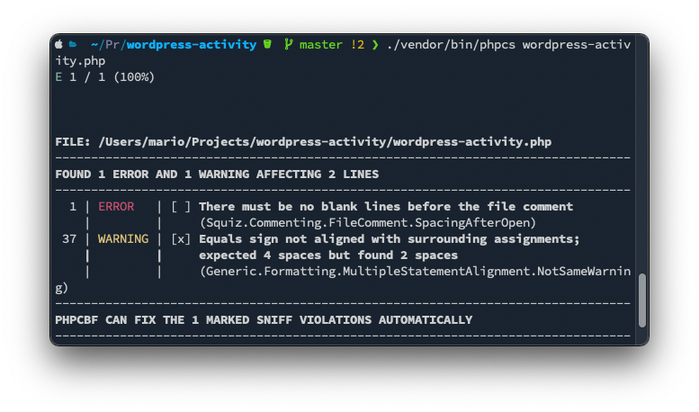

Which is not that straight forward and very cumbersome to do. That's where [`jose-elias-alvarez/null-ls.nvim`](https://github.com/jose-elias-alvarez/null-ls.nvim) plugin comes into play.

What it does is that it executes the linter and/or formatter against the current file when you save (or when you enter the _normal_ mode) and inserts the output as diagnostic information into NeoVim:

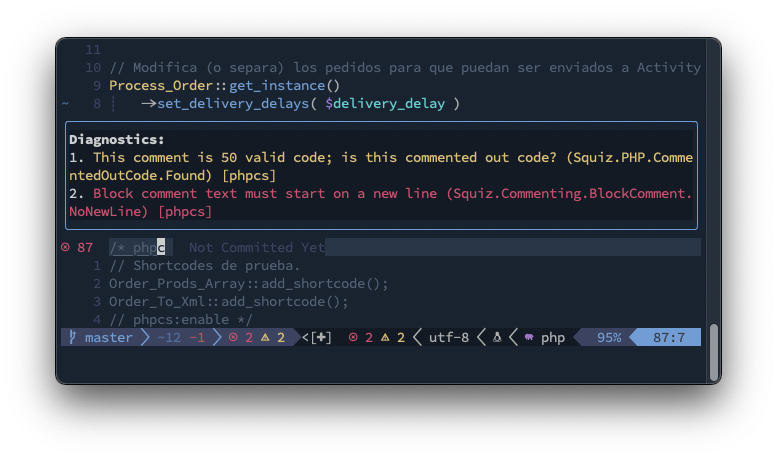

So, to install it add the following to the `lua/plugins.lua` file:

```lua
use({ -- Null-LS Use external formatters and linters
    "jose-elias-alvarez/null-ls.nvim",
    requires = {
        "nvim-lua/plenary.nvim",
    },
    config = function()
        require("config.null-ls")
    end,
})
```

And then create the `lua/config/null-ls.lua` file with the following contents:

```lua
-- lua/config/null-ls.lua

local null_ls = require("null-ls")
local utils = require("null-ls.utils")

null_ls.setup({
    root_dir = utils.root_pattern("composer.json", "package.json", "Makefile", ".git"), -- Add composer
    diagnostics_format = "#{m} (#{c}) [#{s}]",    -- Makes PHPCS errors more readeable
    sources = {
        null_ls.builtins.completion.spell,        -- You still need to execute `:set spell`
        null_ls.builtins.diagnostics.eslint,      -- Add eslint to js projects
        null_ls.builtins.diagnostics.phpcs.with({ -- Change how the php linting will work
            prefer_local = "vendor/bin",
        }),
        null_ls.builtins.formatting.stylua,       -- You need to install stylua first: `brew install stylua`
        null_ls.builtins.formatting.phpcbf.with({ -- Use the local installation first
            prefer_local = "vendor/bin",
        }),
    },
})
```

As you can see, we're changing the `setup` of `null-ls` with the following:

- If you find a `composer.json`, `package.json`, `Makefile`, etc. File, assume that's the root of the project
- Change the format of the diagnostic information so is more readable. Specially since the PHPCS error codes can be very large strings
- Activate `spell`, `eslint` and `stylua` as formatters/linters
- Try to execute a **local** version of `phpcs` and `phpcbf`

And that's it. We have a complete IDE for PHP, JavaScript, (S)CSS, Json development.

## Nice to haves

In this article we covered the essentials to make NeoVim a viable IDE for Web Development. Specially WordPress/Gutenberg development. There are still much more things you can do to improve your editor:

- Add [`folke/trouble.nvim`](https://github.com/folke/trouble.nvim) to show all _diagnostic_ info summarized
- Add [`nvim-telescope/telescope.nvim`](https://github.com/nvim-telescope/telescope.nvim) for fast searching of files and file content
- Add [`lewis6991/gitsigns.nvim`](https://github.com/lewis6991/gitsigns.nvim) to show in the gutter which lines are not in git or which lines of the code have been changed
- Add [`f-person/git-blame.nvim`](https://github.com/f-person/git-blame.nvim) to display [blame](https://www.git-scm.com/docs/git-blame) information righ inside your code
- Add [`nvim-lualine/lualine.nvim`](https://github.com/nvim-lualine/lualine.nvim) to improve NeoVim's status line with diagnostics and git information
- Add [`numToStr/Comment.nvim`](https://github.com/numToStr/Comment.nvim) for commenting code with `gcc`
- Add [`b0o/schemastore.nvim`](https://github.com/b0o/schemastore.nvim) to allow LSP auto complete JSON data for different files like `package.json`, `composer.json`, `.esltinrc.json`, etc.

## Resources

The first resource is my own [NeoVim configuration repository](https://github.com/marioy47/nvim-lua-config). There you can find my complete configuration with some of the plugins I just mentioned plus some others that I just can't live without.

Aditionally, if you want to go deeper into configuring NeoVim, there are some videos and blogs that I really recommend

- [Vim Cheat Sheet](https://devhints.io/vim) The best cheat sheet I've found so far.
- [Lua intro for vim configuration](https://www.youtube.com/watch?v=prnrwpOEsmo) presentation here: <https://smithbm2316.github.io/vimconf-2021/#/18>
- [Everything you need to know to configure NeoVim using Lua](https://vonheikemen.github.io/devlog/tools/configuring-neovim-using-lua/) which weirdly enough it has some missing parts.
- [Vim from scratch](https://www.youtube.com/playlist?list=PLhoH5vyxr6Qq41NFL4GvhFp-WLd5xzIzZ) and the GitHub repo [here](https://github.com/LunarVim/Neovim-from-scratch)
- [Vim to Lua](https://github.com/arnvald/viml-to-lua)
- [Learning Lua eBook](https://riptutorial.com/ebook/lua)
- [kickstartnvim](https://github.com/nvim-lua/kickstart.nvim/blob/master/init.lua) a great starter init file
- [Neovim LSP setup guide by the main developer](https://www.youtube.com/watch?v=puWgHa7k3SY)
- [Configure NeoVim LSP for TypeScript](https://jose-elias-alvarez.medium.com/configuring-neovims-lsp-client-for-typescript-development-5789d58ea9c)
- [A good blog about lua](https://dev.to/casonadams/neovim-lsp-to-replace-vscode-n8c)
- [A Very detailed but complex nvim configuration](https://github.com/Allaman/nvim/)
- [NeoVim & VSCode integration guide](https://github.com/CozyPenguin/vscode-nvim-setup)
