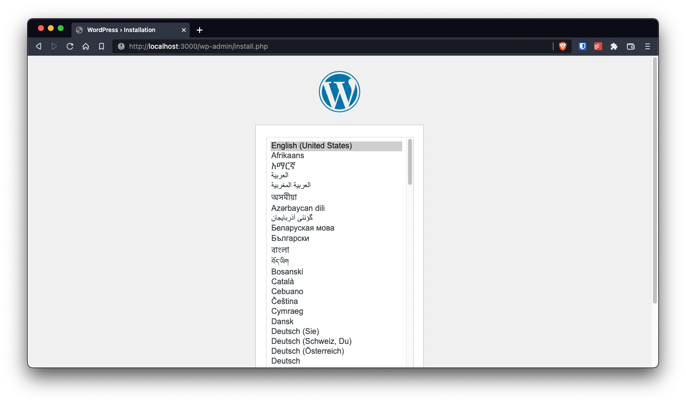
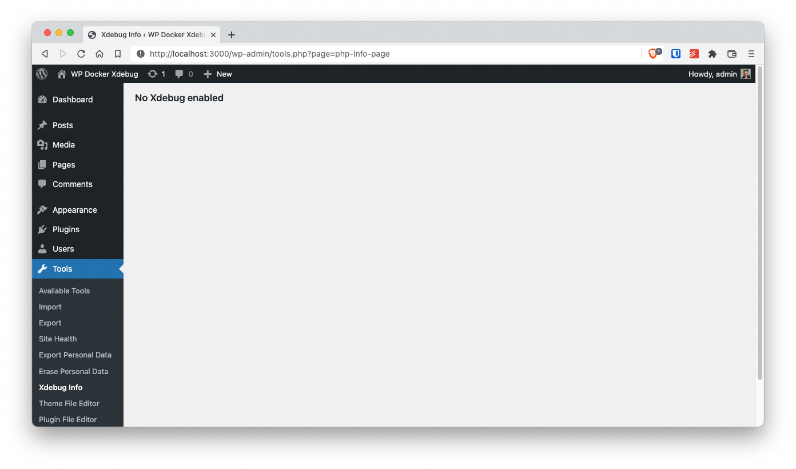
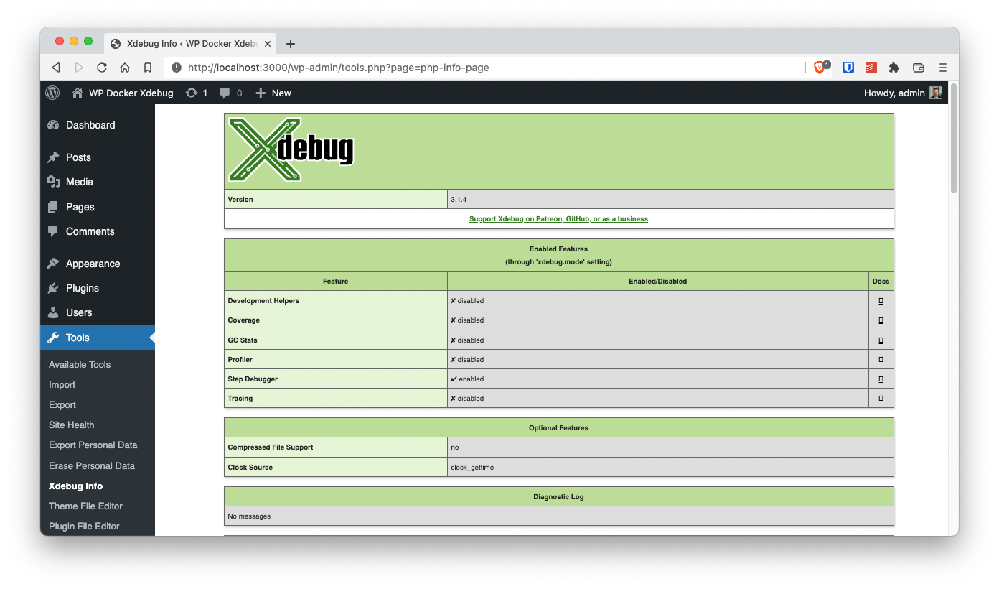
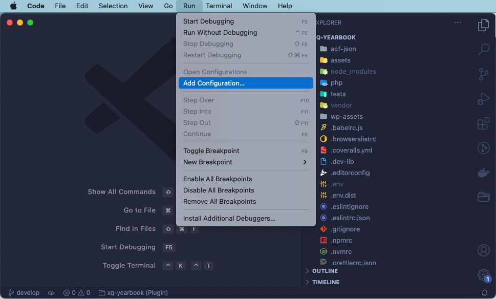
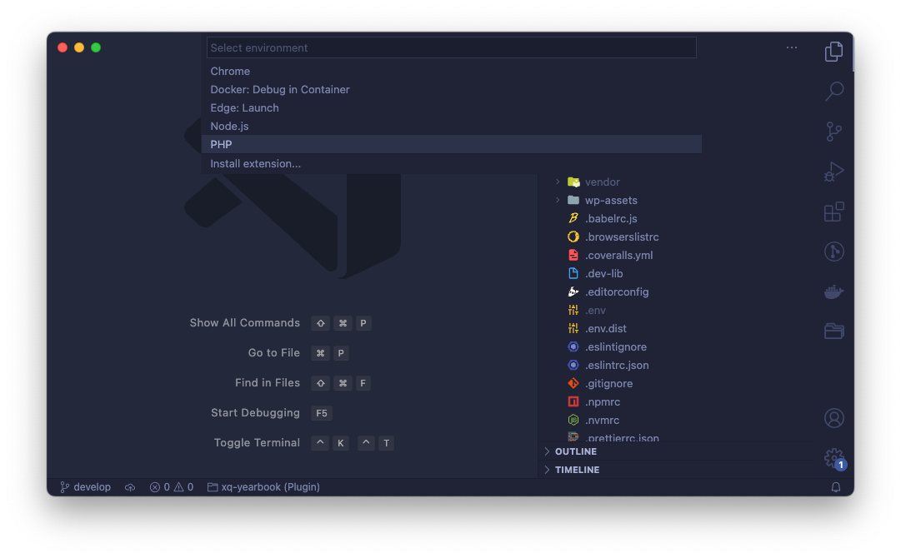

# Wordpress (PHP) debugging in your IDE using Docker and Xdebug

So I started using WordPress as a [REST API](https://developer.wordpress.org/rest-api/) server since that's _the foundation of the [Block Editor](https://developer.wordpress.org/block-editor/)_...

You might be wondering what's does the _Rest API_ has to do with Debugging?

Well, it turns out that you can no use the combination of `wp_die`  with `print_r`  to find out what a variable or object contains! (Duh!)

```php
<?php
// This does nothing when developing an API.
wp_die( print_r( $my_var, true ) );
```

When you are working with REST calls, you really need a debugger in those cases when you are not sure what the contents of a WordPress object or variable have. So Debuggin here is a must.

But, even tough setting up a debugger in PHP is an easy task, is not that well documented. Specially when you are working with Docker.

So here are the steps I take to setup debugging when using WordPress inside the [Official WordPress Docker Image](https://hub.docker.org/_/wordpress).

## TOC

## Setup WordPress in a container

Ok, lets start by creating the development environment for a custom plugin:

```bash
mkdir wordpress-docker-xdebug
cd $_
touch Dockerfile docker-compose.yaml plugin.php
```

And on the `docker-compose.yaml` add the following code to create a minimal WordPress environment whith a [MariaDB database](https://hub.docker.org/_/mariadb) and the [official WordPress image](https://hub.docker.org/_/wordpress)

> I use MariaDB instead of MySQL because the Docker image for it is much more lighter than the MySQL Docker image

```yaml
version: '3'

services:

  db:
    image: mariadb
    container_name: wp-xdebug-db
    environment:
      MYSQL_ROOT_PASSWORD: root
      MYSQL_DATABASE: wordpress
      MYSQL_USER: wordpress
      MYSQL_PASSWORD: wordpress
    volumes:
      - wp-xdebug-data:/var/lib/mysql

  wp:
    image: wordpress:5-apache
    container_name: wp-xdebug-wp
    environment:
      WORDPRESS_DB_HOST: wp-xdebug-db
      WORDPRESS_DB_USER: wordpress
      WORDPRESS_DB_PASSWORD: wordpress
      WORDPRESS_DB_NAME: wordpress
    volumes:
      - wp-xdebug-html:/var/www/html
      - ./:/var/www/html/wp-content/plugins/wordpress-docker-xdebug
    ports:
      - 3000:80

volumes:
  wp-xdebug-data:
  wp-xdebug-html:

networks:
  default:
    name: wp-xdebug-network
```

Most of the magic on the `docker-compose.yaml` file happens is in the placement of environment variables. For information on what the variables for [MariaDB](https://hub.docker.com/_/mariadb) and [WordPress](https://hub.docker.com/_/mariadb) mean, head over to the respective [Dockerhub](https://hub.docker.com) pages. But in summary:

- Give the DB `root` user the password `root`
- Create the `wordpress` database
- Create the user `wordpress` with password `wordpress` in the database
- Make the `/var/lib/mysql` directory in the DB container persistent
- Make the `/var/www/html` directory in the WordPress container persistent
- Connect the current directory with `/var/www/html/wp-content/plugins/wordpress-docker-xdebug` directory inside the WordPress container

Also, notice how I'm instructing Docker to **run WordPress in port 3000**

Finally, just start the image

```bash
docker-compose up -d
```

Now, open up a browser on <http://localhost:3000> and install WordPress like you normally would.



And we're done for the first part.

## Create a WordPress plugin to show Xdebug info

In the previous step we told Docker that the current directory (`./`) is mapped to a plugin directory (`/var/www/html/wp-content/plugins/wordpress-docker-xdebug`). So, just by placing the following code in the `plugin.php` file, we'll be creating a new plugin…

```php
<?php
/**
 * WordPress Docker Xdebug plugin
 *
 * @package           WpDockerXdebug
 * @author            Mario Yepes
 * @copyright         2020 Mario Yepes
 * @license           GPL-2.0-or-later
 *
 * @wordpress-plugin
 * Plugin Name:       WordPress Docker Xdebug plugin
 * Plugin URI:        https://marioyepes.com
 * Description:       A plugin that shows the status of Xdebug in Tools > Xdebug Info
 * Version:           1.0.0
 * Requires at least: 5.2
 * Requires PHP:      7.2
 * Author:            Mario Yepes
 * Author URI:        https://marioyepes.com
 * Text Domain:       wordpress-docker-xdebug
 * License:           GPL v2 or later
 * License URI:       http://www.gnu.org/licenses/gpl-2.0.txt
 * Update URI:        https://marioyepes.com
 */

add_action( 'admin_menu', 'add_php_info_page' );

function add_php_info_page() {
    add_submenu_page(
        'tools.php',           // Parent page
        'Xdebug Info',         // Menu title
        'Xdebug Info',         // Page title
        'manage_options',      // user "role"
        'php-info-page',       // page slug
        'php_info_page_body'); // callback function
}

function php_info_page_body() {
    $message = '<h2>No Xdebug enabled</h2>';
    if ( function_exists( 'xdebug_info' ) ) {
        xdebug_info();
    } else {
        echo $message;
    }
}
```

What this plugin does is just to create a new page in the _WordPress Dashboard_ under `Tools > Xdebug` with info of the status of Xdebug:



Up to here we have a full WordPress installation with a plugin that will tell us the status of Xdebug. Let's change the WordPress image to include Xdebug

## Create a custom Docker Image

First a disclosure. You could actually make this work without using a custom image, and sticking to commands inside the `docker-compose.yaml` file. But this would make the file way too complicated, and very rigid. That's why we are going to **replace** the current WordPress image with a custom, and **very simple** image.

> The reason why we didn't do this in the first place, create our custom image that is, is to be able to test our plugin and make sure that it detects if Xdebug is present or not.

To add a **custom** docker image we have to do 2 things:

- Create a `Dockerfile` with the configuration of our custom image
- Update `docker-compose.yaml` to use our custom image instead of the official WordPress image

So on the `Dockerfile` add the following:

```dockerfile
# Source image
FROM wordpress:5-apache

# We're going to use this path multile times. So save it in a variable.
ARG XDEBUG_INI="/usr/local/etc/php/conf.d/xdebug.ini"

# Install AND configure Xdebug
RUN pecl install xdebug \
    && docker-php-ext-enable xdebug \
    && echo "[xdebug]" > $XDEBUG_INI \
    && echo "xdebug.mode = debug" >> $XDEBUG_INI \
    && echo "xdebug.start_with_request = trigger" >> $XDEBUG_INI \
    && echo "xdebug.client_port = 9003" >> $XDEBUG_INI \
    && echo "xdebug.client_host = 'host.docker.internal'" >> $XDEBUG_INI \
    && echo "xdebug.log = /tmp/xdebug.log" >> $XDEBUG_INI

```

Lets explain a little:

- We're instructing Docker to create an image using as base the `wordpress:5-apache` image
- Then we declare the `XDEBUG_INI` variable with the path of the `xdebug` configuration. This is just to make the file a little cleaner
- Next, on a single command we do 3 things:
  - Install the `xdebug` extension using `pecl`
  - Enable the extension using the `docker-php-ext-enable` command
  - We create the `/user/local/etc/conf.d/xdebug.ini` file using multiple `echo` calls

The important part of the `xdebug.ini` file are the variables `xdebug.client_host` and `xdebug.start_with_request`. The first variable instructs Xdebug to connect to the **debugger client** `host.docker.internal`. The second variable tells Xdebug to **only start this connection** if the `XDEBUG_TRIGGER` URL is present in the request.

Next, you need to **modify** the `docker-compose.yaml` file. Just changing the official image for the custom one we just created in the `Dockerfile`:

```yaml {3}
# ...
  wp:
    build: ./
    container_name: wp-xdebug-wp
    environment:
      WORDPRESS_DB_HOST: wp-xdebug-db
      WORDPRESS_DB_USER: wordpress
      WORDPRESS_DB_PASSWORD: wordpress
      WORDPRESS_DB_NAME: wordpress
    volumes:
      - wp-xdebug-html:/var/www/html
      - ./:/var/www/html/wp-content/plugins/wordpress-docker-xdebug
    ports:
      - 3000:80
# ...
```

Notice that we don't have a `image` field, but a `build` field!

For this changes to take effect, you need to restart your docker environment:

```bash
docker-compose down
docker-compose up -d
```

And now, if you visit the _Xdebug info_ page, you should see something like this:



Great we're done with Docker.

## Explaining some _Gotchas_

OK, so we've been breezing over the `xdebug` configuration. We should explain some things before we continue:

### How does Xdebug works

In a very summarized way, what xdebug does is that when **debugging is active** it will try to connect to port **9003** of the `xdebug.client_host` to send **and receive** debugging information.

The way to instruct Xdebug that it should connect to our IDE, or in other words activate debugging, is by passing the `XDEBUG_TRIGGER` **URL parameter or cookie** when calling our script. For example <http://localhost:3000/wp-admin/tools.php?page=php-info-page&XDEBUG_TRIGGER>

> This can be a drag... Passing an URL parameter all the time. Latter we will see how to make that process easier with cookies.

### The xdebug.ini file

The `xdebug.ini` file should be placed in PHP's `conf.d` directory, which can change from installation to installation. In my case, to figure out where this directory was placed, I executed `php -i` **inside the WordPress container**, and review the output searching for where the `ini` files where placed.

In case your are wondering how this file looks, here are the contents:

```ini
# /usr/local/etc/php/conf.d/xdebug.ini
[xdebug]
xdebug.mode = debug
xdebug.start_with_request = trigger
xdebug.client_port = 9003
xdebug.client_host = 'host.docker.internal'
xdebug.log = /tmp/xdebug.log
```

### The `host.docker.internal` host

One of the biggest issues with Xdebug, is that it will connect to a specific host that needs to be configured in the `xdebug.ini` file.

Fortunately, Docker provides use with a [workaround](https://docs.docker.com/desktop/mac/networking/#use-cases-and-workarounds) to connect **from de container to the host**: Use the special host `host.docker.internal`, _which resolves to the internal IP address used by the host. This is for development purpose and will not work in a production environment outside of Docker Desktop_.

### Installing Xdebug

Another advantage of using Docker's WordPress image is that it comes with [`pecl`](https://pecl.php.net/) pre-configured and it provides the `docker-php-ext-enable` command, which allows us enable/disable extensions with just one command. So to install xdebug **inside the container**, we could just issue the following:

```bash
pecl install xdebug
docker-php-ext-enable xdebug
service apache2 reload
```

## Configure Visual Studio Code

Ok, we should now understand what we did in the Docker configuration. Now lets see how we start using debugging in our IDE.

To configure debugging in _Visual Studio Code_ we need 2 things:

- Install the [PHP Debug](https://marketplace.visualstudio.com/items?itemName=xdebug.php-debug) extension. This will allow VSCode to listen on a given port (in our case 9003) for debug information.
- Create the `.vscode/launch.json` with information on how to map our current _WorkSpace_ to a directory inside the Docker container among other things.

To create the `launch.json` file, just go to _Run > Add Configuration_



And select the **PHP** option



And on the resulting file **modify** the entry _Listen for Xdebug_ to look like this:

```json {9-12}
{
  "version": "0.2.0",
  "configurations": [
    "...",
    {
      "name": "Listen for XDebug",
      "type": "php",
      "request": "launch",
      "port": 9003,
      "pathMappings": {
        "/var/www/html/wp-content/plugins/wordpress-docker-xdebug": "${workspaceFolder}"
      },
      "log": true
    }
    "..."
  ]
}
```

Take into account that:

- Xdebug 2 uses port 9000. Xdebug 3 uses port 9003. That's why we need to specify the port
- Update the `pathMappings` to point to `"/container/path/to/the/plugin": "${worspaceRoot}"` since that's where our code lives **inside** our container

## Start a debugging session

Our setup is ready! No we have to learn how to start a debugging session.

The step are very simple:

- Create a breakpoint in your code
- Click on the _start_ icon on Visual Studio or select _Run > Start Debugging_
- Visit a page passing the trigger variable in the URL

Remember, you have to pass the `XDEBUG_TRIGGER` variable either as an URL parameter or as a cookie parameter to the script you are debuging. Otherwise your browser will keep _loading_ and not show anything.

`youtube: https://youtube.com/shorts/MQdC3FrBFIA`

And since passing the `XDEBUG_TRIGGER` variable constantly can be very frustrating, I recommend using the [Xdebug helper for chrome](https://github.com/mac-cain13/xdebug-helper-for-chrome) extension and have it pass that variable as a **cookie** for you:


And that's it! You are debugging WordPress.

## Resources

- In this GitHub repo you can access the files created for this article <https://github.com/marioy47/wordpress-docker-xdebug>
- Xdebug settings for the `xdebug.ini` file: <https://xdebug.org/docs/all_settings#start_with_request>
- Another approach on setting debugging in Docker: <https://www.larry.dev/xdebug-on-docker/>
