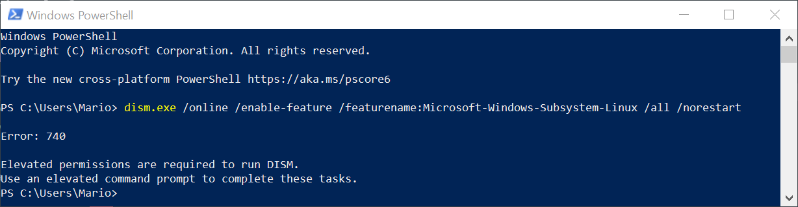
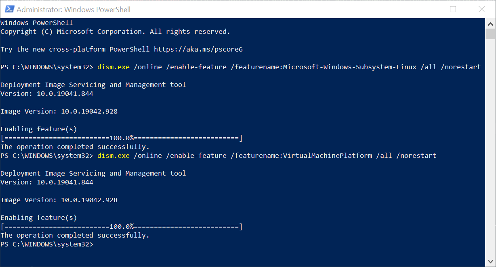
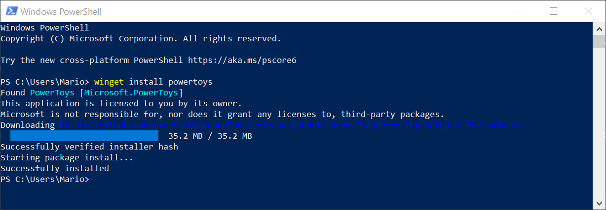
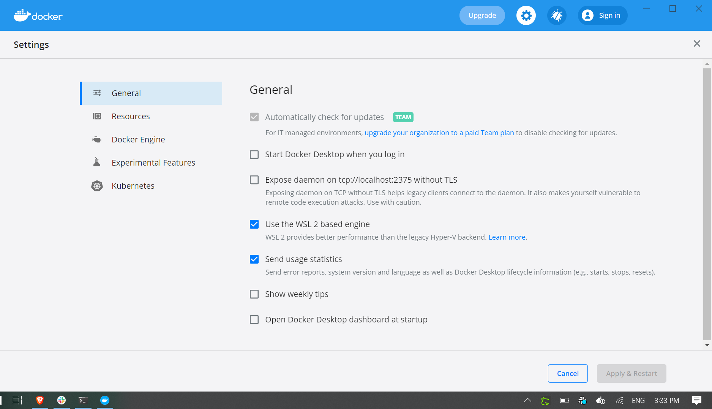
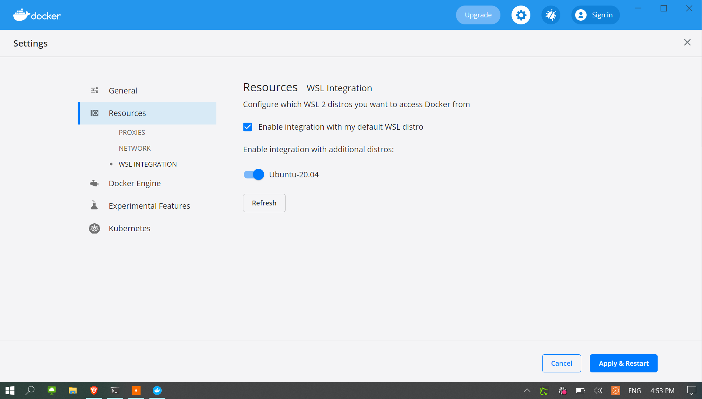
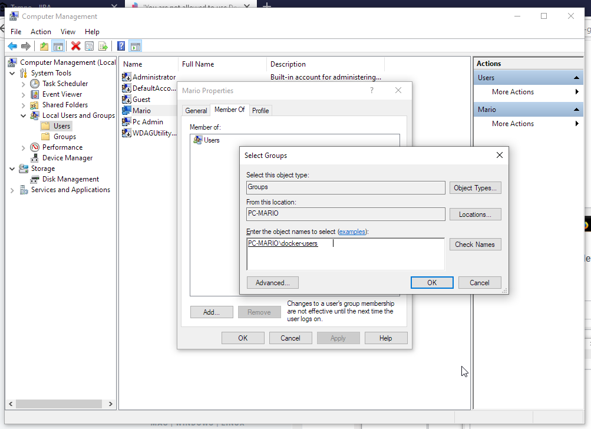

# Install a Windows 10 development machine with docker, WSL 2 and asdf

Recently I had to switch from MacOS to Windows 10 for a client's project and setting up my machine resulted in being a complete challenge. Not because windows is not a good development environment, believe me me, it really is good. It was because I had my [dotfiles](https://github.com/marioy47/dotfiles) so tuned up for Mac that when I tried to use them in Linux inside Windows WSL, they didn't worked.

So I took this as an opportunity to fix some inconsistencies in my files, created a new development workflow, and to make this blog post about the steps that I took to make it work.

## TOC

## Enable WSL2

The first thing to do while setting up an Windows Development machine, is install Linux inside of it using [WSL2](https://docs.microsoft.com/en-us/windows/wsl/about).

In case you don't know, WSL means _Windows Subsystem Linux_ and by the number you can guess that the latest version is version 2.

To install it, I followed the [official documentation](https://docs.microsoft.com/en-us/windows/wsl/install-win10). Which in I'll summarize in the following steps:

### Install the required Windows features

This are:

- The Virtual Machine Platform
- The subsystem

I used _Power Shell_ as an _administrator_ to execute the following commands:

```bash
dism.exe /online /enable-feature /featurename:Microsoft-Windows-Subsystem-Linux /all /norestart
dism.exe /online /enable-feature /featurename:VirtualMachinePlatform /all /norestart
```



Take into account that you have to execute _Power Shell_ as an **administrator** to execute both commands:



Very important: **Restart**.

### Set a default version of WSL

This tells windows which subsystem you are going to use when you start a virtual machine. In our case we have to select 2 since its the only one we have installed:

```bash
wsl --set-default-version 2
wsl --list --verbose
```

### Update the kernel

The WSL comes with a default Linux Kernel that is outdated. Fortunately you can update it by installing [this file](https://wslstorestorage.blob.core.windows.net/wslblob/wsl_update_x64.msi)

Very important: **Restart again**.

... And that's it, you have a **very performant** (almost native performance) Linux along side your Windows.

## Install Winget

If you read some of my previous blog posts, you might notice that I love using [Hombrew](https://brew.sh) to install software in Mac.

Well, windows has an official package manager that works similar and is called _Winget_.

As of April 2021 the best way to install it is using the [releases](https://github.com/microsoft/winget-cli/release) page on the official [GitHub](https://github.com/microsoft/winget-cli) repository.

> It is possible that you have to install the flight or preview version of Windows [App Installer](https://www.microsoft.com/p/app-installer/9nblggh4nns1?ocid=9nblggh4nns1_ORSEARCH_Bing&rtc=1&activetab=pivot:overviewtab) to make it work.

If you installed `winget` then you can do something like this:



## Install Ubuntu

Installing WSL2 and upgrading it's kernel just gives you that: An optimized Linux kernel inside a virtual machine, but **without any Linux tools**. You you don't have any commands like `ls`, `pwd`, `cd`, etc. You also don't have any kind of service or startup scripts.

That's why you need to install an OS, so you can actually run Linux programs inside it. And to do it you just need to issue

```bash
winget install ubuntu
```

> That's why we installed `winget` at the beginning, so we could install apps fairly easy and fast.

Then, Start the _Ubuntu-20.04_ **application** from the _Windows Start Menu_. This will prompt us to create our first user. 

## Windows Terminal

The next step is to install a terminal so you can issue commands in your recently installed Linux OS.

I'm not an expert so I just took the advice of several blogs an YouTube videos and installed the Windows Official Terminal.

```cmd
winget install "Windows Terminal"
```

This are the reasons for using this one instead of other alternatives:

- Is built by Microsoft so there is good suppport for it.
- Is pretty fast to startup
- It provides a drop-down menu to switch to from Linux, to Windows CMD or _Power Shell_
- Low input latency
- You can theme it

To make it look better, I used the following theme:

```json
    "...": "...",
    "schemes": [
        {
          "name": "OceanicMaterial",
          "black": "#000000",
          "red": "#ee2b2a",
          "green": "#40a33f",
          "yellow": "#ffea2e",
          "blue": "#1e80f0",
          "purple": "#8800a0",
          "cyan": "#16afca",
          "white": "#a4a4a4",
          "brightBlack": "#777777",
          "brightRed": "#dc5c60",
          "brightGreen": "#70be71",
          "brightYellow": "#fff163",
          "brightBlue": "#54a4f3",
          "brightPurple": "#aa4dbc",
          "brightCyan": "#42c7da",
          "brightWhite": "#ffffff",
          "background": "#1c262b",
          "foreground": "#c2c8d7",
          "selectionBackground": "#6dc2b8",
          "cursorColor": "#b3b8c3"
        }
    ],
    "...": "..."
```

Additionally, I install the _Hasklug Nerd Font_, which can be downloaded from the [Nerdfonts](https://www.nerdfonts.com/font-downloads) website; And add the following profile to the settings:

```json
{
  "...",
  "profiles": [
    "list": [
      "...",
      {
          "colorScheme": "OceanicMaterial",
          "fontFace": "Hasklug NF",
          "fontSize": 10,
          "guid": "{07b52e3e-de2c-5db4-bd2d-ba144ed6c273}",
          "hidden": false,
          "name": "Ubuntu-20.04",
          "source": "Windows.Terminal.Wsl"
      },
    ]
  ]
}
```

> To get to your personal prfile **json** file, you have to keep the _Alt_ key pressed when selecting the terminals drop down menu.

## Alacritty Terminal

If you are a little more advanced and use `tmux` as a multiplexer, then you might want to stick to Alacritty. Which is even faster than _Windows Terminal_ but lacks some options like tabs and graphical configuration.

In this case, you have to 

- Install _Alacritty_
- Make a configuration directory
- Create a configuration file on that directory

```bash
winget install Alacritty.Alacritty
cd %APPDATA%
mkdir Alacritty
```

> The last 2 steps will create the folder where _Alacritty_ expects it's configuration.

After you've executed those commands, you can place a configuration file [alacritty.yml](https://github.com/marioy47/dotfiles/.alacritty.yml) in that directory with at least the following content:

```yaml
shell:
  program: "C:\\Windows\\System32\\wsl.exe"
```

This will tell _Alacritty_ to use wsl as the interpreter instead of `cmd`. So when you start _Alacritty_ from the _Windows Start Menu_ you'll be taken directly to your Ubuntu Linux.

## Install Linux Apps

The next step is to install some useful apps inside your linux to make it better to work with. In my case, this are:

- PHP's `composer`
- NodeJS LTS
- rTorrent
- ZSH

So we have to add a couple of Debian Package Repos and install packages obviously:

```bash
sudo add-apt-repository ppa:ondrej/php
curl -fsSL https://deb.nodesource.com/setup_16.x | sudo -E bash -
sudo apt-get install -y nodejs unzip rtorrent php-cli zsh
curl -sS https://getcomposer.org/installer | php
sudo mv composer.phar /usr/local/bin/composer
```

This will make available `php`, `node`, `npm` and `composer` available in our Linux.


## Restore secrets files

This step really depends on your setup. But in my case I have a secured `.zip` file with my _ssh_ private keys and some additional secret files like `.rclone.conf`, `.netrc` file and `.aws`.

If you also do have this files this is the perfect moment to restore them:

```bash
unzip /mnt/c/Users/Mario/Downloads/backup-secret-dotfiles.zip
```

## Restores dotfiles

Finally, if you have some kind of [dotfiles](https://github.com/marioy47/dotfiles), this is the final step you should take.

```bash
git clone git@github.com:marioy47/dotfiles.git
```

As you can see, I like to keep this directory in my home folder.

And that's it, you should have now a very workable setup.

## Oh My Zsh and ASDF

I'm spoiled, I admit it... On Mac `brew` takes care of installing node, php, elixir, etc. So I wanted something similar for Linux inside windows. That's when I found ASDF.

We can use [asdf](https://asdf-vm.com/) to install runtime versions of many tools with just a couple of commands. This means, that we can install local copies of those tools and even manage multiple versions of the same tool on our virtual machine.

But (again but) instead of installing the `asdf` tool directly, we are going to use it as a [Oh My ASH](https://ohmyz.sh/) plugin!

> If you don't know what this tools do. I strongly suggest you visit their homepages to find out and by amazed by their utility.

### Oh My ZSH

To install _Oh My ZSH_, issue this command inside your Linux virtual machine:

```bash
sudo apt-get install zsh unzip -y
sh -c "$(curl -fsSL https://raw.github.com/ohmyzsh/ohmyzsh/master/tools/install.sh)"
```

This will ask you if you want to change your shell to `zsh` wich you should say "yes"

Then edit `~/.zshrc` and look for the `plugins` variable and make the following changes

```bash
ZSH_THEME="bira" # Select your own here
### ...
plugins=(git asdf) # Very important the asdf tool
unsetopt BEEP
```

The `unsetopt BEEP` is to disable the annoying beep windows issues whenever you make a mistake like pressing the _Esc_ key twice.

### ASDF

To finish the installation, you have to:

- Source the newly modified `.zshrc` file
- Download the latest version of `asdf` in a hidden directory called `.asdf/`

```bash
source ~/.zshrc
git clone https://github.com/asdf-vm/asdf.git ~/.asdf --branch v0.8.0
```

And now you should have the `asdf` command at your disposal

## ASDF Plugins

If you preffer to install `node` and `yarn` globally or want the _nightly_ version of NeoVim, you can use `asdf` to install those packages locally and update them more frequently.


The process is the following:

- Install the `nodejs` plugin so we can download and install the latest version
- List the available versions of _nodejs_ that `asdf` can install for us
- Select and install a version for _nodejs_
- Stablish that the installed node version (global) will be available when we execute `node` in the command

```bash
asdf plugin add nodejs
asdf list all nodejs
asdf install nodejs lts
asdf list nodejs
asdf global nodejs lts
```

While we're at it, let's do the same for `yarn`:

```bash
asdf plugin add yarn
asdf install yarn latest
asdf list yarn
asdf global yarn 1.22.10
```

And _Neovim_

```bash
asdf plugin add neovim
asdf install neovim nightly
asdf global neovim nightly
```

If you issue the `current` option of `asdf` you should get the actual versions you have active in your system:

```bash
adsf current
```

## Docker

Installing docker is equally easy as the _Windows Terminal_ when we use `winget` from Powershell.

```bash
winget install docker
```

The catch is that, after the installation is done, we have to make sure that WSL2 is being used:

- Open _Docker Desktop_ Windows as **administrator**
- Go to settings
- Make sure that the checkbox to use wsl2 engine is active
- Enable _Resource WSL integration_
- Enable the `Ubuntu-20` distro 





If you are installing Docker as a NON administrator user, you might be getting the  error `You are not allowed to use Docker, you must be in the "docker-users" group` when you try to launch the _Docker Desktop_ application.

The solution is pretty self explanatory, you have to add your current user (in my case "Mario") to the aforementioned group, so just open the _Computer Management_ control panel as and **Administrator** and:

- Go to _Local users and groups_
- Double click on `docker-users`
- Go to _Users_ on the left
- Click on _Add_
- On the textarea add `docker-users` and _Check Names_
- Save
- Log out and in again



And afterwards you should be able to launch _Docker Desktop_ with no issue and without the need to do it as an administrator.

