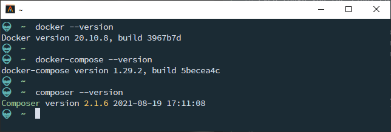
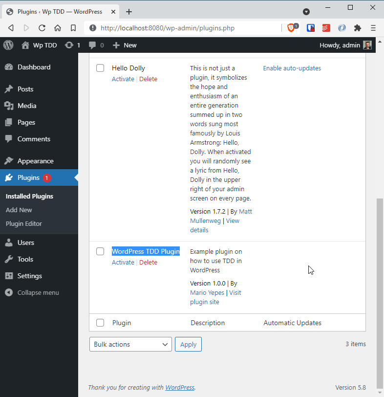
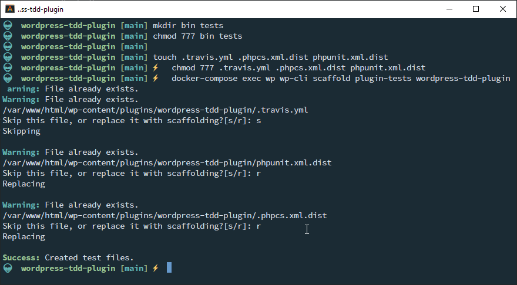
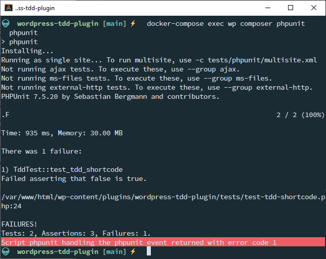

If you landed in this article is because you already are aware that _testing_ your projects is important.

Also, you might already be aware that testing in WordPress is hard, very hard, since it has [hundreds](https://developer.wordpress.org/reference/) upon hundreds of functions that you need to [Mock](https://en.wikipedia.org/wiki/Mock_object) to make your code work.

Finally, you might also be ware that setting up testing in a project that uses a databases is something that can be complex for the amount of _non_ portable configuration it involves.

Well, you are in the right place, because here I'm going to show you how to configure testing in you WordPress plug-in using nothing but docker so you can distribute your environment with your team or move it to a new machine easily.

## Pre-requisites

Even though you the final environment is pretty portable, you still need to install a couple of pieces of software, being the more obvious [Docker](https://docker.com)

Optionally, you can install [`composer`](http://getcomposer.org) in your development machine. This is optional since we are going to install `composer` in our _Docker_ container, but having a local instance will speed up your development process. Specially if you want to execute `phpcs` or `phpcbf` (wich we won't touch in this article) against your code.

Before we continue, make sure you have access to the `docker-compose` command. Unless you have a very old version of _Docker_, you must have access to it.



## Create a plugin

For this example we're going to test a very simple WordPress plugin. And the beauty of our current approach, is that **you can create this plug-in wherever you want. You don't need a WordPress installation nor a database or an Apache server**.

So create an empty directory...

```bash
mkdir wordpress-tdd-plugin
cd $_
git init
touch .gitignore
git add .
git commit -m "First commit"
git branch -m main
```

And then create the plug-in file itself.

We are going to do a very simple plug-in that provides the `tdd-shortcode` _shortcode_ making sure that it uses some native WordPress functions. For that we just need to create the file `wordpress-tdd-pluging.php` in our directory with the following content:

```php {20,21,32}
<?php
/**
 * Plugin Name:       WordPress TDD Plugin
 * Plugin URI:        https://marioyepes.com
 * Description:       Example plugin on how to use TDD in WordPress
 * Version:           1.0.0
 * Requires at least: 4.0
 * Requires PHP:      7.2
 * Author:            Mario Yepes
 * Author URI:        https://marioyepes.com
 * License:           GPL v2 or later
 * License URI:       https://www.gnu.org/licenses/gpl-2.0.html
 * Update URI:        https://example.com/my-plugin/
 * Text Domain:       wp-tdd
 * Domain Path:       /languages
 */

function create_shorcode_tdd_plugin( $atts, $content = '' ) {

        $default_font  = get_option( 'tdd_font', 'Arial, Helvetica, sans-serif');
        $default_color = get_option( 'tdd_color', '');
        $atts          = shortcode_atts(array(
                'font' => $default_font,
                'color' => $default_color,
                'weight' => 'normal'
        ), $atts);

        return '<div style="font-family: ' . $atts['font'] .  '; color: ' . $atts['color'] .
                '; font-weight: ' .  $atts['weight'] . '">' . $content . '</div>';
}

add_shortcode( 'tdd-shortcode', 'create_shorcode_tdd_plugin' );
```

Right from the start you can see that this plug-in is going to be somewhat difficult to test since it uses the `get_option` and `add_shortcode` WordPress functions. But that's something we're going to solve in the following steps.

## Creating the Application Server

And by _Application Server_ I mean the _Docker Container_ that will run [Apache](https://httpd.apache.org) and [PHP](https://php.net) (not MySQL). And for that we'll create our first **Docker image** using the following `Dockerfile`

```dockerfile
# Dockerfile
FROM wordpress

ARG PLUGIN_NAME=wordpres-tdd-plugin

# Setup the OS
RUN apt-get -qq update ; apt-get -y install unzip curl sudo subversion mariadb-client \
        && apt-get autoclean \
        && chsh -s /bin/bash www-data

# Install wp-cli
RUN curl https://raw.githubusercontent.com/wp-cli/builds/gh-pages/phar/wp-cli.phar > /usr/local/bin/wp-cli.phar \
        && echo "#!/bin/bash" > /usr/local/bin/wp-cli \
        && echo "su www-data -c \"/usr/local/bin/wp-cli.phar --path=/var/www/html \$*\"" >> /usr/local/bin/wp-cli \
        && chmod 755 /usr/local/bin/wp-cli* \
        && echo "*** wp-cli command installed"

# Install composer
RUN php -r "copy('https://getcomposer.org/installer', 'composer-setup.php');" \
        && php composer-setup.php \
        && php -r "unlink('composer-setup.php');" \
        && mv composer.phar /usr/local/bin/ \
        && echo "#!/bin/bash" > /usr/local/bin/composer \
        && echo "su www-data -c \"/usr/local/bin/composer.phar --working-dir=/var/www/html/wp-content/plugins/${PLUGIN_NAME} \$*\"" >> /usr/local/bin/composer \
        && chmod ugo+x /usr/local/bin/composer \
        && echo "*** composer command installed"
```

This will create a "Virtual Machine" (Is not a virtual machine but it helps to think of it as one) based in the [official Docker WordPress image](https://hub.docker.com/_/wordpress/) with 3 modifications:

- First we add some packages to the underlying OS: `unzip`, `curl`, `sudo`, `subversion`, `mariadb-client`
- Then we install `wp-cli` and create a script that executes it as the `www-data` user and is aware of our WordPress installation path
- Finally we install `composer` and create a script that runs it as the `www-data` and is aware of the path of our plug-in

To convert this file to something we can run, we need to create an image. This is achieved with the following command:

```bash
docker build -t wp-tdd-image .
docker images # to verify it's creation
```

> Note that I'm building the image with the `wp-tdd-image` _tag_.


This creates the Docker Image, but it doesn't run it. For that we need to execute it:

```bash
docker run --rm -p 8080:80 wp-tdd-image
```

And to verify that is actually running, visit <http://localhost:8080>. **Do not run the installer. It will fail since we still haven't provided a database**.


Now that we know that the `Dockerfile` works, we can remove the image with

```bash
docker image rmi wp-tdd-image
```

## Adding a database

Instead of adding a database to our current image (aka current virtual machine), we're going to use an already created image. But for that to work we have to use `docker-compose` which requires **the new file `docker-compose.yml`**:

```yaml
# docker-compose.yml
version: "3"

services:
  # MySQL database
  db:
    image: mariadb
    restart: unless-stopped
    container_name: tdd-plugin-db
    environment:
      MYSQL_ROOT_PASSWORD: root
      MYSQL_DATABASE: wordpress
      MYSQL_USER: wordpress
      MYSQL_PASSWORD: wordpress
    volumes:
      - db-data:/var/lib/mysql

  # Wordpress
  wp:
    build:
      context: .
      dockerfile: Dockerfile
    restart: unless-stopped
    container_name: tdd-plugin-app
    environment:
      WORDPRESS_DB_HOST: tdd-plugin-db
      WORDPRESS_DB_USER: wordpress
      WORDPRESS_DB_PASSWORD: wordpress
      WORDPRESS_DB_NAME: wordpress
      WORDPRESS_DEBUG: 1
    volumes:
      - wp-data:/var/www/html
      - ./:/var/www/html/wp-content/plugins/wordpress-tdd-plugin
    ports:
      - 8080:80
    depends_on:
      - db

# Make network name pretty
networks:
  default:
    name: tdd-plugin-network

# Persist DB and WordPress data across containers
volumes:
  db-data:
  wp-data:
```

Let's explain a little this `docker-compose.yml`. First the part of the MySQL image:

- I'm using the `mariadb` image since is more lightweight that MySQL and is binary compatible.
- The name of the **database host** will be `tdd-plugin-db`
- I'm using `wordpress` as the username, db name and password
- The password for the MySQL root user is `root`
- I'm persisting the MySQL _datafiles_ so the remain the same between containers

Now, for the WordPress image, I'm telling `docker-compose` to use the `Dockerfile` and:

- Use "wordpress" as the username, password and database name
- Connect to the host `tdd-plugin-db` for the database
- Persist the data in `/var/www/html` between containers
- **Share the local directory** with the container with the path `/var/www/html/wp-content/plugins/wordpress-tdd-plugin`
- Run in port `8080`

Finally, let's **install** WordPress by starting this environment a visiting `http://localhost:8080` to get the WordPress install wizard

```bash
docker-compose up
# Open your browser and go to http://localhost:8080
```


Now **you can install** WordPress and verify that the plug-in is present and valid by visiting your `http://localhost:8080/wp-admin/plugins.php` page:



This is why I love Docker... It saves me the trouble of installing those tools in my machine. Also, it guards me from running into compatibility issues since every development environment is completely isolated from any other project you have.

## Setting up testing

This is the challenging part. Not because is hard, but because it has a couple of tricks.

If you read carefully the `Dockerfile` we used to setup wordpress, you might have noticed that we installed `wp-cli` and `composer` inside the image. The reason for that is so we can:

- Scaffold the testing for our plugin
- Execute the tests

So, open **another terminal** (since the docker-compose is using the one you previously had) and execute the following:

```bash
docker-compose exec wp wp-cli scaffold plugin-tests wordpress-tdd-plugin
```

> `wordpres-tdd-plugin` is the name of our current plug-in

This command is supposed to _scaffold_, or initialize, the testing files in your plug-in directory. The `docker-compose exec wp` part of the command is to have it be executed inside the current running container.


It fails... The reason being that the Docker container is trying to execute the command as the `www-data` user and your local machine either does not have that user, or that users exists but doesn't have write access to your directory.

To solve this issue, we have to do our **first trick**:

- Create the `bin/` and `tests/` directory inside your plug-in directory, with global write and execute permissions
- Create the `.tavis.yml`, `.phpcs.xml.dist` and `phpunit.xml.dist` files with global write permissions.



This time it works! And now we should have the following structure:

```bash
$ tree .
.
├── Dockerfile
├── bin
│   └── install-wp-tests.sh
├── docker-compose.yml
├── phpunit.xml.dist
├── tests
│   ├── bootstrap.php
│   └── test-sample.php
└── wordpress-tdd-plugin.php

2 directories, 7 files
```

We still don't have tests, or even WordPress mock functions. But at least we have the means to create them.

So, What did we do????

What the `docker-compose exec wp wp-cli scaffold plugin-tests wordpress-tdd-plugin` command does is:

- `docker-compose exec wp` tells docker to execute what comes next **inside the already running** `wp` docker container
- `wp-cli scaffold-tests wordpress-tdd-plugin` instructs `wp-cli` to create the testing files for the plugin `wordpress-tdd-plugin` plugin
- The `bin/install-wp-tests.sh` script is designed to create the testing environment for our plugin
- The `tests/test-sample.php` is our first test

## Upgrade the WordPress image

Believe it or not, we are not ready to start testing!

We have all the required files in place, but we still have to create a _WordPress Testing Environment_ in our docker container. And for that we need to update our `Dockerfile`:

```dockerfile {28-34}
# Dockerfile
FROM wordpress

ARG PLUGIN_NAME=wordpres-tdd-plugin

# Setup the OS
RUN apt-get -qq update ; apt-get -y install unzip curl sudo subversion mariadb-client \
        && apt-get autoclean \
        && chsh -s /bin/bash www-data

# Install wp-cli
RUN curl https://raw.githubusercontent.com/wp-cli/builds/gh-pages/phar/wp-cli.phar > /usr/local/bin/wp-cli.phar \
        && echo "#!/bin/bash" > /usr/local/bin/wp-cli \
        && echo "su www-data -c \"/usr/local/bin/wp-cli.phar --path=/var/www/html \$*\"" >> /usr/local/bin/wp-cli \
        && chmod 755 /usr/local/bin/wp-cli* \
        && echo "*** wp-cli command installed"

# Install composer
RUN php -r "copy('https://getcomposer.org/installer', 'composer-setup.php');" \
        && php composer-setup.php \
        && php -r "unlink('composer-setup.php');" \
        && mv composer.phar /usr/local/bin/ \
        && echo "#!/bin/bash" > /usr/local/bin/composer \
        && echo "su www-data -c \"/usr/local/bin/composer.phar --working-dir=/var/www/html/wp-content/plugins/${PLUGIN_NAME} \$*\"" >> /usr/local/bin/composer \
        && chmod ugo+x /usr/local/bin/composer \
        && echo "*** composer command installed"

# Create testing environment
COPY --chmod=755 bin/install-wp-tests.sh /usr/local/bin/
RUN echo "#!/bin/bash" > /usr/local/bin/install-wp-tests \
        && echo "su www-data -c \"install-wp-tests.sh \${WORDPRESS_DB_NAME}_test root root \${WORDPRESS_DB_HOST} latest\"" >> /usr/local/bin/install-wp-tests \
        && chmod ugo+x /usr/local/bin/install-wp-test* \
        && su www-data -c "/usr/local/bin/install-wp-tests.sh ${WORDPRESS_DB_NAME}_test root root '' latest true" \
        && echo "*** install-wp-tests installed"
```

The changes are at the bottom, and we're basically telling the `wp` image to copy the `bin/install-wp-tests.sh` files inside the container and execute that command upon container creation.

So, **stop** the containers by typing `Ctrl-c` in the terminal, and the rebuild the `wp` image with:

```bash
# Ctr-C on the terminal where docker is running
docker-compose build wp
docker-compose up
```

## Install the WordPress test files and PHPUnit

In the last step we added the `install-wp-tests` command to our container. Now we have to execute it so it re-creates the WordPress testing files but with access to our database:

```bash
docker-compose exec wp install-wp-tests
```

What this does is to create a "mock" WordPress inside the container in the path `/tmp/wordpress`. This will enable us to make tests without the need to mock `get_option` and `add_shortcode`, or any other WordPress function, ourselves.

Then we need to install PHPUnit in our plug-in directory **but using the same trick of creating empty files**:

```bash
touch composer.json composer.lock
mkdir vendor
chmod 777 vendor composer.json composer.lock
docker-compose exec wp composer require phpunit/phpunit=^7
docker-compose exec wp install-wp-tests
```

- The first 2 commands creates some empty files and an empty directory
- Then, with `chmod` we make those files and directory writeable by **anyone**
- Next we install the PHPUnit package using the `composer` command inside our container
- Finally we create the Mock (testing) WordPress environment

Notice that we are using PHPUnit version **7** since that is the current version that WordPress supports.

## Executing the `sample-tests.php`

We're almost done with the setup. We just need to add a new `scripts` in our `composer.json` file so we can run our tests easily:

```json {5-7}
{
  "require": {
    "phpunit/phpunit": "^7"
  },
  "scripts": {
    "phpunit": "phpunit"
  }
}
```

And edit the `phpunit.xml.dist` file, enabling the sample test:

```xml {13}
<?xml version="1.0"?>
<phpunit
    bootstrap="tests/bootstrap.php"
    backupGlobals="false"
    colors="true"
    convertErrorsToExceptions="true"
    convertNoticesToExceptions="true"
    convertWarningsToExceptions="true"
    >
    <testsuites>
            <testsuite name="sample">
                    <directory prefix="test-" suffix=".php">./tests/</directory>
                    <!-- <exclude>./tests/test-samplejG.php</exclude> -->
            </testsuite>
    </testsuites>
</phpunit>
```

Finally, execute the tests trough `docker-compose`:

```bash
docker-compose exec wp composer phpunit
```

And we're done with the setup. Now let's actually verify that we can test our plugin

## Our first custom test

At the beginning of this article, we created a simple plug-in with a custom function that we wanted to test. We're finally ready to verify that function by creating a test.

So create the `tests/test-tdd-shortcode.php` file with a custom test:

> The name of the file **has** to start with `test-`

```php
<?php
/**
 * Class TddTest
 *
 * @package Wordpress_Tdd_Plugin
 */

/**
 * Wordpress TDD plugin tests
 */
class TddTest extends WP_UnitTestCase {

    /**
     * Test shortcode output
     */
    public function test_tdd_shortcode() {
        add_option('tdd_font', 'monospaced');
        add_option('tdd_color', 'red');

        $actual = create_shorcode_tdd_plugin(array(), 'hola');
        $expected = '<div style="font-family: monospaced; color: red; font-weight: normal">hola</div>';

        $this->assertEquals($actual, $expected);
        $this->assertTrue(false); // Just to verify phpunit
    }
}
```

Notice that we introduced an error. The last line of the function is a false assertion that will help us to verify that the tests are actually being run.

Les verify that by executing

```bash
docker-compose exec wp composer phpunit
```



And even tough that last assertion fails, we are certain that our tests are being run.

Also notice that we used the `add_option` function. **That's a WordPress function**. So we are certain that our tests are using the WordPress test suite.

## Reference

We're done for this article. But if you want to dig deeper into WordPress testing I recommend reading the following blog posts

- [An Introduction To Automated Testing Of WordPress Plugins With PHPUnit](https://www.smashingmagazine.com/2017/12/automated-testing-wordpress-plugins-phpunit/). It's a great introduction to WordPress testing.
- [Automated API Testing For Your WordPress Site With Codeception](https://deliciousbrains.com/automated-api-testing-codeception-wordpress/). A little more advanced
- [WP-CLI documentation for scaffolding test files](https://developer.wordpress.org/cli/commands/scaffold/plugin-tests/)
- [WordPress official documentation on Plugin Integration](https://make.wordpress.org/cli/handbook/misc/plugin-unit-tests/)
- [Unit Testing Wordpress Plugins with PHPUnit](https://wpmudev.com/blog/unit-testing-wordpress-plugins-phpunit/). It doesn't focus on the setup but the testing itself

And if you want to take a look at the generated files for this article, you can visit the [GitHub repo](https://github.com/marioy47/wordpress-tdd-plugin)
